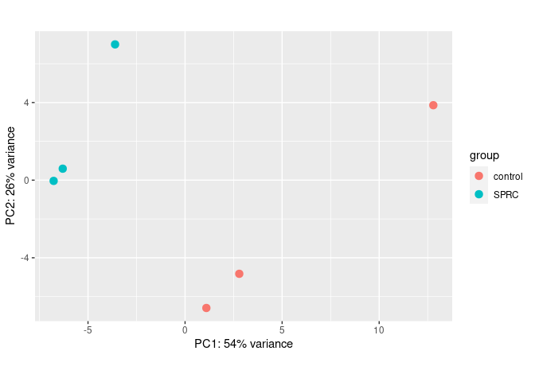
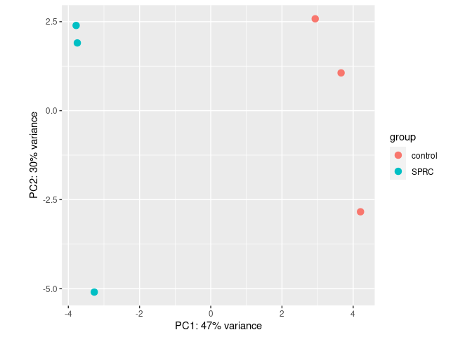
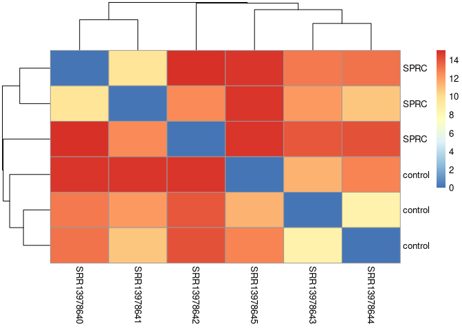
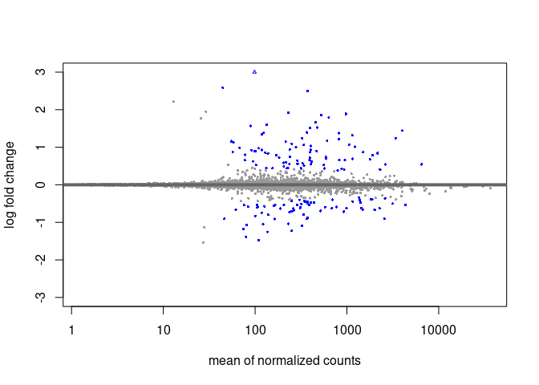
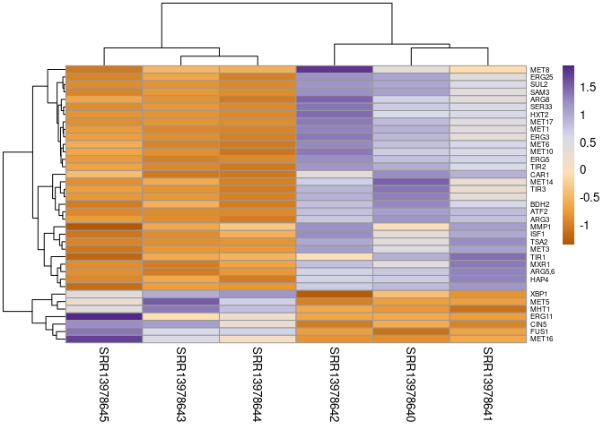
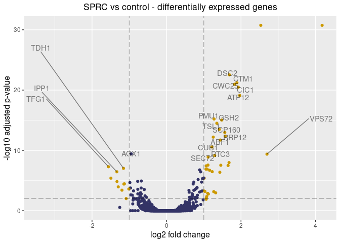

RNA-Seq – Differential Gene Expression Analysis
================
vaibhakv
2023-06-27

## Experimental setup

- Saccharomyces cerevisiae was used as a model to study the mechanism of
  endogenous H2S that promoted the growth rate of yeast.
- The growth of fungi is controlled by several factors, one of which is
  signaling molecules, such as hydrogen sulfide (H2S), which was
  traditionally regarded as a toxic gas without physiological function.
  However, recent studies have revealed that H2S is produced
  enzymatically and endogenously in several species, where it serves as
  a gaseous signaling molecule performing a variety of critical
  biological functions.
- However, the influence of this endogenous H2S on the biological
  activities occurring within the pathogenic fungi, such as
  transcriptomic and phenotypic alternations, has not been elucidated so
  far. Therefore, the present study was aimed to decipher this concern
  by utilizing S-propargyl-cysteine (SPRC) as a novel and stable donor
  of H2S and Saccharomyces cerevisiae as a fungal model.
- In this analysis, we’ll find out the differentially expressed genes
  between two conditions with three replicates each -
  - 3 samples in the presence of SPRC -
    - SRR13978640
    - SRR13978641
    - SRR13978642
  - 3 samples in the absence of SPRC (control)
    - SRR13978643
    - SRR13978644
    - SRR13978645

``` r
library(tidyverse)
library(Rsubread)
library(DESeq2)
library(pheatmap)
library(RColorBrewer)
library(biomaRt)
library(ggrepel)
```

### featureCounts

Use featureCounts to generate the count table

``` r
df <- featureCounts(files = c("data/output/SRR13978640.aln/SRR13978640Aligned.sortedByCoord.out.bam", 
                    "data/output/SRR13978641.aln/SRR13978641Aligned.sortedByCoord.out.bam",  
                    "data/output/SRR13978642.aln/SRR13978642Aligned.sortedByCoord.out.bam",
                    "data/output/SRR13978643.aln/SRR13978643Aligned.sortedByCoord.out.bam",
                    "data/output/SRR13978644.aln/SRR13978644Aligned.sortedByCoord.out.bam",
                    "data/output/SRR13978645.aln/SRR13978645Aligned.sortedByCoord.out.bam"),
                        annot.ext = "genome/Saccharomyces_cerevisiae.R64-1-1.109.gtf", 
                        isGTFAnnotationFile = TRUE,
                        isPairedEnd = TRUE,
                        nthreads = 4)
```

    ## 
    ##         ==========     _____ _    _ ____  _____  ______          _____  
    ##         =====         / ____| |  | |  _ \|  __ \|  ____|   /\   |  __ \ 
    ##           =====      | (___ | |  | | |_) | |__) | |__     /  \  | |  | |
    ##             ====      \___ \| |  | |  _ <|  _  /|  __|   / /\ \ | |  | |
    ##               ====    ____) | |__| | |_) | | \ \| |____ / ____ \| |__| |
    ##         ==========   |_____/ \____/|____/|_|  \_\______/_/    \_\_____/
    ##        Rsubread 2.14.2
    ## 
    ## //========================== featureCounts setting ===========================\\
    ## ||                                                                            ||
    ## ||             Input files : 6 BAM files                                      ||
    ## ||                                                                            ||
    ## ||                           SRR13978640Aligned.sortedByCoord.out.bam         ||
    ## ||                           SRR13978641Aligned.sortedByCoord.out.bam         ||
    ## ||                           SRR13978642Aligned.sortedByCoord.out.bam         ||
    ## ||                           SRR13978643Aligned.sortedByCoord.out.bam         ||
    ## ||                           SRR13978644Aligned.sortedByCoord.out.bam         ||
    ## ||                           SRR13978645Aligned.sortedByCoord.out.bam         ||
    ## ||                                                                            ||
    ## ||              Paired-end : yes                                              ||
    ## ||        Count read pairs : yes                                              ||
    ## ||              Annotation : Saccharomyces_cerevisiae.R64-1-1.109.gtf (GTF)   ||
    ## ||      Dir for temp files : .                                                ||
    ## ||                 Threads : 4                                                ||
    ## ||                   Level : meta-feature level                               ||
    ## ||      Multimapping reads : counted                                          ||
    ## || Multi-overlapping reads : not counted                                      ||
    ## ||   Min overlapping bases : 1                                                ||
    ## ||                                                                            ||
    ## \\============================================================================//
    ## 
    ## //================================= Running ==================================\\
    ## ||                                                                            ||
    ## || Load annotation file Saccharomyces_cerevisiae.R64-1-1.109.gtf ...          ||
    ## ||    Features : 7507                                                         ||
    ## ||    Meta-features : 7127                                                    ||
    ## ||    Chromosomes/contigs : 17                                                ||
    ## ||                                                                            ||
    ## || Process BAM file SRR13978640Aligned.sortedByCoord.out.bam...               ||
    ## ||    Paired-end reads are included.                                          ||
    ## ||    Total alignments : 3294536                                              ||
    ## ||    Successfully assigned alignments : 2310619 (70.1%)                      ||
    ## ||    Running time : 0.57 minutes                                             ||
    ## ||                                                                            ||
    ## || Process BAM file SRR13978641Aligned.sortedByCoord.out.bam...               ||
    ## ||    Paired-end reads are included.                                          ||
    ## ||    Total alignments : 2667430                                              ||
    ## ||    Successfully assigned alignments : 2045225 (76.7%)                      ||
    ## ||    Running time : 0.10 minutes                                             ||
    ## ||                                                                            ||
    ## || Process BAM file SRR13978642Aligned.sortedByCoord.out.bam...               ||
    ## ||    Paired-end reads are included.                                          ||
    ## ||    Total alignments : 5981649                                              ||
    ## ||    Successfully assigned alignments : 2887042 (48.3%)                      ||
    ## ||    Running time : 0.38 minutes                                             ||
    ## ||                                                                            ||
    ## || Process BAM file SRR13978643Aligned.sortedByCoord.out.bam...               ||
    ## ||    Paired-end reads are included.                                          ||
    ## ||    Total alignments : 3319092                                              ||
    ## ||    Successfully assigned alignments : 1975303 (59.5%)                      ||
    ## ||    Running time : 0.16 minutes                                             ||
    ## ||                                                                            ||
    ## || Process BAM file SRR13978644Aligned.sortedByCoord.out.bam...               ||
    ## ||    Paired-end reads are included.                                          ||
    ## ||    Total alignments : 3719013                                              ||
    ## ||    Successfully assigned alignments : 2830348 (76.1%)                      ||
    ## ||    Running time : 0.15 minutes                                             ||
    ## ||                                                                            ||
    ## || Process BAM file SRR13978645Aligned.sortedByCoord.out.bam...               ||
    ## ||    Paired-end reads are included.                                          ||
    ## ||    Total alignments : 1144778                                              ||
    ## ||    Successfully assigned alignments : 431397 (37.7%)                       ||
    ## ||    Running time : 0.08 minutes                                             ||
    ## ||                                                                            ||
    ## || Write the final count table.                                               ||
    ## || Write the read assignment summary.                                         ||
    ## ||                                                                            ||
    ## \\============================================================================//

Save the count table into a variable and give the column names

``` r
raw_counts <- df$counts
colnames(raw_counts) <- paste0("SRR1397864",0:5) 
```

Create the metadata for samples

``` r
metadata <- tibble(sample = paste0("SRR1397864",0:5), 
                   condition = rep(c("SPRC", "control"), each=3))
```

### DESeqDataSetFromMatrix

Then we make a DESeq2 object

``` r
dds <- DESeqDataSetFromMatrix(countData = raw_counts, colData = metadata, design = ~ condition )
```

    ## Warning in DESeqDataSet(se, design = design, ignoreRank): some variables in
    ## design formula are characters, converting to factors

Visualizing the counts

``` r
head(assay(dds)) 
```

    ##         SRR13978640 SRR13978641 SRR13978642 SRR13978643 SRR13978644 SRR13978645
    ## YDL246C           7           7           5           7          12           3
    ## YDL243C          32          34          57          40          44           8
    ## YDR387C         176         154         179         171         202          41
    ## YDL094C           6           6          12           5           8           1
    ## YDR438W          88          92         100          82         148           9
    ## YDR523C          10           9          14           3          10           4

We can filter out the genes with low counts

``` r
keep <- rowSums(counts(dds)) > 10
dds <-  dds[keep,]
```

Estimating size factors and getting normalized counts

``` r
sizeFactors <- estimateSizeFactors(dds)
normalized_counts <- counts(sizeFactors, normalized=TRUE)
```

We transform the data in order to minimize differences between samples
for rows with small counts, and which helps in normalizing the data with
respect to library size.

- We can use 2 types of transformation
  - `vst`
  - `rlog`

#### Variance stabilizing transformation

``` r
vst <-  varianceStabilizingTransformation(dds)
plotPCA(vst)
```

<!-- -->

#### Regularized log transformation

``` r
rlog_dds <- rlog(dds)
plotPCA(rlog_dds)
```

<!-- --> As you can see `rlog`
transformation is more robust than `vst`.

### Heatmap of samples

So for plotting the heatmap of sample distances, we transpose the
`rlog_dds` matrix and calculate distances between them

Then we plot the heatmap.

``` r
sampleDist <- dist(t(assay(rlog_dds)))
sampleDistMatrix <- as.matrix(sampleDist)
rownames(sampleDistMatrix) <- dds$condition

pheatmap(sampleDistMatrix, 
         clustering_distance_rows = sampleDist,
         clustering_distance_cols = sampleDist,
         cols = colors)
```

<!-- -->

### Running DESeq

We finally run `DESEq` on our original deseq object `dds` and not the
transformed ones. Cause the DESeq does the transformation

``` r
res_dds <- DESeq(dds)
```

    ## estimating size factors

    ## estimating dispersions

    ## gene-wise dispersion estimates

    ## mean-dispersion relationship

    ## final dispersion estimates

    ## fitting model and testing

``` r
res <- results(res_dds)
```

We ran `DESeq` and stored the results into `res`

Here, you can see what the column names of `res` indicate. And also the
`summary` of each column

##### Column names

``` r
mcols(res)
```

    ## DataFrame with 6 rows and 2 columns
    ##                        type            description
    ##                 <character>            <character>
    ## baseMean       intermediate mean of normalized c..
    ## log2FoldChange      results log2 fold change (ML..
    ## lfcSE               results standard error: cond..
    ## stat                results Wald statistic: cond..
    ## pvalue              results Wald test p-value: c..
    ## padj                results   BH adjusted p-values

##### Summary

``` r
summary(res)
```

    ## 
    ## out of 6222 with nonzero total read count
    ## adjusted p-value < 0.1
    ## LFC > 0 (up)       : 86, 1.4%
    ## LFC < 0 (down)     : 67, 1.1%
    ## outliers [1]       : 0, 0%
    ## low counts [2]     : 1327, 21%
    ## (mean count < 38)
    ## [1] see 'cooksCutoff' argument of ?results
    ## [2] see 'independentFiltering' argument of ?results

#### Extracting significant genes

In order to make a **heatmap** we’ll have to set some **thresholds**
first to extract only the top genes. These include both *upregulated*
and *downregulated*

``` r
res_sig <- subset(res, padj < 0.05 & baseMean > 100 & abs(log2FoldChange) > 1)
```

Most *upregulated*

``` r
head(res_sig[order(res_sig$log2FoldChange),])
```

    ## log2 fold change (MLE): condition SPRC vs control 
    ## Wald test p-value: condition SPRC vs control 
    ## DataFrame with 6 rows and 6 columns
    ##          baseMean log2FoldChange     lfcSE      stat      pvalue        padj
    ##         <numeric>      <numeric> <numeric> <numeric>   <numeric>   <numeric>
    ## YOR028C   108.834       -1.55976  0.247070  -6.31304 2.73607e-10 5.15118e-08
    ## YMR081C   136.271       -1.33230  0.223228  -5.96832 2.39707e-09 3.55566e-07
    ## YPL111W   251.685       -1.33022  0.251862  -5.28152 1.28115e-07 1.45842e-05
    ## YKL109W   323.179       -1.15495  0.185954  -6.21096 5.26624e-10 9.54751e-08
    ## YIL101C   122.056       -1.14385  0.225322  -5.07649 3.84466e-07 3.84074e-05
    ## YMR011W   229.655       -1.13112  0.221775  -5.10032 3.39071e-07 3.53139e-05

Most *downregulated*

``` r
head(res_sig[order(res_sig$log2FoldChange, decreasing = TRUE),])
```

    ## log2 fold change (MLE): condition SPRC vs control 
    ## Wald test p-value: condition SPRC vs control 
    ## DataFrame with 6 rows and 6 columns
    ##          baseMean log2FoldChange     lfcSE      stat      pvalue        padj
    ##         <numeric>      <numeric> <numeric> <numeric>   <numeric>   <numeric>
    ## YER011W   374.369        2.53137  0.205073  12.34374 5.26512e-35 1.78971e-31
    ## YKL001C   229.786        1.96491  0.200473   9.80137 1.11072e-22 7.76710e-20
    ## YJR010W   972.220        1.92640  0.190171  10.12984 4.07297e-24 3.32287e-21
    ## YJR137C   527.502        1.89133  0.183029  10.33355 4.96890e-25 6.08069e-22
    ## YFR030W   633.872        1.82705  0.178149  10.25576 1.11498e-24 1.09156e-21
    ## YLR092W   456.053        1.68802  0.158546  10.64683 1.80402e-26 2.94355e-23

### MA plot

MA plots are commonly used to represent log fold-change versus mean
expression between two treatments They are scatter plots with **base-2
log fold-change** along the *y-axis* and **normalized mean expression**
along the *x-axis*

First we have to **shrink** the log2fold changes before plotting.

##### What is shrinkage?

In short, it looks at the largest fold changes that are not due to low
counts and uses these to inform a prior distribution. So the large fold
changes from genes with lots of statistical information are not shrunk,
while the imprecise fold changes are shrunk.

This allows you to compare all estimated LFC across experiments.
`DESeq2` does this by default. We’re just doing it to make the MA plot

``` r
res_shrink <- lfcShrink(res_dds, coef = "condition_SPRC_vs_control", type = "apeglm")
```

    ## using 'apeglm' for LFC shrinkage. If used in published research, please cite:
    ##     Zhu, A., Ibrahim, J.G., Love, M.I. (2018) Heavy-tailed prior distributions for
    ##     sequence count data: removing the noise and preserving large differences.
    ##     Bioinformatics. https://doi.org/10.1093/bioinformatics/bty895

``` r
plotMA(res_shrink, ylim = c(-3, 3))
```

<!-- -->

``` r
gene_ids_sig <- rownames(res_sig)
gene_ids <- rownames(res)
```

### bioMart

``` r
listEnsembl()
```

    ##         biomart                version
    ## 1         genes      Ensembl Genes 109
    ## 2 mouse_strains      Mouse strains 109
    ## 3          snps  Ensembl Variation 109
    ## 4    regulation Ensembl Regulation 109

``` r
ensembl <- useEnsembl(biomart = "genes")
```

Selecting the **dataset**

``` r
listDatasets(ensembl) 
```

    ##                            dataset
    ## 1     abrachyrhynchus_gene_ensembl
    ## 2         acalliptera_gene_ensembl
    ## 3       acarolinensis_gene_ensembl
    ## 4        acchrysaetos_gene_ensembl
    ## 5        acitrinellus_gene_ensembl
    ## 6        amelanoleuca_gene_ensembl
    ## 7          amexicanus_gene_ensembl
    ## 8          anancymaae_gene_ensembl
    ## 9          aocellaris_gene_ensembl
    ## 10           apercula_gene_ensembl
    ## 11     aplatyrhynchos_gene_ensembl
    ## 12      apolyacanthus_gene_ensembl
    ## 13    applatyrhynchos_gene_ensembl
    ## 14       atestudineus_gene_ensembl
    ## 15            bbbison_gene_ensembl
    ## 16         bgrunniens_gene_ensembl
    ## 17           bihybrid_gene_ensembl
    ## 18          bmusculus_gene_ensembl
    ## 19             bmutus_gene_ensembl
    ## 20         bsplendens_gene_ensembl
    ## 21            btaurus_gene_ensembl
    ## 22        cabingdonii_gene_ensembl
    ## 23              catys_gene_ensembl
    ## 24           cauratus_gene_ensembl
    ## 25           cccarpio_gene_ensembl
    ## 26       cdromedarius_gene_ensembl
    ## 27           celegans_gene_ensembl
    ## 28        cgchok1gshd_gene_ensembl
    ## 29             cgobio_gene_ensembl
    ## 30          charengus_gene_ensembl
    ## 31            chircus_gene_ensembl
    ## 32         choffmanni_gene_ensembl
    ## 33     chyarkandensis_gene_ensembl
    ## 34      cintestinalis_gene_ensembl
    ## 35           cjacchus_gene_ensembl
    ## 36          cjaponica_gene_ensembl
    ## 37          clanigera_gene_ensembl
    ## 38            cldingo_gene_ensembl
    ## 39       clfamiliaris_gene_ensembl
    ## 40            clumpus_gene_ensembl
    ## 41             cmilii_gene_ensembl
    ## 42           cpbellii_gene_ensembl
    ## 43         cporcellus_gene_ensembl
    ## 44           cporosus_gene_ensembl
    ## 45           csabaeus_gene_ensembl
    ## 46          csavignyi_gene_ensembl
    ## 47        csemilaevis_gene_ensembl
    ## 48          csyrichta_gene_ensembl
    ## 49        cvariegatus_gene_ensembl
    ## 50           cwagneri_gene_ensembl
    ## 51        dclupeoides_gene_ensembl
    ## 52            dlabrax_gene_ensembl
    ## 53            dleucas_gene_ensembl
    ## 54      dmelanogaster_gene_ensembl
    ## 55      dnovemcinctus_gene_ensembl
    ## 56             dordii_gene_ensembl
    ## 57             drerio_gene_ensembl
    ## 58            easinus_gene_ensembl
    ## 59           eburgeri_gene_ensembl
    ## 60          ecaballus_gene_ensembl
    ## 61       ecalabaricus_gene_ensembl
    ## 62        eelectricus_gene_ensembl
    ## 63         eeuropaeus_gene_ensembl
    ## 64            elucius_gene_ensembl
    ## 65          etelfairi_gene_ensembl
    ## 66        falbicollis_gene_ensembl
    ## 67             fcatus_gene_ensembl
    ## 68      fheteroclitus_gene_ensembl
    ## 69         gaculeatus_gene_ensembl
    ## 70          gevgoodei_gene_ensembl
    ## 71            gfortis_gene_ensembl
    ## 72            ggallus_gene_ensembl
    ## 73           ggorilla_gene_ensembl
    ## 74            gmorhua_gene_ensembl
    ## 75           hburtoni_gene_ensembl
    ## 76             hcomes_gene_ensembl
    ## 77           hgfemale_gene_ensembl
    ## 78             hhucho_gene_ensembl
    ## 79           hsapiens_gene_ensembl
    ## 80         ipunctatus_gene_ensembl
    ## 81  itridecemlineatus_gene_ensembl
    ## 82           jjaculus_gene_ensembl
    ## 83        kmarmoratus_gene_ensembl
    ## 84          lafricana_gene_ensembl
    ## 85          lbergylta_gene_ensembl
    ## 86        lcalcarifer_gene_ensembl
    ## 87         lchalumnae_gene_ensembl
    ## 88            lcrocea_gene_ensembl
    ## 89       llaticaudata_gene_ensembl
    ## 90       lleishanense_gene_ensembl
    ## 91          loculatus_gene_ensembl
    ## 92           marmatus_gene_ensembl
    ## 93           mauratus_gene_ensembl
    ## 94            mcaroli_gene_ensembl
    ## 95         mdomestica_gene_ensembl
    ## 96      mfascicularis_gene_ensembl
    ## 97         mgallopavo_gene_ensembl
    ## 98       mleucophaeus_gene_ensembl
    ## 99         mlucifugus_gene_ensembl
    ## 100         mmmarmota_gene_ensembl
    ## 101        mmonoceros_gene_ensembl
    ## 102      mmoschiferus_gene_ensembl
    ## 103          mmulatta_gene_ensembl
    ## 104          mmurdjan_gene_ensembl
    ## 105          mmurinus_gene_ensembl
    ## 106         mmusculus_gene_ensembl
    ## 107       mnemestrina_gene_ensembl
    ## 108      mochrogaster_gene_ensembl
    ## 109           mpahari_gene_ensembl
    ## 110            mpfuro_gene_ensembl
    ## 111       mspicilegus_gene_ensembl
    ## 112          mspretus_gene_ensembl
    ## 113            mzebra_gene_ensembl
    ## 114        nbrichardi_gene_ensembl
    ## 115          neugenii_gene_ensembl
    ## 116          nfurzeri_gene_ensembl
    ## 117           ngalili_gene_ensembl
    ## 118       nleucogenys_gene_ensembl
    ## 119             nnaja_gene_ensembl
    ## 120         nscutatus_gene_ensembl
    ## 121            nvison_gene_ensembl
    ## 122         oanatinus_gene_ensembl
    ## 123     oarambouillet_gene_ensembl
    ## 124            oaries_gene_ensembl
    ## 125        ocuniculus_gene_ensembl
    ## 126            odegus_gene_ensembl
    ## 127        ogarnettii_gene_ensembl
    ## 128        ojavanicus_gene_ensembl
    ## 129          okisutch_gene_ensembl
    ## 130          olatipes_gene_ensembl
    ## 131       omelastigma_gene_ensembl
    ## 132           omykiss_gene_ensembl
    ## 133        oniloticus_gene_ensembl
    ## 134         oprinceps_gene_ensembl
    ## 135         osinensis_gene_ensembl
    ## 136      otshawytscha_gene_ensembl
    ## 137           pabelii_gene_ensembl
    ## 138           panubis_gene_ensembl
    ## 139         pcapensis_gene_ensembl
    ## 140          pcatodon_gene_ensembl
    ## 141         pcinereus_gene_ensembl
    ## 142        pcoquereli_gene_ensembl
    ## 143          pformosa_gene_ensembl
    ## 144       pkingsleyae_gene_ensembl
    ## 145        platipinna_gene_ensembl
    ## 146              pleo_gene_ensembl
    ## 147            pmajor_gene_ensembl
    ## 148          pmarinus_gene_ensembl
    ## 149         pmbairdii_gene_ensembl
    ## 150          pmuralis_gene_ensembl
    ## 151        pnattereri_gene_ensembl
    ## 152         pnyererei_gene_ensembl
    ## 153         ppaniscus_gene_ensembl
    ## 154           ppardus_gene_ensembl
    ## 155       preticulata_gene_ensembl
    ## 156            psimus_gene_ensembl
    ## 157         psinensis_gene_ensembl
    ## 158            psinus_gene_ensembl
    ## 159         ptaltaica_gene_ensembl
    ## 160         ptextilis_gene_ensembl
    ## 161      ptroglodytes_gene_ensembl
    ## 162         pvampyrus_gene_ensembl
    ## 163            rbieti_gene_ensembl
    ## 164    rferrumequinum_gene_ensembl
    ## 165       rnorvegicus_gene_ensembl
    ## 166        rroxellana_gene_ensembl
    ## 167          saraneus_gene_ensembl
    ## 168           saurata_gene_ensembl
    ## 169     sbboliviensis_gene_ensembl
    ## 170          scanaria_gene_ensembl
    ## 171       scaustralis_gene_ensembl
    ## 172       scerevisiae_gene_ensembl
    ## 173         sdumerili_gene_ensembl
    ## 174         sformosus_gene_ensembl
    ## 175          sgrahami_gene_ensembl
    ## 176       shabroptila_gene_ensembl
    ## 177         sharrisii_gene_ensembl
    ## 178        sldorsalis_gene_ensembl
    ## 179       slucioperca_gene_ensembl
    ## 180          smaximus_gene_ensembl
    ## 181         smerianae_gene_ensembl
    ## 182         spartitus_gene_ensembl
    ## 183        spunctatus_gene_ensembl
    ## 184            ssalar_gene_ensembl
    ## 185           ssbamei_gene_ensembl
    ## 186       ssberkshire_gene_ensembl
    ## 187           sscrofa_gene_ensembl
    ## 188       sshampshire_gene_ensembl
    ## 189          ssjinhua_gene_ensembl
    ## 190        sslandrace_gene_ensembl
    ## 191      sslargewhite_gene_ensembl
    ## 192         ssmeishan_gene_ensembl
    ## 193        sspietrain_gene_ensembl
    ## 194       ssrongchang_gene_ensembl
    ## 195         sstibetan_gene_ensembl
    ## 196          ssusmarc_gene_ensembl
    ## 197       sswuzhishan_gene_ensembl
    ## 198           strutta_gene_ensembl
    ## 199         svulgaris_gene_ensembl
    ## 200        tbelangeri_gene_ensembl
    ## 201       tctriunguis_gene_ensembl
    ## 202          tguttata_gene_ensembl
    ## 203     tnigroviridis_gene_ensembl
    ## 204         trubripes_gene_ensembl
    ## 205        ttruncatus_gene_ensembl
    ## 206       uamericanus_gene_ensembl
    ## 207        umaritimus_gene_ensembl
    ## 208          uparryii_gene_ensembl
    ## 209            vpacos_gene_ensembl
    ## 210          vursinus_gene_ensembl
    ## 211           vvulpes_gene_ensembl
    ## 212        xmaculatus_gene_ensembl
    ## 213       xtropicalis_gene_ensembl
    ##                                                      description
    ## 1                          Pink-footed goose genes (ASM259213v1)
    ## 2                               Eastern happy genes (fAstCal1.2)
    ## 3                                Green anole genes (AnoCar2.0v2)
    ## 4                                Golden eagle genes (bAquChr1.2)
    ## 5                                 Midas cichlid genes (Midas_v5)
    ## 6                                Giant panda genes (ASM200744v2)
    ## 7                   Mexican tetra genes (Astyanax_mexicanus-2.0)
    ## 8                             Ma's night monkey genes (Anan_2.0)
    ## 9                            Clown anemonefish genes (AmpOce1.0)
    ## 10                              Orange clownfish genes (Nemo_v1)
    ## 11                                   Mallard genes (ASM874695v1)
    ## 12                             Spiny chromis genes (ASM210954v1)
    ## 13                                      Duck genes (CAU_duck1.0)
    ## 14                             Climbing perch genes (fAnaTes1.2)
    ## 15                           American bison genes (Bison_UMD1.0)
    ## 16                           Domestic yak genes (LU_Bosgru_v3.0)
    ## 17                    Hybrid - Bos Indicus genes (UOA_Brahman_1)
    ## 18                                Blue whale genes (mBalMus1.v2)
    ## 19                                  Wild yak genes (BosGru_v2.0)
    ## 20                      Siamese fighting fish genes (fBetSpl5.2)
    ## 21                                        Cow genes (ARS-UCD1.2)
    ## 22            Abingdon island giant tortoise genes (ASM359739v1)
    ## 23                               Sooty mangabey genes (Caty_1.0)
    ## 24                                  Goldfish genes (ASM336829v1)
    ## 25                            Common carp genes (Cypcar_WagV4.0)
    ## 26                                 Arabian camel genes (CamDro2)
    ## 27          Caenorhabditis elegans (PRJNA13758) genes (WBcel235)
    ## 28                  Chinese hamster CHOK1GS genes (CHOK1GS_HDv1)
    ## 29                        Channel bull blenny genes (fCotGob3.1)
    ## 30                            Atlantic herring genes (Ch_v2.0.2)
    ## 31                                             Goat genes (ARS1)
    ## 32                                         Sloth genes (choHof1)
    ## 33                                   Yarkand deer genes (CEY_v1)
    ## 34                                     C.intestinalis genes (KH)
    ## 35              White-tufted-ear marmoset genes (mCalJac1.pat.X)
    ## 36                  Japanese quail genes (Coturnix_japonica_2.0)
    ## 37                      Long-tailed chinchilla genes (ChiLan1.0)
    ## 38                                     Dingo genes (ASM325472v1)
    ## 39                                      Dog genes (ROS_Cfam_1.0)
    ## 40                                 Lumpfish genes (fCycLum1.pri)
    ## 41              Elephant shark genes (Callorhinchus_milii-6.1.3)
    ## 42           Painted turtle genes (Chrysemys_picta_bellii-3.0.3)
    ## 43                                  Guinea Pig genes (Cavpor3.0)
    ## 44           Australian saltwater crocodile genes (CroPor_comp1)
    ## 45                                  Vervet-AGM genes (ChlSab1.1)
    ## 46                                   C.savignyi genes (CSAV 2.0)
    ## 47                                  Tongue sole genes (Cse_v1.0)
    ## 48                        Tarsier genes (Tarsius_syrichta-2.0.1)
    ## 49                    Sheepshead minnow genes (C_variegatus-1.0)
    ## 50                    Chacoan peccary genes (CatWag_v2_BIUU_UCD)
    ## 51                           Denticle herring genes (fDenClu1.1)
    ## 52                          European seabass genes (dlabrax2021)
    ## 53                              Beluga whale genes (ASM228892v3)
    ## 54                      Drosophila melanogaster genes (BDGP6.32)
    ## 55                                   Armadillo genes (Dasnov3.0)
    ## 56                                 Kangaroo rat genes (Dord_2.0)
    ## 57                                      Zebrafish genes (GRCz11)
    ## 58                                   Donkey genes (ASM1607732v2)
    ## 59                                  Hagfish genes (Eburgeri_3.2)
    ## 60                                       Horse genes (EquCab3.0)
    ## 61                                   Reedfish genes (fErpCal1.1)
    ## 62                      Electric eel genes (Ee_SOAP_WITH_SSPACE)
    ## 63                                      Hedgehog genes (eriEur1)
    ## 64                                 Northern pike genes (Eluc_v4)
    ## 65                         Lesser hedgehog tenrec genes (TENREC)
    ## 66                         Collared flycatcher genes (FicAlb1.5)
    ## 67                                   Cat genes (Felis_catus_9.0)
    ## 68                 Mummichog genes (Fundulus_heteroclitus-3.0.2)
    ## 69                                  Stickleback genes (BROAD S1)
    ## 70              Goodes thornscrub tortoise genes (rGopEvg1_v1.p)
    ## 71                        Medium ground-finch genes (GeoFor_1.0)
    ## 72                   Chicken genes (bGalGal1.mat.broiler.GRCg7b)
    ## 73                                       Gorilla genes (gorGor4)
    ## 74                                Atlantic cod genes (gadMor3.0)
    ## 75                       Burton's mouthbrooder genes (AstBur1.0)
    ## 76                    Tiger tail seahorse genes (H_comes_QL1_v1)
    ## 77               Naked mole-rat female genes (HetGla_female_1.0)
    ## 78                                    Huchen genes (ASM331708v1)
    ## 79                                      Human genes (GRCh38.p13)
    ## 80                            Channel catfish genes (IpCoco_1.2)
    ## 81                                    Squirrel genes (SpeTri2.0)
    ## 82                      Lesser Egyptian jerboa genes (JacJac1.0)
    ## 83                          Mangrove rivulus genes (ASM164957v1)
    ## 84                                    Elephant genes (Loxafr3.0)
    ## 85                              Ballan wrasse genes (BallGen_V1)
    ## 86                  Barramundi perch genes (ASB_HGAPassembly_v1)
    ## 87                                    Coelacanth genes (LatCha1)
    ## 88                     Large yellow croaker genes (L_crocea_2.0)
    ## 89                      Blue-ringed sea krait genes (latLat_1.0)
    ## 90                        Leishan spiny toad genes (ASM966780v1)
    ## 91                                   Spotted gar genes (LepOcu1)
    ## 92                                Zig-zag eel genes (fMasArm1.2)
    ## 93                              Golden Hamster genes (MesAur1.0)
    ## 94                          Ryukyu mouse genes (CAROLI_EIJ_v1.1)
    ## 95                                      Opossum genes (ASM229v1)
    ## 96           Crab-eating macaque genes (Macaca_fascicularis_6.0)
    ## 97                                     Turkey genes (Turkey_5.1)
    ## 98                                     Drill genes (Mleu.le_1.0)
    ## 99                                    Microbat genes (Myoluc2.0)
    ## 100                              Alpine marmot genes (marMar2.1)
    ## 101                                Narwhal genes (NGI_Narwhal_1)
    ## 102                Siberian musk deer genes (MosMos_v2_BIUU_UCD)
    ## 103                                      Macaque genes (Mmul_10)
    ## 104                      Pinecone soldierfish genes (fMyrMur1.1)
    ## 105                                 Mouse Lemur genes (Mmur_3.0)
    ## 106                                         Mouse genes (GRCm39)
    ## 107                          Pig-tailed macaque genes (Mnem_1.0)
    ## 108                               Prairie vole genes (MicOch1.0)
    ## 109                          Shrew mouse genes (PAHARI_EIJ_v1.1)
    ## 110                                  Ferret genes (MusPutFur1.0)
    ## 111                                 Steppe mouse genes (MUSP714)
    ## 112                          Algerian mouse genes (SPRET_EiJ_v1)
    ## 113                            Zebra mbuna genes (M_zebra_UMD2a)
    ## 114                           Lyretail cichlid genes (NeoBri1.0)
    ## 115                                     Wallaby genes (Meug_1.0)
    ## 116                     Turquoise killifish genes (Nfu_20140520)
    ## 117 Upper Galilee mountains blind mole rat genes (S.galili_v1.0)
    ## 118                                      Gibbon genes (Nleu_3.0)
    ## 119                                 Indian cobra genes (Nana_v5)
    ## 120                     Mainland tiger snake genes (TS10Xv2-PRI)
    ## 121                              American mink genes (NNQGG.v01)
    ## 122                               Platypus genes (mOrnAna1.p.v1)
    ## 123                           Sheep genes (Oar_rambouillet_v1.0)
    ## 124                               Sheep (texel) genes (Oar_v3.1)
    ## 125                                     Rabbit genes (OryCun2.0)
    ## 126                                       Degu genes (OctDeg1.0)
    ## 127                                     Bushbaby genes (OtoGar3)
    ## 128                           Javanese ricefish genes (OJAV_1.1)
    ## 129                                  Coho salmon genes (Okis_V2)
    ## 130                     Japanese medaka HdrR genes (ASM223467v1)
    ## 131                           Indian medaka genes (Om_v0.7.RACA)
    ## 132                         Rainbow trout genes (USDA_OmykA_1.1)
    ## 133                    Nile tilapia genes (O_niloticus_UMD_NMBU)
    ## 134                                   Pika genes (OchPri2.0-Ens)
    ## 135                           Chinese medaka genes (ASM858656v1)
    ## 136                             Chinook salmon genes (Otsh_v1.0)
    ## 137                       Sumatran orangutan genes (Susie_PABv2)
    ## 138                              Olive baboon genes (Panubis1.0)
    ## 139                                        Hyrax genes (proCap1)
    ## 140                              Sperm whale genes (ASM283717v2)
    ## 141                               Koala genes (phaCin_unsw_v4.1)
    ## 142                           Coquerel's sifaka genes (Pcoq_1.0)
    ## 143                  Amazon molly genes (Poecilia_formosa-5.1.2)
    ## 144                  Paramormyrops kingsleyae genes (PKINGS_0.1)
    ## 145                        Sailfin molly genes (P_latipinna-1.0)
    ## 146                                       Lion genes (PanLeo1.0)
    ## 147                             Great Tit genes (Parus_major1.1)
    ## 148                                 Lamprey genes (Pmarinus_7.0)
    ## 149             Northern American deer mouse genes (HU_Pman_2.1)
    ## 150                        Common wall lizard genes (PodMur_1.0)
    ## 151      Red-bellied piranha genes (Pygocentrus_nattereri-1.0.2)
    ## 152                      Makobe Island cichlid genes (PunNye1.0)
    ## 153                                     Bonobo genes (panpan1.1)
    ## 154                                    Leopard genes (PanPar1.0)
    ## 155                            Guppy genes (Guppy_female_1.0_MT)
    ## 156                      Greater bamboo lemur genes (Prosim_1.0)
    ## 157                  Chinese softshell turtle genes (PelSin_1.0)
    ## 158                                 Vaquita genes (mPhoSin1.pri)
    ## 159                                      Tiger genes (PanTig1.0)
    ## 160                     Eastern brown snake genes (EBS10Xv2-PRI)
    ## 161                               Chimpanzee genes (Pan_tro_3.0)
    ## 162                                      Megabat genes (pteVam1)
    ## 163                  Black snub-nosed monkey genes (ASM169854v1)
    ## 164                  Greater horseshoe bat genes (mRhiFer1_v1.p)
    ## 165                                        Rat genes (mRatBN7.2)
    ## 166                     Golden snub-nosed monkey genes (Rrox_v1)
    ## 167                                        Shrew genes (sorAra1)
    ## 168                         Gilthead seabream genes (fSpaAur1.1)
    ## 169                   Bolivian squirrel monkey genes (SaiBol1.0)
    ## 170                                   Common canary genes (SCA1)
    ## 171                           African ostrich genes (ASM69896v1)
    ## 172                     Saccharomyces cerevisiae genes (R64-1-1)
    ## 173                            Greater amberjack genes (Sdu_1.0)
    ## 174                          Asian bonytongue genes (fSclFor1.1)
    ## 175             Golden-line barbel genes (SAMN03320097.WGS_v1.1)
    ## 176                                 Kakapo genes (bStrHab1_v1.p)
    ## 177                          Tasmanian devil genes (mSarHar1.11)
    ## 178                          Yellowtail amberjack genes (Sedor1)
    ## 179                                Pike-perch genes (SLUC_FBN_1)
    ## 180                                  Turbot genes (ASM1334776v1)
    ## 181             Argentine black and white tegu genes (HLtupMer3)
    ## 182          Bicolor damselfish genes (Stegastes_partitus-1.0.2)
    ## 183                                  Tuatara genes (ASM311381v1)
    ## 184                            Atlantic salmon genes (Ssal_v3.1)
    ## 185                             Pig - Bamei genes (Bamei_pig_v1)
    ## 186                     Pig - Berkshire genes (Berkshire_pig_v1)
    ## 187                                      Pig genes (Sscrofa11.1)
    ## 188                     Pig - Hampshire genes (Hampshire_pig_v1)
    ## 189                           Pig - Jinhua genes (Jinhua_pig_v1)
    ## 190                       Pig - Landrace genes (Landrace_pig_v1)
    ## 191                      Pig - Largewhite genes (Large_White_v1)
    ## 192                         Pig - Meishan genes (Meishan_pig_v1)
    ## 193                       Pig - Pietrain genes (Pietrain_pig_v1)
    ## 194                     Pig - Rongchang genes (Rongchang_pig_v1)
    ## 195                         Pig - Tibetan genes (Tibetan_Pig_v2)
    ## 196                                Pig USMARC genes (USMARCv1.0)
    ## 197                         Pig - Wuzhishan genes (minipig_v1.0)
    ## 198                               Brown trout genes (fSalTru1.1)
    ## 199                     Eurasian red squirrel genes (mSciVul1.1)
    ## 200                                   Tree Shrew genes (tupBel1)
    ## 201              Three-toed box turtle genes (T_m_triunguis-2.0)
    ## 202                            Zebra finch genes (bTaeGut1_v1.p)
    ## 203                              Tetraodon genes (TETRAODON 8.0)
    ## 204                                      Fugu genes (fTakRub1.2)
    ## 205                                      Dolphin genes (turTru1)
    ## 206                      American black bear genes (ASM334442v1)
    ## 207                                Polar bear genes (UrsMar_1.0)
    ## 208                   Arctic ground squirrel genes (ASM342692v1)
    ## 209                                       Alpaca genes (vicPac1)
    ## 210      Common wombat genes (bare-nosed_wombat_genome_assembly)
    ## 211                                    Red fox genes (VulVul2.2)
    ## 212                       Platyfish genes (X_maculatus-5.0-male)
    ## 213                   Tropical clawed frog genes (UCB_Xtro_10.0)
    ##                               version
    ## 1                         ASM259213v1
    ## 2                          fAstCal1.2
    ## 3                         AnoCar2.0v2
    ## 4                          bAquChr1.2
    ## 5                            Midas_v5
    ## 6                         ASM200744v2
    ## 7              Astyanax_mexicanus-2.0
    ## 8                            Anan_2.0
    ## 9                           AmpOce1.0
    ## 10                            Nemo_v1
    ## 11                        ASM874695v1
    ## 12                        ASM210954v1
    ## 13                        CAU_duck1.0
    ## 14                         fAnaTes1.2
    ## 15                       Bison_UMD1.0
    ## 16                     LU_Bosgru_v3.0
    ## 17                      UOA_Brahman_1
    ## 18                        mBalMus1.v2
    ## 19                        BosGru_v2.0
    ## 20                         fBetSpl5.2
    ## 21                         ARS-UCD1.2
    ## 22                        ASM359739v1
    ## 23                           Caty_1.0
    ## 24                        ASM336829v1
    ## 25                     Cypcar_WagV4.0
    ## 26                            CamDro2
    ## 27                           WBcel235
    ## 28                       CHOK1GS_HDv1
    ## 29                         fCotGob3.1
    ## 30                          Ch_v2.0.2
    ## 31                               ARS1
    ## 32                            choHof1
    ## 33                             CEY_v1
    ## 34                                 KH
    ## 35                     mCalJac1.pat.X
    ## 36              Coturnix_japonica_2.0
    ## 37                          ChiLan1.0
    ## 38                        ASM325472v1
    ## 39                       ROS_Cfam_1.0
    ## 40                       fCycLum1.pri
    ## 41          Callorhinchus_milii-6.1.3
    ## 42       Chrysemys_picta_bellii-3.0.3
    ## 43                          Cavpor3.0
    ## 44                       CroPor_comp1
    ## 45                          ChlSab1.1
    ## 46                           CSAV 2.0
    ## 47                           Cse_v1.0
    ## 48             Tarsius_syrichta-2.0.1
    ## 49                   C_variegatus-1.0
    ## 50                 CatWag_v2_BIUU_UCD
    ## 51                         fDenClu1.1
    ## 52                        dlabrax2021
    ## 53                        ASM228892v3
    ## 54                           BDGP6.32
    ## 55                          Dasnov3.0
    ## 56                           Dord_2.0
    ## 57                             GRCz11
    ## 58                       ASM1607732v2
    ## 59                       Eburgeri_3.2
    ## 60                          EquCab3.0
    ## 61                         fErpCal1.1
    ## 62                Ee_SOAP_WITH_SSPACE
    ## 63                            eriEur1
    ## 64                            Eluc_v4
    ## 65                             TENREC
    ## 66                          FicAlb1.5
    ## 67                    Felis_catus_9.0
    ## 68        Fundulus_heteroclitus-3.0.2
    ## 69                           BROAD S1
    ## 70                      rGopEvg1_v1.p
    ## 71                         GeoFor_1.0
    ## 72        bGalGal1.mat.broiler.GRCg7b
    ## 73                            gorGor4
    ## 74                          gadMor3.0
    ## 75                          AstBur1.0
    ## 76                     H_comes_QL1_v1
    ## 77                  HetGla_female_1.0
    ## 78                        ASM331708v1
    ## 79                         GRCh38.p13
    ## 80                         IpCoco_1.2
    ## 81                          SpeTri2.0
    ## 82                          JacJac1.0
    ## 83                        ASM164957v1
    ## 84                          Loxafr3.0
    ## 85                         BallGen_V1
    ## 86                ASB_HGAPassembly_v1
    ## 87                            LatCha1
    ## 88                       L_crocea_2.0
    ## 89                         latLat_1.0
    ## 90                        ASM966780v1
    ## 91                            LepOcu1
    ## 92                         fMasArm1.2
    ## 93                          MesAur1.0
    ## 94                    CAROLI_EIJ_v1.1
    ## 95                           ASM229v1
    ## 96            Macaca_fascicularis_6.0
    ## 97                         Turkey_5.1
    ## 98                        Mleu.le_1.0
    ## 99                          Myoluc2.0
    ## 100                         marMar2.1
    ## 101                     NGI_Narwhal_1
    ## 102                MosMos_v2_BIUU_UCD
    ## 103                           Mmul_10
    ## 104                        fMyrMur1.1
    ## 105                          Mmur_3.0
    ## 106                            GRCm39
    ## 107                          Mnem_1.0
    ## 108                         MicOch1.0
    ## 109                   PAHARI_EIJ_v1.1
    ## 110                      MusPutFur1.0
    ## 111                           MUSP714
    ## 112                      SPRET_EiJ_v1
    ## 113                     M_zebra_UMD2a
    ## 114                         NeoBri1.0
    ## 115                          Meug_1.0
    ## 116                      Nfu_20140520
    ## 117                     S.galili_v1.0
    ## 118                          Nleu_3.0
    ## 119                           Nana_v5
    ## 120                       TS10Xv2-PRI
    ## 121                         NNQGG.v01
    ## 122                     mOrnAna1.p.v1
    ## 123              Oar_rambouillet_v1.0
    ## 124                          Oar_v3.1
    ## 125                         OryCun2.0
    ## 126                         OctDeg1.0
    ## 127                           OtoGar3
    ## 128                          OJAV_1.1
    ## 129                           Okis_V2
    ## 130                       ASM223467v1
    ## 131                      Om_v0.7.RACA
    ## 132                    USDA_OmykA_1.1
    ## 133              O_niloticus_UMD_NMBU
    ## 134                     OchPri2.0-Ens
    ## 135                       ASM858656v1
    ## 136                         Otsh_v1.0
    ## 137                       Susie_PABv2
    ## 138                        Panubis1.0
    ## 139                           proCap1
    ## 140                       ASM283717v2
    ## 141                  phaCin_unsw_v4.1
    ## 142                          Pcoq_1.0
    ## 143            Poecilia_formosa-5.1.2
    ## 144                        PKINGS_0.1
    ## 145                   P_latipinna-1.0
    ## 146                         PanLeo1.0
    ## 147                    Parus_major1.1
    ## 148                      Pmarinus_7.0
    ## 149                       HU_Pman_2.1
    ## 150                        PodMur_1.0
    ## 151       Pygocentrus_nattereri-1.0.2
    ## 152                         PunNye1.0
    ## 153                         panpan1.1
    ## 154                         PanPar1.0
    ## 155               Guppy_female_1.0_MT
    ## 156                        Prosim_1.0
    ## 157                        PelSin_1.0
    ## 158                      mPhoSin1.pri
    ## 159                         PanTig1.0
    ## 160                      EBS10Xv2-PRI
    ## 161                       Pan_tro_3.0
    ## 162                           pteVam1
    ## 163                       ASM169854v1
    ## 164                     mRhiFer1_v1.p
    ## 165                         mRatBN7.2
    ## 166                           Rrox_v1
    ## 167                           sorAra1
    ## 168                        fSpaAur1.1
    ## 169                         SaiBol1.0
    ## 170                              SCA1
    ## 171                        ASM69896v1
    ## 172                           R64-1-1
    ## 173                           Sdu_1.0
    ## 174                        fSclFor1.1
    ## 175             SAMN03320097.WGS_v1.1
    ## 176                     bStrHab1_v1.p
    ## 177                       mSarHar1.11
    ## 178                            Sedor1
    ## 179                        SLUC_FBN_1
    ## 180                      ASM1334776v1
    ## 181                         HLtupMer3
    ## 182          Stegastes_partitus-1.0.2
    ## 183                       ASM311381v1
    ## 184                         Ssal_v3.1
    ## 185                      Bamei_pig_v1
    ## 186                  Berkshire_pig_v1
    ## 187                       Sscrofa11.1
    ## 188                  Hampshire_pig_v1
    ## 189                     Jinhua_pig_v1
    ## 190                   Landrace_pig_v1
    ## 191                    Large_White_v1
    ## 192                    Meishan_pig_v1
    ## 193                   Pietrain_pig_v1
    ## 194                  Rongchang_pig_v1
    ## 195                    Tibetan_Pig_v2
    ## 196                        USMARCv1.0
    ## 197                      minipig_v1.0
    ## 198                        fSalTru1.1
    ## 199                        mSciVul1.1
    ## 200                           tupBel1
    ## 201                 T_m_triunguis-2.0
    ## 202                     bTaeGut1_v1.p
    ## 203                     TETRAODON 8.0
    ## 204                        fTakRub1.2
    ## 205                           turTru1
    ## 206                       ASM334442v1
    ## 207                        UrsMar_1.0
    ## 208                       ASM342692v1
    ## 209                           vicPac1
    ## 210 bare-nosed_wombat_genome_assembly
    ## 211                         VulVul2.2
    ## 212              X_maculatus-5.0-male
    ## 213                     UCB_Xtro_10.0

``` r
bio.mart <- useMart("ensembl", "scerevisiae_gene_ensembl")
```

Listing the **attributes** and **filters**

``` r
listAttributes(bio.mart)
```

    ##                                                        name
    ## 1                                           ensembl_gene_id
    ## 2                                     ensembl_transcript_id
    ## 3                                        ensembl_peptide_id
    ## 4                                           ensembl_exon_id
    ## 5                                               description
    ## 6                                           chromosome_name
    ## 7                                            start_position
    ## 8                                              end_position
    ## 9                                                    strand
    ## 10                                                     band
    ## 11                                         transcript_start
    ## 12                                           transcript_end
    ## 13                                 transcription_start_site
    ## 14                                        transcript_length
    ## 15                                  transcript_is_canonical
    ## 16                                       external_gene_name
    ## 17                                     external_gene_source
    ## 18                                 external_transcript_name
    ## 19                          external_transcript_source_name
    ## 20                                         transcript_count
    ## 21                               percentage_gene_gc_content
    ## 22                                             gene_biotype
    ## 23                                       transcript_biotype
    ## 24                                                   source
    ## 25                                        transcript_source
    ## 26                                         external_synonym
    ## 27                                                    go_id
    ## 28                                                name_1006
    ## 29                                          definition_1006
    ## 30                                          go_linkage_type
    ## 31                                           namespace_1003
    ## 32                                     goslim_goa_accession
    ## 33                                   goslim_goa_description
    ## 34                                                   chembl
    ## 35                                                     embl
    ## 36                                               protein_id
    ## 37                                                   merops
    ## 38                                   entrezgene_description
    ## 39                                     entrezgene_accession
    ## 40                                            entrezgene_id
    ## 41                                                      pdb
    ## 42                                                      phi
    ## 43                                               refseq_dna
    ## 44                                           refseq_peptide
    ## 45                                                 sgd_gene
    ## 46                                                   string
    ## 47                                                  uniparc
    ## 48                                          uniprotvarsplic
    ## 49                                         uniprotswissprot
    ## 50                                             affy_yeast_2
    ## 51                                              affy_yg_s98
    ## 52                                                      cdd
    ## 53                                                cdd_start
    ## 54                                                  cdd_end
    ## 55                                                   gene3d
    ## 56                                             gene3d_start
    ## 57                                               gene3d_end
    ## 58                                                    hamap
    ## 59                                              hamap_start
    ## 60                                                hamap_end
    ## 61                                               hmmpanther
    ## 62                                         hmmpanther_start
    ## 63                                           hmmpanther_end
    ## 64                                                     pfam
    ## 65                                               pfam_start
    ## 66                                                 pfam_end
    ## 67                                                    pirsf
    ## 68                                              pirsf_start
    ## 69                                                pirsf_end
    ## 70                                                   prints
    ## 71                                             prints_start
    ## 72                                               prints_end
    ## 73                                              scanprosite
    ## 74                                        scanprosite_start
    ## 75                                          scanprosite_end
    ## 76                                                   pfscan
    ## 77                                             pfscan_start
    ## 78                                               pfscan_end
    ## 79                                                     sfld
    ## 80                                               sfld_start
    ## 81                                                 sfld_end
    ## 82                                                    smart
    ## 83                                              smart_start
    ## 84                                                smart_end
    ## 85                                              superfamily
    ## 86                                        superfamily_start
    ## 87                                          superfamily_end
    ## 88                                                  tigrfam
    ## 89                                            tigrfam_start
    ## 90                                              tigrfam_end
    ## 91                                                 interpro
    ## 92                               interpro_short_description
    ## 93                                     interpro_description
    ## 94                                           interpro_start
    ## 95                                             interpro_end
    ## 96                                         alphafold_import
    ## 97                                   alphafold_import_start
    ## 98                                     alphafold_import_end
    ## 99                                               mobidblite
    ## 100                                        mobidblite_start
    ## 101                                          mobidblite_end
    ## 102                                                  ncoils
    ## 103                                            ncoils_start
    ## 104                                              ncoils_end
    ## 105                                                     seg
    ## 106                                               seg_start
    ## 107                                                 seg_end
    ## 108                                                 signalp
    ## 109                                           signalp_start
    ## 110                                             signalp_end
    ## 111                                                   tmhmm
    ## 112                                             tmhmm_start
    ## 113                                               tmhmm_end
    ## 114                                         ensembl_gene_id
    ## 115                                   ensembl_transcript_id
    ## 116                                      ensembl_peptide_id
    ## 117                                         chromosome_name
    ## 118                                          start_position
    ## 119                                            end_position
    ## 120                                        transcript_start
    ## 121                                          transcript_end
    ## 122                                transcription_start_site
    ## 123                                       transcript_length
    ## 124                                                  strand
    ## 125                                      external_gene_name
    ## 126                                    external_gene_source
    ## 127                                             5_utr_start
    ## 128                                               5_utr_end
    ## 129                                             3_utr_start
    ## 130                                               3_utr_end
    ## 131                                              cds_length
    ## 132                                        transcript_count
    ## 133                                             description
    ## 134                                            gene_biotype
    ## 135                                        exon_chrom_start
    ## 136                                          exon_chrom_end
    ## 137                                         is_constitutive
    ## 138                                                    rank
    ## 139                                                   phase
    ## 140                                               end_phase
    ## 141                                       cdna_coding_start
    ## 142                                         cdna_coding_end
    ## 143                                    genomic_coding_start
    ## 144                                      genomic_coding_end
    ## 145                                         ensembl_exon_id
    ## 146                                               cds_start
    ## 147                                                 cds_end
    ## 148                                         ensembl_gene_id
    ## 149                                   ensembl_transcript_id
    ## 150                                      ensembl_peptide_id
    ## 151                                         chromosome_name
    ## 152                                          start_position
    ## 153                                            end_position
    ## 154                                                  strand
    ## 155                                                    band
    ## 156                                      external_gene_name
    ## 157                                    external_gene_source
    ## 158                                        transcript_count
    ## 159                              percentage_gene_gc_content
    ## 160                                             description
    ## 161                        cabingdonii_homolog_ensembl_gene
    ## 162                cabingdonii_homolog_associated_gene_name
    ## 163                     cabingdonii_homolog_ensembl_peptide
    ## 164                          cabingdonii_homolog_chromosome
    ## 165                         cabingdonii_homolog_chrom_start
    ## 166                           cabingdonii_homolog_chrom_end
    ## 167        cabingdonii_homolog_canonical_transcript_protein
    ## 168                             cabingdonii_homolog_subtype
    ## 169                      cabingdonii_homolog_orthology_type
    ## 170                             cabingdonii_homolog_perc_id
    ## 171                          cabingdonii_homolog_perc_id_r1
    ## 172                cabingdonii_homolog_orthology_confidence
    ## 173                        scaustralis_homolog_ensembl_gene
    ## 174                scaustralis_homolog_associated_gene_name
    ## 175                     scaustralis_homolog_ensembl_peptide
    ## 176                          scaustralis_homolog_chromosome
    ## 177                         scaustralis_homolog_chrom_start
    ## 178                           scaustralis_homolog_chrom_end
    ## 179        scaustralis_homolog_canonical_transcript_protein
    ## 180                             scaustralis_homolog_subtype
    ## 181                      scaustralis_homolog_orthology_type
    ## 182                             scaustralis_homolog_perc_id
    ## 183                          scaustralis_homolog_perc_id_r1
    ## 184                scaustralis_homolog_orthology_confidence
    ## 185                           mspretus_homolog_ensembl_gene
    ## 186                   mspretus_homolog_associated_gene_name
    ## 187                        mspretus_homolog_ensembl_peptide
    ## 188                             mspretus_homolog_chromosome
    ## 189                            mspretus_homolog_chrom_start
    ## 190                              mspretus_homolog_chrom_end
    ## 191           mspretus_homolog_canonical_transcript_protein
    ## 192                                mspretus_homolog_subtype
    ## 193                         mspretus_homolog_orthology_type
    ## 194                                mspretus_homolog_perc_id
    ## 195                             mspretus_homolog_perc_id_r1
    ## 196                   mspretus_homolog_orthology_confidence
    ## 197                             vpacos_homolog_ensembl_gene
    ## 198                     vpacos_homolog_associated_gene_name
    ## 199                          vpacos_homolog_ensembl_peptide
    ## 200                               vpacos_homolog_chromosome
    ## 201                              vpacos_homolog_chrom_start
    ## 202                                vpacos_homolog_chrom_end
    ## 203             vpacos_homolog_canonical_transcript_protein
    ## 204                                  vpacos_homolog_subtype
    ## 205                           vpacos_homolog_orthology_type
    ## 206                                  vpacos_homolog_perc_id
    ## 207                               vpacos_homolog_perc_id_r1
    ## 208                     vpacos_homolog_orthology_confidence
    ## 209                          mmmarmota_homolog_ensembl_gene
    ## 210                  mmmarmota_homolog_associated_gene_name
    ## 211                       mmmarmota_homolog_ensembl_peptide
    ## 212                            mmmarmota_homolog_chromosome
    ## 213                           mmmarmota_homolog_chrom_start
    ## 214                             mmmarmota_homolog_chrom_end
    ## 215          mmmarmota_homolog_canonical_transcript_protein
    ## 216                               mmmarmota_homolog_subtype
    ## 217                        mmmarmota_homolog_orthology_type
    ## 218                               mmmarmota_homolog_perc_id
    ## 219                            mmmarmota_homolog_perc_id_r1
    ## 220                  mmmarmota_homolog_orthology_confidence
    ## 221                           pformosa_homolog_ensembl_gene
    ## 222                   pformosa_homolog_associated_gene_name
    ## 223                        pformosa_homolog_ensembl_peptide
    ## 224                             pformosa_homolog_chromosome
    ## 225                            pformosa_homolog_chrom_start
    ## 226                              pformosa_homolog_chrom_end
    ## 227           pformosa_homolog_canonical_transcript_protein
    ## 228                                pformosa_homolog_subtype
    ## 229                         pformosa_homolog_orthology_type
    ## 230                                pformosa_homolog_perc_id
    ## 231                             pformosa_homolog_perc_id_r1
    ## 232                   pformosa_homolog_orthology_confidence
    ## 233                            bbbison_homolog_ensembl_gene
    ## 234                    bbbison_homolog_associated_gene_name
    ## 235                         bbbison_homolog_ensembl_peptide
    ## 236                              bbbison_homolog_chromosome
    ## 237                             bbbison_homolog_chrom_start
    ## 238                               bbbison_homolog_chrom_end
    ## 239            bbbison_homolog_canonical_transcript_protein
    ## 240                                 bbbison_homolog_subtype
    ## 241                          bbbison_homolog_orthology_type
    ## 242                                 bbbison_homolog_perc_id
    ## 243                              bbbison_homolog_perc_id_r1
    ## 244                    bbbison_homolog_orthology_confidence
    ## 245                        uamericanus_homolog_ensembl_gene
    ## 246                uamericanus_homolog_associated_gene_name
    ## 247                     uamericanus_homolog_ensembl_peptide
    ## 248                          uamericanus_homolog_chromosome
    ## 249                         uamericanus_homolog_chrom_start
    ## 250                           uamericanus_homolog_chrom_end
    ## 251        uamericanus_homolog_canonical_transcript_protein
    ## 252                             uamericanus_homolog_subtype
    ## 253                      uamericanus_homolog_orthology_type
    ## 254                             uamericanus_homolog_perc_id
    ## 255                          uamericanus_homolog_perc_id_r1
    ## 256                uamericanus_homolog_orthology_confidence
    ## 257                             nvison_homolog_ensembl_gene
    ## 258                     nvison_homolog_associated_gene_name
    ## 259                          nvison_homolog_ensembl_peptide
    ## 260                               nvison_homolog_chromosome
    ## 261                              nvison_homolog_chrom_start
    ## 262                                nvison_homolog_chrom_end
    ## 263             nvison_homolog_canonical_transcript_protein
    ## 264                                  nvison_homolog_subtype
    ## 265                           nvison_homolog_orthology_type
    ## 266                                  nvison_homolog_perc_id
    ## 267                               nvison_homolog_perc_id_r1
    ## 268                     nvison_homolog_orthology_confidence
    ## 269                       cdromedarius_homolog_ensembl_gene
    ## 270               cdromedarius_homolog_associated_gene_name
    ## 271                    cdromedarius_homolog_ensembl_peptide
    ## 272                         cdromedarius_homolog_chromosome
    ## 273                        cdromedarius_homolog_chrom_start
    ## 274                          cdromedarius_homolog_chrom_end
    ## 275       cdromedarius_homolog_canonical_transcript_protein
    ## 276                            cdromedarius_homolog_subtype
    ## 277                     cdromedarius_homolog_orthology_type
    ## 278                            cdromedarius_homolog_perc_id
    ## 279                         cdromedarius_homolog_perc_id_r1
    ## 280               cdromedarius_homolog_orthology_confidence
    ## 281                           uparryii_homolog_ensembl_gene
    ## 282                   uparryii_homolog_associated_gene_name
    ## 283                        uparryii_homolog_ensembl_peptide
    ## 284                             uparryii_homolog_chromosome
    ## 285                            uparryii_homolog_chrom_start
    ## 286                              uparryii_homolog_chrom_end
    ## 287           uparryii_homolog_canonical_transcript_protein
    ## 288                                uparryii_homolog_subtype
    ## 289                         uparryii_homolog_orthology_type
    ## 290                                uparryii_homolog_perc_id
    ## 291                             uparryii_homolog_perc_id_r1
    ## 292                   uparryii_homolog_orthology_confidence
    ## 293                          smerianae_homolog_ensembl_gene
    ## 294                  smerianae_homolog_associated_gene_name
    ## 295                       smerianae_homolog_ensembl_peptide
    ## 296                            smerianae_homolog_chromosome
    ## 297                           smerianae_homolog_chrom_start
    ## 298                             smerianae_homolog_chrom_end
    ## 299          smerianae_homolog_canonical_transcript_protein
    ## 300                               smerianae_homolog_subtype
    ## 301                        smerianae_homolog_orthology_type
    ## 302                               smerianae_homolog_perc_id
    ## 303                            smerianae_homolog_perc_id_r1
    ## 304                  smerianae_homolog_orthology_confidence
    ## 305                      dnovemcinctus_homolog_ensembl_gene
    ## 306              dnovemcinctus_homolog_associated_gene_name
    ## 307                   dnovemcinctus_homolog_ensembl_peptide
    ## 308                        dnovemcinctus_homolog_chromosome
    ## 309                       dnovemcinctus_homolog_chrom_start
    ## 310                         dnovemcinctus_homolog_chrom_end
    ## 311      dnovemcinctus_homolog_canonical_transcript_protein
    ## 312                           dnovemcinctus_homolog_subtype
    ## 313                    dnovemcinctus_homolog_orthology_type
    ## 314                           dnovemcinctus_homolog_perc_id
    ## 315                        dnovemcinctus_homolog_perc_id_r1
    ## 316              dnovemcinctus_homolog_orthology_confidence
    ## 317                          sformosus_homolog_ensembl_gene
    ## 318                  sformosus_homolog_associated_gene_name
    ## 319                       sformosus_homolog_ensembl_peptide
    ## 320                            sformosus_homolog_chromosome
    ## 321                           sformosus_homolog_chrom_start
    ## 322                             sformosus_homolog_chrom_end
    ## 323          sformosus_homolog_canonical_transcript_protein
    ## 324                               sformosus_homolog_subtype
    ## 325                        sformosus_homolog_orthology_type
    ## 326                               sformosus_homolog_perc_id
    ## 327                            sformosus_homolog_perc_id_r1
    ## 328                  sformosus_homolog_orthology_confidence
    ## 329                            gmorhua_homolog_ensembl_gene
    ## 330                    gmorhua_homolog_associated_gene_name
    ## 331                         gmorhua_homolog_ensembl_peptide
    ## 332                              gmorhua_homolog_chromosome
    ## 333                             gmorhua_homolog_chrom_start
    ## 334                               gmorhua_homolog_chrom_end
    ## 335            gmorhua_homolog_canonical_transcript_protein
    ## 336                                 gmorhua_homolog_subtype
    ## 337                          gmorhua_homolog_orthology_type
    ## 338                                 gmorhua_homolog_perc_id
    ## 339                              gmorhua_homolog_perc_id_r1
    ## 340                    gmorhua_homolog_orthology_confidence
    ## 341                          charengus_homolog_ensembl_gene
    ## 342                  charengus_homolog_associated_gene_name
    ## 343                       charengus_homolog_ensembl_peptide
    ## 344                            charengus_homolog_chromosome
    ## 345                           charengus_homolog_chrom_start
    ## 346                             charengus_homolog_chrom_end
    ## 347          charengus_homolog_canonical_transcript_protein
    ## 348                               charengus_homolog_subtype
    ## 349                        charengus_homolog_orthology_type
    ## 350                               charengus_homolog_perc_id
    ## 351                            charengus_homolog_perc_id_r1
    ## 352                  charengus_homolog_orthology_confidence
    ## 353                             ssalar_homolog_ensembl_gene
    ## 354                     ssalar_homolog_associated_gene_name
    ## 355                          ssalar_homolog_ensembl_peptide
    ## 356                               ssalar_homolog_chromosome
    ## 357                              ssalar_homolog_chrom_start
    ## 358                                ssalar_homolog_chrom_end
    ## 359             ssalar_homolog_canonical_transcript_protein
    ## 360                                  ssalar_homolog_subtype
    ## 361                           ssalar_homolog_orthology_type
    ## 362                                  ssalar_homolog_perc_id
    ## 363                               ssalar_homolog_perc_id_r1
    ## 364                     ssalar_homolog_orthology_confidence
    ## 365                           cporosus_homolog_ensembl_gene
    ## 366                   cporosus_homolog_associated_gene_name
    ## 367                        cporosus_homolog_ensembl_peptide
    ## 368                             cporosus_homolog_chromosome
    ## 369                            cporosus_homolog_chrom_start
    ## 370                              cporosus_homolog_chrom_end
    ## 371           cporosus_homolog_canonical_transcript_protein
    ## 372                                cporosus_homolog_subtype
    ## 373                         cporosus_homolog_orthology_type
    ## 374                                cporosus_homolog_perc_id
    ## 375                             cporosus_homolog_perc_id_r1
    ## 376                   cporosus_homolog_orthology_confidence
    ## 377                          lbergylta_homolog_ensembl_gene
    ## 378                  lbergylta_homolog_associated_gene_name
    ## 379                       lbergylta_homolog_ensembl_peptide
    ## 380                            lbergylta_homolog_chromosome
    ## 381                           lbergylta_homolog_chrom_start
    ## 382                             lbergylta_homolog_chrom_end
    ## 383          lbergylta_homolog_canonical_transcript_protein
    ## 384                               lbergylta_homolog_subtype
    ## 385                        lbergylta_homolog_orthology_type
    ## 386                               lbergylta_homolog_perc_id
    ## 387                            lbergylta_homolog_perc_id_r1
    ## 388                  lbergylta_homolog_orthology_confidence
    ## 389                        lcalcarifer_homolog_ensembl_gene
    ## 390                lcalcarifer_homolog_associated_gene_name
    ## 391                     lcalcarifer_homolog_ensembl_peptide
    ## 392                          lcalcarifer_homolog_chromosome
    ## 393                         lcalcarifer_homolog_chrom_start
    ## 394                           lcalcarifer_homolog_chrom_end
    ## 395        lcalcarifer_homolog_canonical_transcript_protein
    ## 396                             lcalcarifer_homolog_subtype
    ## 397                      lcalcarifer_homolog_orthology_type
    ## 398                             lcalcarifer_homolog_perc_id
    ## 399                          lcalcarifer_homolog_perc_id_r1
    ## 400                lcalcarifer_homolog_orthology_confidence
    ## 401                            dleucas_homolog_ensembl_gene
    ## 402                    dleucas_homolog_associated_gene_name
    ## 403                         dleucas_homolog_ensembl_peptide
    ## 404                              dleucas_homolog_chromosome
    ## 405                             dleucas_homolog_chrom_start
    ## 406                               dleucas_homolog_chrom_end
    ## 407            dleucas_homolog_canonical_transcript_protein
    ## 408                                 dleucas_homolog_subtype
    ## 409                          dleucas_homolog_orthology_type
    ## 410                                 dleucas_homolog_perc_id
    ## 411                              dleucas_homolog_perc_id_r1
    ## 412                    dleucas_homolog_orthology_confidence
    ## 413                          spartitus_homolog_ensembl_gene
    ## 414                  spartitus_homolog_associated_gene_name
    ## 415                       spartitus_homolog_ensembl_peptide
    ## 416                            spartitus_homolog_chromosome
    ## 417                           spartitus_homolog_chrom_start
    ## 418                             spartitus_homolog_chrom_end
    ## 419          spartitus_homolog_canonical_transcript_protein
    ## 420                               spartitus_homolog_subtype
    ## 421                        spartitus_homolog_orthology_type
    ## 422                               spartitus_homolog_perc_id
    ## 423                            spartitus_homolog_perc_id_r1
    ## 424                  spartitus_homolog_orthology_confidence
    ## 425                             rbieti_homolog_ensembl_gene
    ## 426                     rbieti_homolog_associated_gene_name
    ## 427                          rbieti_homolog_ensembl_peptide
    ## 428                               rbieti_homolog_chromosome
    ## 429                              rbieti_homolog_chrom_start
    ## 430                                rbieti_homolog_chrom_end
    ## 431             rbieti_homolog_canonical_transcript_protein
    ## 432                                  rbieti_homolog_subtype
    ## 433                           rbieti_homolog_orthology_type
    ## 434                                  rbieti_homolog_perc_id
    ## 435                               rbieti_homolog_perc_id_r1
    ## 436                     rbieti_homolog_orthology_confidence
    ## 437                          bmusculus_homolog_ensembl_gene
    ## 438                  bmusculus_homolog_associated_gene_name
    ## 439                       bmusculus_homolog_ensembl_peptide
    ## 440                            bmusculus_homolog_chromosome
    ## 441                           bmusculus_homolog_chrom_start
    ## 442                             bmusculus_homolog_chrom_end
    ## 443          bmusculus_homolog_canonical_transcript_protein
    ## 444                               bmusculus_homolog_subtype
    ## 445                        bmusculus_homolog_orthology_type
    ## 446                               bmusculus_homolog_perc_id
    ## 447                            bmusculus_homolog_perc_id_r1
    ## 448                  bmusculus_homolog_orthology_confidence
    ## 449                       llaticaudata_homolog_ensembl_gene
    ## 450               llaticaudata_homolog_associated_gene_name
    ## 451                    llaticaudata_homolog_ensembl_peptide
    ## 452                         llaticaudata_homolog_chromosome
    ## 453                        llaticaudata_homolog_chrom_start
    ## 454                          llaticaudata_homolog_chrom_end
    ## 455       llaticaudata_homolog_canonical_transcript_protein
    ## 456                            llaticaudata_homolog_subtype
    ## 457                     llaticaudata_homolog_orthology_type
    ## 458                            llaticaudata_homolog_perc_id
    ## 459                         llaticaudata_homolog_perc_id_r1
    ## 460               llaticaudata_homolog_orthology_confidence
    ## 461                      sbboliviensis_homolog_ensembl_gene
    ## 462              sbboliviensis_homolog_associated_gene_name
    ## 463                   sbboliviensis_homolog_ensembl_peptide
    ## 464                        sbboliviensis_homolog_chromosome
    ## 465                       sbboliviensis_homolog_chrom_start
    ## 466                         sbboliviensis_homolog_chrom_end
    ## 467      sbboliviensis_homolog_canonical_transcript_protein
    ## 468                           sbboliviensis_homolog_subtype
    ## 469                    sbboliviensis_homolog_orthology_type
    ## 470                           sbboliviensis_homolog_perc_id
    ## 471                        sbboliviensis_homolog_perc_id_r1
    ## 472              sbboliviensis_homolog_orthology_confidence
    ## 473                          ppaniscus_homolog_ensembl_gene
    ## 474                  ppaniscus_homolog_associated_gene_name
    ## 475                       ppaniscus_homolog_ensembl_peptide
    ## 476                            ppaniscus_homolog_chromosome
    ## 477                           ppaniscus_homolog_chrom_start
    ## 478                             ppaniscus_homolog_chrom_end
    ## 479          ppaniscus_homolog_canonical_transcript_protein
    ## 480                               ppaniscus_homolog_subtype
    ## 481                        ppaniscus_homolog_orthology_type
    ## 482                               ppaniscus_homolog_perc_id
    ## 483                            ppaniscus_homolog_perc_id_r1
    ## 484                  ppaniscus_homolog_orthology_confidence
    ## 485                            strutta_homolog_ensembl_gene
    ## 486                    strutta_homolog_associated_gene_name
    ## 487                         strutta_homolog_ensembl_peptide
    ## 488                              strutta_homolog_chromosome
    ## 489                             strutta_homolog_chrom_start
    ## 490                               strutta_homolog_chrom_end
    ## 491            strutta_homolog_canonical_transcript_protein
    ## 492                                 strutta_homolog_subtype
    ## 493                          strutta_homolog_orthology_type
    ## 494                                 strutta_homolog_perc_id
    ## 495                              strutta_homolog_perc_id_r1
    ## 496                    strutta_homolog_orthology_confidence
    ## 497                           hburtoni_homolog_ensembl_gene
    ## 498                   hburtoni_homolog_associated_gene_name
    ## 499                        hburtoni_homolog_ensembl_peptide
    ## 500                             hburtoni_homolog_chromosome
    ## 501                            hburtoni_homolog_chrom_start
    ## 502                              hburtoni_homolog_chrom_end
    ## 503           hburtoni_homolog_canonical_transcript_protein
    ## 504                                hburtoni_homolog_subtype
    ## 505                         hburtoni_homolog_orthology_type
    ## 506                                hburtoni_homolog_perc_id
    ## 507                             hburtoni_homolog_perc_id_r1
    ## 508                   hburtoni_homolog_orthology_confidence
    ## 509                         ogarnettii_homolog_ensembl_gene
    ## 510                 ogarnettii_homolog_associated_gene_name
    ## 511                      ogarnettii_homolog_ensembl_peptide
    ## 512                           ogarnettii_homolog_chromosome
    ## 513                          ogarnettii_homolog_chrom_start
    ## 514                            ogarnettii_homolog_chrom_end
    ## 515         ogarnettii_homolog_canonical_transcript_protein
    ## 516                              ogarnettii_homolog_subtype
    ## 517                       ogarnettii_homolog_orthology_type
    ## 518                              ogarnettii_homolog_perc_id
    ## 519                           ogarnettii_homolog_perc_id_r1
    ## 520                 ogarnettii_homolog_orthology_confidence
    ## 521                      cintestinalis_homolog_ensembl_gene
    ## 522              cintestinalis_homolog_associated_gene_name
    ## 523                   cintestinalis_homolog_ensembl_peptide
    ## 524                        cintestinalis_homolog_chromosome
    ## 525                       cintestinalis_homolog_chrom_start
    ## 526                         cintestinalis_homolog_chrom_end
    ## 527      cintestinalis_homolog_canonical_transcript_protein
    ## 528                           cintestinalis_homolog_subtype
    ## 529                    cintestinalis_homolog_orthology_type
    ## 530                           cintestinalis_homolog_perc_id
    ## 531                        cintestinalis_homolog_perc_id_r1
    ## 532              cintestinalis_homolog_orthology_confidence
    ## 533                          csavignyi_homolog_ensembl_gene
    ## 534                  csavignyi_homolog_associated_gene_name
    ## 535                       csavignyi_homolog_ensembl_peptide
    ## 536                            csavignyi_homolog_chromosome
    ## 537                           csavignyi_homolog_chrom_start
    ## 538                             csavignyi_homolog_chrom_end
    ## 539          csavignyi_homolog_canonical_transcript_protein
    ## 540                               csavignyi_homolog_subtype
    ## 541                        csavignyi_homolog_orthology_type
    ## 542                               csavignyi_homolog_perc_id
    ## 543                            csavignyi_homolog_perc_id_r1
    ## 544                  csavignyi_homolog_orthology_confidence
    ## 545                           celegans_homolog_ensembl_gene
    ## 546                   celegans_homolog_associated_gene_name
    ## 547                        celegans_homolog_ensembl_peptide
    ## 548                             celegans_homolog_chromosome
    ## 549                            celegans_homolog_chrom_start
    ## 550                              celegans_homolog_chrom_end
    ## 551           celegans_homolog_canonical_transcript_protein
    ## 552                                celegans_homolog_subtype
    ## 553                         celegans_homolog_orthology_type
    ## 554                                celegans_homolog_perc_id
    ## 555                             celegans_homolog_perc_id_r1
    ## 556                   celegans_homolog_orthology_confidence
    ## 557                             fcatus_homolog_ensembl_gene
    ## 558                     fcatus_homolog_associated_gene_name
    ## 559                          fcatus_homolog_ensembl_peptide
    ## 560                               fcatus_homolog_chromosome
    ## 561                              fcatus_homolog_chrom_start
    ## 562                                fcatus_homolog_chrom_end
    ## 563             fcatus_homolog_canonical_transcript_protein
    ## 564                                  fcatus_homolog_subtype
    ## 565                           fcatus_homolog_orthology_type
    ## 566                                  fcatus_homolog_perc_id
    ## 567                               fcatus_homolog_perc_id_r1
    ## 568                     fcatus_homolog_orthology_confidence
    ## 569                           cwagneri_homolog_ensembl_gene
    ## 570                   cwagneri_homolog_associated_gene_name
    ## 571                        cwagneri_homolog_ensembl_peptide
    ## 572                             cwagneri_homolog_chromosome
    ## 573                            cwagneri_homolog_chrom_start
    ## 574                              cwagneri_homolog_chrom_end
    ## 575           cwagneri_homolog_canonical_transcript_protein
    ## 576                                cwagneri_homolog_subtype
    ## 577                         cwagneri_homolog_orthology_type
    ## 578                                cwagneri_homolog_perc_id
    ## 579                             cwagneri_homolog_perc_id_r1
    ## 580                   cwagneri_homolog_orthology_confidence
    ## 581                             cgobio_homolog_ensembl_gene
    ## 582                     cgobio_homolog_associated_gene_name
    ## 583                          cgobio_homolog_ensembl_peptide
    ## 584                               cgobio_homolog_chromosome
    ## 585                              cgobio_homolog_chrom_start
    ## 586                                cgobio_homolog_chrom_end
    ## 587             cgobio_homolog_canonical_transcript_protein
    ## 588                                  cgobio_homolog_subtype
    ## 589                           cgobio_homolog_orthology_type
    ## 590                                  cgobio_homolog_perc_id
    ## 591                               cgobio_homolog_perc_id_r1
    ## 592                     cgobio_homolog_orthology_confidence
    ## 593                         ipunctatus_homolog_ensembl_gene
    ## 594                 ipunctatus_homolog_associated_gene_name
    ## 595                      ipunctatus_homolog_ensembl_peptide
    ## 596                           ipunctatus_homolog_chromosome
    ## 597                          ipunctatus_homolog_chrom_start
    ## 598                            ipunctatus_homolog_chrom_end
    ## 599         ipunctatus_homolog_canonical_transcript_protein
    ## 600                              ipunctatus_homolog_subtype
    ## 601                       ipunctatus_homolog_orthology_type
    ## 602                              ipunctatus_homolog_perc_id
    ## 603                           ipunctatus_homolog_perc_id_r1
    ## 604                 ipunctatus_homolog_orthology_confidence
    ## 605                            ggallus_homolog_ensembl_gene
    ## 606                    ggallus_homolog_associated_gene_name
    ## 607                         ggallus_homolog_ensembl_peptide
    ## 608                              ggallus_homolog_chromosome
    ## 609                             ggallus_homolog_chrom_start
    ## 610                               ggallus_homolog_chrom_end
    ## 611            ggallus_homolog_canonical_transcript_protein
    ## 612                                 ggallus_homolog_subtype
    ## 613                          ggallus_homolog_orthology_type
    ## 614                                 ggallus_homolog_perc_id
    ## 615                              ggallus_homolog_perc_id_r1
    ## 616                    ggallus_homolog_orthology_confidence
    ## 617                       ptroglodytes_homolog_ensembl_gene
    ## 618               ptroglodytes_homolog_associated_gene_name
    ## 619                    ptroglodytes_homolog_ensembl_peptide
    ## 620                         ptroglodytes_homolog_chromosome
    ## 621                        ptroglodytes_homolog_chrom_start
    ## 622                          ptroglodytes_homolog_chrom_end
    ## 623       ptroglodytes_homolog_canonical_transcript_protein
    ## 624                            ptroglodytes_homolog_subtype
    ## 625                     ptroglodytes_homolog_orthology_type
    ## 626                            ptroglodytes_homolog_perc_id
    ## 627                         ptroglodytes_homolog_perc_id_r1
    ## 628               ptroglodytes_homolog_orthology_confidence
    ## 629                        cgchok1gshd_homolog_ensembl_gene
    ## 630                cgchok1gshd_homolog_associated_gene_name
    ## 631                     cgchok1gshd_homolog_ensembl_peptide
    ## 632                          cgchok1gshd_homolog_chromosome
    ## 633                         cgchok1gshd_homolog_chrom_start
    ## 634                           cgchok1gshd_homolog_chrom_end
    ## 635        cgchok1gshd_homolog_canonical_transcript_protein
    ## 636                             cgchok1gshd_homolog_subtype
    ## 637                      cgchok1gshd_homolog_orthology_type
    ## 638                             cgchok1gshd_homolog_perc_id
    ## 639                          cgchok1gshd_homolog_perc_id_r1
    ## 640                cgchok1gshd_homolog_orthology_confidence
    ## 641                          osinensis_homolog_ensembl_gene
    ## 642                  osinensis_homolog_associated_gene_name
    ## 643                       osinensis_homolog_ensembl_peptide
    ## 644                            osinensis_homolog_chromosome
    ## 645                           osinensis_homolog_chrom_start
    ## 646                             osinensis_homolog_chrom_end
    ## 647          osinensis_homolog_canonical_transcript_protein
    ## 648                               osinensis_homolog_subtype
    ## 649                        osinensis_homolog_orthology_type
    ## 650                               osinensis_homolog_perc_id
    ## 651                            osinensis_homolog_perc_id_r1
    ## 652                  osinensis_homolog_orthology_confidence
    ## 653                          psinensis_homolog_ensembl_gene
    ## 654                  psinensis_homolog_associated_gene_name
    ## 655                       psinensis_homolog_ensembl_peptide
    ## 656                            psinensis_homolog_chromosome
    ## 657                           psinensis_homolog_chrom_start
    ## 658                             psinensis_homolog_chrom_end
    ## 659          psinensis_homolog_canonical_transcript_protein
    ## 660                               psinensis_homolog_subtype
    ## 661                        psinensis_homolog_orthology_type
    ## 662                               psinensis_homolog_perc_id
    ## 663                            psinensis_homolog_perc_id_r1
    ## 664                  psinensis_homolog_orthology_confidence
    ## 665                       otshawytscha_homolog_ensembl_gene
    ## 666               otshawytscha_homolog_associated_gene_name
    ## 667                    otshawytscha_homolog_ensembl_peptide
    ## 668                         otshawytscha_homolog_chromosome
    ## 669                        otshawytscha_homolog_chrom_start
    ## 670                          otshawytscha_homolog_chrom_end
    ## 671       otshawytscha_homolog_canonical_transcript_protein
    ## 672                            otshawytscha_homolog_subtype
    ## 673                     otshawytscha_homolog_orthology_type
    ## 674                            otshawytscha_homolog_perc_id
    ## 675                         otshawytscha_homolog_perc_id_r1
    ## 676               otshawytscha_homolog_orthology_confidence
    ## 677                       atestudineus_homolog_ensembl_gene
    ## 678               atestudineus_homolog_associated_gene_name
    ## 679                    atestudineus_homolog_ensembl_peptide
    ## 680                         atestudineus_homolog_chromosome
    ## 681                        atestudineus_homolog_chrom_start
    ## 682                          atestudineus_homolog_chrom_end
    ## 683       atestudineus_homolog_canonical_transcript_protein
    ## 684                            atestudineus_homolog_subtype
    ## 685                     atestudineus_homolog_orthology_type
    ## 686                            atestudineus_homolog_perc_id
    ## 687                         atestudineus_homolog_perc_id_r1
    ## 688               atestudineus_homolog_orthology_confidence
    ## 689                         aocellaris_homolog_ensembl_gene
    ## 690                 aocellaris_homolog_associated_gene_name
    ## 691                      aocellaris_homolog_ensembl_peptide
    ## 692                           aocellaris_homolog_chromosome
    ## 693                          aocellaris_homolog_chrom_start
    ## 694                            aocellaris_homolog_chrom_end
    ## 695         aocellaris_homolog_canonical_transcript_protein
    ## 696                              aocellaris_homolog_subtype
    ## 697                       aocellaris_homolog_orthology_type
    ## 698                              aocellaris_homolog_perc_id
    ## 699                           aocellaris_homolog_perc_id_r1
    ## 700                 aocellaris_homolog_orthology_confidence
    ## 701                         lchalumnae_homolog_ensembl_gene
    ## 702                 lchalumnae_homolog_associated_gene_name
    ## 703                      lchalumnae_homolog_ensembl_peptide
    ## 704                           lchalumnae_homolog_chromosome
    ## 705                          lchalumnae_homolog_chrom_start
    ## 706                            lchalumnae_homolog_chrom_end
    ## 707         lchalumnae_homolog_canonical_transcript_protein
    ## 708                              lchalumnae_homolog_subtype
    ## 709                       lchalumnae_homolog_orthology_type
    ## 710                              lchalumnae_homolog_perc_id
    ## 711                           lchalumnae_homolog_perc_id_r1
    ## 712                 lchalumnae_homolog_orthology_confidence
    ## 713                           okisutch_homolog_ensembl_gene
    ## 714                   okisutch_homolog_associated_gene_name
    ## 715                        okisutch_homolog_ensembl_peptide
    ## 716                             okisutch_homolog_chromosome
    ## 717                            okisutch_homolog_chrom_start
    ## 718                              okisutch_homolog_chrom_end
    ## 719           okisutch_homolog_canonical_transcript_protein
    ## 720                                okisutch_homolog_subtype
    ## 721                         okisutch_homolog_orthology_type
    ## 722                                okisutch_homolog_perc_id
    ## 723                             okisutch_homolog_perc_id_r1
    ## 724                   okisutch_homolog_orthology_confidence
    ## 725                        falbicollis_homolog_ensembl_gene
    ## 726                falbicollis_homolog_associated_gene_name
    ## 727                     falbicollis_homolog_ensembl_peptide
    ## 728                          falbicollis_homolog_chromosome
    ## 729                         falbicollis_homolog_chrom_start
    ## 730                           falbicollis_homolog_chrom_end
    ## 731        falbicollis_homolog_canonical_transcript_protein
    ## 732                             falbicollis_homolog_subtype
    ## 733                      falbicollis_homolog_orthology_type
    ## 734                             falbicollis_homolog_perc_id
    ## 735                          falbicollis_homolog_perc_id_r1
    ## 736                falbicollis_homolog_orthology_confidence
    ## 737                           scanaria_homolog_ensembl_gene
    ## 738                   scanaria_homolog_associated_gene_name
    ## 739                        scanaria_homolog_ensembl_peptide
    ## 740                             scanaria_homolog_chromosome
    ## 741                            scanaria_homolog_chrom_start
    ## 742                              scanaria_homolog_chrom_end
    ## 743           scanaria_homolog_canonical_transcript_protein
    ## 744                                scanaria_homolog_subtype
    ## 745                         scanaria_homolog_orthology_type
    ## 746                                scanaria_homolog_perc_id
    ## 747                             scanaria_homolog_perc_id_r1
    ## 748                   scanaria_homolog_orthology_confidence
    ## 749                           cccarpio_homolog_ensembl_gene
    ## 750                   cccarpio_homolog_associated_gene_name
    ## 751                        cccarpio_homolog_ensembl_peptide
    ## 752                             cccarpio_homolog_chromosome
    ## 753                            cccarpio_homolog_chrom_start
    ## 754                              cccarpio_homolog_chrom_end
    ## 755           cccarpio_homolog_canonical_transcript_protein
    ## 756                                cccarpio_homolog_subtype
    ## 757                         cccarpio_homolog_orthology_type
    ## 758                                cccarpio_homolog_perc_id
    ## 759                             cccarpio_homolog_perc_id_r1
    ## 760                   cccarpio_homolog_orthology_confidence
    ## 761                           pmuralis_homolog_ensembl_gene
    ## 762                   pmuralis_homolog_associated_gene_name
    ## 763                        pmuralis_homolog_ensembl_peptide
    ## 764                             pmuralis_homolog_chromosome
    ## 765                            pmuralis_homolog_chrom_start
    ## 766                              pmuralis_homolog_chrom_end
    ## 767           pmuralis_homolog_canonical_transcript_protein
    ## 768                                pmuralis_homolog_subtype
    ## 769                         pmuralis_homolog_orthology_type
    ## 770                                pmuralis_homolog_perc_id
    ## 771                             pmuralis_homolog_perc_id_r1
    ## 772                   pmuralis_homolog_orthology_confidence
    ## 773                           vursinus_homolog_ensembl_gene
    ## 774                   vursinus_homolog_associated_gene_name
    ## 775                        vursinus_homolog_ensembl_peptide
    ## 776                             vursinus_homolog_chromosome
    ## 777                            vursinus_homolog_chrom_start
    ## 778                              vursinus_homolog_chrom_end
    ## 779           vursinus_homolog_canonical_transcript_protein
    ## 780                                vursinus_homolog_subtype
    ## 781                         vursinus_homolog_orthology_type
    ## 782                                vursinus_homolog_perc_id
    ## 783                             vursinus_homolog_perc_id_r1
    ## 784                   vursinus_homolog_orthology_confidence
    ## 785                         pcoquereli_homolog_ensembl_gene
    ## 786                 pcoquereli_homolog_associated_gene_name
    ## 787                      pcoquereli_homolog_ensembl_peptide
    ## 788                           pcoquereli_homolog_chromosome
    ## 789                          pcoquereli_homolog_chrom_start
    ## 790                            pcoquereli_homolog_chrom_end
    ## 791         pcoquereli_homolog_canonical_transcript_protein
    ## 792                              pcoquereli_homolog_subtype
    ## 793                       pcoquereli_homolog_orthology_type
    ## 794                              pcoquereli_homolog_perc_id
    ## 795                           pcoquereli_homolog_perc_id_r1
    ## 796                 pcoquereli_homolog_orthology_confidence
    ## 797                            btaurus_homolog_ensembl_gene
    ## 798                    btaurus_homolog_associated_gene_name
    ## 799                         btaurus_homolog_ensembl_peptide
    ## 800                              btaurus_homolog_chromosome
    ## 801                             btaurus_homolog_chrom_start
    ## 802                               btaurus_homolog_chrom_end
    ## 803            btaurus_homolog_canonical_transcript_protein
    ## 804                                 btaurus_homolog_subtype
    ## 805                          btaurus_homolog_orthology_type
    ## 806                                 btaurus_homolog_perc_id
    ## 807                              btaurus_homolog_perc_id_r1
    ## 808                    btaurus_homolog_orthology_confidence
    ## 809                      mfascicularis_homolog_ensembl_gene
    ## 810              mfascicularis_homolog_associated_gene_name
    ## 811                   mfascicularis_homolog_ensembl_peptide
    ## 812                        mfascicularis_homolog_chromosome
    ## 813                       mfascicularis_homolog_chrom_start
    ## 814                         mfascicularis_homolog_chrom_end
    ## 815      mfascicularis_homolog_canonical_transcript_protein
    ## 816                           mfascicularis_homolog_subtype
    ## 817                    mfascicularis_homolog_orthology_type
    ## 818                           mfascicularis_homolog_perc_id
    ## 819                        mfascicularis_homolog_perc_id_r1
    ## 820              mfascicularis_homolog_orthology_confidence
    ## 821                             odegus_homolog_ensembl_gene
    ## 822                     odegus_homolog_associated_gene_name
    ## 823                          odegus_homolog_ensembl_peptide
    ## 824                               odegus_homolog_chromosome
    ## 825                              odegus_homolog_chrom_start
    ## 826                                odegus_homolog_chrom_end
    ## 827             odegus_homolog_canonical_transcript_protein
    ## 828                                  odegus_homolog_subtype
    ## 829                           odegus_homolog_orthology_type
    ## 830                                  odegus_homolog_perc_id
    ## 831                               odegus_homolog_perc_id_r1
    ## 832                     odegus_homolog_orthology_confidence
    ## 833                        dclupeoides_homolog_ensembl_gene
    ## 834                dclupeoides_homolog_associated_gene_name
    ## 835                     dclupeoides_homolog_ensembl_peptide
    ## 836                          dclupeoides_homolog_chromosome
    ## 837                         dclupeoides_homolog_chrom_start
    ## 838                           dclupeoides_homolog_chrom_end
    ## 839        dclupeoides_homolog_canonical_transcript_protein
    ## 840                             dclupeoides_homolog_subtype
    ## 841                      dclupeoides_homolog_orthology_type
    ## 842                             dclupeoides_homolog_perc_id
    ## 843                          dclupeoides_homolog_perc_id_r1
    ## 844                dclupeoides_homolog_orthology_confidence
    ## 845                            cldingo_homolog_ensembl_gene
    ## 846                    cldingo_homolog_associated_gene_name
    ## 847                         cldingo_homolog_ensembl_peptide
    ## 848                              cldingo_homolog_chromosome
    ## 849                             cldingo_homolog_chrom_start
    ## 850                               cldingo_homolog_chrom_end
    ## 851            cldingo_homolog_canonical_transcript_protein
    ## 852                                 cldingo_homolog_subtype
    ## 853                          cldingo_homolog_orthology_type
    ## 854                                 cldingo_homolog_perc_id
    ## 855                              cldingo_homolog_perc_id_r1
    ## 856                    cldingo_homolog_orthology_confidence
    ## 857                       clfamiliaris_homolog_ensembl_gene
    ## 858               clfamiliaris_homolog_associated_gene_name
    ## 859                    clfamiliaris_homolog_ensembl_peptide
    ## 860                         clfamiliaris_homolog_chromosome
    ## 861                        clfamiliaris_homolog_chrom_start
    ## 862                          clfamiliaris_homolog_chrom_end
    ## 863       clfamiliaris_homolog_canonical_transcript_protein
    ## 864                            clfamiliaris_homolog_subtype
    ## 865                     clfamiliaris_homolog_orthology_type
    ## 866                            clfamiliaris_homolog_perc_id
    ## 867                         clfamiliaris_homolog_perc_id_r1
    ## 868               clfamiliaris_homolog_orthology_confidence
    ## 869                         ttruncatus_homolog_ensembl_gene
    ## 870                 ttruncatus_homolog_associated_gene_name
    ## 871                      ttruncatus_homolog_ensembl_peptide
    ## 872                           ttruncatus_homolog_chromosome
    ## 873                          ttruncatus_homolog_chrom_start
    ## 874                            ttruncatus_homolog_chrom_end
    ## 875         ttruncatus_homolog_canonical_transcript_protein
    ## 876                              ttruncatus_homolog_subtype
    ## 877                       ttruncatus_homolog_orthology_type
    ## 878                              ttruncatus_homolog_perc_id
    ## 879                           ttruncatus_homolog_perc_id_r1
    ## 880                 ttruncatus_homolog_orthology_confidence
    ## 881                         bgrunniens_homolog_ensembl_gene
    ## 882                 bgrunniens_homolog_associated_gene_name
    ## 883                      bgrunniens_homolog_ensembl_peptide
    ## 884                           bgrunniens_homolog_chromosome
    ## 885                          bgrunniens_homolog_chrom_start
    ## 886                            bgrunniens_homolog_chrom_end
    ## 887         bgrunniens_homolog_canonical_transcript_protein
    ## 888                              bgrunniens_homolog_subtype
    ## 889                       bgrunniens_homolog_orthology_type
    ## 890                              bgrunniens_homolog_perc_id
    ## 891                           bgrunniens_homolog_perc_id_r1
    ## 892                 bgrunniens_homolog_orthology_confidence
    ## 893                            easinus_homolog_ensembl_gene
    ## 894                    easinus_homolog_associated_gene_name
    ## 895                         easinus_homolog_ensembl_peptide
    ## 896                              easinus_homolog_chromosome
    ## 897                             easinus_homolog_chrom_start
    ## 898                               easinus_homolog_chrom_end
    ## 899            easinus_homolog_canonical_transcript_protein
    ## 900                                 easinus_homolog_subtype
    ## 901                          easinus_homolog_orthology_type
    ## 902                                 easinus_homolog_perc_id
    ## 903                              easinus_homolog_perc_id_r1
    ## 904                    easinus_homolog_orthology_confidence
    ## 905                       mleucophaeus_homolog_ensembl_gene
    ## 906               mleucophaeus_homolog_associated_gene_name
    ## 907                    mleucophaeus_homolog_ensembl_peptide
    ## 908                         mleucophaeus_homolog_chromosome
    ## 909                        mleucophaeus_homolog_chrom_start
    ## 910                          mleucophaeus_homolog_chrom_end
    ## 911       mleucophaeus_homolog_canonical_transcript_protein
    ## 912                            mleucophaeus_homolog_subtype
    ## 913                     mleucophaeus_homolog_orthology_type
    ## 914                            mleucophaeus_homolog_perc_id
    ## 915                         mleucophaeus_homolog_perc_id_r1
    ## 916               mleucophaeus_homolog_orthology_confidence
    ## 917                      dmelanogaster_homolog_ensembl_gene
    ## 918              dmelanogaster_homolog_associated_gene_name
    ## 919                   dmelanogaster_homolog_ensembl_peptide
    ## 920                        dmelanogaster_homolog_chromosome
    ## 921                       dmelanogaster_homolog_chrom_start
    ## 922                         dmelanogaster_homolog_chrom_end
    ## 923      dmelanogaster_homolog_canonical_transcript_protein
    ## 924                           dmelanogaster_homolog_subtype
    ## 925                    dmelanogaster_homolog_orthology_type
    ## 926                           dmelanogaster_homolog_perc_id
    ## 927                        dmelanogaster_homolog_perc_id_r1
    ## 928              dmelanogaster_homolog_orthology_confidence
    ## 929                    applatyrhynchos_homolog_ensembl_gene
    ## 930            applatyrhynchos_homolog_associated_gene_name
    ## 931                 applatyrhynchos_homolog_ensembl_peptide
    ## 932                      applatyrhynchos_homolog_chromosome
    ## 933                     applatyrhynchos_homolog_chrom_start
    ## 934                       applatyrhynchos_homolog_chrom_end
    ## 935    applatyrhynchos_homolog_canonical_transcript_protein
    ## 936                         applatyrhynchos_homolog_subtype
    ## 937                  applatyrhynchos_homolog_orthology_type
    ## 938                         applatyrhynchos_homolog_perc_id
    ## 939                      applatyrhynchos_homolog_perc_id_r1
    ## 940            applatyrhynchos_homolog_orthology_confidence
    ## 941                          ptextilis_homolog_ensembl_gene
    ## 942                  ptextilis_homolog_associated_gene_name
    ## 943                       ptextilis_homolog_ensembl_peptide
    ## 944                            ptextilis_homolog_chromosome
    ## 945                           ptextilis_homolog_chrom_start
    ## 946                             ptextilis_homolog_chrom_end
    ## 947          ptextilis_homolog_canonical_transcript_protein
    ## 948                               ptextilis_homolog_subtype
    ## 949                        ptextilis_homolog_orthology_type
    ## 950                               ptextilis_homolog_perc_id
    ## 951                            ptextilis_homolog_perc_id_r1
    ## 952                  ptextilis_homolog_orthology_confidence
    ## 953                        acalliptera_homolog_ensembl_gene
    ## 954                acalliptera_homolog_associated_gene_name
    ## 955                     acalliptera_homolog_ensembl_peptide
    ## 956                          acalliptera_homolog_chromosome
    ## 957                         acalliptera_homolog_chrom_start
    ## 958                           acalliptera_homolog_chrom_end
    ## 959        acalliptera_homolog_canonical_transcript_protein
    ## 960                             acalliptera_homolog_subtype
    ## 961                      acalliptera_homolog_orthology_type
    ## 962                             acalliptera_homolog_perc_id
    ## 963                          acalliptera_homolog_perc_id_r1
    ## 964                acalliptera_homolog_orthology_confidence
    ## 965                        eelectricus_homolog_ensembl_gene
    ## 966                eelectricus_homolog_associated_gene_name
    ## 967                     eelectricus_homolog_ensembl_peptide
    ## 968                          eelectricus_homolog_chromosome
    ## 969                         eelectricus_homolog_chrom_start
    ## 970                           eelectricus_homolog_chrom_end
    ## 971        eelectricus_homolog_canonical_transcript_protein
    ## 972                             eelectricus_homolog_subtype
    ## 973                      eelectricus_homolog_orthology_type
    ## 974                             eelectricus_homolog_perc_id
    ## 975                          eelectricus_homolog_perc_id_r1
    ## 976                eelectricus_homolog_orthology_confidence
    ## 977                          lafricana_homolog_ensembl_gene
    ## 978                  lafricana_homolog_associated_gene_name
    ## 979                       lafricana_homolog_ensembl_peptide
    ## 980                            lafricana_homolog_chromosome
    ## 981                           lafricana_homolog_chrom_start
    ## 982                             lafricana_homolog_chrom_end
    ## 983          lafricana_homolog_canonical_transcript_protein
    ## 984                               lafricana_homolog_subtype
    ## 985                        lafricana_homolog_orthology_type
    ## 986                               lafricana_homolog_perc_id
    ## 987                            lafricana_homolog_perc_id_r1
    ## 988                  lafricana_homolog_orthology_confidence
    ## 989                             cmilii_homolog_ensembl_gene
    ## 990                     cmilii_homolog_associated_gene_name
    ## 991                          cmilii_homolog_ensembl_peptide
    ## 992                               cmilii_homolog_chromosome
    ## 993                              cmilii_homolog_chrom_start
    ## 994                                cmilii_homolog_chrom_end
    ## 995             cmilii_homolog_canonical_transcript_protein
    ## 996                                  cmilii_homolog_subtype
    ## 997                           cmilii_homolog_orthology_type
    ## 998                                  cmilii_homolog_perc_id
    ## 999                               cmilii_homolog_perc_id_r1
    ## 1000                    cmilii_homolog_orthology_confidence
    ## 1001                         svulgaris_homolog_ensembl_gene
    ## 1002                 svulgaris_homolog_associated_gene_name
    ## 1003                      svulgaris_homolog_ensembl_peptide
    ## 1004                           svulgaris_homolog_chromosome
    ## 1005                          svulgaris_homolog_chrom_start
    ## 1006                            svulgaris_homolog_chrom_end
    ## 1007         svulgaris_homolog_canonical_transcript_protein
    ## 1008                              svulgaris_homolog_subtype
    ## 1009                       svulgaris_homolog_orthology_type
    ## 1010                              svulgaris_homolog_perc_id
    ## 1011                           svulgaris_homolog_perc_id_r1
    ## 1012                 svulgaris_homolog_orthology_confidence
    ## 1013                           dlabrax_homolog_ensembl_gene
    ## 1014                   dlabrax_homolog_associated_gene_name
    ## 1015                        dlabrax_homolog_ensembl_peptide
    ## 1016                             dlabrax_homolog_chromosome
    ## 1017                            dlabrax_homolog_chrom_start
    ## 1018                              dlabrax_homolog_chrom_end
    ## 1019           dlabrax_homolog_canonical_transcript_protein
    ## 1020                                dlabrax_homolog_subtype
    ## 1021                         dlabrax_homolog_orthology_type
    ## 1022                                dlabrax_homolog_perc_id
    ## 1023                             dlabrax_homolog_perc_id_r1
    ## 1024                   dlabrax_homolog_orthology_confidence
    ## 1025                            mpfuro_homolog_ensembl_gene
    ## 1026                    mpfuro_homolog_associated_gene_name
    ## 1027                         mpfuro_homolog_ensembl_peptide
    ## 1028                              mpfuro_homolog_chromosome
    ## 1029                             mpfuro_homolog_chrom_start
    ## 1030                               mpfuro_homolog_chrom_end
    ## 1031            mpfuro_homolog_canonical_transcript_protein
    ## 1032                                 mpfuro_homolog_subtype
    ## 1033                          mpfuro_homolog_orthology_type
    ## 1034                                 mpfuro_homolog_perc_id
    ## 1035                              mpfuro_homolog_perc_id_r1
    ## 1036                    mpfuro_homolog_orthology_confidence
    ## 1037                         trubripes_homolog_ensembl_gene
    ## 1038                 trubripes_homolog_associated_gene_name
    ## 1039                      trubripes_homolog_ensembl_peptide
    ## 1040                           trubripes_homolog_chromosome
    ## 1041                          trubripes_homolog_chrom_start
    ## 1042                            trubripes_homolog_chrom_end
    ## 1043         trubripes_homolog_canonical_transcript_protein
    ## 1044                              trubripes_homolog_subtype
    ## 1045                       trubripes_homolog_orthology_type
    ## 1046                              trubripes_homolog_perc_id
    ## 1047                           trubripes_homolog_perc_id_r1
    ## 1048                 trubripes_homolog_orthology_confidence
    ## 1049                      amelanoleuca_homolog_ensembl_gene
    ## 1050              amelanoleuca_homolog_associated_gene_name
    ## 1051                   amelanoleuca_homolog_ensembl_peptide
    ## 1052                        amelanoleuca_homolog_chromosome
    ## 1053                       amelanoleuca_homolog_chrom_start
    ## 1054                         amelanoleuca_homolog_chrom_end
    ## 1055      amelanoleuca_homolog_canonical_transcript_protein
    ## 1056                           amelanoleuca_homolog_subtype
    ## 1057                    amelanoleuca_homolog_orthology_type
    ## 1058                           amelanoleuca_homolog_perc_id
    ## 1059                        amelanoleuca_homolog_perc_id_r1
    ## 1060              amelanoleuca_homolog_orthology_confidence
    ## 1061                       nleucogenys_homolog_ensembl_gene
    ## 1062               nleucogenys_homolog_associated_gene_name
    ## 1063                    nleucogenys_homolog_ensembl_peptide
    ## 1064                         nleucogenys_homolog_chromosome
    ## 1065                        nleucogenys_homolog_chrom_start
    ## 1066                          nleucogenys_homolog_chrom_end
    ## 1067       nleucogenys_homolog_canonical_transcript_protein
    ## 1068                            nleucogenys_homolog_subtype
    ## 1069                     nleucogenys_homolog_orthology_type
    ## 1070                            nleucogenys_homolog_perc_id
    ## 1071                         nleucogenys_homolog_perc_id_r1
    ## 1072               nleucogenys_homolog_orthology_confidence
    ## 1073                           saurata_homolog_ensembl_gene
    ## 1074                   saurata_homolog_associated_gene_name
    ## 1075                        saurata_homolog_ensembl_peptide
    ## 1076                             saurata_homolog_chromosome
    ## 1077                            saurata_homolog_chrom_start
    ## 1078                              saurata_homolog_chrom_end
    ## 1079           saurata_homolog_canonical_transcript_protein
    ## 1080                                saurata_homolog_subtype
    ## 1081                         saurata_homolog_orthology_type
    ## 1082                                saurata_homolog_perc_id
    ## 1083                             saurata_homolog_perc_id_r1
    ## 1084                   saurata_homolog_orthology_confidence
    ## 1085                           chircus_homolog_ensembl_gene
    ## 1086                   chircus_homolog_associated_gene_name
    ## 1087                        chircus_homolog_ensembl_peptide
    ## 1088                             chircus_homolog_chromosome
    ## 1089                            chircus_homolog_chrom_start
    ## 1090                              chircus_homolog_chrom_end
    ## 1091           chircus_homolog_canonical_transcript_protein
    ## 1092                                chircus_homolog_subtype
    ## 1093                         chircus_homolog_orthology_type
    ## 1094                                chircus_homolog_perc_id
    ## 1095                             chircus_homolog_perc_id_r1
    ## 1096                   chircus_homolog_orthology_confidence
    ## 1097                          mauratus_homolog_ensembl_gene
    ## 1098                  mauratus_homolog_associated_gene_name
    ## 1099                       mauratus_homolog_ensembl_peptide
    ## 1100                            mauratus_homolog_chromosome
    ## 1101                           mauratus_homolog_chrom_start
    ## 1102                             mauratus_homolog_chrom_end
    ## 1103          mauratus_homolog_canonical_transcript_protein
    ## 1104                               mauratus_homolog_subtype
    ## 1105                        mauratus_homolog_orthology_type
    ## 1106                               mauratus_homolog_perc_id
    ## 1107                            mauratus_homolog_perc_id_r1
    ## 1108                  mauratus_homolog_orthology_confidence
    ## 1109                      acchrysaetos_homolog_ensembl_gene
    ## 1110              acchrysaetos_homolog_associated_gene_name
    ## 1111                   acchrysaetos_homolog_ensembl_peptide
    ## 1112                        acchrysaetos_homolog_chromosome
    ## 1113                       acchrysaetos_homolog_chrom_start
    ## 1114                         acchrysaetos_homolog_chrom_end
    ## 1115      acchrysaetos_homolog_canonical_transcript_protein
    ## 1116                           acchrysaetos_homolog_subtype
    ## 1117                    acchrysaetos_homolog_orthology_type
    ## 1118                           acchrysaetos_homolog_perc_id
    ## 1119                        acchrysaetos_homolog_perc_id_r1
    ## 1120              acchrysaetos_homolog_orthology_confidence
    ## 1121                        rroxellana_homolog_ensembl_gene
    ## 1122                rroxellana_homolog_associated_gene_name
    ## 1123                     rroxellana_homolog_ensembl_peptide
    ## 1124                          rroxellana_homolog_chromosome
    ## 1125                         rroxellana_homolog_chrom_start
    ## 1126                           rroxellana_homolog_chrom_end
    ## 1127        rroxellana_homolog_canonical_transcript_protein
    ## 1128                             rroxellana_homolog_subtype
    ## 1129                      rroxellana_homolog_orthology_type
    ## 1130                             rroxellana_homolog_perc_id
    ## 1131                          rroxellana_homolog_perc_id_r1
    ## 1132                rroxellana_homolog_orthology_confidence
    ## 1133                          sgrahami_homolog_ensembl_gene
    ## 1134                  sgrahami_homolog_associated_gene_name
    ## 1135                       sgrahami_homolog_ensembl_peptide
    ## 1136                            sgrahami_homolog_chromosome
    ## 1137                           sgrahami_homolog_chrom_start
    ## 1138                             sgrahami_homolog_chrom_end
    ## 1139          sgrahami_homolog_canonical_transcript_protein
    ## 1140                               sgrahami_homolog_subtype
    ## 1141                        sgrahami_homolog_orthology_type
    ## 1142                               sgrahami_homolog_perc_id
    ## 1143                            sgrahami_homolog_perc_id_r1
    ## 1144                  sgrahami_homolog_orthology_confidence
    ## 1145                          cauratus_homolog_ensembl_gene
    ## 1146                  cauratus_homolog_associated_gene_name
    ## 1147                       cauratus_homolog_ensembl_peptide
    ## 1148                            cauratus_homolog_chromosome
    ## 1149                           cauratus_homolog_chrom_start
    ## 1150                             cauratus_homolog_chrom_end
    ## 1151          cauratus_homolog_canonical_transcript_protein
    ## 1152                               cauratus_homolog_subtype
    ## 1153                        cauratus_homolog_orthology_type
    ## 1154                               cauratus_homolog_perc_id
    ## 1155                            cauratus_homolog_perc_id_r1
    ## 1156                  cauratus_homolog_orthology_confidence
    ## 1157                         gevgoodei_homolog_ensembl_gene
    ## 1158                 gevgoodei_homolog_associated_gene_name
    ## 1159                      gevgoodei_homolog_ensembl_peptide
    ## 1160                           gevgoodei_homolog_chromosome
    ## 1161                          gevgoodei_homolog_chrom_start
    ## 1162                            gevgoodei_homolog_chrom_end
    ## 1163         gevgoodei_homolog_canonical_transcript_protein
    ## 1164                              gevgoodei_homolog_subtype
    ## 1165                       gevgoodei_homolog_orthology_type
    ## 1166                              gevgoodei_homolog_perc_id
    ## 1167                           gevgoodei_homolog_perc_id_r1
    ## 1168                 gevgoodei_homolog_orthology_confidence
    ## 1169                          ggorilla_homolog_ensembl_gene
    ## 1170                  ggorilla_homolog_associated_gene_name
    ## 1171                       ggorilla_homolog_ensembl_peptide
    ## 1172                            ggorilla_homolog_chromosome
    ## 1173                           ggorilla_homolog_chrom_start
    ## 1174                             ggorilla_homolog_chrom_end
    ## 1175          ggorilla_homolog_canonical_transcript_protein
    ## 1176                               ggorilla_homolog_subtype
    ## 1177                        ggorilla_homolog_orthology_type
    ## 1178                               ggorilla_homolog_perc_id
    ## 1179                            ggorilla_homolog_perc_id_r1
    ## 1180                  ggorilla_homolog_orthology_confidence
    ## 1181                            pmajor_homolog_ensembl_gene
    ## 1182                    pmajor_homolog_associated_gene_name
    ## 1183                         pmajor_homolog_ensembl_peptide
    ## 1184                              pmajor_homolog_chromosome
    ## 1185                             pmajor_homolog_chrom_start
    ## 1186                               pmajor_homolog_chrom_end
    ## 1187            pmajor_homolog_canonical_transcript_protein
    ## 1188                                 pmajor_homolog_subtype
    ## 1189                          pmajor_homolog_orthology_type
    ## 1190                                 pmajor_homolog_perc_id
    ## 1191                              pmajor_homolog_perc_id_r1
    ## 1192                    pmajor_homolog_orthology_confidence
    ## 1193                         sdumerili_homolog_ensembl_gene
    ## 1194                 sdumerili_homolog_associated_gene_name
    ## 1195                      sdumerili_homolog_ensembl_peptide
    ## 1196                           sdumerili_homolog_chromosome
    ## 1197                          sdumerili_homolog_chrom_start
    ## 1198                            sdumerili_homolog_chrom_end
    ## 1199         sdumerili_homolog_canonical_transcript_protein
    ## 1200                              sdumerili_homolog_subtype
    ## 1201                       sdumerili_homolog_orthology_type
    ## 1202                              sdumerili_homolog_perc_id
    ## 1203                           sdumerili_homolog_perc_id_r1
    ## 1204                 sdumerili_homolog_orthology_confidence
    ## 1205                            psimus_homolog_ensembl_gene
    ## 1206                    psimus_homolog_associated_gene_name
    ## 1207                         psimus_homolog_ensembl_peptide
    ## 1208                              psimus_homolog_chromosome
    ## 1209                             psimus_homolog_chrom_start
    ## 1210                               psimus_homolog_chrom_end
    ## 1211            psimus_homolog_canonical_transcript_protein
    ## 1212                                 psimus_homolog_subtype
    ## 1213                          psimus_homolog_orthology_type
    ## 1214                                 psimus_homolog_perc_id
    ## 1215                              psimus_homolog_perc_id_r1
    ## 1216                    psimus_homolog_orthology_confidence
    ## 1217                    rferrumequinum_homolog_ensembl_gene
    ## 1218            rferrumequinum_homolog_associated_gene_name
    ## 1219                 rferrumequinum_homolog_ensembl_peptide
    ## 1220                      rferrumequinum_homolog_chromosome
    ## 1221                     rferrumequinum_homolog_chrom_start
    ## 1222                       rferrumequinum_homolog_chrom_end
    ## 1223    rferrumequinum_homolog_canonical_transcript_protein
    ## 1224                         rferrumequinum_homolog_subtype
    ## 1225                  rferrumequinum_homolog_orthology_type
    ## 1226                         rferrumequinum_homolog_perc_id
    ## 1227                      rferrumequinum_homolog_perc_id_r1
    ## 1228            rferrumequinum_homolog_orthology_confidence
    ## 1229                     acarolinensis_homolog_ensembl_gene
    ## 1230             acarolinensis_homolog_associated_gene_name
    ## 1231                  acarolinensis_homolog_ensembl_peptide
    ## 1232                       acarolinensis_homolog_chromosome
    ## 1233                      acarolinensis_homolog_chrom_start
    ## 1234                        acarolinensis_homolog_chrom_end
    ## 1235     acarolinensis_homolog_canonical_transcript_protein
    ## 1236                          acarolinensis_homolog_subtype
    ## 1237                   acarolinensis_homolog_orthology_type
    ## 1238                          acarolinensis_homolog_perc_id
    ## 1239                       acarolinensis_homolog_perc_id_r1
    ## 1240             acarolinensis_homolog_orthology_confidence
    ## 1241                        cporcellus_homolog_ensembl_gene
    ## 1242                cporcellus_homolog_associated_gene_name
    ## 1243                     cporcellus_homolog_ensembl_peptide
    ## 1244                          cporcellus_homolog_chromosome
    ## 1245                         cporcellus_homolog_chrom_start
    ## 1246                           cporcellus_homolog_chrom_end
    ## 1247        cporcellus_homolog_canonical_transcript_protein
    ## 1248                             cporcellus_homolog_subtype
    ## 1249                      cporcellus_homolog_orthology_type
    ## 1250                             cporcellus_homolog_perc_id
    ## 1251                          cporcellus_homolog_perc_id_r1
    ## 1252                cporcellus_homolog_orthology_confidence
    ## 1253                       preticulata_homolog_ensembl_gene
    ## 1254               preticulata_homolog_associated_gene_name
    ## 1255                    preticulata_homolog_ensembl_peptide
    ## 1256                         preticulata_homolog_chromosome
    ## 1257                        preticulata_homolog_chrom_start
    ## 1258                          preticulata_homolog_chrom_end
    ## 1259       preticulata_homolog_canonical_transcript_protein
    ## 1260                            preticulata_homolog_subtype
    ## 1261                     preticulata_homolog_orthology_type
    ## 1262                            preticulata_homolog_perc_id
    ## 1263                         preticulata_homolog_perc_id_r1
    ## 1264               preticulata_homolog_orthology_confidence
    ## 1265                          eburgeri_homolog_ensembl_gene
    ## 1266                  eburgeri_homolog_associated_gene_name
    ## 1267                       eburgeri_homolog_ensembl_peptide
    ## 1268                            eburgeri_homolog_chromosome
    ## 1269                           eburgeri_homolog_chrom_start
    ## 1270                             eburgeri_homolog_chrom_end
    ## 1271          eburgeri_homolog_canonical_transcript_protein
    ## 1272                               eburgeri_homolog_subtype
    ## 1273                        eburgeri_homolog_orthology_type
    ## 1274                               eburgeri_homolog_perc_id
    ## 1275                            eburgeri_homolog_perc_id_r1
    ## 1276                  eburgeri_homolog_orthology_confidence
    ## 1277                        eeuropaeus_homolog_ensembl_gene
    ## 1278                eeuropaeus_homolog_associated_gene_name
    ## 1279                     eeuropaeus_homolog_ensembl_peptide
    ## 1280                          eeuropaeus_homolog_chromosome
    ## 1281                         eeuropaeus_homolog_chrom_start
    ## 1282                           eeuropaeus_homolog_chrom_end
    ## 1283        eeuropaeus_homolog_canonical_transcript_protein
    ## 1284                             eeuropaeus_homolog_subtype
    ## 1285                      eeuropaeus_homolog_orthology_type
    ## 1286                             eeuropaeus_homolog_perc_id
    ## 1287                          eeuropaeus_homolog_perc_id_r1
    ## 1288                eeuropaeus_homolog_orthology_confidence
    ## 1289                         ecaballus_homolog_ensembl_gene
    ## 1290                 ecaballus_homolog_associated_gene_name
    ## 1291                      ecaballus_homolog_ensembl_peptide
    ## 1292                           ecaballus_homolog_chromosome
    ## 1293                          ecaballus_homolog_chrom_start
    ## 1294                            ecaballus_homolog_chrom_end
    ## 1295         ecaballus_homolog_canonical_transcript_protein
    ## 1296                              ecaballus_homolog_subtype
    ## 1297                       ecaballus_homolog_orthology_type
    ## 1298                              ecaballus_homolog_perc_id
    ## 1299                           ecaballus_homolog_perc_id_r1
    ## 1300                 ecaballus_homolog_orthology_confidence
    ## 1301                            hhucho_homolog_ensembl_gene
    ## 1302                    hhucho_homolog_associated_gene_name
    ## 1303                         hhucho_homolog_ensembl_peptide
    ## 1304                              hhucho_homolog_chromosome
    ## 1305                             hhucho_homolog_chrom_start
    ## 1306                               hhucho_homolog_chrom_end
    ## 1307            hhucho_homolog_canonical_transcript_protein
    ## 1308                                 hhucho_homolog_subtype
    ## 1309                          hhucho_homolog_orthology_type
    ## 1310                                 hhucho_homolog_perc_id
    ## 1311                              hhucho_homolog_perc_id_r1
    ## 1312                    hhucho_homolog_orthology_confidence
    ## 1313                          hsapiens_homolog_ensembl_gene
    ## 1314                  hsapiens_homolog_associated_gene_name
    ## 1315                       hsapiens_homolog_ensembl_peptide
    ## 1316                            hsapiens_homolog_chromosome
    ## 1317                           hsapiens_homolog_chrom_start
    ## 1318                             hsapiens_homolog_chrom_end
    ## 1319          hsapiens_homolog_canonical_transcript_protein
    ## 1320                               hsapiens_homolog_subtype
    ## 1321                        hsapiens_homolog_orthology_type
    ## 1322                               hsapiens_homolog_perc_id
    ## 1323                            hsapiens_homolog_perc_id_r1
    ## 1324                  hsapiens_homolog_orthology_confidence
    ## 1325                          bihybrid_homolog_ensembl_gene
    ## 1326                  bihybrid_homolog_associated_gene_name
    ## 1327                       bihybrid_homolog_ensembl_peptide
    ## 1328                            bihybrid_homolog_chromosome
    ## 1329                           bihybrid_homolog_chrom_start
    ## 1330                             bihybrid_homolog_chrom_end
    ## 1331          bihybrid_homolog_canonical_transcript_protein
    ## 1332                               bihybrid_homolog_subtype
    ## 1333                        bihybrid_homolog_orthology_type
    ## 1334                               bihybrid_homolog_perc_id
    ## 1335                            bihybrid_homolog_perc_id_r1
    ## 1336                  bihybrid_homolog_orthology_confidence
    ## 1337                         pcapensis_homolog_ensembl_gene
    ## 1338                 pcapensis_homolog_associated_gene_name
    ## 1339                      pcapensis_homolog_ensembl_peptide
    ## 1340                           pcapensis_homolog_chromosome
    ## 1341                          pcapensis_homolog_chrom_start
    ## 1342                            pcapensis_homolog_chrom_end
    ## 1343         pcapensis_homolog_canonical_transcript_protein
    ## 1344                              pcapensis_homolog_subtype
    ## 1345                       pcapensis_homolog_orthology_type
    ## 1346                              pcapensis_homolog_perc_id
    ## 1347                           pcapensis_homolog_perc_id_r1
    ## 1348                 pcapensis_homolog_orthology_confidence
    ## 1349                             nnaja_homolog_ensembl_gene
    ## 1350                     nnaja_homolog_associated_gene_name
    ## 1351                          nnaja_homolog_ensembl_peptide
    ## 1352                               nnaja_homolog_chromosome
    ## 1353                              nnaja_homolog_chrom_start
    ## 1354                                nnaja_homolog_chrom_end
    ## 1355             nnaja_homolog_canonical_transcript_protein
    ## 1356                                  nnaja_homolog_subtype
    ## 1357                           nnaja_homolog_orthology_type
    ## 1358                                  nnaja_homolog_perc_id
    ## 1359                               nnaja_homolog_perc_id_r1
    ## 1360                     nnaja_homolog_orthology_confidence
    ## 1361                       omelastigma_homolog_ensembl_gene
    ## 1362               omelastigma_homolog_associated_gene_name
    ## 1363                    omelastigma_homolog_ensembl_peptide
    ## 1364                         omelastigma_homolog_chromosome
    ## 1365                        omelastigma_homolog_chrom_start
    ## 1366                          omelastigma_homolog_chrom_end
    ## 1367       omelastigma_homolog_canonical_transcript_protein
    ## 1368                            omelastigma_homolog_subtype
    ## 1369                     omelastigma_homolog_orthology_type
    ## 1370                            omelastigma_homolog_perc_id
    ## 1371                         omelastigma_homolog_perc_id_r1
    ## 1372               omelastigma_homolog_orthology_confidence
    ## 1373                          olatipes_homolog_ensembl_gene
    ## 1374                  olatipes_homolog_associated_gene_name
    ## 1375                       olatipes_homolog_ensembl_peptide
    ## 1376                            olatipes_homolog_chromosome
    ## 1377                           olatipes_homolog_chrom_start
    ## 1378                             olatipes_homolog_chrom_end
    ## 1379          olatipes_homolog_canonical_transcript_protein
    ## 1380                               olatipes_homolog_subtype
    ## 1381                        olatipes_homolog_orthology_type
    ## 1382                               olatipes_homolog_perc_id
    ## 1383                            olatipes_homolog_perc_id_r1
    ## 1384                  olatipes_homolog_orthology_confidence
    ## 1385                         cjaponica_homolog_ensembl_gene
    ## 1386                 cjaponica_homolog_associated_gene_name
    ## 1387                      cjaponica_homolog_ensembl_peptide
    ## 1388                           cjaponica_homolog_chromosome
    ## 1389                          cjaponica_homolog_chrom_start
    ## 1390                            cjaponica_homolog_chrom_end
    ## 1391         cjaponica_homolog_canonical_transcript_protein
    ## 1392                              cjaponica_homolog_subtype
    ## 1393                       cjaponica_homolog_orthology_type
    ## 1394                              cjaponica_homolog_perc_id
    ## 1395                           cjaponica_homolog_perc_id_r1
    ## 1396                 cjaponica_homolog_orthology_confidence
    ## 1397                        ojavanicus_homolog_ensembl_gene
    ## 1398                ojavanicus_homolog_associated_gene_name
    ## 1399                     ojavanicus_homolog_ensembl_peptide
    ## 1400                          ojavanicus_homolog_chromosome
    ## 1401                         ojavanicus_homolog_chrom_start
    ## 1402                           ojavanicus_homolog_chrom_end
    ## 1403        ojavanicus_homolog_canonical_transcript_protein
    ## 1404                             ojavanicus_homolog_subtype
    ## 1405                      ojavanicus_homolog_orthology_type
    ## 1406                             ojavanicus_homolog_perc_id
    ## 1407                          ojavanicus_homolog_perc_id_r1
    ## 1408                ojavanicus_homolog_orthology_confidence
    ## 1409                       shabroptila_homolog_ensembl_gene
    ## 1410               shabroptila_homolog_associated_gene_name
    ## 1411                    shabroptila_homolog_ensembl_peptide
    ## 1412                         shabroptila_homolog_chromosome
    ## 1413                        shabroptila_homolog_chrom_start
    ## 1414                          shabroptila_homolog_chrom_end
    ## 1415       shabroptila_homolog_canonical_transcript_protein
    ## 1416                            shabroptila_homolog_subtype
    ## 1417                     shabroptila_homolog_orthology_type
    ## 1418                            shabroptila_homolog_perc_id
    ## 1419                         shabroptila_homolog_perc_id_r1
    ## 1420               shabroptila_homolog_orthology_confidence
    ## 1421                            dordii_homolog_ensembl_gene
    ## 1422                    dordii_homolog_associated_gene_name
    ## 1423                         dordii_homolog_ensembl_peptide
    ## 1424                              dordii_homolog_chromosome
    ## 1425                             dordii_homolog_chrom_start
    ## 1426                               dordii_homolog_chrom_end
    ## 1427            dordii_homolog_canonical_transcript_protein
    ## 1428                                 dordii_homolog_subtype
    ## 1429                          dordii_homolog_orthology_type
    ## 1430                                 dordii_homolog_perc_id
    ## 1431                              dordii_homolog_perc_id_r1
    ## 1432                    dordii_homolog_orthology_confidence
    ## 1433                         pcinereus_homolog_ensembl_gene
    ## 1434                 pcinereus_homolog_associated_gene_name
    ## 1435                      pcinereus_homolog_ensembl_peptide
    ## 1436                           pcinereus_homolog_chromosome
    ## 1437                          pcinereus_homolog_chrom_start
    ## 1438                            pcinereus_homolog_chrom_end
    ## 1439         pcinereus_homolog_canonical_transcript_protein
    ## 1440                              pcinereus_homolog_subtype
    ## 1441                       pcinereus_homolog_orthology_type
    ## 1442                              pcinereus_homolog_perc_id
    ## 1443                           pcinereus_homolog_perc_id_r1
    ## 1444                 pcinereus_homolog_orthology_confidence
    ## 1445                          pmarinus_homolog_ensembl_gene
    ## 1446                  pmarinus_homolog_associated_gene_name
    ## 1447                       pmarinus_homolog_ensembl_peptide
    ## 1448                            pmarinus_homolog_chromosome
    ## 1449                           pmarinus_homolog_chrom_start
    ## 1450                             pmarinus_homolog_chrom_end
    ## 1451          pmarinus_homolog_canonical_transcript_protein
    ## 1452                               pmarinus_homolog_subtype
    ## 1453                        pmarinus_homolog_orthology_type
    ## 1454                               pmarinus_homolog_perc_id
    ## 1455                            pmarinus_homolog_perc_id_r1
    ## 1456                  pmarinus_homolog_orthology_confidence
    ## 1457                           lcrocea_homolog_ensembl_gene
    ## 1458                   lcrocea_homolog_associated_gene_name
    ## 1459                        lcrocea_homolog_ensembl_peptide
    ## 1460                             lcrocea_homolog_chromosome
    ## 1461                            lcrocea_homolog_chrom_start
    ## 1462                              lcrocea_homolog_chrom_end
    ## 1463           lcrocea_homolog_canonical_transcript_protein
    ## 1464                                lcrocea_homolog_subtype
    ## 1465                         lcrocea_homolog_orthology_type
    ## 1466                                lcrocea_homolog_perc_id
    ## 1467                             lcrocea_homolog_perc_id_r1
    ## 1468                   lcrocea_homolog_orthology_confidence
    ## 1469                      lleishanense_homolog_ensembl_gene
    ## 1470              lleishanense_homolog_associated_gene_name
    ## 1471                   lleishanense_homolog_ensembl_peptide
    ## 1472                        lleishanense_homolog_chromosome
    ## 1473                       lleishanense_homolog_chrom_start
    ## 1474                         lleishanense_homolog_chrom_end
    ## 1475      lleishanense_homolog_canonical_transcript_protein
    ## 1476                           lleishanense_homolog_subtype
    ## 1477                    lleishanense_homolog_orthology_type
    ## 1478                           lleishanense_homolog_perc_id
    ## 1479                        lleishanense_homolog_perc_id_r1
    ## 1480              lleishanense_homolog_orthology_confidence
    ## 1481                           ppardus_homolog_ensembl_gene
    ## 1482                   ppardus_homolog_associated_gene_name
    ## 1483                        ppardus_homolog_ensembl_peptide
    ## 1484                             ppardus_homolog_chromosome
    ## 1485                            ppardus_homolog_chrom_start
    ## 1486                              ppardus_homolog_chrom_end
    ## 1487           ppardus_homolog_canonical_transcript_protein
    ## 1488                                ppardus_homolog_subtype
    ## 1489                         ppardus_homolog_orthology_type
    ## 1490                                ppardus_homolog_perc_id
    ## 1491                             ppardus_homolog_perc_id_r1
    ## 1492                   ppardus_homolog_orthology_confidence
    ## 1493                          jjaculus_homolog_ensembl_gene
    ## 1494                  jjaculus_homolog_associated_gene_name
    ## 1495                       jjaculus_homolog_ensembl_peptide
    ## 1496                            jjaculus_homolog_chromosome
    ## 1497                           jjaculus_homolog_chrom_start
    ## 1498                             jjaculus_homolog_chrom_end
    ## 1499          jjaculus_homolog_canonical_transcript_protein
    ## 1500                               jjaculus_homolog_subtype
    ## 1501                        jjaculus_homolog_orthology_type
    ## 1502                               jjaculus_homolog_perc_id
    ## 1503                            jjaculus_homolog_perc_id_r1
    ## 1504                  jjaculus_homolog_orthology_confidence
    ## 1505                         etelfairi_homolog_ensembl_gene
    ## 1506                 etelfairi_homolog_associated_gene_name
    ## 1507                      etelfairi_homolog_ensembl_peptide
    ## 1508                           etelfairi_homolog_chromosome
    ## 1509                          etelfairi_homolog_chrom_start
    ## 1510                            etelfairi_homolog_chrom_end
    ## 1511         etelfairi_homolog_canonical_transcript_protein
    ## 1512                              etelfairi_homolog_subtype
    ## 1513                       etelfairi_homolog_orthology_type
    ## 1514                              etelfairi_homolog_perc_id
    ## 1515                           etelfairi_homolog_perc_id_r1
    ## 1516                 etelfairi_homolog_orthology_confidence
    ## 1517                              pleo_homolog_ensembl_gene
    ## 1518                      pleo_homolog_associated_gene_name
    ## 1519                           pleo_homolog_ensembl_peptide
    ## 1520                                pleo_homolog_chromosome
    ## 1521                               pleo_homolog_chrom_start
    ## 1522                                 pleo_homolog_chrom_end
    ## 1523              pleo_homolog_canonical_transcript_protein
    ## 1524                                   pleo_homolog_subtype
    ## 1525                            pleo_homolog_orthology_type
    ## 1526                                   pleo_homolog_perc_id
    ## 1527                                pleo_homolog_perc_id_r1
    ## 1528                      pleo_homolog_orthology_confidence
    ## 1529                         clanigera_homolog_ensembl_gene
    ## 1530                 clanigera_homolog_associated_gene_name
    ## 1531                      clanigera_homolog_ensembl_peptide
    ## 1532                           clanigera_homolog_chromosome
    ## 1533                          clanigera_homolog_chrom_start
    ## 1534                            clanigera_homolog_chrom_end
    ## 1535         clanigera_homolog_canonical_transcript_protein
    ## 1536                              clanigera_homolog_subtype
    ## 1537                       clanigera_homolog_orthology_type
    ## 1538                              clanigera_homolog_perc_id
    ## 1539                           clanigera_homolog_perc_id_r1
    ## 1540                 clanigera_homolog_orthology_confidence
    ## 1541                           clumpus_homolog_ensembl_gene
    ## 1542                   clumpus_homolog_associated_gene_name
    ## 1543                        clumpus_homolog_ensembl_peptide
    ## 1544                             clumpus_homolog_chromosome
    ## 1545                            clumpus_homolog_chrom_start
    ## 1546                              clumpus_homolog_chrom_end
    ## 1547           clumpus_homolog_canonical_transcript_protein
    ## 1548                                clumpus_homolog_subtype
    ## 1549                         clumpus_homolog_orthology_type
    ## 1550                                clumpus_homolog_perc_id
    ## 1551                             clumpus_homolog_perc_id_r1
    ## 1552                   clumpus_homolog_orthology_confidence
    ## 1553                        nbrichardi_homolog_ensembl_gene
    ## 1554                nbrichardi_homolog_associated_gene_name
    ## 1555                     nbrichardi_homolog_ensembl_peptide
    ## 1556                          nbrichardi_homolog_chromosome
    ## 1557                         nbrichardi_homolog_chrom_start
    ## 1558                           nbrichardi_homolog_chrom_end
    ## 1559        nbrichardi_homolog_canonical_transcript_protein
    ## 1560                             nbrichardi_homolog_subtype
    ## 1561                      nbrichardi_homolog_orthology_type
    ## 1562                             nbrichardi_homolog_perc_id
    ## 1563                          nbrichardi_homolog_perc_id_r1
    ## 1564                nbrichardi_homolog_orthology_confidence
    ## 1565                        anancymaae_homolog_ensembl_gene
    ## 1566                anancymaae_homolog_associated_gene_name
    ## 1567                     anancymaae_homolog_ensembl_peptide
    ## 1568                          anancymaae_homolog_chromosome
    ## 1569                         anancymaae_homolog_chrom_start
    ## 1570                           anancymaae_homolog_chrom_end
    ## 1571        anancymaae_homolog_canonical_transcript_protein
    ## 1572                             anancymaae_homolog_subtype
    ## 1573                      anancymaae_homolog_orthology_type
    ## 1574                             anancymaae_homolog_perc_id
    ## 1575                          anancymaae_homolog_perc_id_r1
    ## 1576                anancymaae_homolog_orthology_confidence
    ## 1577                          mmulatta_homolog_ensembl_gene
    ## 1578                  mmulatta_homolog_associated_gene_name
    ## 1579                       mmulatta_homolog_ensembl_peptide
    ## 1580                            mmulatta_homolog_chromosome
    ## 1581                           mmulatta_homolog_chrom_start
    ## 1582                             mmulatta_homolog_chrom_end
    ## 1583          mmulatta_homolog_canonical_transcript_protein
    ## 1584                               mmulatta_homolog_subtype
    ## 1585                        mmulatta_homolog_orthology_type
    ## 1586                               mmulatta_homolog_perc_id
    ## 1587                            mmulatta_homolog_perc_id_r1
    ## 1588                  mmulatta_homolog_orthology_confidence
    ## 1589                         nscutatus_homolog_ensembl_gene
    ## 1590                 nscutatus_homolog_associated_gene_name
    ## 1591                      nscutatus_homolog_ensembl_peptide
    ## 1592                           nscutatus_homolog_chromosome
    ## 1593                          nscutatus_homolog_chrom_start
    ## 1594                            nscutatus_homolog_chrom_end
    ## 1595         nscutatus_homolog_canonical_transcript_protein
    ## 1596                              nscutatus_homolog_subtype
    ## 1597                       nscutatus_homolog_orthology_type
    ## 1598                              nscutatus_homolog_perc_id
    ## 1599                           nscutatus_homolog_perc_id_r1
    ## 1600                 nscutatus_homolog_orthology_confidence
    ## 1601                         pnyererei_homolog_ensembl_gene
    ## 1602                 pnyererei_homolog_associated_gene_name
    ## 1603                      pnyererei_homolog_ensembl_peptide
    ## 1604                           pnyererei_homolog_chromosome
    ## 1605                          pnyererei_homolog_chrom_start
    ## 1606                            pnyererei_homolog_chrom_end
    ## 1607         pnyererei_homolog_canonical_transcript_protein
    ## 1608                              pnyererei_homolog_subtype
    ## 1609                       pnyererei_homolog_orthology_type
    ## 1610                              pnyererei_homolog_perc_id
    ## 1611                           pnyererei_homolog_perc_id_r1
    ## 1612                 pnyererei_homolog_orthology_confidence
    ## 1613                       kmarmoratus_homolog_ensembl_gene
    ## 1614               kmarmoratus_homolog_associated_gene_name
    ## 1615                    kmarmoratus_homolog_ensembl_peptide
    ## 1616                         kmarmoratus_homolog_chromosome
    ## 1617                        kmarmoratus_homolog_chrom_start
    ## 1618                          kmarmoratus_homolog_chrom_end
    ## 1619       kmarmoratus_homolog_canonical_transcript_protein
    ## 1620                            kmarmoratus_homolog_subtype
    ## 1621                     kmarmoratus_homolog_orthology_type
    ## 1622                            kmarmoratus_homolog_perc_id
    ## 1623                         kmarmoratus_homolog_perc_id_r1
    ## 1624               kmarmoratus_homolog_orthology_confidence
    ## 1625                           gfortis_homolog_ensembl_gene
    ## 1626                   gfortis_homolog_associated_gene_name
    ## 1627                        gfortis_homolog_ensembl_peptide
    ## 1628                             gfortis_homolog_chromosome
    ## 1629                            gfortis_homolog_chrom_start
    ## 1630                              gfortis_homolog_chrom_end
    ## 1631           gfortis_homolog_canonical_transcript_protein
    ## 1632                                gfortis_homolog_subtype
    ## 1633                         gfortis_homolog_orthology_type
    ## 1634                                gfortis_homolog_perc_id
    ## 1635                             gfortis_homolog_perc_id_r1
    ## 1636                   gfortis_homolog_orthology_confidence
    ## 1637                         pvampyrus_homolog_ensembl_gene
    ## 1638                 pvampyrus_homolog_associated_gene_name
    ## 1639                      pvampyrus_homolog_ensembl_peptide
    ## 1640                           pvampyrus_homolog_chromosome
    ## 1641                          pvampyrus_homolog_chrom_start
    ## 1642                            pvampyrus_homolog_chrom_end
    ## 1643         pvampyrus_homolog_canonical_transcript_protein
    ## 1644                              pvampyrus_homolog_subtype
    ## 1645                       pvampyrus_homolog_orthology_type
    ## 1646                              pvampyrus_homolog_perc_id
    ## 1647                           pvampyrus_homolog_perc_id_r1
    ## 1648                 pvampyrus_homolog_orthology_confidence
    ## 1649                        amexicanus_homolog_ensembl_gene
    ## 1650                amexicanus_homolog_associated_gene_name
    ## 1651                     amexicanus_homolog_ensembl_peptide
    ## 1652                          amexicanus_homolog_chromosome
    ## 1653                         amexicanus_homolog_chrom_start
    ## 1654                           amexicanus_homolog_chrom_end
    ## 1655        amexicanus_homolog_canonical_transcript_protein
    ## 1656                             amexicanus_homolog_subtype
    ## 1657                      amexicanus_homolog_orthology_type
    ## 1658                             amexicanus_homolog_perc_id
    ## 1659                          amexicanus_homolog_perc_id_r1
    ## 1660                amexicanus_homolog_orthology_confidence
    ## 1661                        mlucifugus_homolog_ensembl_gene
    ## 1662                mlucifugus_homolog_associated_gene_name
    ## 1663                     mlucifugus_homolog_ensembl_peptide
    ## 1664                          mlucifugus_homolog_chromosome
    ## 1665                         mlucifugus_homolog_chrom_start
    ## 1666                           mlucifugus_homolog_chrom_end
    ## 1667        mlucifugus_homolog_canonical_transcript_protein
    ## 1668                             mlucifugus_homolog_subtype
    ## 1669                      mlucifugus_homolog_orthology_type
    ## 1670                             mlucifugus_homolog_perc_id
    ## 1671                          mlucifugus_homolog_perc_id_r1
    ## 1672                mlucifugus_homolog_orthology_confidence
    ## 1673                      acitrinellus_homolog_ensembl_gene
    ## 1674              acitrinellus_homolog_associated_gene_name
    ## 1675                   acitrinellus_homolog_ensembl_peptide
    ## 1676                        acitrinellus_homolog_chromosome
    ## 1677                       acitrinellus_homolog_chrom_start
    ## 1678                         acitrinellus_homolog_chrom_end
    ## 1679      acitrinellus_homolog_canonical_transcript_protein
    ## 1680                           acitrinellus_homolog_subtype
    ## 1681                    acitrinellus_homolog_orthology_type
    ## 1682                           acitrinellus_homolog_perc_id
    ## 1683                        acitrinellus_homolog_perc_id_r1
    ## 1684              acitrinellus_homolog_orthology_confidence
    ## 1685                         mmusculus_homolog_ensembl_gene
    ## 1686                 mmusculus_homolog_associated_gene_name
    ## 1687                      mmusculus_homolog_ensembl_peptide
    ## 1688                           mmusculus_homolog_chromosome
    ## 1689                          mmusculus_homolog_chrom_start
    ## 1690                            mmusculus_homolog_chrom_end
    ## 1691         mmusculus_homolog_canonical_transcript_protein
    ## 1692                              mmusculus_homolog_subtype
    ## 1693                       mmusculus_homolog_orthology_type
    ## 1694                              mmusculus_homolog_perc_id
    ## 1695                           mmusculus_homolog_perc_id_r1
    ## 1696                 mmusculus_homolog_orthology_confidence
    ## 1697                          mmurinus_homolog_ensembl_gene
    ## 1698                  mmurinus_homolog_associated_gene_name
    ## 1699                       mmurinus_homolog_ensembl_peptide
    ## 1700                            mmurinus_homolog_chromosome
    ## 1701                           mmurinus_homolog_chrom_start
    ## 1702                             mmurinus_homolog_chrom_end
    ## 1703          mmurinus_homolog_canonical_transcript_protein
    ## 1704                               mmurinus_homolog_subtype
    ## 1705                        mmurinus_homolog_orthology_type
    ## 1706                               mmurinus_homolog_perc_id
    ## 1707                            mmurinus_homolog_perc_id_r1
    ## 1708                  mmurinus_homolog_orthology_confidence
    ## 1709                     fheteroclitus_homolog_ensembl_gene
    ## 1710             fheteroclitus_homolog_associated_gene_name
    ## 1711                  fheteroclitus_homolog_ensembl_peptide
    ## 1712                       fheteroclitus_homolog_chromosome
    ## 1713                      fheteroclitus_homolog_chrom_start
    ## 1714                        fheteroclitus_homolog_chrom_end
    ## 1715     fheteroclitus_homolog_canonical_transcript_protein
    ## 1716                          fheteroclitus_homolog_subtype
    ## 1717                   fheteroclitus_homolog_orthology_type
    ## 1718                          fheteroclitus_homolog_perc_id
    ## 1719                       fheteroclitus_homolog_perc_id_r1
    ## 1720             fheteroclitus_homolog_orthology_confidence
    ## 1721                          hgfemale_homolog_ensembl_gene
    ## 1722                  hgfemale_homolog_associated_gene_name
    ## 1723                       hgfemale_homolog_ensembl_peptide
    ## 1724                            hgfemale_homolog_chromosome
    ## 1725                           hgfemale_homolog_chrom_start
    ## 1726                             hgfemale_homolog_chrom_end
    ## 1727          hgfemale_homolog_canonical_transcript_protein
    ## 1728                               hgfemale_homolog_subtype
    ## 1729                        hgfemale_homolog_orthology_type
    ## 1730                               hgfemale_homolog_perc_id
    ## 1731                            hgfemale_homolog_perc_id_r1
    ## 1732                  hgfemale_homolog_orthology_confidence
    ## 1733                        mmonoceros_homolog_ensembl_gene
    ## 1734                mmonoceros_homolog_associated_gene_name
    ## 1735                     mmonoceros_homolog_ensembl_peptide
    ## 1736                          mmonoceros_homolog_chromosome
    ## 1737                         mmonoceros_homolog_chrom_start
    ## 1738                           mmonoceros_homolog_chrom_end
    ## 1739        mmonoceros_homolog_canonical_transcript_protein
    ## 1740                             mmonoceros_homolog_subtype
    ## 1741                      mmonoceros_homolog_orthology_type
    ## 1742                             mmonoceros_homolog_perc_id
    ## 1743                          mmonoceros_homolog_perc_id_r1
    ## 1744                mmonoceros_homolog_orthology_confidence
    ## 1745                        oniloticus_homolog_ensembl_gene
    ## 1746                oniloticus_homolog_associated_gene_name
    ## 1747                     oniloticus_homolog_ensembl_peptide
    ## 1748                          oniloticus_homolog_chromosome
    ## 1749                         oniloticus_homolog_chrom_start
    ## 1750                           oniloticus_homolog_chrom_end
    ## 1751        oniloticus_homolog_canonical_transcript_protein
    ## 1752                             oniloticus_homolog_subtype
    ## 1753                      oniloticus_homolog_orthology_type
    ## 1754                             oniloticus_homolog_perc_id
    ## 1755                          oniloticus_homolog_perc_id_r1
    ## 1756                oniloticus_homolog_orthology_confidence
    ## 1757                         pmbairdii_homolog_ensembl_gene
    ## 1758                 pmbairdii_homolog_associated_gene_name
    ## 1759                      pmbairdii_homolog_ensembl_peptide
    ## 1760                           pmbairdii_homolog_chromosome
    ## 1761                          pmbairdii_homolog_chrom_start
    ## 1762                            pmbairdii_homolog_chrom_end
    ## 1763         pmbairdii_homolog_canonical_transcript_protein
    ## 1764                              pmbairdii_homolog_subtype
    ## 1765                       pmbairdii_homolog_orthology_type
    ## 1766                              pmbairdii_homolog_perc_id
    ## 1767                           pmbairdii_homolog_perc_id_r1
    ## 1768                 pmbairdii_homolog_orthology_confidence
    ## 1769                           elucius_homolog_ensembl_gene
    ## 1770                   elucius_homolog_associated_gene_name
    ## 1771                        elucius_homolog_ensembl_peptide
    ## 1772                             elucius_homolog_chromosome
    ## 1773                            elucius_homolog_chrom_start
    ## 1774                              elucius_homolog_chrom_end
    ## 1775           elucius_homolog_canonical_transcript_protein
    ## 1776                                elucius_homolog_subtype
    ## 1777                         elucius_homolog_orthology_type
    ## 1778                                elucius_homolog_perc_id
    ## 1779                             elucius_homolog_perc_id_r1
    ## 1780                   elucius_homolog_orthology_confidence
    ## 1781                           panubis_homolog_ensembl_gene
    ## 1782                   panubis_homolog_associated_gene_name
    ## 1783                        panubis_homolog_ensembl_peptide
    ## 1784                             panubis_homolog_chromosome
    ## 1785                            panubis_homolog_chrom_start
    ## 1786                              panubis_homolog_chrom_end
    ## 1787           panubis_homolog_canonical_transcript_protein
    ## 1788                                panubis_homolog_subtype
    ## 1789                         panubis_homolog_orthology_type
    ## 1790                                panubis_homolog_perc_id
    ## 1791                             panubis_homolog_perc_id_r1
    ## 1792                   panubis_homolog_orthology_confidence
    ## 1793                        mdomestica_homolog_ensembl_gene
    ## 1794                mdomestica_homolog_associated_gene_name
    ## 1795                     mdomestica_homolog_ensembl_peptide
    ## 1796                          mdomestica_homolog_chromosome
    ## 1797                         mdomestica_homolog_chrom_start
    ## 1798                           mdomestica_homolog_chrom_end
    ## 1799        mdomestica_homolog_canonical_transcript_protein
    ## 1800                             mdomestica_homolog_subtype
    ## 1801                      mdomestica_homolog_orthology_type
    ## 1802                             mdomestica_homolog_perc_id
    ## 1803                          mdomestica_homolog_perc_id_r1
    ## 1804                mdomestica_homolog_orthology_confidence
    ## 1805                          apercula_homolog_ensembl_gene
    ## 1806                  apercula_homolog_associated_gene_name
    ## 1807                       apercula_homolog_ensembl_peptide
    ## 1808                            apercula_homolog_chromosome
    ## 1809                           apercula_homolog_chrom_start
    ## 1810                             apercula_homolog_chrom_end
    ## 1811          apercula_homolog_canonical_transcript_protein
    ## 1812                               apercula_homolog_subtype
    ## 1813                        apercula_homolog_orthology_type
    ## 1814                               apercula_homolog_perc_id
    ## 1815                            apercula_homolog_perc_id_r1
    ## 1816                  apercula_homolog_orthology_confidence
    ## 1817                          cpbellii_homolog_ensembl_gene
    ## 1818                  cpbellii_homolog_associated_gene_name
    ## 1819                       cpbellii_homolog_ensembl_peptide
    ## 1820                            cpbellii_homolog_chromosome
    ## 1821                           cpbellii_homolog_chrom_start
    ## 1822                             cpbellii_homolog_chrom_end
    ## 1823          cpbellii_homolog_canonical_transcript_protein
    ## 1824                               cpbellii_homolog_subtype
    ## 1825                        cpbellii_homolog_orthology_type
    ## 1826                               cpbellii_homolog_perc_id
    ## 1827                            cpbellii_homolog_perc_id_r1
    ## 1828                  cpbellii_homolog_orthology_confidence
    ## 1829                       pkingsleyae_homolog_ensembl_gene
    ## 1830               pkingsleyae_homolog_associated_gene_name
    ## 1831                    pkingsleyae_homolog_ensembl_peptide
    ## 1832                         pkingsleyae_homolog_chromosome
    ## 1833                        pkingsleyae_homolog_chrom_start
    ## 1834                          pkingsleyae_homolog_chrom_end
    ## 1835       pkingsleyae_homolog_canonical_transcript_protein
    ## 1836                            pkingsleyae_homolog_subtype
    ## 1837                     pkingsleyae_homolog_orthology_type
    ## 1838                            pkingsleyae_homolog_perc_id
    ## 1839                         pkingsleyae_homolog_perc_id_r1
    ## 1840               pkingsleyae_homolog_orthology_confidence
    ## 1841                           sscrofa_homolog_ensembl_gene
    ## 1842                   sscrofa_homolog_associated_gene_name
    ## 1843                        sscrofa_homolog_ensembl_peptide
    ## 1844                             sscrofa_homolog_chromosome
    ## 1845                            sscrofa_homolog_chrom_start
    ## 1846                              sscrofa_homolog_chrom_end
    ## 1847           sscrofa_homolog_canonical_transcript_protein
    ## 1848                                sscrofa_homolog_subtype
    ## 1849                         sscrofa_homolog_orthology_type
    ## 1850                                sscrofa_homolog_perc_id
    ## 1851                             sscrofa_homolog_perc_id_r1
    ## 1852                   sscrofa_homolog_orthology_confidence
    ## 1853                       mnemestrina_homolog_ensembl_gene
    ## 1854               mnemestrina_homolog_associated_gene_name
    ## 1855                    mnemestrina_homolog_ensembl_peptide
    ## 1856                         mnemestrina_homolog_chromosome
    ## 1857                        mnemestrina_homolog_chrom_start
    ## 1858                          mnemestrina_homolog_chrom_end
    ## 1859       mnemestrina_homolog_canonical_transcript_protein
    ## 1860                            mnemestrina_homolog_subtype
    ## 1861                     mnemestrina_homolog_orthology_type
    ## 1862                            mnemestrina_homolog_perc_id
    ## 1863                         mnemestrina_homolog_perc_id_r1
    ## 1864               mnemestrina_homolog_orthology_confidence
    ## 1865                         oprinceps_homolog_ensembl_gene
    ## 1866                 oprinceps_homolog_associated_gene_name
    ## 1867                      oprinceps_homolog_ensembl_peptide
    ## 1868                           oprinceps_homolog_chromosome
    ## 1869                          oprinceps_homolog_chrom_start
    ## 1870                            oprinceps_homolog_chrom_end
    ## 1871         oprinceps_homolog_canonical_transcript_protein
    ## 1872                              oprinceps_homolog_subtype
    ## 1873                       oprinceps_homolog_orthology_type
    ## 1874                              oprinceps_homolog_perc_id
    ## 1875                           oprinceps_homolog_perc_id_r1
    ## 1876                 oprinceps_homolog_orthology_confidence
    ## 1877                       slucioperca_homolog_ensembl_gene
    ## 1878               slucioperca_homolog_associated_gene_name
    ## 1879                    slucioperca_homolog_ensembl_peptide
    ## 1880                         slucioperca_homolog_chromosome
    ## 1881                        slucioperca_homolog_chrom_start
    ## 1882                          slucioperca_homolog_chrom_end
    ## 1883       slucioperca_homolog_canonical_transcript_protein
    ## 1884                            slucioperca_homolog_subtype
    ## 1885                     slucioperca_homolog_orthology_type
    ## 1886                            slucioperca_homolog_perc_id
    ## 1887                         slucioperca_homolog_perc_id_r1
    ## 1888               slucioperca_homolog_orthology_confidence
    ## 1889                          mmurdjan_homolog_ensembl_gene
    ## 1890                  mmurdjan_homolog_associated_gene_name
    ## 1891                       mmurdjan_homolog_ensembl_peptide
    ## 1892                            mmurdjan_homolog_chromosome
    ## 1893                           mmurdjan_homolog_chrom_start
    ## 1894                             mmurdjan_homolog_chrom_end
    ## 1895          mmurdjan_homolog_canonical_transcript_protein
    ## 1896                               mmurdjan_homolog_subtype
    ## 1897                        mmurdjan_homolog_orthology_type
    ## 1898                               mmurdjan_homolog_perc_id
    ## 1899                            mmurdjan_homolog_perc_id_r1
    ## 1900                  mmurdjan_homolog_orthology_confidence
    ## 1901                   abrachyrhynchus_homolog_ensembl_gene
    ## 1902           abrachyrhynchus_homolog_associated_gene_name
    ## 1903                abrachyrhynchus_homolog_ensembl_peptide
    ## 1904                     abrachyrhynchus_homolog_chromosome
    ## 1905                    abrachyrhynchus_homolog_chrom_start
    ## 1906                      abrachyrhynchus_homolog_chrom_end
    ## 1907   abrachyrhynchus_homolog_canonical_transcript_protein
    ## 1908                        abrachyrhynchus_homolog_subtype
    ## 1909                 abrachyrhynchus_homolog_orthology_type
    ## 1910                        abrachyrhynchus_homolog_perc_id
    ## 1911                     abrachyrhynchus_homolog_perc_id_r1
    ## 1912           abrachyrhynchus_homolog_orthology_confidence
    ## 1913                        xmaculatus_homolog_ensembl_gene
    ## 1914                xmaculatus_homolog_associated_gene_name
    ## 1915                     xmaculatus_homolog_ensembl_peptide
    ## 1916                          xmaculatus_homolog_chromosome
    ## 1917                         xmaculatus_homolog_chrom_start
    ## 1918                           xmaculatus_homolog_chrom_end
    ## 1919        xmaculatus_homolog_canonical_transcript_protein
    ## 1920                             xmaculatus_homolog_subtype
    ## 1921                      xmaculatus_homolog_orthology_type
    ## 1922                             xmaculatus_homolog_perc_id
    ## 1923                          xmaculatus_homolog_perc_id_r1
    ## 1924                xmaculatus_homolog_orthology_confidence
    ## 1925                         oanatinus_homolog_ensembl_gene
    ## 1926                 oanatinus_homolog_associated_gene_name
    ## 1927                      oanatinus_homolog_ensembl_peptide
    ## 1928                           oanatinus_homolog_chromosome
    ## 1929                          oanatinus_homolog_chrom_start
    ## 1930                            oanatinus_homolog_chrom_end
    ## 1931         oanatinus_homolog_canonical_transcript_protein
    ## 1932                              oanatinus_homolog_subtype
    ## 1933                       oanatinus_homolog_orthology_type
    ## 1934                              oanatinus_homolog_perc_id
    ## 1935                           oanatinus_homolog_perc_id_r1
    ## 1936                 oanatinus_homolog_orthology_confidence
    ## 1937                        umaritimus_homolog_ensembl_gene
    ## 1938                umaritimus_homolog_associated_gene_name
    ## 1939                     umaritimus_homolog_ensembl_peptide
    ## 1940                          umaritimus_homolog_chromosome
    ## 1941                         umaritimus_homolog_chrom_start
    ## 1942                           umaritimus_homolog_chrom_end
    ## 1943        umaritimus_homolog_canonical_transcript_protein
    ## 1944                             umaritimus_homolog_subtype
    ## 1945                      umaritimus_homolog_orthology_type
    ## 1946                             umaritimus_homolog_perc_id
    ## 1947                          umaritimus_homolog_perc_id_r1
    ## 1948                umaritimus_homolog_orthology_confidence
    ## 1949                      mochrogaster_homolog_ensembl_gene
    ## 1950              mochrogaster_homolog_associated_gene_name
    ## 1951                   mochrogaster_homolog_ensembl_peptide
    ## 1952                        mochrogaster_homolog_chromosome
    ## 1953                       mochrogaster_homolog_chrom_start
    ## 1954                         mochrogaster_homolog_chrom_end
    ## 1955      mochrogaster_homolog_canonical_transcript_protein
    ## 1956                           mochrogaster_homolog_subtype
    ## 1957                    mochrogaster_homolog_orthology_type
    ## 1958                           mochrogaster_homolog_perc_id
    ## 1959                        mochrogaster_homolog_perc_id_r1
    ## 1960              mochrogaster_homolog_orthology_confidence
    ## 1961                        ocuniculus_homolog_ensembl_gene
    ## 1962                ocuniculus_homolog_associated_gene_name
    ## 1963                     ocuniculus_homolog_ensembl_peptide
    ## 1964                          ocuniculus_homolog_chromosome
    ## 1965                         ocuniculus_homolog_chrom_start
    ## 1966                           ocuniculus_homolog_chrom_end
    ## 1967        ocuniculus_homolog_canonical_transcript_protein
    ## 1968                             ocuniculus_homolog_subtype
    ## 1969                      ocuniculus_homolog_orthology_type
    ## 1970                             ocuniculus_homolog_perc_id
    ## 1971                          ocuniculus_homolog_perc_id_r1
    ## 1972                ocuniculus_homolog_orthology_confidence
    ## 1973                           omykiss_homolog_ensembl_gene
    ## 1974                   omykiss_homolog_associated_gene_name
    ## 1975                        omykiss_homolog_ensembl_peptide
    ## 1976                             omykiss_homolog_chromosome
    ## 1977                            omykiss_homolog_chrom_start
    ## 1978                              omykiss_homolog_chrom_end
    ## 1979           omykiss_homolog_canonical_transcript_protein
    ## 1980                                omykiss_homolog_subtype
    ## 1981                         omykiss_homolog_orthology_type
    ## 1982                                omykiss_homolog_perc_id
    ## 1983                             omykiss_homolog_perc_id_r1
    ## 1984                   omykiss_homolog_orthology_confidence
    ## 1985                       rnorvegicus_homolog_ensembl_gene
    ## 1986               rnorvegicus_homolog_associated_gene_name
    ## 1987                    rnorvegicus_homolog_ensembl_peptide
    ## 1988                         rnorvegicus_homolog_chromosome
    ## 1989                        rnorvegicus_homolog_chrom_start
    ## 1990                          rnorvegicus_homolog_chrom_end
    ## 1991       rnorvegicus_homolog_canonical_transcript_protein
    ## 1992                            rnorvegicus_homolog_subtype
    ## 1993                     rnorvegicus_homolog_orthology_type
    ## 1994                            rnorvegicus_homolog_perc_id
    ## 1995                         rnorvegicus_homolog_perc_id_r1
    ## 1996               rnorvegicus_homolog_orthology_confidence
    ## 1997                           vvulpes_homolog_ensembl_gene
    ## 1998                   vvulpes_homolog_associated_gene_name
    ## 1999                        vvulpes_homolog_ensembl_peptide
    ## 2000                             vvulpes_homolog_chromosome
    ## 2001                            vvulpes_homolog_chrom_start
    ## 2002                              vvulpes_homolog_chrom_end
    ## 2003           vvulpes_homolog_canonical_transcript_protein
    ## 2004                                vvulpes_homolog_subtype
    ## 2005                         vvulpes_homolog_orthology_type
    ## 2006                                vvulpes_homolog_perc_id
    ## 2007                             vvulpes_homolog_perc_id_r1
    ## 2008                   vvulpes_homolog_orthology_confidence
    ## 2009                        pnattereri_homolog_ensembl_gene
    ## 2010                pnattereri_homolog_associated_gene_name
    ## 2011                     pnattereri_homolog_ensembl_peptide
    ## 2012                          pnattereri_homolog_chromosome
    ## 2013                         pnattereri_homolog_chrom_start
    ## 2014                           pnattereri_homolog_chrom_end
    ## 2015        pnattereri_homolog_canonical_transcript_protein
    ## 2016                             pnattereri_homolog_subtype
    ## 2017                      pnattereri_homolog_orthology_type
    ## 2018                             pnattereri_homolog_perc_id
    ## 2019                          pnattereri_homolog_perc_id_r1
    ## 2020                pnattereri_homolog_orthology_confidence
    ## 2021                      ecalabaricus_homolog_ensembl_gene
    ## 2022              ecalabaricus_homolog_associated_gene_name
    ## 2023                   ecalabaricus_homolog_ensembl_peptide
    ## 2024                        ecalabaricus_homolog_chromosome
    ## 2025                       ecalabaricus_homolog_chrom_start
    ## 2026                         ecalabaricus_homolog_chrom_end
    ## 2027      ecalabaricus_homolog_canonical_transcript_protein
    ## 2028                           ecalabaricus_homolog_subtype
    ## 2029                    ecalabaricus_homolog_orthology_type
    ## 2030                           ecalabaricus_homolog_perc_id
    ## 2031                        ecalabaricus_homolog_perc_id_r1
    ## 2032              ecalabaricus_homolog_orthology_confidence
    ## 2033                           mcaroli_homolog_ensembl_gene
    ## 2034                   mcaroli_homolog_associated_gene_name
    ## 2035                        mcaroli_homolog_ensembl_peptide
    ## 2036                             mcaroli_homolog_chromosome
    ## 2037                            mcaroli_homolog_chrom_start
    ## 2038                              mcaroli_homolog_chrom_end
    ## 2039           mcaroli_homolog_canonical_transcript_protein
    ## 2040                                mcaroli_homolog_subtype
    ## 2041                         mcaroli_homolog_orthology_type
    ## 2042                                mcaroli_homolog_perc_id
    ## 2043                             mcaroli_homolog_perc_id_r1
    ## 2044                   mcaroli_homolog_orthology_confidence
    ## 2045                        platipinna_homolog_ensembl_gene
    ## 2046                platipinna_homolog_associated_gene_name
    ## 2047                     platipinna_homolog_ensembl_peptide
    ## 2048                          platipinna_homolog_chromosome
    ## 2049                         platipinna_homolog_chrom_start
    ## 2050                           platipinna_homolog_chrom_end
    ## 2051        platipinna_homolog_canonical_transcript_protein
    ## 2052                             platipinna_homolog_subtype
    ## 2053                      platipinna_homolog_orthology_type
    ## 2054                             platipinna_homolog_perc_id
    ## 2055                          platipinna_homolog_perc_id_r1
    ## 2056                platipinna_homolog_orthology_confidence
    ## 2057                     oarambouillet_homolog_ensembl_gene
    ## 2058             oarambouillet_homolog_associated_gene_name
    ## 2059                  oarambouillet_homolog_ensembl_peptide
    ## 2060                       oarambouillet_homolog_chromosome
    ## 2061                      oarambouillet_homolog_chrom_start
    ## 2062                        oarambouillet_homolog_chrom_end
    ## 2063     oarambouillet_homolog_canonical_transcript_protein
    ## 2064                          oarambouillet_homolog_subtype
    ## 2065                   oarambouillet_homolog_orthology_type
    ## 2066                          oarambouillet_homolog_perc_id
    ## 2067                       oarambouillet_homolog_perc_id_r1
    ## 2068             oarambouillet_homolog_orthology_confidence
    ## 2069                       cvariegatus_homolog_ensembl_gene
    ## 2070               cvariegatus_homolog_associated_gene_name
    ## 2071                    cvariegatus_homolog_ensembl_peptide
    ## 2072                         cvariegatus_homolog_chromosome
    ## 2073                        cvariegatus_homolog_chrom_start
    ## 2074                          cvariegatus_homolog_chrom_end
    ## 2075       cvariegatus_homolog_canonical_transcript_protein
    ## 2076                            cvariegatus_homolog_subtype
    ## 2077                     cvariegatus_homolog_orthology_type
    ## 2078                            cvariegatus_homolog_perc_id
    ## 2079                         cvariegatus_homolog_perc_id_r1
    ## 2080               cvariegatus_homolog_orthology_confidence
    ## 2081                          saraneus_homolog_ensembl_gene
    ## 2082                  saraneus_homolog_associated_gene_name
    ## 2083                       saraneus_homolog_ensembl_peptide
    ## 2084                            saraneus_homolog_chromosome
    ## 2085                           saraneus_homolog_chrom_start
    ## 2086                             saraneus_homolog_chrom_end
    ## 2087          saraneus_homolog_canonical_transcript_protein
    ## 2088                               saraneus_homolog_subtype
    ## 2089                        saraneus_homolog_orthology_type
    ## 2090                               saraneus_homolog_perc_id
    ## 2091                            saraneus_homolog_perc_id_r1
    ## 2092                  saraneus_homolog_orthology_confidence
    ## 2093                           mpahari_homolog_ensembl_gene
    ## 2094                   mpahari_homolog_associated_gene_name
    ## 2095                        mpahari_homolog_ensembl_peptide
    ## 2096                             mpahari_homolog_chromosome
    ## 2097                            mpahari_homolog_chrom_start
    ## 2098                              mpahari_homolog_chrom_end
    ## 2099           mpahari_homolog_canonical_transcript_protein
    ## 2100                                mpahari_homolog_subtype
    ## 2101                         mpahari_homolog_orthology_type
    ## 2102                                mpahari_homolog_perc_id
    ## 2103                             mpahari_homolog_perc_id_r1
    ## 2104                   mpahari_homolog_orthology_confidence
    ## 2105                        bsplendens_homolog_ensembl_gene
    ## 2106                bsplendens_homolog_associated_gene_name
    ## 2107                     bsplendens_homolog_ensembl_peptide
    ## 2108                          bsplendens_homolog_chromosome
    ## 2109                         bsplendens_homolog_chrom_start
    ## 2110                           bsplendens_homolog_chrom_end
    ## 2111        bsplendens_homolog_canonical_transcript_protein
    ## 2112                             bsplendens_homolog_subtype
    ## 2113                      bsplendens_homolog_orthology_type
    ## 2114                             bsplendens_homolog_perc_id
    ## 2115                          bsplendens_homolog_perc_id_r1
    ## 2116                bsplendens_homolog_orthology_confidence
    ## 2117                      mmoschiferus_homolog_ensembl_gene
    ## 2118              mmoschiferus_homolog_associated_gene_name
    ## 2119                   mmoschiferus_homolog_ensembl_peptide
    ## 2120                        mmoschiferus_homolog_chromosome
    ## 2121                       mmoschiferus_homolog_chrom_start
    ## 2122                         mmoschiferus_homolog_chrom_end
    ## 2123      mmoschiferus_homolog_canonical_transcript_protein
    ## 2124                           mmoschiferus_homolog_subtype
    ## 2125                    mmoschiferus_homolog_orthology_type
    ## 2126                           mmoschiferus_homolog_perc_id
    ## 2127                        mmoschiferus_homolog_perc_id_r1
    ## 2128              mmoschiferus_homolog_orthology_confidence
    ## 2129                        choffmanni_homolog_ensembl_gene
    ## 2130                choffmanni_homolog_associated_gene_name
    ## 2131                     choffmanni_homolog_ensembl_peptide
    ## 2132                          choffmanni_homolog_chromosome
    ## 2133                         choffmanni_homolog_chrom_start
    ## 2134                           choffmanni_homolog_chrom_end
    ## 2135        choffmanni_homolog_canonical_transcript_protein
    ## 2136                             choffmanni_homolog_subtype
    ## 2137                      choffmanni_homolog_orthology_type
    ## 2138                             choffmanni_homolog_perc_id
    ## 2139                          choffmanni_homolog_perc_id_r1
    ## 2140                choffmanni_homolog_orthology_confidence
    ## 2141                             catys_homolog_ensembl_gene
    ## 2142                     catys_homolog_associated_gene_name
    ## 2143                          catys_homolog_ensembl_peptide
    ## 2144                               catys_homolog_chromosome
    ## 2145                              catys_homolog_chrom_start
    ## 2146                                catys_homolog_chrom_end
    ## 2147             catys_homolog_canonical_transcript_protein
    ## 2148                                  catys_homolog_subtype
    ## 2149                           catys_homolog_orthology_type
    ## 2150                                  catys_homolog_perc_id
    ## 2151                               catys_homolog_perc_id_r1
    ## 2152                     catys_homolog_orthology_confidence
    ## 2153                          pcatodon_homolog_ensembl_gene
    ## 2154                  pcatodon_homolog_associated_gene_name
    ## 2155                       pcatodon_homolog_ensembl_peptide
    ## 2156                            pcatodon_homolog_chromosome
    ## 2157                           pcatodon_homolog_chrom_start
    ## 2158                             pcatodon_homolog_chrom_end
    ## 2159          pcatodon_homolog_canonical_transcript_protein
    ## 2160                               pcatodon_homolog_subtype
    ## 2161                        pcatodon_homolog_orthology_type
    ## 2162                               pcatodon_homolog_perc_id
    ## 2163                            pcatodon_homolog_perc_id_r1
    ## 2164                  pcatodon_homolog_orthology_confidence
    ## 2165                     apolyacanthus_homolog_ensembl_gene
    ## 2166             apolyacanthus_homolog_associated_gene_name
    ## 2167                  apolyacanthus_homolog_ensembl_peptide
    ## 2168                       apolyacanthus_homolog_chromosome
    ## 2169                      apolyacanthus_homolog_chrom_start
    ## 2170                        apolyacanthus_homolog_chrom_end
    ## 2171     apolyacanthus_homolog_canonical_transcript_protein
    ## 2172                          apolyacanthus_homolog_subtype
    ## 2173                   apolyacanthus_homolog_orthology_type
    ## 2174                          apolyacanthus_homolog_perc_id
    ## 2175                       apolyacanthus_homolog_perc_id_r1
    ## 2176             apolyacanthus_homolog_orthology_confidence
    ## 2177                         loculatus_homolog_ensembl_gene
    ## 2178                 loculatus_homolog_associated_gene_name
    ## 2179                      loculatus_homolog_ensembl_peptide
    ## 2180                           loculatus_homolog_chromosome
    ## 2181                          loculatus_homolog_chrom_start
    ## 2182                            loculatus_homolog_chrom_end
    ## 2183         loculatus_homolog_canonical_transcript_protein
    ## 2184                              loculatus_homolog_subtype
    ## 2185                       loculatus_homolog_orthology_type
    ## 2186                              loculatus_homolog_perc_id
    ## 2187                           loculatus_homolog_perc_id_r1
    ## 2188                 loculatus_homolog_orthology_confidence
    ## 2189                 itridecemlineatus_homolog_ensembl_gene
    ## 2190         itridecemlineatus_homolog_associated_gene_name
    ## 2191              itridecemlineatus_homolog_ensembl_peptide
    ## 2192                   itridecemlineatus_homolog_chromosome
    ## 2193                  itridecemlineatus_homolog_chrom_start
    ## 2194                    itridecemlineatus_homolog_chrom_end
    ## 2195 itridecemlineatus_homolog_canonical_transcript_protein
    ## 2196                      itridecemlineatus_homolog_subtype
    ## 2197               itridecemlineatus_homolog_orthology_type
    ## 2198                      itridecemlineatus_homolog_perc_id
    ## 2199                   itridecemlineatus_homolog_perc_id_r1
    ## 2200         itridecemlineatus_homolog_orthology_confidence
    ## 2201                       mspicilegus_homolog_ensembl_gene
    ## 2202               mspicilegus_homolog_associated_gene_name
    ## 2203                    mspicilegus_homolog_ensembl_peptide
    ## 2204                         mspicilegus_homolog_chromosome
    ## 2205                        mspicilegus_homolog_chrom_start
    ## 2206                          mspicilegus_homolog_chrom_end
    ## 2207       mspicilegus_homolog_canonical_transcript_protein
    ## 2208                            mspicilegus_homolog_subtype
    ## 2209                     mspicilegus_homolog_orthology_type
    ## 2210                            mspicilegus_homolog_perc_id
    ## 2211                         mspicilegus_homolog_perc_id_r1
    ## 2212               mspicilegus_homolog_orthology_confidence
    ## 2213                        gaculeatus_homolog_ensembl_gene
    ## 2214                gaculeatus_homolog_associated_gene_name
    ## 2215                     gaculeatus_homolog_ensembl_peptide
    ## 2216                          gaculeatus_homolog_chromosome
    ## 2217                         gaculeatus_homolog_chrom_start
    ## 2218                           gaculeatus_homolog_chrom_end
    ## 2219        gaculeatus_homolog_canonical_transcript_protein
    ## 2220                             gaculeatus_homolog_subtype
    ## 2221                      gaculeatus_homolog_orthology_type
    ## 2222                             gaculeatus_homolog_perc_id
    ## 2223                          gaculeatus_homolog_perc_id_r1
    ## 2224                gaculeatus_homolog_orthology_confidence
    ## 2225                           pabelii_homolog_ensembl_gene
    ## 2226                   pabelii_homolog_associated_gene_name
    ## 2227                        pabelii_homolog_ensembl_peptide
    ## 2228                             pabelii_homolog_chromosome
    ## 2229                            pabelii_homolog_chrom_start
    ## 2230                              pabelii_homolog_chrom_end
    ## 2231           pabelii_homolog_canonical_transcript_protein
    ## 2232                                pabelii_homolog_subtype
    ## 2233                         pabelii_homolog_orthology_type
    ## 2234                                pabelii_homolog_perc_id
    ## 2235                             pabelii_homolog_perc_id_r1
    ## 2236                   pabelii_homolog_orthology_confidence
    ## 2237                         csyrichta_homolog_ensembl_gene
    ## 2238                 csyrichta_homolog_associated_gene_name
    ## 2239                      csyrichta_homolog_ensembl_peptide
    ## 2240                           csyrichta_homolog_chromosome
    ## 2241                          csyrichta_homolog_chrom_start
    ## 2242                            csyrichta_homolog_chrom_end
    ## 2243         csyrichta_homolog_canonical_transcript_protein
    ## 2244                              csyrichta_homolog_subtype
    ## 2245                       csyrichta_homolog_orthology_type
    ## 2246                              csyrichta_homolog_perc_id
    ## 2247                           csyrichta_homolog_perc_id_r1
    ## 2248                 csyrichta_homolog_orthology_confidence
    ## 2249                         sharrisii_homolog_ensembl_gene
    ## 2250                 sharrisii_homolog_associated_gene_name
    ## 2251                      sharrisii_homolog_ensembl_peptide
    ## 2252                           sharrisii_homolog_chromosome
    ## 2253                          sharrisii_homolog_chrom_start
    ## 2254                            sharrisii_homolog_chrom_end
    ## 2255         sharrisii_homolog_canonical_transcript_protein
    ## 2256                              sharrisii_homolog_subtype
    ## 2257                       sharrisii_homolog_orthology_type
    ## 2258                              sharrisii_homolog_perc_id
    ## 2259                           sharrisii_homolog_perc_id_r1
    ## 2260                 sharrisii_homolog_orthology_confidence
    ## 2261                     tnigroviridis_homolog_ensembl_gene
    ## 2262             tnigroviridis_homolog_associated_gene_name
    ## 2263                  tnigroviridis_homolog_ensembl_peptide
    ## 2264                       tnigroviridis_homolog_chromosome
    ## 2265                      tnigroviridis_homolog_chrom_start
    ## 2266                        tnigroviridis_homolog_chrom_end
    ## 2267     tnigroviridis_homolog_canonical_transcript_protein
    ## 2268                          tnigroviridis_homolog_subtype
    ## 2269                   tnigroviridis_homolog_orthology_type
    ## 2270                          tnigroviridis_homolog_perc_id
    ## 2271                       tnigroviridis_homolog_perc_id_r1
    ## 2272             tnigroviridis_homolog_orthology_confidence
    ## 2273                       tctriunguis_homolog_ensembl_gene
    ## 2274               tctriunguis_homolog_associated_gene_name
    ## 2275                    tctriunguis_homolog_ensembl_peptide
    ## 2276                         tctriunguis_homolog_chromosome
    ## 2277                        tctriunguis_homolog_chrom_start
    ## 2278                          tctriunguis_homolog_chrom_end
    ## 2279       tctriunguis_homolog_canonical_transcript_protein
    ## 2280                            tctriunguis_homolog_subtype
    ## 2281                     tctriunguis_homolog_orthology_type
    ## 2282                            tctriunguis_homolog_perc_id
    ## 2283                         tctriunguis_homolog_perc_id_r1
    ## 2284               tctriunguis_homolog_orthology_confidence
    ## 2285                         ptaltaica_homolog_ensembl_gene
    ## 2286                 ptaltaica_homolog_associated_gene_name
    ## 2287                      ptaltaica_homolog_ensembl_peptide
    ## 2288                           ptaltaica_homolog_chromosome
    ## 2289                          ptaltaica_homolog_chrom_start
    ## 2290                            ptaltaica_homolog_chrom_end
    ## 2291         ptaltaica_homolog_canonical_transcript_protein
    ## 2292                              ptaltaica_homolog_subtype
    ## 2293                       ptaltaica_homolog_orthology_type
    ## 2294                              ptaltaica_homolog_perc_id
    ## 2295                           ptaltaica_homolog_perc_id_r1
    ## 2296                 ptaltaica_homolog_orthology_confidence
    ## 2297                            hcomes_homolog_ensembl_gene
    ## 2298                    hcomes_homolog_associated_gene_name
    ## 2299                         hcomes_homolog_ensembl_peptide
    ## 2300                              hcomes_homolog_chromosome
    ## 2301                             hcomes_homolog_chrom_start
    ## 2302                               hcomes_homolog_chrom_end
    ## 2303            hcomes_homolog_canonical_transcript_protein
    ## 2304                                 hcomes_homolog_subtype
    ## 2305                          hcomes_homolog_orthology_type
    ## 2306                                 hcomes_homolog_perc_id
    ## 2307                              hcomes_homolog_perc_id_r1
    ## 2308                    hcomes_homolog_orthology_confidence
    ## 2309                       csemilaevis_homolog_ensembl_gene
    ## 2310               csemilaevis_homolog_associated_gene_name
    ## 2311                    csemilaevis_homolog_ensembl_peptide
    ## 2312                         csemilaevis_homolog_chromosome
    ## 2313                        csemilaevis_homolog_chrom_start
    ## 2314                          csemilaevis_homolog_chrom_end
    ## 2315       csemilaevis_homolog_canonical_transcript_protein
    ## 2316                            csemilaevis_homolog_subtype
    ## 2317                     csemilaevis_homolog_orthology_type
    ## 2318                            csemilaevis_homolog_perc_id
    ## 2319                         csemilaevis_homolog_perc_id_r1
    ## 2320               csemilaevis_homolog_orthology_confidence
    ## 2321                        tbelangeri_homolog_ensembl_gene
    ## 2322                tbelangeri_homolog_associated_gene_name
    ## 2323                     tbelangeri_homolog_ensembl_peptide
    ## 2324                          tbelangeri_homolog_chromosome
    ## 2325                         tbelangeri_homolog_chrom_start
    ## 2326                           tbelangeri_homolog_chrom_end
    ## 2327        tbelangeri_homolog_canonical_transcript_protein
    ## 2328                             tbelangeri_homolog_subtype
    ## 2329                      tbelangeri_homolog_orthology_type
    ## 2330                             tbelangeri_homolog_perc_id
    ## 2331                          tbelangeri_homolog_perc_id_r1
    ## 2332                tbelangeri_homolog_orthology_confidence
    ## 2333                       xtropicalis_homolog_ensembl_gene
    ## 2334               xtropicalis_homolog_associated_gene_name
    ## 2335                    xtropicalis_homolog_ensembl_peptide
    ## 2336                         xtropicalis_homolog_chromosome
    ## 2337                        xtropicalis_homolog_chrom_start
    ## 2338                          xtropicalis_homolog_chrom_end
    ## 2339       xtropicalis_homolog_canonical_transcript_protein
    ## 2340                            xtropicalis_homolog_subtype
    ## 2341                     xtropicalis_homolog_orthology_type
    ## 2342                            xtropicalis_homolog_perc_id
    ## 2343                         xtropicalis_homolog_perc_id_r1
    ## 2344               xtropicalis_homolog_orthology_confidence
    ## 2345                        spunctatus_homolog_ensembl_gene
    ## 2346                spunctatus_homolog_associated_gene_name
    ## 2347                     spunctatus_homolog_ensembl_peptide
    ## 2348                          spunctatus_homolog_chromosome
    ## 2349                         spunctatus_homolog_chrom_start
    ## 2350                           spunctatus_homolog_chrom_end
    ## 2351        spunctatus_homolog_canonical_transcript_protein
    ## 2352                             spunctatus_homolog_subtype
    ## 2353                      spunctatus_homolog_orthology_type
    ## 2354                             spunctatus_homolog_perc_id
    ## 2355                          spunctatus_homolog_perc_id_r1
    ## 2356                spunctatus_homolog_orthology_confidence
    ## 2357                          smaximus_homolog_ensembl_gene
    ## 2358                  smaximus_homolog_associated_gene_name
    ## 2359                       smaximus_homolog_ensembl_peptide
    ## 2360                            smaximus_homolog_chromosome
    ## 2361                           smaximus_homolog_chrom_start
    ## 2362                             smaximus_homolog_chrom_end
    ## 2363          smaximus_homolog_canonical_transcript_protein
    ## 2364                               smaximus_homolog_subtype
    ## 2365                        smaximus_homolog_orthology_type
    ## 2366                               smaximus_homolog_perc_id
    ## 2367                            smaximus_homolog_perc_id_r1
    ## 2368                  smaximus_homolog_orthology_confidence
    ## 2369                        mgallopavo_homolog_ensembl_gene
    ## 2370                mgallopavo_homolog_associated_gene_name
    ## 2371                     mgallopavo_homolog_ensembl_peptide
    ## 2372                          mgallopavo_homolog_chromosome
    ## 2373                         mgallopavo_homolog_chrom_start
    ## 2374                           mgallopavo_homolog_chrom_end
    ## 2375        mgallopavo_homolog_canonical_transcript_protein
    ## 2376                             mgallopavo_homolog_subtype
    ## 2377                      mgallopavo_homolog_orthology_type
    ## 2378                             mgallopavo_homolog_perc_id
    ## 2379                          mgallopavo_homolog_perc_id_r1
    ## 2380                mgallopavo_homolog_orthology_confidence
    ## 2381                          nfurzeri_homolog_ensembl_gene
    ## 2382                  nfurzeri_homolog_associated_gene_name
    ## 2383                       nfurzeri_homolog_ensembl_peptide
    ## 2384                            nfurzeri_homolog_chromosome
    ## 2385                           nfurzeri_homolog_chrom_start
    ## 2386                             nfurzeri_homolog_chrom_end
    ## 2387          nfurzeri_homolog_canonical_transcript_protein
    ## 2388                               nfurzeri_homolog_subtype
    ## 2389                        nfurzeri_homolog_orthology_type
    ## 2390                               nfurzeri_homolog_perc_id
    ## 2391                            nfurzeri_homolog_perc_id_r1
    ## 2392                  nfurzeri_homolog_orthology_confidence
    ## 2393                           ngalili_homolog_ensembl_gene
    ## 2394                   ngalili_homolog_associated_gene_name
    ## 2395                        ngalili_homolog_ensembl_peptide
    ## 2396                             ngalili_homolog_chromosome
    ## 2397                            ngalili_homolog_chrom_start
    ## 2398                              ngalili_homolog_chrom_end
    ## 2399           ngalili_homolog_canonical_transcript_protein
    ## 2400                                ngalili_homolog_subtype
    ## 2401                         ngalili_homolog_orthology_type
    ## 2402                                ngalili_homolog_perc_id
    ## 2403                             ngalili_homolog_perc_id_r1
    ## 2404                   ngalili_homolog_orthology_confidence
    ## 2405                            psinus_homolog_ensembl_gene
    ## 2406                    psinus_homolog_associated_gene_name
    ## 2407                         psinus_homolog_ensembl_peptide
    ## 2408                              psinus_homolog_chromosome
    ## 2409                             psinus_homolog_chrom_start
    ## 2410                               psinus_homolog_chrom_end
    ## 2411            psinus_homolog_canonical_transcript_protein
    ## 2412                                 psinus_homolog_subtype
    ## 2413                          psinus_homolog_orthology_type
    ## 2414                                 psinus_homolog_perc_id
    ## 2415                              psinus_homolog_perc_id_r1
    ## 2416                    psinus_homolog_orthology_confidence
    ## 2417                          csabaeus_homolog_ensembl_gene
    ## 2418                  csabaeus_homolog_associated_gene_name
    ## 2419                       csabaeus_homolog_ensembl_peptide
    ## 2420                            csabaeus_homolog_chromosome
    ## 2421                           csabaeus_homolog_chrom_start
    ## 2422                             csabaeus_homolog_chrom_end
    ## 2423          csabaeus_homolog_canonical_transcript_protein
    ## 2424                               csabaeus_homolog_subtype
    ## 2425                        csabaeus_homolog_orthology_type
    ## 2426                               csabaeus_homolog_perc_id
    ## 2427                            csabaeus_homolog_perc_id_r1
    ## 2428                  csabaeus_homolog_orthology_confidence
    ## 2429                          neugenii_homolog_ensembl_gene
    ## 2430                  neugenii_homolog_associated_gene_name
    ## 2431                       neugenii_homolog_ensembl_peptide
    ## 2432                            neugenii_homolog_chromosome
    ## 2433                           neugenii_homolog_chrom_start
    ## 2434                             neugenii_homolog_chrom_end
    ## 2435          neugenii_homolog_canonical_transcript_protein
    ## 2436                               neugenii_homolog_subtype
    ## 2437                        neugenii_homolog_orthology_type
    ## 2438                               neugenii_homolog_perc_id
    ## 2439                            neugenii_homolog_perc_id_r1
    ## 2440                  neugenii_homolog_orthology_confidence
    ## 2441                          cjacchus_homolog_ensembl_gene
    ## 2442                  cjacchus_homolog_associated_gene_name
    ## 2443                       cjacchus_homolog_ensembl_peptide
    ## 2444                            cjacchus_homolog_chromosome
    ## 2445                           cjacchus_homolog_chrom_start
    ## 2446                             cjacchus_homolog_chrom_end
    ## 2447          cjacchus_homolog_canonical_transcript_protein
    ## 2448                               cjacchus_homolog_subtype
    ## 2449                        cjacchus_homolog_orthology_type
    ## 2450                               cjacchus_homolog_perc_id
    ## 2451                            cjacchus_homolog_perc_id_r1
    ## 2452                  cjacchus_homolog_orthology_confidence
    ## 2453                            bmutus_homolog_ensembl_gene
    ## 2454                    bmutus_homolog_associated_gene_name
    ## 2455                         bmutus_homolog_ensembl_peptide
    ## 2456                              bmutus_homolog_chromosome
    ## 2457                             bmutus_homolog_chrom_start
    ## 2458                               bmutus_homolog_chrom_end
    ## 2459            bmutus_homolog_canonical_transcript_protein
    ## 2460                                 bmutus_homolog_subtype
    ## 2461                          bmutus_homolog_orthology_type
    ## 2462                                 bmutus_homolog_perc_id
    ## 2463                              bmutus_homolog_perc_id_r1
    ## 2464                    bmutus_homolog_orthology_confidence
    ## 2465                    chyarkandensis_homolog_ensembl_gene
    ## 2466            chyarkandensis_homolog_associated_gene_name
    ## 2467                 chyarkandensis_homolog_ensembl_peptide
    ## 2468                      chyarkandensis_homolog_chromosome
    ## 2469                     chyarkandensis_homolog_chrom_start
    ## 2470                       chyarkandensis_homolog_chrom_end
    ## 2471    chyarkandensis_homolog_canonical_transcript_protein
    ## 2472                         chyarkandensis_homolog_subtype
    ## 2473                  chyarkandensis_homolog_orthology_type
    ## 2474                         chyarkandensis_homolog_perc_id
    ## 2475                      chyarkandensis_homolog_perc_id_r1
    ## 2476            chyarkandensis_homolog_orthology_confidence
    ## 2477                        sldorsalis_homolog_ensembl_gene
    ## 2478                sldorsalis_homolog_associated_gene_name
    ## 2479                     sldorsalis_homolog_ensembl_peptide
    ## 2480                          sldorsalis_homolog_chromosome
    ## 2481                         sldorsalis_homolog_chrom_start
    ## 2482                           sldorsalis_homolog_chrom_end
    ## 2483        sldorsalis_homolog_canonical_transcript_protein
    ## 2484                             sldorsalis_homolog_subtype
    ## 2485                      sldorsalis_homolog_orthology_type
    ## 2486                             sldorsalis_homolog_perc_id
    ## 2487                          sldorsalis_homolog_perc_id_r1
    ## 2488                sldorsalis_homolog_orthology_confidence
    ## 2489                          tguttata_homolog_ensembl_gene
    ## 2490                  tguttata_homolog_associated_gene_name
    ## 2491                       tguttata_homolog_ensembl_peptide
    ## 2492                            tguttata_homolog_chromosome
    ## 2493                           tguttata_homolog_chrom_start
    ## 2494                             tguttata_homolog_chrom_end
    ## 2495          tguttata_homolog_canonical_transcript_protein
    ## 2496                               tguttata_homolog_subtype
    ## 2497                        tguttata_homolog_orthology_type
    ## 2498                               tguttata_homolog_perc_id
    ## 2499                            tguttata_homolog_perc_id_r1
    ## 2500                  tguttata_homolog_orthology_confidence
    ## 2501                            mzebra_homolog_ensembl_gene
    ## 2502                    mzebra_homolog_associated_gene_name
    ## 2503                         mzebra_homolog_ensembl_peptide
    ## 2504                              mzebra_homolog_chromosome
    ## 2505                             mzebra_homolog_chrom_start
    ## 2506                               mzebra_homolog_chrom_end
    ## 2507            mzebra_homolog_canonical_transcript_protein
    ## 2508                                 mzebra_homolog_subtype
    ## 2509                          mzebra_homolog_orthology_type
    ## 2510                                 mzebra_homolog_perc_id
    ## 2511                              mzebra_homolog_perc_id_r1
    ## 2512                    mzebra_homolog_orthology_confidence
    ## 2513                            drerio_homolog_ensembl_gene
    ## 2514                    drerio_homolog_associated_gene_name
    ## 2515                         drerio_homolog_ensembl_peptide
    ## 2516                              drerio_homolog_chromosome
    ## 2517                             drerio_homolog_chrom_start
    ## 2518                               drerio_homolog_chrom_end
    ## 2519            drerio_homolog_canonical_transcript_protein
    ## 2520                                 drerio_homolog_subtype
    ## 2521                          drerio_homolog_orthology_type
    ## 2522                                 drerio_homolog_perc_id
    ## 2523                              drerio_homolog_perc_id_r1
    ## 2524                    drerio_homolog_orthology_confidence
    ## 2525                          marmatus_homolog_ensembl_gene
    ## 2526                  marmatus_homolog_associated_gene_name
    ## 2527                       marmatus_homolog_ensembl_peptide
    ## 2528                            marmatus_homolog_chromosome
    ## 2529                           marmatus_homolog_chrom_start
    ## 2530                             marmatus_homolog_chrom_end
    ## 2531          marmatus_homolog_canonical_transcript_protein
    ## 2532                               marmatus_homolog_subtype
    ## 2533                        marmatus_homolog_orthology_type
    ## 2534                               marmatus_homolog_perc_id
    ## 2535                            marmatus_homolog_perc_id_r1
    ## 2536                  marmatus_homolog_orthology_confidence
    ## 2537                       scerevisiae_paralog_ensembl_gene
    ## 2538               scerevisiae_paralog_associated_gene_name
    ## 2539                    scerevisiae_paralog_ensembl_peptide
    ## 2540                         scerevisiae_paralog_chromosome
    ## 2541                        scerevisiae_paralog_chrom_start
    ## 2542                          scerevisiae_paralog_chrom_end
    ## 2543       scerevisiae_paralog_canonical_transcript_protein
    ## 2544                            scerevisiae_paralog_subtype
    ## 2545                     scerevisiae_paralog_orthology_type
    ## 2546                            scerevisiae_paralog_perc_id
    ## 2547                         scerevisiae_paralog_perc_id_r1
    ## 2548                                        ensembl_gene_id
    ## 2549                                  ensembl_transcript_id
    ## 2550                                     ensembl_peptide_id
    ## 2551                                        chromosome_name
    ## 2552                                         start_position
    ## 2553                                           end_position
    ## 2554                                                 strand
    ## 2555                                                   band
    ## 2556                                     external_gene_name
    ## 2557                                   external_gene_source
    ## 2558                                       transcript_count
    ## 2559                             percentage_gene_gc_content
    ## 2560                                            description
    ## 2561                                         variation_name
    ## 2562                             germ_line_variation_source
    ## 2563                                     source_description
    ## 2564                                                 allele
    ## 2565                                              validated
    ## 2566                                              mapweight
    ## 2567                                           minor_allele
    ## 2568                                      minor_allele_freq
    ## 2569                                     minor_allele_count
    ## 2570                                  clinical_significance
    ## 2571                                    transcript_location
    ## 2572                                  snp_chromosome_strand
    ## 2573                                       peptide_location
    ## 2574                                       chromosome_start
    ## 2575                                         chromosome_end
    ## 2576                               polyphen_prediction_2076
    ## 2577                                    polyphen_score_2076
    ## 2578                                   sift_prediction_2076
    ## 2579                                        sift_score_2076
    ## 2580                            distance_to_transcript_2076
    ## 2581                                         cds_start_2076
    ## 2582                                           cds_end_2076
    ## 2583                                          peptide_shift
    ## 2584                                      synonymous_status
    ## 2585                                     allele_string_2076
    ## 2586                                 transcript_exon_intron
    ## 2587                                       gene_exon_intron
    ## 2588                                       transcript_flank
    ## 2589                                             gene_flank
    ## 2590                                coding_transcript_flank
    ## 2591                                      coding_gene_flank
    ## 2592                                                   5utr
    ## 2593                                                   3utr
    ## 2594                                              gene_exon
    ## 2595                                                   cdna
    ## 2596                                                 coding
    ## 2597                                                peptide
    ## 2598                                         upstream_flank
    ## 2599                                       downstream_flank
    ## 2600                                        ensembl_gene_id
    ## 2601                                            description
    ## 2602                                     external_gene_name
    ## 2603                                   external_gene_source
    ## 2604                                        chromosome_name
    ## 2605                                         start_position
    ## 2606                                           end_position
    ## 2607                                           gene_biotype
    ## 2608                                                uniparc
    ## 2609                                       uniprotswissprot
    ## 2610                                      cdna_coding_start
    ## 2611                                        cdna_coding_end
    ## 2612                                            5_utr_start
    ## 2613                                              5_utr_end
    ## 2614                                            3_utr_start
    ## 2615                                              3_utr_end
    ## 2616                                  ensembl_transcript_id
    ## 2617                                     ensembl_peptide_id
    ## 2618                                     transcript_biotype
    ## 2619                                                 strand
    ## 2620                                       transcript_start
    ## 2621                                         transcript_end
    ## 2622                               transcription_start_site
    ## 2623                                      transcript_length
    ## 2624                                             cds_length
    ## 2625                                              cds_start
    ## 2626                                                cds_end
    ## 2627                                        ensembl_exon_id
    ## 2628                                       exon_chrom_start
    ## 2629                                         exon_chrom_end
    ## 2630                                                 strand
    ## 2631                                                   rank
    ## 2632                                                  phase
    ## 2633                                              end_phase
    ## 2634                                      cdna_coding_start
    ## 2635                                        cdna_coding_end
    ## 2636                                   genomic_coding_start
    ## 2637                                     genomic_coding_end
    ## 2638                                        is_constitutive
    ##                                                                          description
    ## 1                                                                     Gene stable ID
    ## 2                                                               Transcript stable ID
    ## 3                                                                  Protein stable ID
    ## 4                                                                     Exon stable ID
    ## 5                                                                   Gene description
    ## 6                                                           Chromosome/scaffold name
    ## 7                                                                    Gene start (bp)
    ## 8                                                                      Gene end (bp)
    ## 9                                                                             Strand
    ## 10                                                                    Karyotype band
    ## 11                                                             Transcript start (bp)
    ## 12                                                               Transcript end (bp)
    ## 13                                                    Transcription start site (TSS)
    ## 14                                        Transcript length (including UTRs and CDS)
    ## 15                                                                 Ensembl Canonical
    ## 16                                                                         Gene name
    ## 17                                                               Source of gene name
    ## 18                                                                   Transcript name
    ## 19                                                         Source of transcript name
    ## 20                                                                  Transcript count
    ## 21                                                                 Gene % GC content
    ## 22                                                                         Gene type
    ## 23                                                                   Transcript type
    ## 24                                                                     Source (gene)
    ## 25                                                               Source (transcript)
    ## 26                                                                      Gene Synonym
    ## 27                                                                 GO term accession
    ## 28                                                                      GO term name
    ## 29                                                                GO term definition
    ## 30                                                             GO term evidence code
    ## 31                                                                         GO domain
    ## 32                                                           GOSlim GOA Accession(s)
    ## 33                                                            GOSlim GOA Description
    ## 34                                                                         ChEMBL ID
    ## 35                                                    European Nucleotide Archive ID
    ## 36                                                                  INSDC protein ID
    ## 37                                                MEROPS - the Peptidase Database ID
    ## 38                                       NCBI gene (formerly Entrezgene) description
    ## 39                                         NCBI gene (formerly Entrezgene) accession
    ## 40                                                NCBI gene (formerly Entrezgene) ID
    ## 41                                                                            PDB ID
    ## 42                                                             PHI-base accession ID
    ## 43                                                                     RefSeq DNA ID
    ## 44                                                                 RefSeq peptide ID
    ## 45                                                                  SGD gene name ID
    ## 46                                                                         STRING ID
    ## 47                                                                        UniParc ID
    ## 48                                                        UniProtKB/SpliceVariant ID
    ## 49                                                           UniProtKB/Swiss-Prot ID
    ## 50                                                                AFFY Yeast 2 probe
    ## 51                                                                 AFFY YG S98 probe
    ## 52                                                                            CDD ID
    ## 53                                                                         CDD start
    ## 54                                                                           CDD end
    ## 55                                                                         Gene3D ID
    ## 56                                                                      Gene3D start
    ## 57                                                                        Gene3D end
    ## 58                                                                          HAMAP ID
    ## 59                                                                       HAMAP start
    ## 60                                                                         HAMAP end
    ## 61                                                                        PANTHER ID
    ## 62                                                                     PANTHER start
    ## 63                                                                       PANTHER end
    ## 64                                                                           Pfam ID
    ## 65                                                                        Pfam start
    ## 66                                                                          Pfam end
    ## 67                                                                          PIRSF ID
    ## 68                                                                       PIRSF start
    ## 69                                                                         PIRSF end
    ## 70                                                                         Prints ID
    ## 71                                                                      Prints start
    ## 72                                                                        Prints end
    ## 73                                                               PROSITE patterns ID
    ## 74                                                            PROSITE patterns start
    ## 75                                                              PROSITE patterns end
    ## 76                                                               PROSITE profiles ID
    ## 77                                                            PROSITE profiles start
    ## 78                                                              PROSITE profiles end
    ## 79                                                                           SFLD ID
    ## 80                                                                        SFLD start
    ## 81                                                                          SFLD end
    ## 82                                                                          SMART ID
    ## 83                                                                       SMART start
    ## 84                                                                         SMART end
    ## 85                                                                    Superfamily ID
    ## 86                                                                 Superfamily start
    ## 87                                                                   Superfamily end
    ## 88                                                                        TIGRFAM ID
    ## 89                                                                     TIGRFAM start
    ## 90                                                                       TIGRFAM end
    ## 91                                                                       Interpro ID
    ## 92                                                        Interpro Short Description
    ## 93                                                              Interpro Description
    ## 94                                                                    Interpro start
    ## 95                                                                      Interpro end
    ## 96                                                                AFDB-ENSP mappings
    ## 97                                                          AFDB-ENSP mappings start
    ## 98                                                            AFDB-ENSP mappings end
    ## 99                                                                       MobiDB lite
    ## 100                                                                MobiDB lite start
    ## 101                                                                  MobiDB lite end
    ## 102                                                            Coiled-coils (Ncoils)
    ## 103                                                      Coiled-coils (Ncoils) start
    ## 104                                                        Coiled-coils (Ncoils) end
    ## 105                                                             Low complexity (Seg)
    ## 106                                                       Low complexity (Seg) start
    ## 107                                                         Low complexity (Seg) end
    ## 108                                                          Cleavage site (Signalp)
    ## 109                                                    Cleavage site (Signalp) start
    ## 110                                                      Cleavage site (Signalp) end
    ## 111                                                            Transmembrane helices
    ## 112                                                      Transmembrane helices start
    ## 113                                                        Transmembrane helices end
    ## 114                                                                   Gene stable ID
    ## 115                                                             Transcript stable ID
    ## 116                                                                Protein stable ID
    ## 117                                                         Chromosome/scaffold name
    ## 118                                                                  Gene start (bp)
    ## 119                                                                    Gene end (bp)
    ## 120                                                            Transcript start (bp)
    ## 121                                                              Transcript end (bp)
    ## 122                                                   Transcription start site (TSS)
    ## 123                                       Transcript length (including UTRs and CDS)
    ## 124                                                                           Strand
    ## 125                                                                        Gene name
    ## 126                                                              Source of gene name
    ## 127                                                                     5' UTR start
    ## 128                                                                       5' UTR end
    ## 129                                                                     3' UTR start
    ## 130                                                                       3' UTR end
    ## 131                                                                       CDS Length
    ## 132                                                                 Transcript count
    ## 133                                                                 Gene description
    ## 134                                                                        Gene type
    ## 135                                                           Exon region start (bp)
    ## 136                                                             Exon region end (bp)
    ## 137                                                                Constitutive exon
    ## 138                                                          Exon rank in transcript
    ## 139                                                                      Start phase
    ## 140                                                                        End phase
    ## 141                                                                cDNA coding start
    ## 142                                                                  cDNA coding end
    ## 143                                                             Genomic coding start
    ## 144                                                               Genomic coding end
    ## 145                                                                   Exon stable ID
    ## 146                                                                        CDS start
    ## 147                                                                          CDS end
    ## 148                                                                   Gene stable ID
    ## 149                                                             Transcript stable ID
    ## 150                                                                Protein stable ID
    ## 151                                                         Chromosome/scaffold name
    ## 152                                                                  Gene start (bp)
    ## 153                                                                    Gene end (bp)
    ## 154                                                                           Strand
    ## 155                                                                   Karyotype band
    ## 156                                                                        Gene name
    ## 157                                                              Source of gene name
    ## 158                                                                 Transcript count
    ## 159                                                                Gene % GC content
    ## 160                                                                 Gene description
    ## 161                                    Abingdon island giant tortoise gene stable ID
    ## 162                                         Abingdon island giant tortoise gene name
    ## 163                   Abingdon island giant tortoise protein or transcript stable ID
    ## 164                          Abingdon island giant tortoise chromosome/scaffold name
    ## 165                    Abingdon island giant tortoise chromosome/scaffold start (bp)
    ## 166                      Abingdon island giant tortoise chromosome/scaffold end (bp)
    ## 167                                                   Query protein or transcript ID
    ## 168                         Last common ancestor with Abingdon island giant tortoise
    ## 169                                     Abingdon island giant tortoise homology type
    ## 170          %id. target Abingdon island giant tortoise gene identical to query gene
    ## 171          %id. query gene identical to target Abingdon island giant tortoise gene
    ## 172              Abingdon island giant tortoise orthology confidence [0 low, 1 high]
    ## 173                                                   African ostrich gene stable ID
    ## 174                                                        African ostrich gene name
    ## 175                                  African ostrich protein or transcript stable ID
    ## 176                                         African ostrich chromosome/scaffold name
    ## 177                                   African ostrich chromosome/scaffold start (bp)
    ## 178                                     African ostrich chromosome/scaffold end (bp)
    ## 179                                                   Query protein or transcript ID
    ## 180                                        Last common ancestor with African ostrich
    ## 181                                                    African ostrich homology type
    ## 182                         %id. target African ostrich gene identical to query gene
    ## 183                         %id. query gene identical to target African ostrich gene
    ## 184                             African ostrich orthology confidence [0 low, 1 high]
    ## 185                                                    Algerian mouse gene stable ID
    ## 186                                                         Algerian mouse gene name
    ## 187                                   Algerian mouse protein or transcript stable ID
    ## 188                                          Algerian mouse chromosome/scaffold name
    ## 189                                    Algerian mouse chromosome/scaffold start (bp)
    ## 190                                      Algerian mouse chromosome/scaffold end (bp)
    ## 191                                                   Query protein or transcript ID
    ## 192                                         Last common ancestor with Algerian mouse
    ## 193                                                     Algerian mouse homology type
    ## 194                          %id. target Algerian mouse gene identical to query gene
    ## 195                          %id. query gene identical to target Algerian mouse gene
    ## 196                              Algerian mouse orthology confidence [0 low, 1 high]
    ## 197                                                            Alpaca gene stable ID
    ## 198                                                                 Alpaca gene name
    ## 199                                           Alpaca protein or transcript stable ID
    ## 200                                                  Alpaca chromosome/scaffold name
    ## 201                                            Alpaca chromosome/scaffold start (bp)
    ## 202                                              Alpaca chromosome/scaffold end (bp)
    ## 203                                                   Query protein or transcript ID
    ## 204                                                 Last common ancestor with Alpaca
    ## 205                                                             Alpaca homology type
    ## 206                                  %id. target Alpaca gene identical to query gene
    ## 207                                  %id. query gene identical to target Alpaca gene
    ## 208                                      Alpaca orthology confidence [0 low, 1 high]
    ## 209                                                     Alpine marmot gene stable ID
    ## 210                                                          Alpine marmot gene name
    ## 211                                    Alpine marmot protein or transcript stable ID
    ## 212                                           Alpine marmot chromosome/scaffold name
    ## 213                                     Alpine marmot chromosome/scaffold start (bp)
    ## 214                                       Alpine marmot chromosome/scaffold end (bp)
    ## 215                                                   Query protein or transcript ID
    ## 216                                          Last common ancestor with Alpine marmot
    ## 217                                                      Alpine marmot homology type
    ## 218                           %id. target Alpine marmot gene identical to query gene
    ## 219                           %id. query gene identical to target Alpine marmot gene
    ## 220                               Alpine marmot orthology confidence [0 low, 1 high]
    ## 221                                                      Amazon molly gene stable ID
    ## 222                                                           Amazon molly gene name
    ## 223                                     Amazon molly protein or transcript stable ID
    ## 224                                            Amazon molly chromosome/scaffold name
    ## 225                                      Amazon molly chromosome/scaffold start (bp)
    ## 226                                        Amazon molly chromosome/scaffold end (bp)
    ## 227                                                   Query protein or transcript ID
    ## 228                                           Last common ancestor with Amazon molly
    ## 229                                                       Amazon molly homology type
    ## 230                            %id. target Amazon molly gene identical to query gene
    ## 231                            %id. query gene identical to target Amazon molly gene
    ## 232                                Amazon molly orthology confidence [0 low, 1 high]
    ## 233                                                    American bison gene stable ID
    ## 234                                                         American bison gene name
    ## 235                                   American bison protein or transcript stable ID
    ## 236                                          American bison chromosome/scaffold name
    ## 237                                    American bison chromosome/scaffold start (bp)
    ## 238                                      American bison chromosome/scaffold end (bp)
    ## 239                                                   Query protein or transcript ID
    ## 240                                         Last common ancestor with American bison
    ## 241                                                     American bison homology type
    ## 242                          %id. target American bison gene identical to query gene
    ## 243                          %id. query gene identical to target American bison gene
    ## 244                              American bison orthology confidence [0 low, 1 high]
    ## 245                                               American black bear gene stable ID
    ## 246                                                    American black bear gene name
    ## 247                              American black bear protein or transcript stable ID
    ## 248                                     American black bear chromosome/scaffold name
    ## 249                               American black bear chromosome/scaffold start (bp)
    ## 250                                 American black bear chromosome/scaffold end (bp)
    ## 251                                                   Query protein or transcript ID
    ## 252                                    Last common ancestor with American black bear
    ## 253                                                American black bear homology type
    ## 254                     %id. target American black bear gene identical to query gene
    ## 255                     %id. query gene identical to target American black bear gene
    ## 256                         American black bear orthology confidence [0 low, 1 high]
    ## 257                                                     American mink gene stable ID
    ## 258                                                          American mink gene name
    ## 259                                    American mink protein or transcript stable ID
    ## 260                                           American mink chromosome/scaffold name
    ## 261                                     American mink chromosome/scaffold start (bp)
    ## 262                                       American mink chromosome/scaffold end (bp)
    ## 263                                                   Query protein or transcript ID
    ## 264                                          Last common ancestor with American mink
    ## 265                                                      American mink homology type
    ## 266                           %id. target American mink gene identical to query gene
    ## 267                           %id. query gene identical to target American mink gene
    ## 268                               American mink orthology confidence [0 low, 1 high]
    ## 269                                                     Arabian camel gene stable ID
    ## 270                                                          Arabian camel gene name
    ## 271                                    Arabian camel protein or transcript stable ID
    ## 272                                           Arabian camel chromosome/scaffold name
    ## 273                                     Arabian camel chromosome/scaffold start (bp)
    ## 274                                       Arabian camel chromosome/scaffold end (bp)
    ## 275                                                   Query protein or transcript ID
    ## 276                                          Last common ancestor with Arabian camel
    ## 277                                                      Arabian camel homology type
    ## 278                           %id. target Arabian camel gene identical to query gene
    ## 279                           %id. query gene identical to target Arabian camel gene
    ## 280                               Arabian camel orthology confidence [0 low, 1 high]
    ## 281                                            Arctic ground squirrel gene stable ID
    ## 282                                                 Arctic ground squirrel gene name
    ## 283                           Arctic ground squirrel protein or transcript stable ID
    ## 284                                  Arctic ground squirrel chromosome/scaffold name
    ## 285                            Arctic ground squirrel chromosome/scaffold start (bp)
    ## 286                              Arctic ground squirrel chromosome/scaffold end (bp)
    ## 287                                                   Query protein or transcript ID
    ## 288                                 Last common ancestor with Arctic ground squirrel
    ## 289                                             Arctic ground squirrel homology type
    ## 290                  %id. target Arctic ground squirrel gene identical to query gene
    ## 291                  %id. query gene identical to target Arctic ground squirrel gene
    ## 292                      Arctic ground squirrel orthology confidence [0 low, 1 high]
    ## 293                                    Argentine black and white tegu gene stable ID
    ## 294                                         Argentine black and white tegu gene name
    ## 295                   Argentine black and white tegu protein or transcript stable ID
    ## 296                          Argentine black and white tegu chromosome/scaffold name
    ## 297                    Argentine black and white tegu chromosome/scaffold start (bp)
    ## 298                      Argentine black and white tegu chromosome/scaffold end (bp)
    ## 299                                                   Query protein or transcript ID
    ## 300                         Last common ancestor with Argentine black and white tegu
    ## 301                                     Argentine black and white tegu homology type
    ## 302          %id. target Argentine black and white tegu gene identical to query gene
    ## 303          %id. query gene identical to target Argentine black and white tegu gene
    ## 304              Argentine black and white tegu orthology confidence [0 low, 1 high]
    ## 305                                                         Armadillo gene stable ID
    ## 306                                                              Armadillo gene name
    ## 307                                        Armadillo protein or transcript stable ID
    ## 308                                               Armadillo chromosome/scaffold name
    ## 309                                         Armadillo chromosome/scaffold start (bp)
    ## 310                                           Armadillo chromosome/scaffold end (bp)
    ## 311                                                   Query protein or transcript ID
    ## 312                                              Last common ancestor with Armadillo
    ## 313                                                          Armadillo homology type
    ## 314                               %id. target Armadillo gene identical to query gene
    ## 315                               %id. query gene identical to target Armadillo gene
    ## 316                                   Armadillo orthology confidence [0 low, 1 high]
    ## 317                                                  Asian bonytongue gene stable ID
    ## 318                                                       Asian bonytongue gene name
    ## 319                                 Asian bonytongue protein or transcript stable ID
    ## 320                                        Asian bonytongue chromosome/scaffold name
    ## 321                                  Asian bonytongue chromosome/scaffold start (bp)
    ## 322                                    Asian bonytongue chromosome/scaffold end (bp)
    ## 323                                                   Query protein or transcript ID
    ## 324                                       Last common ancestor with Asian bonytongue
    ## 325                                                   Asian bonytongue homology type
    ## 326                        %id. target Asian bonytongue gene identical to query gene
    ## 327                        %id. query gene identical to target Asian bonytongue gene
    ## 328                            Asian bonytongue orthology confidence [0 low, 1 high]
    ## 329                                                      Atlantic cod gene stable ID
    ## 330                                                           Atlantic cod gene name
    ## 331                                     Atlantic cod protein or transcript stable ID
    ## 332                                            Atlantic cod chromosome/scaffold name
    ## 333                                      Atlantic cod chromosome/scaffold start (bp)
    ## 334                                        Atlantic cod chromosome/scaffold end (bp)
    ## 335                                                   Query protein or transcript ID
    ## 336                                           Last common ancestor with Atlantic cod
    ## 337                                                       Atlantic cod homology type
    ## 338                            %id. target Atlantic cod gene identical to query gene
    ## 339                            %id. query gene identical to target Atlantic cod gene
    ## 340                                Atlantic cod orthology confidence [0 low, 1 high]
    ## 341                                                  Atlantic herring gene stable ID
    ## 342                                                       Atlantic herring gene name
    ## 343                                 Atlantic herring protein or transcript stable ID
    ## 344                                        Atlantic herring chromosome/scaffold name
    ## 345                                  Atlantic herring chromosome/scaffold start (bp)
    ## 346                                    Atlantic herring chromosome/scaffold end (bp)
    ## 347                                                   Query protein or transcript ID
    ## 348                                       Last common ancestor with Atlantic herring
    ## 349                                                   Atlantic herring homology type
    ## 350                        %id. target Atlantic herring gene identical to query gene
    ## 351                        %id. query gene identical to target Atlantic herring gene
    ## 352                            Atlantic herring orthology confidence [0 low, 1 high]
    ## 353                                                   Atlantic salmon gene stable ID
    ## 354                                                        Atlantic salmon gene name
    ## 355                                  Atlantic salmon protein or transcript stable ID
    ## 356                                         Atlantic salmon chromosome/scaffold name
    ## 357                                   Atlantic salmon chromosome/scaffold start (bp)
    ## 358                                     Atlantic salmon chromosome/scaffold end (bp)
    ## 359                                                   Query protein or transcript ID
    ## 360                                        Last common ancestor with Atlantic salmon
    ## 361                                                    Atlantic salmon homology type
    ## 362                         %id. target Atlantic salmon gene identical to query gene
    ## 363                         %id. query gene identical to target Atlantic salmon gene
    ## 364                             Atlantic salmon orthology confidence [0 low, 1 high]
    ## 365                                    Australian saltwater crocodile gene stable ID
    ## 366                                         Australian saltwater crocodile gene name
    ## 367                   Australian saltwater crocodile protein or transcript stable ID
    ## 368                          Australian saltwater crocodile chromosome/scaffold name
    ## 369                    Australian saltwater crocodile chromosome/scaffold start (bp)
    ## 370                      Australian saltwater crocodile chromosome/scaffold end (bp)
    ## 371                                                   Query protein or transcript ID
    ## 372                         Last common ancestor with Australian saltwater crocodile
    ## 373                                     Australian saltwater crocodile homology type
    ## 374          %id. target Australian saltwater crocodile gene identical to query gene
    ## 375          %id. query gene identical to target Australian saltwater crocodile gene
    ## 376              Australian saltwater crocodile orthology confidence [0 low, 1 high]
    ## 377                                                     Ballan wrasse gene stable ID
    ## 378                                                          Ballan wrasse gene name
    ## 379                                    Ballan wrasse protein or transcript stable ID
    ## 380                                           Ballan wrasse chromosome/scaffold name
    ## 381                                     Ballan wrasse chromosome/scaffold start (bp)
    ## 382                                       Ballan wrasse chromosome/scaffold end (bp)
    ## 383                                                   Query protein or transcript ID
    ## 384                                          Last common ancestor with Ballan wrasse
    ## 385                                                      Ballan wrasse homology type
    ## 386                           %id. target Ballan wrasse gene identical to query gene
    ## 387                           %id. query gene identical to target Ballan wrasse gene
    ## 388                               Ballan wrasse orthology confidence [0 low, 1 high]
    ## 389                                                  Barramundi perch gene stable ID
    ## 390                                                       Barramundi perch gene name
    ## 391                                 Barramundi perch protein or transcript stable ID
    ## 392                                        Barramundi perch chromosome/scaffold name
    ## 393                                  Barramundi perch chromosome/scaffold start (bp)
    ## 394                                    Barramundi perch chromosome/scaffold end (bp)
    ## 395                                                   Query protein or transcript ID
    ## 396                                       Last common ancestor with Barramundi perch
    ## 397                                                   Barramundi perch homology type
    ## 398                        %id. target Barramundi perch gene identical to query gene
    ## 399                        %id. query gene identical to target Barramundi perch gene
    ## 400                            Barramundi perch orthology confidence [0 low, 1 high]
    ## 401                                                      Beluga whale gene stable ID
    ## 402                                                           Beluga whale gene name
    ## 403                                     Beluga whale protein or transcript stable ID
    ## 404                                            Beluga whale chromosome/scaffold name
    ## 405                                      Beluga whale chromosome/scaffold start (bp)
    ## 406                                        Beluga whale chromosome/scaffold end (bp)
    ## 407                                                   Query protein or transcript ID
    ## 408                                           Last common ancestor with Beluga whale
    ## 409                                                       Beluga whale homology type
    ## 410                            %id. target Beluga whale gene identical to query gene
    ## 411                            %id. query gene identical to target Beluga whale gene
    ## 412                                Beluga whale orthology confidence [0 low, 1 high]
    ## 413                                                Bicolor damselfish gene stable ID
    ## 414                                                     Bicolor damselfish gene name
    ## 415                               Bicolor damselfish protein or transcript stable ID
    ## 416                                      Bicolor damselfish chromosome/scaffold name
    ## 417                                Bicolor damselfish chromosome/scaffold start (bp)
    ## 418                                  Bicolor damselfish chromosome/scaffold end (bp)
    ## 419                                                   Query protein or transcript ID
    ## 420                                     Last common ancestor with Bicolor damselfish
    ## 421                                                 Bicolor damselfish homology type
    ## 422                      %id. target Bicolor damselfish gene identical to query gene
    ## 423                      %id. query gene identical to target Bicolor damselfish gene
    ## 424                          Bicolor damselfish orthology confidence [0 low, 1 high]
    ## 425                                           Black snub-nosed monkey gene stable ID
    ## 426                                                Black snub-nosed monkey gene name
    ## 427                          Black snub-nosed monkey protein or transcript stable ID
    ## 428                                 Black snub-nosed monkey chromosome/scaffold name
    ## 429                           Black snub-nosed monkey chromosome/scaffold start (bp)
    ## 430                             Black snub-nosed monkey chromosome/scaffold end (bp)
    ## 431                                                   Query protein or transcript ID
    ## 432                                Last common ancestor with Black snub-nosed monkey
    ## 433                                            Black snub-nosed monkey homology type
    ## 434                 %id. target Black snub-nosed monkey gene identical to query gene
    ## 435                 %id. query gene identical to target Black snub-nosed monkey gene
    ## 436                     Black snub-nosed monkey orthology confidence [0 low, 1 high]
    ## 437                                                        Blue whale gene stable ID
    ## 438                                                             Blue whale gene name
    ## 439                                       Blue whale protein or transcript stable ID
    ## 440                                              Blue whale chromosome/scaffold name
    ## 441                                        Blue whale chromosome/scaffold start (bp)
    ## 442                                          Blue whale chromosome/scaffold end (bp)
    ## 443                                                   Query protein or transcript ID
    ## 444                                             Last common ancestor with Blue whale
    ## 445                                                         Blue whale homology type
    ## 446                              %id. target Blue whale gene identical to query gene
    ## 447                              %id. query gene identical to target Blue whale gene
    ## 448                                  Blue whale orthology confidence [0 low, 1 high]
    ## 449                                             Blue-ringed sea krait gene stable ID
    ## 450                                                  Blue-ringed sea krait gene name
    ## 451                            Blue-ringed sea krait protein or transcript stable ID
    ## 452                                   Blue-ringed sea krait chromosome/scaffold name
    ## 453                             Blue-ringed sea krait chromosome/scaffold start (bp)
    ## 454                               Blue-ringed sea krait chromosome/scaffold end (bp)
    ## 455                                                   Query protein or transcript ID
    ## 456                                  Last common ancestor with Blue-ringed sea krait
    ## 457                                              Blue-ringed sea krait homology type
    ## 458                   %id. target Blue-ringed sea krait gene identical to query gene
    ## 459                   %id. query gene identical to target Blue-ringed sea krait gene
    ## 460                       Blue-ringed sea krait orthology confidence [0 low, 1 high]
    ## 461                                          Bolivian squirrel monkey gene stable ID
    ## 462                                               Bolivian squirrel monkey gene name
    ## 463                         Bolivian squirrel monkey protein or transcript stable ID
    ## 464                                Bolivian squirrel monkey chromosome/scaffold name
    ## 465                          Bolivian squirrel monkey chromosome/scaffold start (bp)
    ## 466                            Bolivian squirrel monkey chromosome/scaffold end (bp)
    ## 467                                                   Query protein or transcript ID
    ## 468                               Last common ancestor with Bolivian squirrel monkey
    ## 469                                           Bolivian squirrel monkey homology type
    ## 470                %id. target Bolivian squirrel monkey gene identical to query gene
    ## 471                %id. query gene identical to target Bolivian squirrel monkey gene
    ## 472                    Bolivian squirrel monkey orthology confidence [0 low, 1 high]
    ## 473                                                            Bonobo gene stable ID
    ## 474                                                                 Bonobo gene name
    ## 475                                           Bonobo protein or transcript stable ID
    ## 476                                                  Bonobo chromosome/scaffold name
    ## 477                                            Bonobo chromosome/scaffold start (bp)
    ## 478                                              Bonobo chromosome/scaffold end (bp)
    ## 479                                                   Query protein or transcript ID
    ## 480                                                 Last common ancestor with Bonobo
    ## 481                                                             Bonobo homology type
    ## 482                                  %id. target Bonobo gene identical to query gene
    ## 483                                  %id. query gene identical to target Bonobo gene
    ## 484                                      Bonobo orthology confidence [0 low, 1 high]
    ## 485                                                       Brown trout gene stable ID
    ## 486                                                            Brown trout gene name
    ## 487                                      Brown trout protein or transcript stable ID
    ## 488                                             Brown trout chromosome/scaffold name
    ## 489                                       Brown trout chromosome/scaffold start (bp)
    ## 490                                         Brown trout chromosome/scaffold end (bp)
    ## 491                                                   Query protein or transcript ID
    ## 492                                            Last common ancestor with Brown trout
    ## 493                                                        Brown trout homology type
    ## 494                             %id. target Brown trout gene identical to query gene
    ## 495                             %id. query gene identical to target Brown trout gene
    ## 496                                 Brown trout orthology confidence [0 low, 1 high]
    ## 497                                             Burton's mouthbrooder gene stable ID
    ## 498                                                  Burton's mouthbrooder gene name
    ## 499                            Burton's mouthbrooder protein or transcript stable ID
    ## 500                                   Burton's mouthbrooder chromosome/scaffold name
    ## 501                             Burton's mouthbrooder chromosome/scaffold start (bp)
    ## 502                               Burton's mouthbrooder chromosome/scaffold end (bp)
    ## 503                                                   Query protein or transcript ID
    ## 504                                  Last common ancestor with Burton's mouthbrooder
    ## 505                                              Burton's mouthbrooder homology type
    ## 506                   %id. target Burton's mouthbrooder gene identical to query gene
    ## 507                   %id. query gene identical to target Burton's mouthbrooder gene
    ## 508                       Burton's mouthbrooder orthology confidence [0 low, 1 high]
    ## 509                                                          Bushbaby gene stable ID
    ## 510                                                               Bushbaby gene name
    ## 511                                         Bushbaby protein or transcript stable ID
    ## 512                                                Bushbaby chromosome/scaffold name
    ## 513                                          Bushbaby chromosome/scaffold start (bp)
    ## 514                                            Bushbaby chromosome/scaffold end (bp)
    ## 515                                                   Query protein or transcript ID
    ## 516                                               Last common ancestor with Bushbaby
    ## 517                                                           Bushbaby homology type
    ## 518                                %id. target Bushbaby gene identical to query gene
    ## 519                                %id. query gene identical to target Bushbaby gene
    ## 520                                    Bushbaby orthology confidence [0 low, 1 high]
    ## 521                                                    C.intestinalis gene stable ID
    ## 522                                                         C.intestinalis gene name
    ## 523                                   C.intestinalis protein or transcript stable ID
    ## 524                                          C.intestinalis chromosome/scaffold name
    ## 525                                    C.intestinalis chromosome/scaffold start (bp)
    ## 526                                      C.intestinalis chromosome/scaffold end (bp)
    ## 527                                                   Query protein or transcript ID
    ## 528                                         Last common ancestor with C.intestinalis
    ## 529                                                     C.intestinalis homology type
    ## 530                          %id. target C.intestinalis gene identical to query gene
    ## 531                          %id. query gene identical to target C.intestinalis gene
    ## 532                              C.intestinalis orthology confidence [0 low, 1 high]
    ## 533                                                        C.savignyi gene stable ID
    ## 534                                                             C.savignyi gene name
    ## 535                                       C.savignyi protein or transcript stable ID
    ## 536                                              C.savignyi chromosome/scaffold name
    ## 537                                        C.savignyi chromosome/scaffold start (bp)
    ## 538                                          C.savignyi chromosome/scaffold end (bp)
    ## 539                                                   Query protein or transcript ID
    ## 540                                             Last common ancestor with C.savignyi
    ## 541                                                         C.savignyi homology type
    ## 542                              %id. target C.savignyi gene identical to query gene
    ## 543                              %id. query gene identical to target C.savignyi gene
    ## 544                                  C.savignyi orthology confidence [0 low, 1 high]
    ## 545                               Caenorhabditis elegans (PRJNA13758) gene stable ID
    ## 546                                    Caenorhabditis elegans (PRJNA13758) gene name
    ## 547              Caenorhabditis elegans (PRJNA13758) protein or transcript stable ID
    ## 548                     Caenorhabditis elegans (PRJNA13758) chromosome/scaffold name
    ## 549               Caenorhabditis elegans (PRJNA13758) chromosome/scaffold start (bp)
    ## 550                 Caenorhabditis elegans (PRJNA13758) chromosome/scaffold end (bp)
    ## 551                                                   Query protein or transcript ID
    ## 552                    Last common ancestor with Caenorhabditis elegans (PRJNA13758)
    ## 553                                Caenorhabditis elegans (PRJNA13758) homology type
    ## 554     %id. target Caenorhabditis elegans (PRJNA13758) gene identical to query gene
    ## 555     %id. query gene identical to target Caenorhabditis elegans (PRJNA13758) gene
    ## 556         Caenorhabditis elegans (PRJNA13758) orthology confidence [0 low, 1 high]
    ## 557                                                               Cat gene stable ID
    ## 558                                                                    Cat gene name
    ## 559                                              Cat protein or transcript stable ID
    ## 560                                                     Cat chromosome/scaffold name
    ## 561                                               Cat chromosome/scaffold start (bp)
    ## 562                                                 Cat chromosome/scaffold end (bp)
    ## 563                                                   Query protein or transcript ID
    ## 564                                                    Last common ancestor with Cat
    ## 565                                                                Cat homology type
    ## 566                                     %id. target Cat gene identical to query gene
    ## 567                                     %id. query gene identical to target Cat gene
    ## 568                                         Cat orthology confidence [0 low, 1 high]
    ## 569                                                   Chacoan peccary gene stable ID
    ## 570                                                        Chacoan peccary gene name
    ## 571                                  Chacoan peccary protein or transcript stable ID
    ## 572                                         Chacoan peccary chromosome/scaffold name
    ## 573                                   Chacoan peccary chromosome/scaffold start (bp)
    ## 574                                     Chacoan peccary chromosome/scaffold end (bp)
    ## 575                                                   Query protein or transcript ID
    ## 576                                        Last common ancestor with Chacoan peccary
    ## 577                                                    Chacoan peccary homology type
    ## 578                         %id. target Chacoan peccary gene identical to query gene
    ## 579                         %id. query gene identical to target Chacoan peccary gene
    ## 580                             Chacoan peccary orthology confidence [0 low, 1 high]
    ## 581                                               Channel bull blenny gene stable ID
    ## 582                                                    Channel bull blenny gene name
    ## 583                              Channel bull blenny protein or transcript stable ID
    ## 584                                     Channel bull blenny chromosome/scaffold name
    ## 585                               Channel bull blenny chromosome/scaffold start (bp)
    ## 586                                 Channel bull blenny chromosome/scaffold end (bp)
    ## 587                                                   Query protein or transcript ID
    ## 588                                    Last common ancestor with Channel bull blenny
    ## 589                                                Channel bull blenny homology type
    ## 590                     %id. target Channel bull blenny gene identical to query gene
    ## 591                     %id. query gene identical to target Channel bull blenny gene
    ## 592                         Channel bull blenny orthology confidence [0 low, 1 high]
    ## 593                                                   Channel catfish gene stable ID
    ## 594                                                        Channel catfish gene name
    ## 595                                  Channel catfish protein or transcript stable ID
    ## 596                                         Channel catfish chromosome/scaffold name
    ## 597                                   Channel catfish chromosome/scaffold start (bp)
    ## 598                                     Channel catfish chromosome/scaffold end (bp)
    ## 599                                                   Query protein or transcript ID
    ## 600                                        Last common ancestor with Channel catfish
    ## 601                                                    Channel catfish homology type
    ## 602                         %id. target Channel catfish gene identical to query gene
    ## 603                         %id. query gene identical to target Channel catfish gene
    ## 604                             Channel catfish orthology confidence [0 low, 1 high]
    ## 605                                                           Chicken gene stable ID
    ## 606                                                                Chicken gene name
    ## 607                                          Chicken protein or transcript stable ID
    ## 608                                                 Chicken chromosome/scaffold name
    ## 609                                           Chicken chromosome/scaffold start (bp)
    ## 610                                             Chicken chromosome/scaffold end (bp)
    ## 611                                                   Query protein or transcript ID
    ## 612                                                Last common ancestor with Chicken
    ## 613                                                            Chicken homology type
    ## 614                                 %id. target Chicken gene identical to query gene
    ## 615                                 %id. query gene identical to target Chicken gene
    ## 616                                     Chicken orthology confidence [0 low, 1 high]
    ## 617                                                        Chimpanzee gene stable ID
    ## 618                                                             Chimpanzee gene name
    ## 619                                       Chimpanzee protein or transcript stable ID
    ## 620                                              Chimpanzee chromosome/scaffold name
    ## 621                                        Chimpanzee chromosome/scaffold start (bp)
    ## 622                                          Chimpanzee chromosome/scaffold end (bp)
    ## 623                                                   Query protein or transcript ID
    ## 624                                             Last common ancestor with Chimpanzee
    ## 625                                                         Chimpanzee homology type
    ## 626                              %id. target Chimpanzee gene identical to query gene
    ## 627                              %id. query gene identical to target Chimpanzee gene
    ## 628                                  Chimpanzee orthology confidence [0 low, 1 high]
    ## 629                                           Chinese hamster CHOK1GS gene stable ID
    ## 630                                                Chinese hamster CHOK1GS gene name
    ## 631                          Chinese hamster CHOK1GS protein or transcript stable ID
    ## 632                                 Chinese hamster CHOK1GS chromosome/scaffold name
    ## 633                           Chinese hamster CHOK1GS chromosome/scaffold start (bp)
    ## 634                             Chinese hamster CHOK1GS chromosome/scaffold end (bp)
    ## 635                                                   Query protein or transcript ID
    ## 636                                Last common ancestor with Chinese hamster CHOK1GS
    ## 637                                            Chinese hamster CHOK1GS homology type
    ## 638                 %id. target Chinese hamster CHOK1GS gene identical to query gene
    ## 639                 %id. query gene identical to target Chinese hamster CHOK1GS gene
    ## 640                     Chinese hamster CHOK1GS orthology confidence [0 low, 1 high]
    ## 641                                                    Chinese medaka gene stable ID
    ## 642                                                         Chinese medaka gene name
    ## 643                                   Chinese medaka protein or transcript stable ID
    ## 644                                          Chinese medaka chromosome/scaffold name
    ## 645                                    Chinese medaka chromosome/scaffold start (bp)
    ## 646                                      Chinese medaka chromosome/scaffold end (bp)
    ## 647                                                   Query protein or transcript ID
    ## 648                                         Last common ancestor with Chinese medaka
    ## 649                                                     Chinese medaka homology type
    ## 650                          %id. target Chinese medaka gene identical to query gene
    ## 651                          %id. query gene identical to target Chinese medaka gene
    ## 652                              Chinese medaka orthology confidence [0 low, 1 high]
    ## 653                                          Chinese softshell turtle gene stable ID
    ## 654                                               Chinese softshell turtle gene name
    ## 655                         Chinese softshell turtle protein or transcript stable ID
    ## 656                                Chinese softshell turtle chromosome/scaffold name
    ## 657                          Chinese softshell turtle chromosome/scaffold start (bp)
    ## 658                            Chinese softshell turtle chromosome/scaffold end (bp)
    ## 659                                                   Query protein or transcript ID
    ## 660                               Last common ancestor with Chinese softshell turtle
    ## 661                                           Chinese softshell turtle homology type
    ## 662                %id. target Chinese softshell turtle gene identical to query gene
    ## 663                %id. query gene identical to target Chinese softshell turtle gene
    ## 664                    Chinese softshell turtle orthology confidence [0 low, 1 high]
    ## 665                                                    Chinook salmon gene stable ID
    ## 666                                                         Chinook salmon gene name
    ## 667                                   Chinook salmon protein or transcript stable ID
    ## 668                                          Chinook salmon chromosome/scaffold name
    ## 669                                    Chinook salmon chromosome/scaffold start (bp)
    ## 670                                      Chinook salmon chromosome/scaffold end (bp)
    ## 671                                                   Query protein or transcript ID
    ## 672                                         Last common ancestor with Chinook salmon
    ## 673                                                     Chinook salmon homology type
    ## 674                          %id. target Chinook salmon gene identical to query gene
    ## 675                          %id. query gene identical to target Chinook salmon gene
    ## 676                              Chinook salmon orthology confidence [0 low, 1 high]
    ## 677                                                    Climbing perch gene stable ID
    ## 678                                                         Climbing perch gene name
    ## 679                                   Climbing perch protein or transcript stable ID
    ## 680                                          Climbing perch chromosome/scaffold name
    ## 681                                    Climbing perch chromosome/scaffold start (bp)
    ## 682                                      Climbing perch chromosome/scaffold end (bp)
    ## 683                                                   Query protein or transcript ID
    ## 684                                         Last common ancestor with Climbing perch
    ## 685                                                     Climbing perch homology type
    ## 686                          %id. target Climbing perch gene identical to query gene
    ## 687                          %id. query gene identical to target Climbing perch gene
    ## 688                              Climbing perch orthology confidence [0 low, 1 high]
    ## 689                                                 Clown anemonefish gene stable ID
    ## 690                                                      Clown anemonefish gene name
    ## 691                                Clown anemonefish protein or transcript stable ID
    ## 692                                       Clown anemonefish chromosome/scaffold name
    ## 693                                 Clown anemonefish chromosome/scaffold start (bp)
    ## 694                                   Clown anemonefish chromosome/scaffold end (bp)
    ## 695                                                   Query protein or transcript ID
    ## 696                                      Last common ancestor with Clown anemonefish
    ## 697                                                  Clown anemonefish homology type
    ## 698                       %id. target Clown anemonefish gene identical to query gene
    ## 699                       %id. query gene identical to target Clown anemonefish gene
    ## 700                           Clown anemonefish orthology confidence [0 low, 1 high]
    ## 701                                                        Coelacanth gene stable ID
    ## 702                                                             Coelacanth gene name
    ## 703                                       Coelacanth protein or transcript stable ID
    ## 704                                              Coelacanth chromosome/scaffold name
    ## 705                                        Coelacanth chromosome/scaffold start (bp)
    ## 706                                          Coelacanth chromosome/scaffold end (bp)
    ## 707                                                   Query protein or transcript ID
    ## 708                                             Last common ancestor with Coelacanth
    ## 709                                                         Coelacanth homology type
    ## 710                              %id. target Coelacanth gene identical to query gene
    ## 711                              %id. query gene identical to target Coelacanth gene
    ## 712                                  Coelacanth orthology confidence [0 low, 1 high]
    ## 713                                                       Coho salmon gene stable ID
    ## 714                                                            Coho salmon gene name
    ## 715                                      Coho salmon protein or transcript stable ID
    ## 716                                             Coho salmon chromosome/scaffold name
    ## 717                                       Coho salmon chromosome/scaffold start (bp)
    ## 718                                         Coho salmon chromosome/scaffold end (bp)
    ## 719                                                   Query protein or transcript ID
    ## 720                                            Last common ancestor with Coho salmon
    ## 721                                                        Coho salmon homology type
    ## 722                             %id. target Coho salmon gene identical to query gene
    ## 723                             %id. query gene identical to target Coho salmon gene
    ## 724                                 Coho salmon orthology confidence [0 low, 1 high]
    ## 725                                               Collared flycatcher gene stable ID
    ## 726                                                    Collared flycatcher gene name
    ## 727                              Collared flycatcher protein or transcript stable ID
    ## 728                                     Collared flycatcher chromosome/scaffold name
    ## 729                               Collared flycatcher chromosome/scaffold start (bp)
    ## 730                                 Collared flycatcher chromosome/scaffold end (bp)
    ## 731                                                   Query protein or transcript ID
    ## 732                                    Last common ancestor with Collared flycatcher
    ## 733                                                Collared flycatcher homology type
    ## 734                     %id. target Collared flycatcher gene identical to query gene
    ## 735                     %id. query gene identical to target Collared flycatcher gene
    ## 736                         Collared flycatcher orthology confidence [0 low, 1 high]
    ## 737                                                     Common canary gene stable ID
    ## 738                                                          Common canary gene name
    ## 739                                    Common canary protein or transcript stable ID
    ## 740                                           Common canary chromosome/scaffold name
    ## 741                                     Common canary chromosome/scaffold start (bp)
    ## 742                                       Common canary chromosome/scaffold end (bp)
    ## 743                                                   Query protein or transcript ID
    ## 744                                          Last common ancestor with Common canary
    ## 745                                                      Common canary homology type
    ## 746                           %id. target Common canary gene identical to query gene
    ## 747                           %id. query gene identical to target Common canary gene
    ## 748                               Common canary orthology confidence [0 low, 1 high]
    ## 749                                                       Common carp gene stable ID
    ## 750                                                            Common carp gene name
    ## 751                                      Common carp protein or transcript stable ID
    ## 752                                             Common carp chromosome/scaffold name
    ## 753                                       Common carp chromosome/scaffold start (bp)
    ## 754                                         Common carp chromosome/scaffold end (bp)
    ## 755                                                   Query protein or transcript ID
    ## 756                                            Last common ancestor with Common carp
    ## 757                                                        Common carp homology type
    ## 758                             %id. target Common carp gene identical to query gene
    ## 759                             %id. query gene identical to target Common carp gene
    ## 760                                 Common carp orthology confidence [0 low, 1 high]
    ## 761                                                Common wall lizard gene stable ID
    ## 762                                                     Common wall lizard gene name
    ## 763                               Common wall lizard protein or transcript stable ID
    ## 764                                      Common wall lizard chromosome/scaffold name
    ## 765                                Common wall lizard chromosome/scaffold start (bp)
    ## 766                                  Common wall lizard chromosome/scaffold end (bp)
    ## 767                                                   Query protein or transcript ID
    ## 768                                     Last common ancestor with Common wall lizard
    ## 769                                                 Common wall lizard homology type
    ## 770                      %id. target Common wall lizard gene identical to query gene
    ## 771                      %id. query gene identical to target Common wall lizard gene
    ## 772                          Common wall lizard orthology confidence [0 low, 1 high]
    ## 773                                                     Common wombat gene stable ID
    ## 774                                                          Common wombat gene name
    ## 775                                    Common wombat protein or transcript stable ID
    ## 776                                           Common wombat chromosome/scaffold name
    ## 777                                     Common wombat chromosome/scaffold start (bp)
    ## 778                                       Common wombat chromosome/scaffold end (bp)
    ## 779                                                   Query protein or transcript ID
    ## 780                                          Last common ancestor with Common wombat
    ## 781                                                      Common wombat homology type
    ## 782                           %id. target Common wombat gene identical to query gene
    ## 783                           %id. query gene identical to target Common wombat gene
    ## 784                               Common wombat orthology confidence [0 low, 1 high]
    ## 785                                                 Coquerel's sifaka gene stable ID
    ## 786                                                      Coquerel's sifaka gene name
    ## 787                                Coquerel's sifaka protein or transcript stable ID
    ## 788                                       Coquerel's sifaka chromosome/scaffold name
    ## 789                                 Coquerel's sifaka chromosome/scaffold start (bp)
    ## 790                                   Coquerel's sifaka chromosome/scaffold end (bp)
    ## 791                                                   Query protein or transcript ID
    ## 792                                      Last common ancestor with Coquerel's sifaka
    ## 793                                                  Coquerel's sifaka homology type
    ## 794                       %id. target Coquerel's sifaka gene identical to query gene
    ## 795                       %id. query gene identical to target Coquerel's sifaka gene
    ## 796                           Coquerel's sifaka orthology confidence [0 low, 1 high]
    ## 797                                                               Cow gene stable ID
    ## 798                                                                    Cow gene name
    ## 799                                              Cow protein or transcript stable ID
    ## 800                                                     Cow chromosome/scaffold name
    ## 801                                               Cow chromosome/scaffold start (bp)
    ## 802                                                 Cow chromosome/scaffold end (bp)
    ## 803                                                   Query protein or transcript ID
    ## 804                                                    Last common ancestor with Cow
    ## 805                                                                Cow homology type
    ## 806                                     %id. target Cow gene identical to query gene
    ## 807                                     %id. query gene identical to target Cow gene
    ## 808                                         Cow orthology confidence [0 low, 1 high]
    ## 809                                               Crab-eating macaque gene stable ID
    ## 810                                                    Crab-eating macaque gene name
    ## 811                              Crab-eating macaque protein or transcript stable ID
    ## 812                                     Crab-eating macaque chromosome/scaffold name
    ## 813                               Crab-eating macaque chromosome/scaffold start (bp)
    ## 814                                 Crab-eating macaque chromosome/scaffold end (bp)
    ## 815                                                   Query protein or transcript ID
    ## 816                                    Last common ancestor with Crab-eating macaque
    ## 817                                                Crab-eating macaque homology type
    ## 818                     %id. target Crab-eating macaque gene identical to query gene
    ## 819                     %id. query gene identical to target Crab-eating macaque gene
    ## 820                         Crab-eating macaque orthology confidence [0 low, 1 high]
    ## 821                                                              Degu gene stable ID
    ## 822                                                                   Degu gene name
    ## 823                                             Degu protein or transcript stable ID
    ## 824                                                    Degu chromosome/scaffold name
    ## 825                                              Degu chromosome/scaffold start (bp)
    ## 826                                                Degu chromosome/scaffold end (bp)
    ## 827                                                   Query protein or transcript ID
    ## 828                                                   Last common ancestor with Degu
    ## 829                                                               Degu homology type
    ## 830                                    %id. target Degu gene identical to query gene
    ## 831                                    %id. query gene identical to target Degu gene
    ## 832                                        Degu orthology confidence [0 low, 1 high]
    ## 833                                                  Denticle herring gene stable ID
    ## 834                                                       Denticle herring gene name
    ## 835                                 Denticle herring protein or transcript stable ID
    ## 836                                        Denticle herring chromosome/scaffold name
    ## 837                                  Denticle herring chromosome/scaffold start (bp)
    ## 838                                    Denticle herring chromosome/scaffold end (bp)
    ## 839                                                   Query protein or transcript ID
    ## 840                                       Last common ancestor with Denticle herring
    ## 841                                                   Denticle herring homology type
    ## 842                        %id. target Denticle herring gene identical to query gene
    ## 843                        %id. query gene identical to target Denticle herring gene
    ## 844                            Denticle herring orthology confidence [0 low, 1 high]
    ## 845                                                             Dingo gene stable ID
    ## 846                                                                  Dingo gene name
    ## 847                                            Dingo protein or transcript stable ID
    ## 848                                                   Dingo chromosome/scaffold name
    ## 849                                             Dingo chromosome/scaffold start (bp)
    ## 850                                               Dingo chromosome/scaffold end (bp)
    ## 851                                                   Query protein or transcript ID
    ## 852                                                  Last common ancestor with Dingo
    ## 853                                                              Dingo homology type
    ## 854                                   %id. target Dingo gene identical to query gene
    ## 855                                   %id. query gene identical to target Dingo gene
    ## 856                                       Dingo orthology confidence [0 low, 1 high]
    ## 857                                                               Dog gene stable ID
    ## 858                                                                    Dog gene name
    ## 859                                              Dog protein or transcript stable ID
    ## 860                                                     Dog chromosome/scaffold name
    ## 861                                               Dog chromosome/scaffold start (bp)
    ## 862                                                 Dog chromosome/scaffold end (bp)
    ## 863                                                   Query protein or transcript ID
    ## 864                                                    Last common ancestor with Dog
    ## 865                                                                Dog homology type
    ## 866                                     %id. target Dog gene identical to query gene
    ## 867                                     %id. query gene identical to target Dog gene
    ## 868                                         Dog orthology confidence [0 low, 1 high]
    ## 869                                                           Dolphin gene stable ID
    ## 870                                                                Dolphin gene name
    ## 871                                          Dolphin protein or transcript stable ID
    ## 872                                                 Dolphin chromosome/scaffold name
    ## 873                                           Dolphin chromosome/scaffold start (bp)
    ## 874                                             Dolphin chromosome/scaffold end (bp)
    ## 875                                                   Query protein or transcript ID
    ## 876                                                Last common ancestor with Dolphin
    ## 877                                                            Dolphin homology type
    ## 878                                 %id. target Dolphin gene identical to query gene
    ## 879                                 %id. query gene identical to target Dolphin gene
    ## 880                                     Dolphin orthology confidence [0 low, 1 high]
    ## 881                                                      Domestic yak gene stable ID
    ## 882                                                           Domestic yak gene name
    ## 883                                     Domestic yak protein or transcript stable ID
    ## 884                                            Domestic yak chromosome/scaffold name
    ## 885                                      Domestic yak chromosome/scaffold start (bp)
    ## 886                                        Domestic yak chromosome/scaffold end (bp)
    ## 887                                                   Query protein or transcript ID
    ## 888                                           Last common ancestor with Domestic yak
    ## 889                                                       Domestic yak homology type
    ## 890                            %id. target Domestic yak gene identical to query gene
    ## 891                            %id. query gene identical to target Domestic yak gene
    ## 892                                Domestic yak orthology confidence [0 low, 1 high]
    ## 893                                                            Donkey gene stable ID
    ## 894                                                                 Donkey gene name
    ## 895                                           Donkey protein or transcript stable ID
    ## 896                                                  Donkey chromosome/scaffold name
    ## 897                                            Donkey chromosome/scaffold start (bp)
    ## 898                                              Donkey chromosome/scaffold end (bp)
    ## 899                                                   Query protein or transcript ID
    ## 900                                                 Last common ancestor with Donkey
    ## 901                                                             Donkey homology type
    ## 902                                  %id. target Donkey gene identical to query gene
    ## 903                                  %id. query gene identical to target Donkey gene
    ## 904                                      Donkey orthology confidence [0 low, 1 high]
    ## 905                                                             Drill gene stable ID
    ## 906                                                                  Drill gene name
    ## 907                                            Drill protein or transcript stable ID
    ## 908                                                   Drill chromosome/scaffold name
    ## 909                                             Drill chromosome/scaffold start (bp)
    ## 910                                               Drill chromosome/scaffold end (bp)
    ## 911                                                   Query protein or transcript ID
    ## 912                                                  Last common ancestor with Drill
    ## 913                                                              Drill homology type
    ## 914                                   %id. target Drill gene identical to query gene
    ## 915                                   %id. query gene identical to target Drill gene
    ## 916                                       Drill orthology confidence [0 low, 1 high]
    ## 917                                           Drosophila melanogaster gene stable ID
    ## 918                                                Drosophila melanogaster gene name
    ## 919                          Drosophila melanogaster protein or transcript stable ID
    ## 920                                 Drosophila melanogaster chromosome/scaffold name
    ## 921                           Drosophila melanogaster chromosome/scaffold start (bp)
    ## 922                             Drosophila melanogaster chromosome/scaffold end (bp)
    ## 923                                                   Query protein or transcript ID
    ## 924                                Last common ancestor with Drosophila melanogaster
    ## 925                                            Drosophila melanogaster homology type
    ## 926                 %id. target Drosophila melanogaster gene identical to query gene
    ## 927                 %id. query gene identical to target Drosophila melanogaster gene
    ## 928                     Drosophila melanogaster orthology confidence [0 low, 1 high]
    ## 929                                                              Duck gene stable ID
    ## 930                                                                   Duck gene name
    ## 931                                             Duck protein or transcript stable ID
    ## 932                                                    Duck chromosome/scaffold name
    ## 933                                              Duck chromosome/scaffold start (bp)
    ## 934                                                Duck chromosome/scaffold end (bp)
    ## 935                                                   Query protein or transcript ID
    ## 936                                                   Last common ancestor with Duck
    ## 937                                                               Duck homology type
    ## 938                                    %id. target Duck gene identical to query gene
    ## 939                                    %id. query gene identical to target Duck gene
    ## 940                                        Duck orthology confidence [0 low, 1 high]
    ## 941                                               Eastern brown snake gene stable ID
    ## 942                                                    Eastern brown snake gene name
    ## 943                              Eastern brown snake protein or transcript stable ID
    ## 944                                     Eastern brown snake chromosome/scaffold name
    ## 945                               Eastern brown snake chromosome/scaffold start (bp)
    ## 946                                 Eastern brown snake chromosome/scaffold end (bp)
    ## 947                                                   Query protein or transcript ID
    ## 948                                    Last common ancestor with Eastern brown snake
    ## 949                                                Eastern brown snake homology type
    ## 950                     %id. target Eastern brown snake gene identical to query gene
    ## 951                     %id. query gene identical to target Eastern brown snake gene
    ## 952                         Eastern brown snake orthology confidence [0 low, 1 high]
    ## 953                                                     Eastern happy gene stable ID
    ## 954                                                          Eastern happy gene name
    ## 955                                    Eastern happy protein or transcript stable ID
    ## 956                                           Eastern happy chromosome/scaffold name
    ## 957                                     Eastern happy chromosome/scaffold start (bp)
    ## 958                                       Eastern happy chromosome/scaffold end (bp)
    ## 959                                                   Query protein or transcript ID
    ## 960                                          Last common ancestor with Eastern happy
    ## 961                                                      Eastern happy homology type
    ## 962                           %id. target Eastern happy gene identical to query gene
    ## 963                           %id. query gene identical to target Eastern happy gene
    ## 964                               Eastern happy orthology confidence [0 low, 1 high]
    ## 965                                                      Electric eel gene stable ID
    ## 966                                                           Electric eel gene name
    ## 967                                     Electric eel protein or transcript stable ID
    ## 968                                            Electric eel chromosome/scaffold name
    ## 969                                      Electric eel chromosome/scaffold start (bp)
    ## 970                                        Electric eel chromosome/scaffold end (bp)
    ## 971                                                   Query protein or transcript ID
    ## 972                                           Last common ancestor with Electric eel
    ## 973                                                       Electric eel homology type
    ## 974                            %id. target Electric eel gene identical to query gene
    ## 975                            %id. query gene identical to target Electric eel gene
    ## 976                                Electric eel orthology confidence [0 low, 1 high]
    ## 977                                                          Elephant gene stable ID
    ## 978                                                               Elephant gene name
    ## 979                                         Elephant protein or transcript stable ID
    ## 980                                                Elephant chromosome/scaffold name
    ## 981                                          Elephant chromosome/scaffold start (bp)
    ## 982                                            Elephant chromosome/scaffold end (bp)
    ## 983                                                   Query protein or transcript ID
    ## 984                                               Last common ancestor with Elephant
    ## 985                                                           Elephant homology type
    ## 986                                %id. target Elephant gene identical to query gene
    ## 987                                %id. query gene identical to target Elephant gene
    ## 988                                    Elephant orthology confidence [0 low, 1 high]
    ## 989                                                    Elephant shark gene stable ID
    ## 990                                                         Elephant shark gene name
    ## 991                                   Elephant shark protein or transcript stable ID
    ## 992                                          Elephant shark chromosome/scaffold name
    ## 993                                    Elephant shark chromosome/scaffold start (bp)
    ## 994                                      Elephant shark chromosome/scaffold end (bp)
    ## 995                                                   Query protein or transcript ID
    ## 996                                         Last common ancestor with Elephant shark
    ## 997                                                     Elephant shark homology type
    ## 998                          %id. target Elephant shark gene identical to query gene
    ## 999                          %id. query gene identical to target Elephant shark gene
    ## 1000                             Elephant shark orthology confidence [0 low, 1 high]
    ## 1001                                            Eurasian red squirrel gene stable ID
    ## 1002                                                 Eurasian red squirrel gene name
    ## 1003                           Eurasian red squirrel protein or transcript stable ID
    ## 1004                                  Eurasian red squirrel chromosome/scaffold name
    ## 1005                            Eurasian red squirrel chromosome/scaffold start (bp)
    ## 1006                              Eurasian red squirrel chromosome/scaffold end (bp)
    ## 1007                                                  Query protein or transcript ID
    ## 1008                                 Last common ancestor with Eurasian red squirrel
    ## 1009                                             Eurasian red squirrel homology type
    ## 1010                  %id. target Eurasian red squirrel gene identical to query gene
    ## 1011                  %id. query gene identical to target Eurasian red squirrel gene
    ## 1012                      Eurasian red squirrel orthology confidence [0 low, 1 high]
    ## 1013                                                 European seabass gene stable ID
    ## 1014                                                      European seabass gene name
    ## 1015                                European seabass protein or transcript stable ID
    ## 1016                                       European seabass chromosome/scaffold name
    ## 1017                                 European seabass chromosome/scaffold start (bp)
    ## 1018                                   European seabass chromosome/scaffold end (bp)
    ## 1019                                                  Query protein or transcript ID
    ## 1020                                      Last common ancestor with European seabass
    ## 1021                                                  European seabass homology type
    ## 1022                       %id. target European seabass gene identical to query gene
    ## 1023                       %id. query gene identical to target European seabass gene
    ## 1024                           European seabass orthology confidence [0 low, 1 high]
    ## 1025                                                           Ferret gene stable ID
    ## 1026                                                                Ferret gene name
    ## 1027                                          Ferret protein or transcript stable ID
    ## 1028                                                 Ferret chromosome/scaffold name
    ## 1029                                           Ferret chromosome/scaffold start (bp)
    ## 1030                                             Ferret chromosome/scaffold end (bp)
    ## 1031                                                  Query protein or transcript ID
    ## 1032                                                Last common ancestor with Ferret
    ## 1033                                                            Ferret homology type
    ## 1034                                 %id. target Ferret gene identical to query gene
    ## 1035                                 %id. query gene identical to target Ferret gene
    ## 1036                                     Ferret orthology confidence [0 low, 1 high]
    ## 1037                                                             Fugu gene stable ID
    ## 1038                                                                  Fugu gene name
    ## 1039                                            Fugu protein or transcript stable ID
    ## 1040                                                   Fugu chromosome/scaffold name
    ## 1041                                             Fugu chromosome/scaffold start (bp)
    ## 1042                                               Fugu chromosome/scaffold end (bp)
    ## 1043                                                  Query protein or transcript ID
    ## 1044                                                  Last common ancestor with Fugu
    ## 1045                                                              Fugu homology type
    ## 1046                                   %id. target Fugu gene identical to query gene
    ## 1047                                   %id. query gene identical to target Fugu gene
    ## 1048                                       Fugu orthology confidence [0 low, 1 high]
    ## 1049                                                      Giant panda gene stable ID
    ## 1050                                                           Giant panda gene name
    ## 1051                                     Giant panda protein or transcript stable ID
    ## 1052                                            Giant panda chromosome/scaffold name
    ## 1053                                      Giant panda chromosome/scaffold start (bp)
    ## 1054                                        Giant panda chromosome/scaffold end (bp)
    ## 1055                                                  Query protein or transcript ID
    ## 1056                                           Last common ancestor with Giant panda
    ## 1057                                                       Giant panda homology type
    ## 1058                            %id. target Giant panda gene identical to query gene
    ## 1059                            %id. query gene identical to target Giant panda gene
    ## 1060                                Giant panda orthology confidence [0 low, 1 high]
    ## 1061                                                           Gibbon gene stable ID
    ## 1062                                                                Gibbon gene name
    ## 1063                                          Gibbon protein or transcript stable ID
    ## 1064                                                 Gibbon chromosome/scaffold name
    ## 1065                                           Gibbon chromosome/scaffold start (bp)
    ## 1066                                             Gibbon chromosome/scaffold end (bp)
    ## 1067                                                  Query protein or transcript ID
    ## 1068                                                Last common ancestor with Gibbon
    ## 1069                                                            Gibbon homology type
    ## 1070                                 %id. target Gibbon gene identical to query gene
    ## 1071                                 %id. query gene identical to target Gibbon gene
    ## 1072                                     Gibbon orthology confidence [0 low, 1 high]
    ## 1073                                                Gilthead seabream gene stable ID
    ## 1074                                                     Gilthead seabream gene name
    ## 1075                               Gilthead seabream protein or transcript stable ID
    ## 1076                                      Gilthead seabream chromosome/scaffold name
    ## 1077                                Gilthead seabream chromosome/scaffold start (bp)
    ## 1078                                  Gilthead seabream chromosome/scaffold end (bp)
    ## 1079                                                  Query protein or transcript ID
    ## 1080                                     Last common ancestor with Gilthead seabream
    ## 1081                                                 Gilthead seabream homology type
    ## 1082                      %id. target Gilthead seabream gene identical to query gene
    ## 1083                      %id. query gene identical to target Gilthead seabream gene
    ## 1084                          Gilthead seabream orthology confidence [0 low, 1 high]
    ## 1085                                                             Goat gene stable ID
    ## 1086                                                                  Goat gene name
    ## 1087                                            Goat protein or transcript stable ID
    ## 1088                                                   Goat chromosome/scaffold name
    ## 1089                                             Goat chromosome/scaffold start (bp)
    ## 1090                                               Goat chromosome/scaffold end (bp)
    ## 1091                                                  Query protein or transcript ID
    ## 1092                                                  Last common ancestor with Goat
    ## 1093                                                              Goat homology type
    ## 1094                                   %id. target Goat gene identical to query gene
    ## 1095                                   %id. query gene identical to target Goat gene
    ## 1096                                       Goat orthology confidence [0 low, 1 high]
    ## 1097                                                   Golden Hamster gene stable ID
    ## 1098                                                        Golden Hamster gene name
    ## 1099                                  Golden Hamster protein or transcript stable ID
    ## 1100                                         Golden Hamster chromosome/scaffold name
    ## 1101                                   Golden Hamster chromosome/scaffold start (bp)
    ## 1102                                     Golden Hamster chromosome/scaffold end (bp)
    ## 1103                                                  Query protein or transcript ID
    ## 1104                                        Last common ancestor with Golden Hamster
    ## 1105                                                    Golden Hamster homology type
    ## 1106                         %id. target Golden Hamster gene identical to query gene
    ## 1107                         %id. query gene identical to target Golden Hamster gene
    ## 1108                             Golden Hamster orthology confidence [0 low, 1 high]
    ## 1109                                                     Golden eagle gene stable ID
    ## 1110                                                          Golden eagle gene name
    ## 1111                                    Golden eagle protein or transcript stable ID
    ## 1112                                           Golden eagle chromosome/scaffold name
    ## 1113                                     Golden eagle chromosome/scaffold start (bp)
    ## 1114                                       Golden eagle chromosome/scaffold end (bp)
    ## 1115                                                  Query protein or transcript ID
    ## 1116                                          Last common ancestor with Golden eagle
    ## 1117                                                      Golden eagle homology type
    ## 1118                           %id. target Golden eagle gene identical to query gene
    ## 1119                           %id. query gene identical to target Golden eagle gene
    ## 1120                               Golden eagle orthology confidence [0 low, 1 high]
    ## 1121                                         Golden snub-nosed monkey gene stable ID
    ## 1122                                              Golden snub-nosed monkey gene name
    ## 1123                        Golden snub-nosed monkey protein or transcript stable ID
    ## 1124                               Golden snub-nosed monkey chromosome/scaffold name
    ## 1125                         Golden snub-nosed monkey chromosome/scaffold start (bp)
    ## 1126                           Golden snub-nosed monkey chromosome/scaffold end (bp)
    ## 1127                                                  Query protein or transcript ID
    ## 1128                              Last common ancestor with Golden snub-nosed monkey
    ## 1129                                          Golden snub-nosed monkey homology type
    ## 1130               %id. target Golden snub-nosed monkey gene identical to query gene
    ## 1131               %id. query gene identical to target Golden snub-nosed monkey gene
    ## 1132                   Golden snub-nosed monkey orthology confidence [0 low, 1 high]
    ## 1133                                               Golden-line barbel gene stable ID
    ## 1134                                                    Golden-line barbel gene name
    ## 1135                              Golden-line barbel protein or transcript stable ID
    ## 1136                                     Golden-line barbel chromosome/scaffold name
    ## 1137                               Golden-line barbel chromosome/scaffold start (bp)
    ## 1138                                 Golden-line barbel chromosome/scaffold end (bp)
    ## 1139                                                  Query protein or transcript ID
    ## 1140                                    Last common ancestor with Golden-line barbel
    ## 1141                                                Golden-line barbel homology type
    ## 1142                     %id. target Golden-line barbel gene identical to query gene
    ## 1143                     %id. query gene identical to target Golden-line barbel gene
    ## 1144                         Golden-line barbel orthology confidence [0 low, 1 high]
    ## 1145                                                         Goldfish gene stable ID
    ## 1146                                                              Goldfish gene name
    ## 1147                                        Goldfish protein or transcript stable ID
    ## 1148                                               Goldfish chromosome/scaffold name
    ## 1149                                         Goldfish chromosome/scaffold start (bp)
    ## 1150                                           Goldfish chromosome/scaffold end (bp)
    ## 1151                                                  Query protein or transcript ID
    ## 1152                                              Last common ancestor with Goldfish
    ## 1153                                                          Goldfish homology type
    ## 1154                               %id. target Goldfish gene identical to query gene
    ## 1155                               %id. query gene identical to target Goldfish gene
    ## 1156                                   Goldfish orthology confidence [0 low, 1 high]
    ## 1157                                       Goodes thornscrub tortoise gene stable ID
    ## 1158                                            Goodes thornscrub tortoise gene name
    ## 1159                      Goodes thornscrub tortoise protein or transcript stable ID
    ## 1160                             Goodes thornscrub tortoise chromosome/scaffold name
    ## 1161                       Goodes thornscrub tortoise chromosome/scaffold start (bp)
    ## 1162                         Goodes thornscrub tortoise chromosome/scaffold end (bp)
    ## 1163                                                  Query protein or transcript ID
    ## 1164                            Last common ancestor with Goodes thornscrub tortoise
    ## 1165                                        Goodes thornscrub tortoise homology type
    ## 1166             %id. target Goodes thornscrub tortoise gene identical to query gene
    ## 1167             %id. query gene identical to target Goodes thornscrub tortoise gene
    ## 1168                 Goodes thornscrub tortoise orthology confidence [0 low, 1 high]
    ## 1169                                                          Gorilla gene stable ID
    ## 1170                                                               Gorilla gene name
    ## 1171                                         Gorilla protein or transcript stable ID
    ## 1172                                                Gorilla chromosome/scaffold name
    ## 1173                                          Gorilla chromosome/scaffold start (bp)
    ## 1174                                            Gorilla chromosome/scaffold end (bp)
    ## 1175                                                  Query protein or transcript ID
    ## 1176                                               Last common ancestor with Gorilla
    ## 1177                                                           Gorilla homology type
    ## 1178                                %id. target Gorilla gene identical to query gene
    ## 1179                                %id. query gene identical to target Gorilla gene
    ## 1180                                    Gorilla orthology confidence [0 low, 1 high]
    ## 1181                                                        Great Tit gene stable ID
    ## 1182                                                             Great Tit gene name
    ## 1183                                       Great Tit protein or transcript stable ID
    ## 1184                                              Great Tit chromosome/scaffold name
    ## 1185                                        Great Tit chromosome/scaffold start (bp)
    ## 1186                                          Great Tit chromosome/scaffold end (bp)
    ## 1187                                                  Query protein or transcript ID
    ## 1188                                             Last common ancestor with Great Tit
    ## 1189                                                         Great Tit homology type
    ## 1190                              %id. target Great Tit gene identical to query gene
    ## 1191                              %id. query gene identical to target Great Tit gene
    ## 1192                                  Great Tit orthology confidence [0 low, 1 high]
    ## 1193                                                Greater amberjack gene stable ID
    ## 1194                                                     Greater amberjack gene name
    ## 1195                               Greater amberjack protein or transcript stable ID
    ## 1196                                      Greater amberjack chromosome/scaffold name
    ## 1197                                Greater amberjack chromosome/scaffold start (bp)
    ## 1198                                  Greater amberjack chromosome/scaffold end (bp)
    ## 1199                                                  Query protein or transcript ID
    ## 1200                                     Last common ancestor with Greater amberjack
    ## 1201                                                 Greater amberjack homology type
    ## 1202                      %id. target Greater amberjack gene identical to query gene
    ## 1203                      %id. query gene identical to target Greater amberjack gene
    ## 1204                          Greater amberjack orthology confidence [0 low, 1 high]
    ## 1205                                             Greater bamboo lemur gene stable ID
    ## 1206                                                  Greater bamboo lemur gene name
    ## 1207                            Greater bamboo lemur protein or transcript stable ID
    ## 1208                                   Greater bamboo lemur chromosome/scaffold name
    ## 1209                             Greater bamboo lemur chromosome/scaffold start (bp)
    ## 1210                               Greater bamboo lemur chromosome/scaffold end (bp)
    ## 1211                                                  Query protein or transcript ID
    ## 1212                                  Last common ancestor with Greater bamboo lemur
    ## 1213                                              Greater bamboo lemur homology type
    ## 1214                   %id. target Greater bamboo lemur gene identical to query gene
    ## 1215                   %id. query gene identical to target Greater bamboo lemur gene
    ## 1216                       Greater bamboo lemur orthology confidence [0 low, 1 high]
    ## 1217                                            Greater horseshoe bat gene stable ID
    ## 1218                                                 Greater horseshoe bat gene name
    ## 1219                           Greater horseshoe bat protein or transcript stable ID
    ## 1220                                  Greater horseshoe bat chromosome/scaffold name
    ## 1221                            Greater horseshoe bat chromosome/scaffold start (bp)
    ## 1222                              Greater horseshoe bat chromosome/scaffold end (bp)
    ## 1223                                                  Query protein or transcript ID
    ## 1224                                 Last common ancestor with Greater horseshoe bat
    ## 1225                                             Greater horseshoe bat homology type
    ## 1226                  %id. target Greater horseshoe bat gene identical to query gene
    ## 1227                  %id. query gene identical to target Greater horseshoe bat gene
    ## 1228                      Greater horseshoe bat orthology confidence [0 low, 1 high]
    ## 1229                                                      Green anole gene stable ID
    ## 1230                                                           Green anole gene name
    ## 1231                                     Green anole protein or transcript stable ID
    ## 1232                                            Green anole chromosome/scaffold name
    ## 1233                                      Green anole chromosome/scaffold start (bp)
    ## 1234                                        Green anole chromosome/scaffold end (bp)
    ## 1235                                                  Query protein or transcript ID
    ## 1236                                           Last common ancestor with Green anole
    ## 1237                                                       Green anole homology type
    ## 1238                            %id. target Green anole gene identical to query gene
    ## 1239                            %id. query gene identical to target Green anole gene
    ## 1240                                Green anole orthology confidence [0 low, 1 high]
    ## 1241                                                       Guinea Pig gene stable ID
    ## 1242                                                            Guinea Pig gene name
    ## 1243                                      Guinea Pig protein or transcript stable ID
    ## 1244                                             Guinea Pig chromosome/scaffold name
    ## 1245                                       Guinea Pig chromosome/scaffold start (bp)
    ## 1246                                         Guinea Pig chromosome/scaffold end (bp)
    ## 1247                                                  Query protein or transcript ID
    ## 1248                                            Last common ancestor with Guinea Pig
    ## 1249                                                        Guinea Pig homology type
    ## 1250                             %id. target Guinea Pig gene identical to query gene
    ## 1251                             %id. query gene identical to target Guinea Pig gene
    ## 1252                                 Guinea Pig orthology confidence [0 low, 1 high]
    ## 1253                                                            Guppy gene stable ID
    ## 1254                                                                 Guppy gene name
    ## 1255                                           Guppy protein or transcript stable ID
    ## 1256                                                  Guppy chromosome/scaffold name
    ## 1257                                            Guppy chromosome/scaffold start (bp)
    ## 1258                                              Guppy chromosome/scaffold end (bp)
    ## 1259                                                  Query protein or transcript ID
    ## 1260                                                 Last common ancestor with Guppy
    ## 1261                                                             Guppy homology type
    ## 1262                                  %id. target Guppy gene identical to query gene
    ## 1263                                  %id. query gene identical to target Guppy gene
    ## 1264                                      Guppy orthology confidence [0 low, 1 high]
    ## 1265                                                          Hagfish gene stable ID
    ## 1266                                                               Hagfish gene name
    ## 1267                                         Hagfish protein or transcript stable ID
    ## 1268                                                Hagfish chromosome/scaffold name
    ## 1269                                          Hagfish chromosome/scaffold start (bp)
    ## 1270                                            Hagfish chromosome/scaffold end (bp)
    ## 1271                                                  Query protein or transcript ID
    ## 1272                                               Last common ancestor with Hagfish
    ## 1273                                                           Hagfish homology type
    ## 1274                                %id. target Hagfish gene identical to query gene
    ## 1275                                %id. query gene identical to target Hagfish gene
    ## 1276                                    Hagfish orthology confidence [0 low, 1 high]
    ## 1277                                                         Hedgehog gene stable ID
    ## 1278                                                              Hedgehog gene name
    ## 1279                                        Hedgehog protein or transcript stable ID
    ## 1280                                               Hedgehog chromosome/scaffold name
    ## 1281                                         Hedgehog chromosome/scaffold start (bp)
    ## 1282                                           Hedgehog chromosome/scaffold end (bp)
    ## 1283                                                  Query protein or transcript ID
    ## 1284                                              Last common ancestor with Hedgehog
    ## 1285                                                          Hedgehog homology type
    ## 1286                               %id. target Hedgehog gene identical to query gene
    ## 1287                               %id. query gene identical to target Hedgehog gene
    ## 1288                                   Hedgehog orthology confidence [0 low, 1 high]
    ## 1289                                                            Horse gene stable ID
    ## 1290                                                                 Horse gene name
    ## 1291                                           Horse protein or transcript stable ID
    ## 1292                                                  Horse chromosome/scaffold name
    ## 1293                                            Horse chromosome/scaffold start (bp)
    ## 1294                                              Horse chromosome/scaffold end (bp)
    ## 1295                                                  Query protein or transcript ID
    ## 1296                                                 Last common ancestor with Horse
    ## 1297                                                             Horse homology type
    ## 1298                                  %id. target Horse gene identical to query gene
    ## 1299                                  %id. query gene identical to target Horse gene
    ## 1300                                      Horse orthology confidence [0 low, 1 high]
    ## 1301                                                           Huchen gene stable ID
    ## 1302                                                                Huchen gene name
    ## 1303                                          Huchen protein or transcript stable ID
    ## 1304                                                 Huchen chromosome/scaffold name
    ## 1305                                           Huchen chromosome/scaffold start (bp)
    ## 1306                                             Huchen chromosome/scaffold end (bp)
    ## 1307                                                  Query protein or transcript ID
    ## 1308                                                Last common ancestor with Huchen
    ## 1309                                                            Huchen homology type
    ## 1310                                 %id. target Huchen gene identical to query gene
    ## 1311                                 %id. query gene identical to target Huchen gene
    ## 1312                                     Huchen orthology confidence [0 low, 1 high]
    ## 1313                                                            Human gene stable ID
    ## 1314                                                                 Human gene name
    ## 1315                                           Human protein or transcript stable ID
    ## 1316                                                  Human chromosome/scaffold name
    ## 1317                                            Human chromosome/scaffold start (bp)
    ## 1318                                              Human chromosome/scaffold end (bp)
    ## 1319                                                  Query protein or transcript ID
    ## 1320                                                 Last common ancestor with Human
    ## 1321                                                             Human homology type
    ## 1322                                  %id. target Human gene identical to query gene
    ## 1323                                  %id. query gene identical to target Human gene
    ## 1324                                      Human orthology confidence [0 low, 1 high]
    ## 1325                                             Hybrid - Bos Indicus gene stable ID
    ## 1326                                                  Hybrid - Bos Indicus gene name
    ## 1327                            Hybrid - Bos Indicus protein or transcript stable ID
    ## 1328                                   Hybrid - Bos Indicus chromosome/scaffold name
    ## 1329                             Hybrid - Bos Indicus chromosome/scaffold start (bp)
    ## 1330                               Hybrid - Bos Indicus chromosome/scaffold end (bp)
    ## 1331                                                  Query protein or transcript ID
    ## 1332                                  Last common ancestor with Hybrid - Bos Indicus
    ## 1333                                              Hybrid - Bos Indicus homology type
    ## 1334                   %id. target Hybrid - Bos Indicus gene identical to query gene
    ## 1335                   %id. query gene identical to target Hybrid - Bos Indicus gene
    ## 1336                       Hybrid - Bos Indicus orthology confidence [0 low, 1 high]
    ## 1337                                                            Hyrax gene stable ID
    ## 1338                                                                 Hyrax gene name
    ## 1339                                           Hyrax protein or transcript stable ID
    ## 1340                                                  Hyrax chromosome/scaffold name
    ## 1341                                            Hyrax chromosome/scaffold start (bp)
    ## 1342                                              Hyrax chromosome/scaffold end (bp)
    ## 1343                                                  Query protein or transcript ID
    ## 1344                                                 Last common ancestor with Hyrax
    ## 1345                                                             Hyrax homology type
    ## 1346                                  %id. target Hyrax gene identical to query gene
    ## 1347                                  %id. query gene identical to target Hyrax gene
    ## 1348                                      Hyrax orthology confidence [0 low, 1 high]
    ## 1349                                                     Indian cobra gene stable ID
    ## 1350                                                          Indian cobra gene name
    ## 1351                                    Indian cobra protein or transcript stable ID
    ## 1352                                           Indian cobra chromosome/scaffold name
    ## 1353                                     Indian cobra chromosome/scaffold start (bp)
    ## 1354                                       Indian cobra chromosome/scaffold end (bp)
    ## 1355                                                  Query protein or transcript ID
    ## 1356                                          Last common ancestor with Indian cobra
    ## 1357                                                      Indian cobra homology type
    ## 1358                           %id. target Indian cobra gene identical to query gene
    ## 1359                           %id. query gene identical to target Indian cobra gene
    ## 1360                               Indian cobra orthology confidence [0 low, 1 high]
    ## 1361                                                    Indian medaka gene stable ID
    ## 1362                                                         Indian medaka gene name
    ## 1363                                   Indian medaka protein or transcript stable ID
    ## 1364                                          Indian medaka chromosome/scaffold name
    ## 1365                                    Indian medaka chromosome/scaffold start (bp)
    ## 1366                                      Indian medaka chromosome/scaffold end (bp)
    ## 1367                                                  Query protein or transcript ID
    ## 1368                                         Last common ancestor with Indian medaka
    ## 1369                                                     Indian medaka homology type
    ## 1370                          %id. target Indian medaka gene identical to query gene
    ## 1371                          %id. query gene identical to target Indian medaka gene
    ## 1372                              Indian medaka orthology confidence [0 low, 1 high]
    ## 1373                                             Japanese medaka HdrR gene stable ID
    ## 1374                                                  Japanese medaka HdrR gene name
    ## 1375                            Japanese medaka HdrR protein or transcript stable ID
    ## 1376                                   Japanese medaka HdrR chromosome/scaffold name
    ## 1377                             Japanese medaka HdrR chromosome/scaffold start (bp)
    ## 1378                               Japanese medaka HdrR chromosome/scaffold end (bp)
    ## 1379                                                  Query protein or transcript ID
    ## 1380                                  Last common ancestor with Japanese medaka HdrR
    ## 1381                                              Japanese medaka HdrR homology type
    ## 1382                   %id. target Japanese medaka HdrR gene identical to query gene
    ## 1383                   %id. query gene identical to target Japanese medaka HdrR gene
    ## 1384                       Japanese medaka HdrR orthology confidence [0 low, 1 high]
    ## 1385                                                   Japanese quail gene stable ID
    ## 1386                                                        Japanese quail gene name
    ## 1387                                  Japanese quail protein or transcript stable ID
    ## 1388                                         Japanese quail chromosome/scaffold name
    ## 1389                                   Japanese quail chromosome/scaffold start (bp)
    ## 1390                                     Japanese quail chromosome/scaffold end (bp)
    ## 1391                                                  Query protein or transcript ID
    ## 1392                                        Last common ancestor with Japanese quail
    ## 1393                                                    Japanese quail homology type
    ## 1394                         %id. target Japanese quail gene identical to query gene
    ## 1395                         %id. query gene identical to target Japanese quail gene
    ## 1396                             Japanese quail orthology confidence [0 low, 1 high]
    ## 1397                                                Javanese ricefish gene stable ID
    ## 1398                                                     Javanese ricefish gene name
    ## 1399                               Javanese ricefish protein or transcript stable ID
    ## 1400                                      Javanese ricefish chromosome/scaffold name
    ## 1401                                Javanese ricefish chromosome/scaffold start (bp)
    ## 1402                                  Javanese ricefish chromosome/scaffold end (bp)
    ## 1403                                                  Query protein or transcript ID
    ## 1404                                     Last common ancestor with Javanese ricefish
    ## 1405                                                 Javanese ricefish homology type
    ## 1406                      %id. target Javanese ricefish gene identical to query gene
    ## 1407                      %id. query gene identical to target Javanese ricefish gene
    ## 1408                          Javanese ricefish orthology confidence [0 low, 1 high]
    ## 1409                                                           Kakapo gene stable ID
    ## 1410                                                                Kakapo gene name
    ## 1411                                          Kakapo protein or transcript stable ID
    ## 1412                                                 Kakapo chromosome/scaffold name
    ## 1413                                           Kakapo chromosome/scaffold start (bp)
    ## 1414                                             Kakapo chromosome/scaffold end (bp)
    ## 1415                                                  Query protein or transcript ID
    ## 1416                                                Last common ancestor with Kakapo
    ## 1417                                                            Kakapo homology type
    ## 1418                                 %id. target Kakapo gene identical to query gene
    ## 1419                                 %id. query gene identical to target Kakapo gene
    ## 1420                                     Kakapo orthology confidence [0 low, 1 high]
    ## 1421                                                     Kangaroo rat gene stable ID
    ## 1422                                                          Kangaroo rat gene name
    ## 1423                                    Kangaroo rat protein or transcript stable ID
    ## 1424                                           Kangaroo rat chromosome/scaffold name
    ## 1425                                     Kangaroo rat chromosome/scaffold start (bp)
    ## 1426                                       Kangaroo rat chromosome/scaffold end (bp)
    ## 1427                                                  Query protein or transcript ID
    ## 1428                                          Last common ancestor with Kangaroo rat
    ## 1429                                                      Kangaroo rat homology type
    ## 1430                           %id. target Kangaroo rat gene identical to query gene
    ## 1431                           %id. query gene identical to target Kangaroo rat gene
    ## 1432                               Kangaroo rat orthology confidence [0 low, 1 high]
    ## 1433                                                            Koala gene stable ID
    ## 1434                                                                 Koala gene name
    ## 1435                                           Koala protein or transcript stable ID
    ## 1436                                                  Koala chromosome/scaffold name
    ## 1437                                            Koala chromosome/scaffold start (bp)
    ## 1438                                              Koala chromosome/scaffold end (bp)
    ## 1439                                                  Query protein or transcript ID
    ## 1440                                                 Last common ancestor with Koala
    ## 1441                                                             Koala homology type
    ## 1442                                  %id. target Koala gene identical to query gene
    ## 1443                                  %id. query gene identical to target Koala gene
    ## 1444                                      Koala orthology confidence [0 low, 1 high]
    ## 1445                                                          Lamprey gene stable ID
    ## 1446                                                               Lamprey gene name
    ## 1447                                         Lamprey protein or transcript stable ID
    ## 1448                                                Lamprey chromosome/scaffold name
    ## 1449                                          Lamprey chromosome/scaffold start (bp)
    ## 1450                                            Lamprey chromosome/scaffold end (bp)
    ## 1451                                                  Query protein or transcript ID
    ## 1452                                               Last common ancestor with Lamprey
    ## 1453                                                           Lamprey homology type
    ## 1454                                %id. target Lamprey gene identical to query gene
    ## 1455                                %id. query gene identical to target Lamprey gene
    ## 1456                                    Lamprey orthology confidence [0 low, 1 high]
    ## 1457                                             Large yellow croaker gene stable ID
    ## 1458                                                  Large yellow croaker gene name
    ## 1459                            Large yellow croaker protein or transcript stable ID
    ## 1460                                   Large yellow croaker chromosome/scaffold name
    ## 1461                             Large yellow croaker chromosome/scaffold start (bp)
    ## 1462                               Large yellow croaker chromosome/scaffold end (bp)
    ## 1463                                                  Query protein or transcript ID
    ## 1464                                  Last common ancestor with Large yellow croaker
    ## 1465                                              Large yellow croaker homology type
    ## 1466                   %id. target Large yellow croaker gene identical to query gene
    ## 1467                   %id. query gene identical to target Large yellow croaker gene
    ## 1468                       Large yellow croaker orthology confidence [0 low, 1 high]
    ## 1469                                               Leishan spiny toad gene stable ID
    ## 1470                                                    Leishan spiny toad gene name
    ## 1471                              Leishan spiny toad protein or transcript stable ID
    ## 1472                                     Leishan spiny toad chromosome/scaffold name
    ## 1473                               Leishan spiny toad chromosome/scaffold start (bp)
    ## 1474                                 Leishan spiny toad chromosome/scaffold end (bp)
    ## 1475                                                  Query protein or transcript ID
    ## 1476                                    Last common ancestor with Leishan spiny toad
    ## 1477                                                Leishan spiny toad homology type
    ## 1478                     %id. target Leishan spiny toad gene identical to query gene
    ## 1479                     %id. query gene identical to target Leishan spiny toad gene
    ## 1480                         Leishan spiny toad orthology confidence [0 low, 1 high]
    ## 1481                                                          Leopard gene stable ID
    ## 1482                                                               Leopard gene name
    ## 1483                                         Leopard protein or transcript stable ID
    ## 1484                                                Leopard chromosome/scaffold name
    ## 1485                                          Leopard chromosome/scaffold start (bp)
    ## 1486                                            Leopard chromosome/scaffold end (bp)
    ## 1487                                                  Query protein or transcript ID
    ## 1488                                               Last common ancestor with Leopard
    ## 1489                                                           Leopard homology type
    ## 1490                                %id. target Leopard gene identical to query gene
    ## 1491                                %id. query gene identical to target Leopard gene
    ## 1492                                    Leopard orthology confidence [0 low, 1 high]
    ## 1493                                           Lesser Egyptian jerboa gene stable ID
    ## 1494                                                Lesser Egyptian jerboa gene name
    ## 1495                          Lesser Egyptian jerboa protein or transcript stable ID
    ## 1496                                 Lesser Egyptian jerboa chromosome/scaffold name
    ## 1497                           Lesser Egyptian jerboa chromosome/scaffold start (bp)
    ## 1498                             Lesser Egyptian jerboa chromosome/scaffold end (bp)
    ## 1499                                                  Query protein or transcript ID
    ## 1500                                Last common ancestor with Lesser Egyptian jerboa
    ## 1501                                            Lesser Egyptian jerboa homology type
    ## 1502                 %id. target Lesser Egyptian jerboa gene identical to query gene
    ## 1503                 %id. query gene identical to target Lesser Egyptian jerboa gene
    ## 1504                     Lesser Egyptian jerboa orthology confidence [0 low, 1 high]
    ## 1505                                           Lesser hedgehog tenrec gene stable ID
    ## 1506                                                Lesser hedgehog tenrec gene name
    ## 1507                          Lesser hedgehog tenrec protein or transcript stable ID
    ## 1508                                 Lesser hedgehog tenrec chromosome/scaffold name
    ## 1509                           Lesser hedgehog tenrec chromosome/scaffold start (bp)
    ## 1510                             Lesser hedgehog tenrec chromosome/scaffold end (bp)
    ## 1511                                                  Query protein or transcript ID
    ## 1512                                Last common ancestor with Lesser hedgehog tenrec
    ## 1513                                            Lesser hedgehog tenrec homology type
    ## 1514                 %id. target Lesser hedgehog tenrec gene identical to query gene
    ## 1515                 %id. query gene identical to target Lesser hedgehog tenrec gene
    ## 1516                     Lesser hedgehog tenrec orthology confidence [0 low, 1 high]
    ## 1517                                                             Lion gene stable ID
    ## 1518                                                                  Lion gene name
    ## 1519                                            Lion protein or transcript stable ID
    ## 1520                                                   Lion chromosome/scaffold name
    ## 1521                                             Lion chromosome/scaffold start (bp)
    ## 1522                                               Lion chromosome/scaffold end (bp)
    ## 1523                                                  Query protein or transcript ID
    ## 1524                                                  Last common ancestor with Lion
    ## 1525                                                              Lion homology type
    ## 1526                                   %id. target Lion gene identical to query gene
    ## 1527                                   %id. query gene identical to target Lion gene
    ## 1528                                       Lion orthology confidence [0 low, 1 high]
    ## 1529                                           Long-tailed chinchilla gene stable ID
    ## 1530                                                Long-tailed chinchilla gene name
    ## 1531                          Long-tailed chinchilla protein or transcript stable ID
    ## 1532                                 Long-tailed chinchilla chromosome/scaffold name
    ## 1533                           Long-tailed chinchilla chromosome/scaffold start (bp)
    ## 1534                             Long-tailed chinchilla chromosome/scaffold end (bp)
    ## 1535                                                  Query protein or transcript ID
    ## 1536                                Last common ancestor with Long-tailed chinchilla
    ## 1537                                            Long-tailed chinchilla homology type
    ## 1538                 %id. target Long-tailed chinchilla gene identical to query gene
    ## 1539                 %id. query gene identical to target Long-tailed chinchilla gene
    ## 1540                     Long-tailed chinchilla orthology confidence [0 low, 1 high]
    ## 1541                                                         Lumpfish gene stable ID
    ## 1542                                                              Lumpfish gene name
    ## 1543                                        Lumpfish protein or transcript stable ID
    ## 1544                                               Lumpfish chromosome/scaffold name
    ## 1545                                         Lumpfish chromosome/scaffold start (bp)
    ## 1546                                           Lumpfish chromosome/scaffold end (bp)
    ## 1547                                                  Query protein or transcript ID
    ## 1548                                              Last common ancestor with Lumpfish
    ## 1549                                                          Lumpfish homology type
    ## 1550                               %id. target Lumpfish gene identical to query gene
    ## 1551                               %id. query gene identical to target Lumpfish gene
    ## 1552                                   Lumpfish orthology confidence [0 low, 1 high]
    ## 1553                                                 Lyretail cichlid gene stable ID
    ## 1554                                                      Lyretail cichlid gene name
    ## 1555                                Lyretail cichlid protein or transcript stable ID
    ## 1556                                       Lyretail cichlid chromosome/scaffold name
    ## 1557                                 Lyretail cichlid chromosome/scaffold start (bp)
    ## 1558                                   Lyretail cichlid chromosome/scaffold end (bp)
    ## 1559                                                  Query protein or transcript ID
    ## 1560                                      Last common ancestor with Lyretail cichlid
    ## 1561                                                  Lyretail cichlid homology type
    ## 1562                       %id. target Lyretail cichlid gene identical to query gene
    ## 1563                       %id. query gene identical to target Lyretail cichlid gene
    ## 1564                           Lyretail cichlid orthology confidence [0 low, 1 high]
    ## 1565                                                Ma's night monkey gene stable ID
    ## 1566                                                     Ma's night monkey gene name
    ## 1567                               Ma's night monkey protein or transcript stable ID
    ## 1568                                      Ma's night monkey chromosome/scaffold name
    ## 1569                                Ma's night monkey chromosome/scaffold start (bp)
    ## 1570                                  Ma's night monkey chromosome/scaffold end (bp)
    ## 1571                                                  Query protein or transcript ID
    ## 1572                                     Last common ancestor with Ma's night monkey
    ## 1573                                                 Ma's night monkey homology type
    ## 1574                      %id. target Ma's night monkey gene identical to query gene
    ## 1575                      %id. query gene identical to target Ma's night monkey gene
    ## 1576                          Ma's night monkey orthology confidence [0 low, 1 high]
    ## 1577                                                          Macaque gene stable ID
    ## 1578                                                               Macaque gene name
    ## 1579                                         Macaque protein or transcript stable ID
    ## 1580                                                Macaque chromosome/scaffold name
    ## 1581                                          Macaque chromosome/scaffold start (bp)
    ## 1582                                            Macaque chromosome/scaffold end (bp)
    ## 1583                                                  Query protein or transcript ID
    ## 1584                                               Last common ancestor with Macaque
    ## 1585                                                           Macaque homology type
    ## 1586                                %id. target Macaque gene identical to query gene
    ## 1587                                %id. query gene identical to target Macaque gene
    ## 1588                                    Macaque orthology confidence [0 low, 1 high]
    ## 1589                                             Mainland tiger snake gene stable ID
    ## 1590                                                  Mainland tiger snake gene name
    ## 1591                            Mainland tiger snake protein or transcript stable ID
    ## 1592                                   Mainland tiger snake chromosome/scaffold name
    ## 1593                             Mainland tiger snake chromosome/scaffold start (bp)
    ## 1594                               Mainland tiger snake chromosome/scaffold end (bp)
    ## 1595                                                  Query protein or transcript ID
    ## 1596                                  Last common ancestor with Mainland tiger snake
    ## 1597                                              Mainland tiger snake homology type
    ## 1598                   %id. target Mainland tiger snake gene identical to query gene
    ## 1599                   %id. query gene identical to target Mainland tiger snake gene
    ## 1600                       Mainland tiger snake orthology confidence [0 low, 1 high]
    ## 1601                                            Makobe Island cichlid gene stable ID
    ## 1602                                                 Makobe Island cichlid gene name
    ## 1603                           Makobe Island cichlid protein or transcript stable ID
    ## 1604                                  Makobe Island cichlid chromosome/scaffold name
    ## 1605                            Makobe Island cichlid chromosome/scaffold start (bp)
    ## 1606                              Makobe Island cichlid chromosome/scaffold end (bp)
    ## 1607                                                  Query protein or transcript ID
    ## 1608                                 Last common ancestor with Makobe Island cichlid
    ## 1609                                             Makobe Island cichlid homology type
    ## 1610                  %id. target Makobe Island cichlid gene identical to query gene
    ## 1611                  %id. query gene identical to target Makobe Island cichlid gene
    ## 1612                      Makobe Island cichlid orthology confidence [0 low, 1 high]
    ## 1613                                                 Mangrove rivulus gene stable ID
    ## 1614                                                      Mangrove rivulus gene name
    ## 1615                                Mangrove rivulus protein or transcript stable ID
    ## 1616                                       Mangrove rivulus chromosome/scaffold name
    ## 1617                                 Mangrove rivulus chromosome/scaffold start (bp)
    ## 1618                                   Mangrove rivulus chromosome/scaffold end (bp)
    ## 1619                                                  Query protein or transcript ID
    ## 1620                                      Last common ancestor with Mangrove rivulus
    ## 1621                                                  Mangrove rivulus homology type
    ## 1622                       %id. target Mangrove rivulus gene identical to query gene
    ## 1623                       %id. query gene identical to target Mangrove rivulus gene
    ## 1624                           Mangrove rivulus orthology confidence [0 low, 1 high]
    ## 1625                                              Medium ground-finch gene stable ID
    ## 1626                                                   Medium ground-finch gene name
    ## 1627                             Medium ground-finch protein or transcript stable ID
    ## 1628                                    Medium ground-finch chromosome/scaffold name
    ## 1629                              Medium ground-finch chromosome/scaffold start (bp)
    ## 1630                                Medium ground-finch chromosome/scaffold end (bp)
    ## 1631                                                  Query protein or transcript ID
    ## 1632                                   Last common ancestor with Medium ground-finch
    ## 1633                                               Medium ground-finch homology type
    ## 1634                    %id. target Medium ground-finch gene identical to query gene
    ## 1635                    %id. query gene identical to target Medium ground-finch gene
    ## 1636                        Medium ground-finch orthology confidence [0 low, 1 high]
    ## 1637                                                          Megabat gene stable ID
    ## 1638                                                               Megabat gene name
    ## 1639                                         Megabat protein or transcript stable ID
    ## 1640                                                Megabat chromosome/scaffold name
    ## 1641                                          Megabat chromosome/scaffold start (bp)
    ## 1642                                            Megabat chromosome/scaffold end (bp)
    ## 1643                                                  Query protein or transcript ID
    ## 1644                                               Last common ancestor with Megabat
    ## 1645                                                           Megabat homology type
    ## 1646                                %id. target Megabat gene identical to query gene
    ## 1647                                %id. query gene identical to target Megabat gene
    ## 1648                                    Megabat orthology confidence [0 low, 1 high]
    ## 1649                                                    Mexican tetra gene stable ID
    ## 1650                                                         Mexican tetra gene name
    ## 1651                                   Mexican tetra protein or transcript stable ID
    ## 1652                                          Mexican tetra chromosome/scaffold name
    ## 1653                                    Mexican tetra chromosome/scaffold start (bp)
    ## 1654                                      Mexican tetra chromosome/scaffold end (bp)
    ## 1655                                                  Query protein or transcript ID
    ## 1656                                         Last common ancestor with Mexican tetra
    ## 1657                                                     Mexican tetra homology type
    ## 1658                          %id. target Mexican tetra gene identical to query gene
    ## 1659                          %id. query gene identical to target Mexican tetra gene
    ## 1660                              Mexican tetra orthology confidence [0 low, 1 high]
    ## 1661                                                         Microbat gene stable ID
    ## 1662                                                              Microbat gene name
    ## 1663                                        Microbat protein or transcript stable ID
    ## 1664                                               Microbat chromosome/scaffold name
    ## 1665                                         Microbat chromosome/scaffold start (bp)
    ## 1666                                           Microbat chromosome/scaffold end (bp)
    ## 1667                                                  Query protein or transcript ID
    ## 1668                                              Last common ancestor with Microbat
    ## 1669                                                          Microbat homology type
    ## 1670                               %id. target Microbat gene identical to query gene
    ## 1671                               %id. query gene identical to target Microbat gene
    ## 1672                                   Microbat orthology confidence [0 low, 1 high]
    ## 1673                                                    Midas cichlid gene stable ID
    ## 1674                                                         Midas cichlid gene name
    ## 1675                                   Midas cichlid protein or transcript stable ID
    ## 1676                                          Midas cichlid chromosome/scaffold name
    ## 1677                                    Midas cichlid chromosome/scaffold start (bp)
    ## 1678                                      Midas cichlid chromosome/scaffold end (bp)
    ## 1679                                                  Query protein or transcript ID
    ## 1680                                         Last common ancestor with Midas cichlid
    ## 1681                                                     Midas cichlid homology type
    ## 1682                          %id. target Midas cichlid gene identical to query gene
    ## 1683                          %id. query gene identical to target Midas cichlid gene
    ## 1684                              Midas cichlid orthology confidence [0 low, 1 high]
    ## 1685                                                            Mouse gene stable ID
    ## 1686                                                                 Mouse gene name
    ## 1687                                           Mouse protein or transcript stable ID
    ## 1688                                                  Mouse chromosome/scaffold name
    ## 1689                                            Mouse chromosome/scaffold start (bp)
    ## 1690                                              Mouse chromosome/scaffold end (bp)
    ## 1691                                                  Query protein or transcript ID
    ## 1692                                                 Last common ancestor with Mouse
    ## 1693                                                             Mouse homology type
    ## 1694                                  %id. target Mouse gene identical to query gene
    ## 1695                                  %id. query gene identical to target Mouse gene
    ## 1696                                      Mouse orthology confidence [0 low, 1 high]
    ## 1697                                                      Mouse Lemur gene stable ID
    ## 1698                                                           Mouse Lemur gene name
    ## 1699                                     Mouse Lemur protein or transcript stable ID
    ## 1700                                            Mouse Lemur chromosome/scaffold name
    ## 1701                                      Mouse Lemur chromosome/scaffold start (bp)
    ## 1702                                        Mouse Lemur chromosome/scaffold end (bp)
    ## 1703                                                  Query protein or transcript ID
    ## 1704                                           Last common ancestor with Mouse Lemur
    ## 1705                                                       Mouse Lemur homology type
    ## 1706                            %id. target Mouse Lemur gene identical to query gene
    ## 1707                            %id. query gene identical to target Mouse Lemur gene
    ## 1708                                Mouse Lemur orthology confidence [0 low, 1 high]
    ## 1709                                                        Mummichog gene stable ID
    ## 1710                                                             Mummichog gene name
    ## 1711                                       Mummichog protein or transcript stable ID
    ## 1712                                              Mummichog chromosome/scaffold name
    ## 1713                                        Mummichog chromosome/scaffold start (bp)
    ## 1714                                          Mummichog chromosome/scaffold end (bp)
    ## 1715                                                  Query protein or transcript ID
    ## 1716                                             Last common ancestor with Mummichog
    ## 1717                                                         Mummichog homology type
    ## 1718                              %id. target Mummichog gene identical to query gene
    ## 1719                              %id. query gene identical to target Mummichog gene
    ## 1720                                  Mummichog orthology confidence [0 low, 1 high]
    ## 1721                                            Naked mole-rat female gene stable ID
    ## 1722                                                 Naked mole-rat female gene name
    ## 1723                           Naked mole-rat female protein or transcript stable ID
    ## 1724                                  Naked mole-rat female chromosome/scaffold name
    ## 1725                            Naked mole-rat female chromosome/scaffold start (bp)
    ## 1726                              Naked mole-rat female chromosome/scaffold end (bp)
    ## 1727                                                  Query protein or transcript ID
    ## 1728                                 Last common ancestor with Naked mole-rat female
    ## 1729                                             Naked mole-rat female homology type
    ## 1730                  %id. target Naked mole-rat female gene identical to query gene
    ## 1731                  %id. query gene identical to target Naked mole-rat female gene
    ## 1732                      Naked mole-rat female orthology confidence [0 low, 1 high]
    ## 1733                                                          Narwhal gene stable ID
    ## 1734                                                               Narwhal gene name
    ## 1735                                         Narwhal protein or transcript stable ID
    ## 1736                                                Narwhal chromosome/scaffold name
    ## 1737                                          Narwhal chromosome/scaffold start (bp)
    ## 1738                                            Narwhal chromosome/scaffold end (bp)
    ## 1739                                                  Query protein or transcript ID
    ## 1740                                               Last common ancestor with Narwhal
    ## 1741                                                           Narwhal homology type
    ## 1742                                %id. target Narwhal gene identical to query gene
    ## 1743                                %id. query gene identical to target Narwhal gene
    ## 1744                                    Narwhal orthology confidence [0 low, 1 high]
    ## 1745                                                     Nile tilapia gene stable ID
    ## 1746                                                          Nile tilapia gene name
    ## 1747                                    Nile tilapia protein or transcript stable ID
    ## 1748                                           Nile tilapia chromosome/scaffold name
    ## 1749                                     Nile tilapia chromosome/scaffold start (bp)
    ## 1750                                       Nile tilapia chromosome/scaffold end (bp)
    ## 1751                                                  Query protein or transcript ID
    ## 1752                                          Last common ancestor with Nile tilapia
    ## 1753                                                      Nile tilapia homology type
    ## 1754                           %id. target Nile tilapia gene identical to query gene
    ## 1755                           %id. query gene identical to target Nile tilapia gene
    ## 1756                               Nile tilapia orthology confidence [0 low, 1 high]
    ## 1757                                     Northern American deer mouse gene stable ID
    ## 1758                                          Northern American deer mouse gene name
    ## 1759                    Northern American deer mouse protein or transcript stable ID
    ## 1760                           Northern American deer mouse chromosome/scaffold name
    ## 1761                     Northern American deer mouse chromosome/scaffold start (bp)
    ## 1762                       Northern American deer mouse chromosome/scaffold end (bp)
    ## 1763                                                  Query protein or transcript ID
    ## 1764                          Last common ancestor with Northern American deer mouse
    ## 1765                                      Northern American deer mouse homology type
    ## 1766           %id. target Northern American deer mouse gene identical to query gene
    ## 1767           %id. query gene identical to target Northern American deer mouse gene
    ## 1768               Northern American deer mouse orthology confidence [0 low, 1 high]
    ## 1769                                                    Northern pike gene stable ID
    ## 1770                                                         Northern pike gene name
    ## 1771                                   Northern pike protein or transcript stable ID
    ## 1772                                          Northern pike chromosome/scaffold name
    ## 1773                                    Northern pike chromosome/scaffold start (bp)
    ## 1774                                      Northern pike chromosome/scaffold end (bp)
    ## 1775                                                  Query protein or transcript ID
    ## 1776                                         Last common ancestor with Northern pike
    ## 1777                                                     Northern pike homology type
    ## 1778                          %id. target Northern pike gene identical to query gene
    ## 1779                          %id. query gene identical to target Northern pike gene
    ## 1780                              Northern pike orthology confidence [0 low, 1 high]
    ## 1781                                                     Olive baboon gene stable ID
    ## 1782                                                          Olive baboon gene name
    ## 1783                                    Olive baboon protein or transcript stable ID
    ## 1784                                           Olive baboon chromosome/scaffold name
    ## 1785                                     Olive baboon chromosome/scaffold start (bp)
    ## 1786                                       Olive baboon chromosome/scaffold end (bp)
    ## 1787                                                  Query protein or transcript ID
    ## 1788                                          Last common ancestor with Olive baboon
    ## 1789                                                      Olive baboon homology type
    ## 1790                           %id. target Olive baboon gene identical to query gene
    ## 1791                           %id. query gene identical to target Olive baboon gene
    ## 1792                               Olive baboon orthology confidence [0 low, 1 high]
    ## 1793                                                          Opossum gene stable ID
    ## 1794                                                               Opossum gene name
    ## 1795                                         Opossum protein or transcript stable ID
    ## 1796                                                Opossum chromosome/scaffold name
    ## 1797                                          Opossum chromosome/scaffold start (bp)
    ## 1798                                            Opossum chromosome/scaffold end (bp)
    ## 1799                                                  Query protein or transcript ID
    ## 1800                                               Last common ancestor with Opossum
    ## 1801                                                           Opossum homology type
    ## 1802                                %id. target Opossum gene identical to query gene
    ## 1803                                %id. query gene identical to target Opossum gene
    ## 1804                                    Opossum orthology confidence [0 low, 1 high]
    ## 1805                                                 Orange clownfish gene stable ID
    ## 1806                                                      Orange clownfish gene name
    ## 1807                                Orange clownfish protein or transcript stable ID
    ## 1808                                       Orange clownfish chromosome/scaffold name
    ## 1809                                 Orange clownfish chromosome/scaffold start (bp)
    ## 1810                                   Orange clownfish chromosome/scaffold end (bp)
    ## 1811                                                  Query protein or transcript ID
    ## 1812                                      Last common ancestor with Orange clownfish
    ## 1813                                                  Orange clownfish homology type
    ## 1814                       %id. target Orange clownfish gene identical to query gene
    ## 1815                       %id. query gene identical to target Orange clownfish gene
    ## 1816                           Orange clownfish orthology confidence [0 low, 1 high]
    ## 1817                                                   Painted turtle gene stable ID
    ## 1818                                                        Painted turtle gene name
    ## 1819                                  Painted turtle protein or transcript stable ID
    ## 1820                                         Painted turtle chromosome/scaffold name
    ## 1821                                   Painted turtle chromosome/scaffold start (bp)
    ## 1822                                     Painted turtle chromosome/scaffold end (bp)
    ## 1823                                                  Query protein or transcript ID
    ## 1824                                        Last common ancestor with Painted turtle
    ## 1825                                                    Painted turtle homology type
    ## 1826                         %id. target Painted turtle gene identical to query gene
    ## 1827                         %id. query gene identical to target Painted turtle gene
    ## 1828                             Painted turtle orthology confidence [0 low, 1 high]
    ## 1829                                         Paramormyrops kingsleyae gene stable ID
    ## 1830                                              Paramormyrops kingsleyae gene name
    ## 1831                        Paramormyrops kingsleyae protein or transcript stable ID
    ## 1832                               Paramormyrops kingsleyae chromosome/scaffold name
    ## 1833                         Paramormyrops kingsleyae chromosome/scaffold start (bp)
    ## 1834                           Paramormyrops kingsleyae chromosome/scaffold end (bp)
    ## 1835                                                  Query protein or transcript ID
    ## 1836                              Last common ancestor with Paramormyrops kingsleyae
    ## 1837                                          Paramormyrops kingsleyae homology type
    ## 1838               %id. target Paramormyrops kingsleyae gene identical to query gene
    ## 1839               %id. query gene identical to target Paramormyrops kingsleyae gene
    ## 1840                   Paramormyrops kingsleyae orthology confidence [0 low, 1 high]
    ## 1841                                                              Pig gene stable ID
    ## 1842                                                                   Pig gene name
    ## 1843                                             Pig protein or transcript stable ID
    ## 1844                                                    Pig chromosome/scaffold name
    ## 1845                                              Pig chromosome/scaffold start (bp)
    ## 1846                                                Pig chromosome/scaffold end (bp)
    ## 1847                                                  Query protein or transcript ID
    ## 1848                                                   Last common ancestor with Pig
    ## 1849                                                               Pig homology type
    ## 1850                                    %id. target Pig gene identical to query gene
    ## 1851                                    %id. query gene identical to target Pig gene
    ## 1852                                        Pig orthology confidence [0 low, 1 high]
    ## 1853                                               Pig-tailed macaque gene stable ID
    ## 1854                                                    Pig-tailed macaque gene name
    ## 1855                              Pig-tailed macaque protein or transcript stable ID
    ## 1856                                     Pig-tailed macaque chromosome/scaffold name
    ## 1857                               Pig-tailed macaque chromosome/scaffold start (bp)
    ## 1858                                 Pig-tailed macaque chromosome/scaffold end (bp)
    ## 1859                                                  Query protein or transcript ID
    ## 1860                                    Last common ancestor with Pig-tailed macaque
    ## 1861                                                Pig-tailed macaque homology type
    ## 1862                     %id. target Pig-tailed macaque gene identical to query gene
    ## 1863                     %id. query gene identical to target Pig-tailed macaque gene
    ## 1864                         Pig-tailed macaque orthology confidence [0 low, 1 high]
    ## 1865                                                             Pika gene stable ID
    ## 1866                                                                  Pika gene name
    ## 1867                                            Pika protein or transcript stable ID
    ## 1868                                                   Pika chromosome/scaffold name
    ## 1869                                             Pika chromosome/scaffold start (bp)
    ## 1870                                               Pika chromosome/scaffold end (bp)
    ## 1871                                                  Query protein or transcript ID
    ## 1872                                                  Last common ancestor with Pika
    ## 1873                                                              Pika homology type
    ## 1874                                   %id. target Pika gene identical to query gene
    ## 1875                                   %id. query gene identical to target Pika gene
    ## 1876                                       Pika orthology confidence [0 low, 1 high]
    ## 1877                                                       Pike-perch gene stable ID
    ## 1878                                                            Pike-perch gene name
    ## 1879                                      Pike-perch protein or transcript stable ID
    ## 1880                                             Pike-perch chromosome/scaffold name
    ## 1881                                       Pike-perch chromosome/scaffold start (bp)
    ## 1882                                         Pike-perch chromosome/scaffold end (bp)
    ## 1883                                                  Query protein or transcript ID
    ## 1884                                            Last common ancestor with Pike-perch
    ## 1885                                                        Pike-perch homology type
    ## 1886                             %id. target Pike-perch gene identical to query gene
    ## 1887                             %id. query gene identical to target Pike-perch gene
    ## 1888                                 Pike-perch orthology confidence [0 low, 1 high]
    ## 1889                                             Pinecone soldierfish gene stable ID
    ## 1890                                                  Pinecone soldierfish gene name
    ## 1891                            Pinecone soldierfish protein or transcript stable ID
    ## 1892                                   Pinecone soldierfish chromosome/scaffold name
    ## 1893                             Pinecone soldierfish chromosome/scaffold start (bp)
    ## 1894                               Pinecone soldierfish chromosome/scaffold end (bp)
    ## 1895                                                  Query protein or transcript ID
    ## 1896                                  Last common ancestor with Pinecone soldierfish
    ## 1897                                              Pinecone soldierfish homology type
    ## 1898                   %id. target Pinecone soldierfish gene identical to query gene
    ## 1899                   %id. query gene identical to target Pinecone soldierfish gene
    ## 1900                       Pinecone soldierfish orthology confidence [0 low, 1 high]
    ## 1901                                                Pink-footed goose gene stable ID
    ## 1902                                                     Pink-footed goose gene name
    ## 1903                               Pink-footed goose protein or transcript stable ID
    ## 1904                                      Pink-footed goose chromosome/scaffold name
    ## 1905                                Pink-footed goose chromosome/scaffold start (bp)
    ## 1906                                  Pink-footed goose chromosome/scaffold end (bp)
    ## 1907                                                  Query protein or transcript ID
    ## 1908                                     Last common ancestor with Pink-footed goose
    ## 1909                                                 Pink-footed goose homology type
    ## 1910                      %id. target Pink-footed goose gene identical to query gene
    ## 1911                      %id. query gene identical to target Pink-footed goose gene
    ## 1912                          Pink-footed goose orthology confidence [0 low, 1 high]
    ## 1913                                                        Platyfish gene stable ID
    ## 1914                                                             Platyfish gene name
    ## 1915                                       Platyfish protein or transcript stable ID
    ## 1916                                              Platyfish chromosome/scaffold name
    ## 1917                                        Platyfish chromosome/scaffold start (bp)
    ## 1918                                          Platyfish chromosome/scaffold end (bp)
    ## 1919                                                  Query protein or transcript ID
    ## 1920                                             Last common ancestor with Platyfish
    ## 1921                                                         Platyfish homology type
    ## 1922                              %id. target Platyfish gene identical to query gene
    ## 1923                              %id. query gene identical to target Platyfish gene
    ## 1924                                  Platyfish orthology confidence [0 low, 1 high]
    ## 1925                                                         Platypus gene stable ID
    ## 1926                                                              Platypus gene name
    ## 1927                                        Platypus protein or transcript stable ID
    ## 1928                                               Platypus chromosome/scaffold name
    ## 1929                                         Platypus chromosome/scaffold start (bp)
    ## 1930                                           Platypus chromosome/scaffold end (bp)
    ## 1931                                                  Query protein or transcript ID
    ## 1932                                              Last common ancestor with Platypus
    ## 1933                                                          Platypus homology type
    ## 1934                               %id. target Platypus gene identical to query gene
    ## 1935                               %id. query gene identical to target Platypus gene
    ## 1936                                   Platypus orthology confidence [0 low, 1 high]
    ## 1937                                                       Polar bear gene stable ID
    ## 1938                                                            Polar bear gene name
    ## 1939                                      Polar bear protein or transcript stable ID
    ## 1940                                             Polar bear chromosome/scaffold name
    ## 1941                                       Polar bear chromosome/scaffold start (bp)
    ## 1942                                         Polar bear chromosome/scaffold end (bp)
    ## 1943                                                  Query protein or transcript ID
    ## 1944                                            Last common ancestor with Polar bear
    ## 1945                                                        Polar bear homology type
    ## 1946                             %id. target Polar bear gene identical to query gene
    ## 1947                             %id. query gene identical to target Polar bear gene
    ## 1948                                 Polar bear orthology confidence [0 low, 1 high]
    ## 1949                                                     Prairie vole gene stable ID
    ## 1950                                                          Prairie vole gene name
    ## 1951                                    Prairie vole protein or transcript stable ID
    ## 1952                                           Prairie vole chromosome/scaffold name
    ## 1953                                     Prairie vole chromosome/scaffold start (bp)
    ## 1954                                       Prairie vole chromosome/scaffold end (bp)
    ## 1955                                                  Query protein or transcript ID
    ## 1956                                          Last common ancestor with Prairie vole
    ## 1957                                                      Prairie vole homology type
    ## 1958                           %id. target Prairie vole gene identical to query gene
    ## 1959                           %id. query gene identical to target Prairie vole gene
    ## 1960                               Prairie vole orthology confidence [0 low, 1 high]
    ## 1961                                                           Rabbit gene stable ID
    ## 1962                                                                Rabbit gene name
    ## 1963                                          Rabbit protein or transcript stable ID
    ## 1964                                                 Rabbit chromosome/scaffold name
    ## 1965                                           Rabbit chromosome/scaffold start (bp)
    ## 1966                                             Rabbit chromosome/scaffold end (bp)
    ## 1967                                                  Query protein or transcript ID
    ## 1968                                                Last common ancestor with Rabbit
    ## 1969                                                            Rabbit homology type
    ## 1970                                 %id. target Rabbit gene identical to query gene
    ## 1971                                 %id. query gene identical to target Rabbit gene
    ## 1972                                     Rabbit orthology confidence [0 low, 1 high]
    ## 1973                                                    Rainbow trout gene stable ID
    ## 1974                                                         Rainbow trout gene name
    ## 1975                                   Rainbow trout protein or transcript stable ID
    ## 1976                                          Rainbow trout chromosome/scaffold name
    ## 1977                                    Rainbow trout chromosome/scaffold start (bp)
    ## 1978                                      Rainbow trout chromosome/scaffold end (bp)
    ## 1979                                                  Query protein or transcript ID
    ## 1980                                         Last common ancestor with Rainbow trout
    ## 1981                                                     Rainbow trout homology type
    ## 1982                          %id. target Rainbow trout gene identical to query gene
    ## 1983                          %id. query gene identical to target Rainbow trout gene
    ## 1984                              Rainbow trout orthology confidence [0 low, 1 high]
    ## 1985                                                              Rat gene stable ID
    ## 1986                                                                   Rat gene name
    ## 1987                                             Rat protein or transcript stable ID
    ## 1988                                                    Rat chromosome/scaffold name
    ## 1989                                              Rat chromosome/scaffold start (bp)
    ## 1990                                                Rat chromosome/scaffold end (bp)
    ## 1991                                                  Query protein or transcript ID
    ## 1992                                                   Last common ancestor with Rat
    ## 1993                                                               Rat homology type
    ## 1994                                    %id. target Rat gene identical to query gene
    ## 1995                                    %id. query gene identical to target Rat gene
    ## 1996                                        Rat orthology confidence [0 low, 1 high]
    ## 1997                                                          Red fox gene stable ID
    ## 1998                                                               Red fox gene name
    ## 1999                                         Red fox protein or transcript stable ID
    ## 2000                                                Red fox chromosome/scaffold name
    ## 2001                                          Red fox chromosome/scaffold start (bp)
    ## 2002                                            Red fox chromosome/scaffold end (bp)
    ## 2003                                                  Query protein or transcript ID
    ## 2004                                               Last common ancestor with Red fox
    ## 2005                                                           Red fox homology type
    ## 2006                                %id. target Red fox gene identical to query gene
    ## 2007                                %id. query gene identical to target Red fox gene
    ## 2008                                    Red fox orthology confidence [0 low, 1 high]
    ## 2009                                              Red-bellied piranha gene stable ID
    ## 2010                                                   Red-bellied piranha gene name
    ## 2011                             Red-bellied piranha protein or transcript stable ID
    ## 2012                                    Red-bellied piranha chromosome/scaffold name
    ## 2013                              Red-bellied piranha chromosome/scaffold start (bp)
    ## 2014                                Red-bellied piranha chromosome/scaffold end (bp)
    ## 2015                                                  Query protein or transcript ID
    ## 2016                                   Last common ancestor with Red-bellied piranha
    ## 2017                                               Red-bellied piranha homology type
    ## 2018                    %id. target Red-bellied piranha gene identical to query gene
    ## 2019                    %id. query gene identical to target Red-bellied piranha gene
    ## 2020                        Red-bellied piranha orthology confidence [0 low, 1 high]
    ## 2021                                                         Reedfish gene stable ID
    ## 2022                                                              Reedfish gene name
    ## 2023                                        Reedfish protein or transcript stable ID
    ## 2024                                               Reedfish chromosome/scaffold name
    ## 2025                                         Reedfish chromosome/scaffold start (bp)
    ## 2026                                           Reedfish chromosome/scaffold end (bp)
    ## 2027                                                  Query protein or transcript ID
    ## 2028                                              Last common ancestor with Reedfish
    ## 2029                                                          Reedfish homology type
    ## 2030                               %id. target Reedfish gene identical to query gene
    ## 2031                               %id. query gene identical to target Reedfish gene
    ## 2032                                   Reedfish orthology confidence [0 low, 1 high]
    ## 2033                                                     Ryukyu mouse gene stable ID
    ## 2034                                                          Ryukyu mouse gene name
    ## 2035                                    Ryukyu mouse protein or transcript stable ID
    ## 2036                                           Ryukyu mouse chromosome/scaffold name
    ## 2037                                     Ryukyu mouse chromosome/scaffold start (bp)
    ## 2038                                       Ryukyu mouse chromosome/scaffold end (bp)
    ## 2039                                                  Query protein or transcript ID
    ## 2040                                          Last common ancestor with Ryukyu mouse
    ## 2041                                                      Ryukyu mouse homology type
    ## 2042                           %id. target Ryukyu mouse gene identical to query gene
    ## 2043                           %id. query gene identical to target Ryukyu mouse gene
    ## 2044                               Ryukyu mouse orthology confidence [0 low, 1 high]
    ## 2045                                                    Sailfin molly gene stable ID
    ## 2046                                                         Sailfin molly gene name
    ## 2047                                   Sailfin molly protein or transcript stable ID
    ## 2048                                          Sailfin molly chromosome/scaffold name
    ## 2049                                    Sailfin molly chromosome/scaffold start (bp)
    ## 2050                                      Sailfin molly chromosome/scaffold end (bp)
    ## 2051                                                  Query protein or transcript ID
    ## 2052                                         Last common ancestor with Sailfin molly
    ## 2053                                                     Sailfin molly homology type
    ## 2054                          %id. target Sailfin molly gene identical to query gene
    ## 2055                          %id. query gene identical to target Sailfin molly gene
    ## 2056                              Sailfin molly orthology confidence [0 low, 1 high]
    ## 2057                                                            Sheep gene stable ID
    ## 2058                                                                 Sheep gene name
    ## 2059                                           Sheep protein or transcript stable ID
    ## 2060                                                  Sheep chromosome/scaffold name
    ## 2061                                            Sheep chromosome/scaffold start (bp)
    ## 2062                                              Sheep chromosome/scaffold end (bp)
    ## 2063                                                  Query protein or transcript ID
    ## 2064                                                 Last common ancestor with Sheep
    ## 2065                                                             Sheep homology type
    ## 2066                                  %id. target Sheep gene identical to query gene
    ## 2067                                  %id. query gene identical to target Sheep gene
    ## 2068                                      Sheep orthology confidence [0 low, 1 high]
    ## 2069                                                Sheepshead minnow gene stable ID
    ## 2070                                                     Sheepshead minnow gene name
    ## 2071                               Sheepshead minnow protein or transcript stable ID
    ## 2072                                      Sheepshead minnow chromosome/scaffold name
    ## 2073                                Sheepshead minnow chromosome/scaffold start (bp)
    ## 2074                                  Sheepshead minnow chromosome/scaffold end (bp)
    ## 2075                                                  Query protein or transcript ID
    ## 2076                                     Last common ancestor with Sheepshead minnow
    ## 2077                                                 Sheepshead minnow homology type
    ## 2078                      %id. target Sheepshead minnow gene identical to query gene
    ## 2079                      %id. query gene identical to target Sheepshead minnow gene
    ## 2080                          Sheepshead minnow orthology confidence [0 low, 1 high]
    ## 2081                                                            Shrew gene stable ID
    ## 2082                                                                 Shrew gene name
    ## 2083                                           Shrew protein or transcript stable ID
    ## 2084                                                  Shrew chromosome/scaffold name
    ## 2085                                            Shrew chromosome/scaffold start (bp)
    ## 2086                                              Shrew chromosome/scaffold end (bp)
    ## 2087                                                  Query protein or transcript ID
    ## 2088                                                 Last common ancestor with Shrew
    ## 2089                                                             Shrew homology type
    ## 2090                                  %id. target Shrew gene identical to query gene
    ## 2091                                  %id. query gene identical to target Shrew gene
    ## 2092                                      Shrew orthology confidence [0 low, 1 high]
    ## 2093                                                      Shrew mouse gene stable ID
    ## 2094                                                           Shrew mouse gene name
    ## 2095                                     Shrew mouse protein or transcript stable ID
    ## 2096                                            Shrew mouse chromosome/scaffold name
    ## 2097                                      Shrew mouse chromosome/scaffold start (bp)
    ## 2098                                        Shrew mouse chromosome/scaffold end (bp)
    ## 2099                                                  Query protein or transcript ID
    ## 2100                                           Last common ancestor with Shrew mouse
    ## 2101                                                       Shrew mouse homology type
    ## 2102                            %id. target Shrew mouse gene identical to query gene
    ## 2103                            %id. query gene identical to target Shrew mouse gene
    ## 2104                                Shrew mouse orthology confidence [0 low, 1 high]
    ## 2105                                            Siamese fighting fish gene stable ID
    ## 2106                                                 Siamese fighting fish gene name
    ## 2107                           Siamese fighting fish protein or transcript stable ID
    ## 2108                                  Siamese fighting fish chromosome/scaffold name
    ## 2109                            Siamese fighting fish chromosome/scaffold start (bp)
    ## 2110                              Siamese fighting fish chromosome/scaffold end (bp)
    ## 2111                                                  Query protein or transcript ID
    ## 2112                                 Last common ancestor with Siamese fighting fish
    ## 2113                                             Siamese fighting fish homology type
    ## 2114                  %id. target Siamese fighting fish gene identical to query gene
    ## 2115                  %id. query gene identical to target Siamese fighting fish gene
    ## 2116                      Siamese fighting fish orthology confidence [0 low, 1 high]
    ## 2117                                               Siberian musk deer gene stable ID
    ## 2118                                                    Siberian musk deer gene name
    ## 2119                              Siberian musk deer protein or transcript stable ID
    ## 2120                                     Siberian musk deer chromosome/scaffold name
    ## 2121                               Siberian musk deer chromosome/scaffold start (bp)
    ## 2122                                 Siberian musk deer chromosome/scaffold end (bp)
    ## 2123                                                  Query protein or transcript ID
    ## 2124                                    Last common ancestor with Siberian musk deer
    ## 2125                                                Siberian musk deer homology type
    ## 2126                     %id. target Siberian musk deer gene identical to query gene
    ## 2127                     %id. query gene identical to target Siberian musk deer gene
    ## 2128                         Siberian musk deer orthology confidence [0 low, 1 high]
    ## 2129                                                            Sloth gene stable ID
    ## 2130                                                                 Sloth gene name
    ## 2131                                           Sloth protein or transcript stable ID
    ## 2132                                                  Sloth chromosome/scaffold name
    ## 2133                                            Sloth chromosome/scaffold start (bp)
    ## 2134                                              Sloth chromosome/scaffold end (bp)
    ## 2135                                                  Query protein or transcript ID
    ## 2136                                                 Last common ancestor with Sloth
    ## 2137                                                             Sloth homology type
    ## 2138                                  %id. target Sloth gene identical to query gene
    ## 2139                                  %id. query gene identical to target Sloth gene
    ## 2140                                      Sloth orthology confidence [0 low, 1 high]
    ## 2141                                                   Sooty mangabey gene stable ID
    ## 2142                                                        Sooty mangabey gene name
    ## 2143                                  Sooty mangabey protein or transcript stable ID
    ## 2144                                         Sooty mangabey chromosome/scaffold name
    ## 2145                                   Sooty mangabey chromosome/scaffold start (bp)
    ## 2146                                     Sooty mangabey chromosome/scaffold end (bp)
    ## 2147                                                  Query protein or transcript ID
    ## 2148                                        Last common ancestor with Sooty mangabey
    ## 2149                                                    Sooty mangabey homology type
    ## 2150                         %id. target Sooty mangabey gene identical to query gene
    ## 2151                         %id. query gene identical to target Sooty mangabey gene
    ## 2152                             Sooty mangabey orthology confidence [0 low, 1 high]
    ## 2153                                                      Sperm whale gene stable ID
    ## 2154                                                           Sperm whale gene name
    ## 2155                                     Sperm whale protein or transcript stable ID
    ## 2156                                            Sperm whale chromosome/scaffold name
    ## 2157                                      Sperm whale chromosome/scaffold start (bp)
    ## 2158                                        Sperm whale chromosome/scaffold end (bp)
    ## 2159                                                  Query protein or transcript ID
    ## 2160                                           Last common ancestor with Sperm whale
    ## 2161                                                       Sperm whale homology type
    ## 2162                            %id. target Sperm whale gene identical to query gene
    ## 2163                            %id. query gene identical to target Sperm whale gene
    ## 2164                                Sperm whale orthology confidence [0 low, 1 high]
    ## 2165                                                    Spiny chromis gene stable ID
    ## 2166                                                         Spiny chromis gene name
    ## 2167                                   Spiny chromis protein or transcript stable ID
    ## 2168                                          Spiny chromis chromosome/scaffold name
    ## 2169                                    Spiny chromis chromosome/scaffold start (bp)
    ## 2170                                      Spiny chromis chromosome/scaffold end (bp)
    ## 2171                                                  Query protein or transcript ID
    ## 2172                                         Last common ancestor with Spiny chromis
    ## 2173                                                     Spiny chromis homology type
    ## 2174                          %id. target Spiny chromis gene identical to query gene
    ## 2175                          %id. query gene identical to target Spiny chromis gene
    ## 2176                              Spiny chromis orthology confidence [0 low, 1 high]
    ## 2177                                                      Spotted gar gene stable ID
    ## 2178                                                           Spotted gar gene name
    ## 2179                                     Spotted gar protein or transcript stable ID
    ## 2180                                            Spotted gar chromosome/scaffold name
    ## 2181                                      Spotted gar chromosome/scaffold start (bp)
    ## 2182                                        Spotted gar chromosome/scaffold end (bp)
    ## 2183                                                  Query protein or transcript ID
    ## 2184                                           Last common ancestor with Spotted gar
    ## 2185                                                       Spotted gar homology type
    ## 2186                            %id. target Spotted gar gene identical to query gene
    ## 2187                            %id. query gene identical to target Spotted gar gene
    ## 2188                                Spotted gar orthology confidence [0 low, 1 high]
    ## 2189                                                         Squirrel gene stable ID
    ## 2190                                                              Squirrel gene name
    ## 2191                                        Squirrel protein or transcript stable ID
    ## 2192                                               Squirrel chromosome/scaffold name
    ## 2193                                         Squirrel chromosome/scaffold start (bp)
    ## 2194                                           Squirrel chromosome/scaffold end (bp)
    ## 2195                                                  Query protein or transcript ID
    ## 2196                                              Last common ancestor with Squirrel
    ## 2197                                                          Squirrel homology type
    ## 2198                               %id. target Squirrel gene identical to query gene
    ## 2199                               %id. query gene identical to target Squirrel gene
    ## 2200                                   Squirrel orthology confidence [0 low, 1 high]
    ## 2201                                                     Steppe mouse gene stable ID
    ## 2202                                                          Steppe mouse gene name
    ## 2203                                    Steppe mouse protein or transcript stable ID
    ## 2204                                           Steppe mouse chromosome/scaffold name
    ## 2205                                     Steppe mouse chromosome/scaffold start (bp)
    ## 2206                                       Steppe mouse chromosome/scaffold end (bp)
    ## 2207                                                  Query protein or transcript ID
    ## 2208                                          Last common ancestor with Steppe mouse
    ## 2209                                                      Steppe mouse homology type
    ## 2210                           %id. target Steppe mouse gene identical to query gene
    ## 2211                           %id. query gene identical to target Steppe mouse gene
    ## 2212                               Steppe mouse orthology confidence [0 low, 1 high]
    ## 2213                                                      Stickleback gene stable ID
    ## 2214                                                           Stickleback gene name
    ## 2215                                     Stickleback protein or transcript stable ID
    ## 2216                                            Stickleback chromosome/scaffold name
    ## 2217                                      Stickleback chromosome/scaffold start (bp)
    ## 2218                                        Stickleback chromosome/scaffold end (bp)
    ## 2219                                                  Query protein or transcript ID
    ## 2220                                           Last common ancestor with Stickleback
    ## 2221                                                       Stickleback homology type
    ## 2222                            %id. target Stickleback gene identical to query gene
    ## 2223                            %id. query gene identical to target Stickleback gene
    ## 2224                                Stickleback orthology confidence [0 low, 1 high]
    ## 2225                                               Sumatran orangutan gene stable ID
    ## 2226                                                    Sumatran orangutan gene name
    ## 2227                              Sumatran orangutan protein or transcript stable ID
    ## 2228                                     Sumatran orangutan chromosome/scaffold name
    ## 2229                               Sumatran orangutan chromosome/scaffold start (bp)
    ## 2230                                 Sumatran orangutan chromosome/scaffold end (bp)
    ## 2231                                                  Query protein or transcript ID
    ## 2232                                    Last common ancestor with Sumatran orangutan
    ## 2233                                                Sumatran orangutan homology type
    ## 2234                     %id. target Sumatran orangutan gene identical to query gene
    ## 2235                     %id. query gene identical to target Sumatran orangutan gene
    ## 2236                         Sumatran orangutan orthology confidence [0 low, 1 high]
    ## 2237                                                          Tarsier gene stable ID
    ## 2238                                                               Tarsier gene name
    ## 2239                                         Tarsier protein or transcript stable ID
    ## 2240                                                Tarsier chromosome/scaffold name
    ## 2241                                          Tarsier chromosome/scaffold start (bp)
    ## 2242                                            Tarsier chromosome/scaffold end (bp)
    ## 2243                                                  Query protein or transcript ID
    ## 2244                                               Last common ancestor with Tarsier
    ## 2245                                                           Tarsier homology type
    ## 2246                                %id. target Tarsier gene identical to query gene
    ## 2247                                %id. query gene identical to target Tarsier gene
    ## 2248                                    Tarsier orthology confidence [0 low, 1 high]
    ## 2249                                                  Tasmanian devil gene stable ID
    ## 2250                                                       Tasmanian devil gene name
    ## 2251                                 Tasmanian devil protein or transcript stable ID
    ## 2252                                        Tasmanian devil chromosome/scaffold name
    ## 2253                                  Tasmanian devil chromosome/scaffold start (bp)
    ## 2254                                    Tasmanian devil chromosome/scaffold end (bp)
    ## 2255                                                  Query protein or transcript ID
    ## 2256                                       Last common ancestor with Tasmanian devil
    ## 2257                                                   Tasmanian devil homology type
    ## 2258                        %id. target Tasmanian devil gene identical to query gene
    ## 2259                        %id. query gene identical to target Tasmanian devil gene
    ## 2260                            Tasmanian devil orthology confidence [0 low, 1 high]
    ## 2261                                                        Tetraodon gene stable ID
    ## 2262                                                             Tetraodon gene name
    ## 2263                                       Tetraodon protein or transcript stable ID
    ## 2264                                              Tetraodon chromosome/scaffold name
    ## 2265                                        Tetraodon chromosome/scaffold start (bp)
    ## 2266                                          Tetraodon chromosome/scaffold end (bp)
    ## 2267                                                  Query protein or transcript ID
    ## 2268                                             Last common ancestor with Tetraodon
    ## 2269                                                         Tetraodon homology type
    ## 2270                              %id. target Tetraodon gene identical to query gene
    ## 2271                              %id. query gene identical to target Tetraodon gene
    ## 2272                                  Tetraodon orthology confidence [0 low, 1 high]
    ## 2273                                            Three-toed box turtle gene stable ID
    ## 2274                                                 Three-toed box turtle gene name
    ## 2275                           Three-toed box turtle protein or transcript stable ID
    ## 2276                                  Three-toed box turtle chromosome/scaffold name
    ## 2277                            Three-toed box turtle chromosome/scaffold start (bp)
    ## 2278                              Three-toed box turtle chromosome/scaffold end (bp)
    ## 2279                                                  Query protein or transcript ID
    ## 2280                                 Last common ancestor with Three-toed box turtle
    ## 2281                                             Three-toed box turtle homology type
    ## 2282                  %id. target Three-toed box turtle gene identical to query gene
    ## 2283                  %id. query gene identical to target Three-toed box turtle gene
    ## 2284                      Three-toed box turtle orthology confidence [0 low, 1 high]
    ## 2285                                                            Tiger gene stable ID
    ## 2286                                                                 Tiger gene name
    ## 2287                                           Tiger protein or transcript stable ID
    ## 2288                                                  Tiger chromosome/scaffold name
    ## 2289                                            Tiger chromosome/scaffold start (bp)
    ## 2290                                              Tiger chromosome/scaffold end (bp)
    ## 2291                                                  Query protein or transcript ID
    ## 2292                                                 Last common ancestor with Tiger
    ## 2293                                                             Tiger homology type
    ## 2294                                  %id. target Tiger gene identical to query gene
    ## 2295                                  %id. query gene identical to target Tiger gene
    ## 2296                                      Tiger orthology confidence [0 low, 1 high]
    ## 2297                                              Tiger tail seahorse gene stable ID
    ## 2298                                                   Tiger tail seahorse gene name
    ## 2299                             Tiger tail seahorse protein or transcript stable ID
    ## 2300                                    Tiger tail seahorse chromosome/scaffold name
    ## 2301                              Tiger tail seahorse chromosome/scaffold start (bp)
    ## 2302                                Tiger tail seahorse chromosome/scaffold end (bp)
    ## 2303                                                  Query protein or transcript ID
    ## 2304                                   Last common ancestor with Tiger tail seahorse
    ## 2305                                               Tiger tail seahorse homology type
    ## 2306                    %id. target Tiger tail seahorse gene identical to query gene
    ## 2307                    %id. query gene identical to target Tiger tail seahorse gene
    ## 2308                        Tiger tail seahorse orthology confidence [0 low, 1 high]
    ## 2309                                                      Tongue sole gene stable ID
    ## 2310                                                           Tongue sole gene name
    ## 2311                                     Tongue sole protein or transcript stable ID
    ## 2312                                            Tongue sole chromosome/scaffold name
    ## 2313                                      Tongue sole chromosome/scaffold start (bp)
    ## 2314                                        Tongue sole chromosome/scaffold end (bp)
    ## 2315                                                  Query protein or transcript ID
    ## 2316                                           Last common ancestor with Tongue sole
    ## 2317                                                       Tongue sole homology type
    ## 2318                            %id. target Tongue sole gene identical to query gene
    ## 2319                            %id. query gene identical to target Tongue sole gene
    ## 2320                                Tongue sole orthology confidence [0 low, 1 high]
    ## 2321                                                       Tree Shrew gene stable ID
    ## 2322                                                            Tree Shrew gene name
    ## 2323                                      Tree Shrew protein or transcript stable ID
    ## 2324                                             Tree Shrew chromosome/scaffold name
    ## 2325                                       Tree Shrew chromosome/scaffold start (bp)
    ## 2326                                         Tree Shrew chromosome/scaffold end (bp)
    ## 2327                                                  Query protein or transcript ID
    ## 2328                                            Last common ancestor with Tree Shrew
    ## 2329                                                        Tree Shrew homology type
    ## 2330                             %id. target Tree Shrew gene identical to query gene
    ## 2331                             %id. query gene identical to target Tree Shrew gene
    ## 2332                                 Tree Shrew orthology confidence [0 low, 1 high]
    ## 2333                                             Tropical clawed frog gene stable ID
    ## 2334                                                  Tropical clawed frog gene name
    ## 2335                            Tropical clawed frog protein or transcript stable ID
    ## 2336                                   Tropical clawed frog chromosome/scaffold name
    ## 2337                             Tropical clawed frog chromosome/scaffold start (bp)
    ## 2338                               Tropical clawed frog chromosome/scaffold end (bp)
    ## 2339                                                  Query protein or transcript ID
    ## 2340                                  Last common ancestor with Tropical clawed frog
    ## 2341                                              Tropical clawed frog homology type
    ## 2342                   %id. target Tropical clawed frog gene identical to query gene
    ## 2343                   %id. query gene identical to target Tropical clawed frog gene
    ## 2344                       Tropical clawed frog orthology confidence [0 low, 1 high]
    ## 2345                                                          Tuatara gene stable ID
    ## 2346                                                               Tuatara gene name
    ## 2347                                         Tuatara protein or transcript stable ID
    ## 2348                                                Tuatara chromosome/scaffold name
    ## 2349                                          Tuatara chromosome/scaffold start (bp)
    ## 2350                                            Tuatara chromosome/scaffold end (bp)
    ## 2351                                                  Query protein or transcript ID
    ## 2352                                               Last common ancestor with Tuatara
    ## 2353                                                           Tuatara homology type
    ## 2354                                %id. target Tuatara gene identical to query gene
    ## 2355                                %id. query gene identical to target Tuatara gene
    ## 2356                                    Tuatara orthology confidence [0 low, 1 high]
    ## 2357                                                           Turbot gene stable ID
    ## 2358                                                                Turbot gene name
    ## 2359                                          Turbot protein or transcript stable ID
    ## 2360                                                 Turbot chromosome/scaffold name
    ## 2361                                           Turbot chromosome/scaffold start (bp)
    ## 2362                                             Turbot chromosome/scaffold end (bp)
    ## 2363                                                  Query protein or transcript ID
    ## 2364                                                Last common ancestor with Turbot
    ## 2365                                                            Turbot homology type
    ## 2366                                 %id. target Turbot gene identical to query gene
    ## 2367                                 %id. query gene identical to target Turbot gene
    ## 2368                                     Turbot orthology confidence [0 low, 1 high]
    ## 2369                                                           Turkey gene stable ID
    ## 2370                                                                Turkey gene name
    ## 2371                                          Turkey protein or transcript stable ID
    ## 2372                                                 Turkey chromosome/scaffold name
    ## 2373                                           Turkey chromosome/scaffold start (bp)
    ## 2374                                             Turkey chromosome/scaffold end (bp)
    ## 2375                                                  Query protein or transcript ID
    ## 2376                                                Last common ancestor with Turkey
    ## 2377                                                            Turkey homology type
    ## 2378                                 %id. target Turkey gene identical to query gene
    ## 2379                                 %id. query gene identical to target Turkey gene
    ## 2380                                     Turkey orthology confidence [0 low, 1 high]
    ## 2381                                              Turquoise killifish gene stable ID
    ## 2382                                                   Turquoise killifish gene name
    ## 2383                             Turquoise killifish protein or transcript stable ID
    ## 2384                                    Turquoise killifish chromosome/scaffold name
    ## 2385                              Turquoise killifish chromosome/scaffold start (bp)
    ## 2386                                Turquoise killifish chromosome/scaffold end (bp)
    ## 2387                                                  Query protein or transcript ID
    ## 2388                                   Last common ancestor with Turquoise killifish
    ## 2389                                               Turquoise killifish homology type
    ## 2390                    %id. target Turquoise killifish gene identical to query gene
    ## 2391                    %id. query gene identical to target Turquoise killifish gene
    ## 2392                        Turquoise killifish orthology confidence [0 low, 1 high]
    ## 2393                           Upper Galilee mountains blind mole rat gene stable ID
    ## 2394                                Upper Galilee mountains blind mole rat gene name
    ## 2395          Upper Galilee mountains blind mole rat protein or transcript stable ID
    ## 2396                 Upper Galilee mountains blind mole rat chromosome/scaffold name
    ## 2397           Upper Galilee mountains blind mole rat chromosome/scaffold start (bp)
    ## 2398             Upper Galilee mountains blind mole rat chromosome/scaffold end (bp)
    ## 2399                                                  Query protein or transcript ID
    ## 2400                Last common ancestor with Upper Galilee mountains blind mole rat
    ## 2401                            Upper Galilee mountains blind mole rat homology type
    ## 2402 %id. target Upper Galilee mountains blind mole rat gene identical to query gene
    ## 2403 %id. query gene identical to target Upper Galilee mountains blind mole rat gene
    ## 2404     Upper Galilee mountains blind mole rat orthology confidence [0 low, 1 high]
    ## 2405                                                          Vaquita gene stable ID
    ## 2406                                                               Vaquita gene name
    ## 2407                                         Vaquita protein or transcript stable ID
    ## 2408                                                Vaquita chromosome/scaffold name
    ## 2409                                          Vaquita chromosome/scaffold start (bp)
    ## 2410                                            Vaquita chromosome/scaffold end (bp)
    ## 2411                                                  Query protein or transcript ID
    ## 2412                                               Last common ancestor with Vaquita
    ## 2413                                                           Vaquita homology type
    ## 2414                                %id. target Vaquita gene identical to query gene
    ## 2415                                %id. query gene identical to target Vaquita gene
    ## 2416                                    Vaquita orthology confidence [0 low, 1 high]
    ## 2417                                                       Vervet-AGM gene stable ID
    ## 2418                                                            Vervet-AGM gene name
    ## 2419                                      Vervet-AGM protein or transcript stable ID
    ## 2420                                             Vervet-AGM chromosome/scaffold name
    ## 2421                                       Vervet-AGM chromosome/scaffold start (bp)
    ## 2422                                         Vervet-AGM chromosome/scaffold end (bp)
    ## 2423                                                  Query protein or transcript ID
    ## 2424                                            Last common ancestor with Vervet-AGM
    ## 2425                                                        Vervet-AGM homology type
    ## 2426                             %id. target Vervet-AGM gene identical to query gene
    ## 2427                             %id. query gene identical to target Vervet-AGM gene
    ## 2428                                 Vervet-AGM orthology confidence [0 low, 1 high]
    ## 2429                                                          Wallaby gene stable ID
    ## 2430                                                               Wallaby gene name
    ## 2431                                         Wallaby protein or transcript stable ID
    ## 2432                                                Wallaby chromosome/scaffold name
    ## 2433                                          Wallaby chromosome/scaffold start (bp)
    ## 2434                                            Wallaby chromosome/scaffold end (bp)
    ## 2435                                                  Query protein or transcript ID
    ## 2436                                               Last common ancestor with Wallaby
    ## 2437                                                           Wallaby homology type
    ## 2438                                %id. target Wallaby gene identical to query gene
    ## 2439                                %id. query gene identical to target Wallaby gene
    ## 2440                                    Wallaby orthology confidence [0 low, 1 high]
    ## 2441                                        White-tufted-ear marmoset gene stable ID
    ## 2442                                             White-tufted-ear marmoset gene name
    ## 2443                       White-tufted-ear marmoset protein or transcript stable ID
    ## 2444                              White-tufted-ear marmoset chromosome/scaffold name
    ## 2445                        White-tufted-ear marmoset chromosome/scaffold start (bp)
    ## 2446                          White-tufted-ear marmoset chromosome/scaffold end (bp)
    ## 2447                                                  Query protein or transcript ID
    ## 2448                             Last common ancestor with White-tufted-ear marmoset
    ## 2449                                         White-tufted-ear marmoset homology type
    ## 2450              %id. target White-tufted-ear marmoset gene identical to query gene
    ## 2451              %id. query gene identical to target White-tufted-ear marmoset gene
    ## 2452                  White-tufted-ear marmoset orthology confidence [0 low, 1 high]
    ## 2453                                                         Wild yak gene stable ID
    ## 2454                                                              Wild yak gene name
    ## 2455                                        Wild yak protein or transcript stable ID
    ## 2456                                               Wild yak chromosome/scaffold name
    ## 2457                                         Wild yak chromosome/scaffold start (bp)
    ## 2458                                           Wild yak chromosome/scaffold end (bp)
    ## 2459                                                  Query protein or transcript ID
    ## 2460                                              Last common ancestor with Wild yak
    ## 2461                                                          Wild yak homology type
    ## 2462                               %id. target Wild yak gene identical to query gene
    ## 2463                               %id. query gene identical to target Wild yak gene
    ## 2464                                   Wild yak orthology confidence [0 low, 1 high]
    ## 2465                                                     Yarkand deer gene stable ID
    ## 2466                                                          Yarkand deer gene name
    ## 2467                                    Yarkand deer protein or transcript stable ID
    ## 2468                                           Yarkand deer chromosome/scaffold name
    ## 2469                                     Yarkand deer chromosome/scaffold start (bp)
    ## 2470                                       Yarkand deer chromosome/scaffold end (bp)
    ## 2471                                                  Query protein or transcript ID
    ## 2472                                          Last common ancestor with Yarkand deer
    ## 2473                                                      Yarkand deer homology type
    ## 2474                           %id. target Yarkand deer gene identical to query gene
    ## 2475                           %id. query gene identical to target Yarkand deer gene
    ## 2476                               Yarkand deer orthology confidence [0 low, 1 high]
    ## 2477                                             Yellowtail amberjack gene stable ID
    ## 2478                                                  Yellowtail amberjack gene name
    ## 2479                            Yellowtail amberjack protein or transcript stable ID
    ## 2480                                   Yellowtail amberjack chromosome/scaffold name
    ## 2481                             Yellowtail amberjack chromosome/scaffold start (bp)
    ## 2482                               Yellowtail amberjack chromosome/scaffold end (bp)
    ## 2483                                                  Query protein or transcript ID
    ## 2484                                  Last common ancestor with Yellowtail amberjack
    ## 2485                                              Yellowtail amberjack homology type
    ## 2486                   %id. target Yellowtail amberjack gene identical to query gene
    ## 2487                   %id. query gene identical to target Yellowtail amberjack gene
    ## 2488                       Yellowtail amberjack orthology confidence [0 low, 1 high]
    ## 2489                                                      Zebra finch gene stable ID
    ## 2490                                                           Zebra finch gene name
    ## 2491                                     Zebra finch protein or transcript stable ID
    ## 2492                                            Zebra finch chromosome/scaffold name
    ## 2493                                      Zebra finch chromosome/scaffold start (bp)
    ## 2494                                        Zebra finch chromosome/scaffold end (bp)
    ## 2495                                                  Query protein or transcript ID
    ## 2496                                           Last common ancestor with Zebra finch
    ## 2497                                                       Zebra finch homology type
    ## 2498                            %id. target Zebra finch gene identical to query gene
    ## 2499                            %id. query gene identical to target Zebra finch gene
    ## 2500                                Zebra finch orthology confidence [0 low, 1 high]
    ## 2501                                                      Zebra mbuna gene stable ID
    ## 2502                                                           Zebra mbuna gene name
    ## 2503                                     Zebra mbuna protein or transcript stable ID
    ## 2504                                            Zebra mbuna chromosome/scaffold name
    ## 2505                                      Zebra mbuna chromosome/scaffold start (bp)
    ## 2506                                        Zebra mbuna chromosome/scaffold end (bp)
    ## 2507                                                  Query protein or transcript ID
    ## 2508                                           Last common ancestor with Zebra mbuna
    ## 2509                                                       Zebra mbuna homology type
    ## 2510                            %id. target Zebra mbuna gene identical to query gene
    ## 2511                            %id. query gene identical to target Zebra mbuna gene
    ## 2512                                Zebra mbuna orthology confidence [0 low, 1 high]
    ## 2513                                                        Zebrafish gene stable ID
    ## 2514                                                             Zebrafish gene name
    ## 2515                                       Zebrafish protein or transcript stable ID
    ## 2516                                              Zebrafish chromosome/scaffold name
    ## 2517                                        Zebrafish chromosome/scaffold start (bp)
    ## 2518                                          Zebrafish chromosome/scaffold end (bp)
    ## 2519                                                  Query protein or transcript ID
    ## 2520                                             Last common ancestor with Zebrafish
    ## 2521                                                         Zebrafish homology type
    ## 2522                              %id. target Zebrafish gene identical to query gene
    ## 2523                              %id. query gene identical to target Zebrafish gene
    ## 2524                                  Zebrafish orthology confidence [0 low, 1 high]
    ## 2525                                                      Zig-zag eel gene stable ID
    ## 2526                                                           Zig-zag eel gene name
    ## 2527                                     Zig-zag eel protein or transcript stable ID
    ## 2528                                            Zig-zag eel chromosome/scaffold name
    ## 2529                                      Zig-zag eel chromosome/scaffold start (bp)
    ## 2530                                        Zig-zag eel chromosome/scaffold end (bp)
    ## 2531                                                  Query protein or transcript ID
    ## 2532                                           Last common ancestor with Zig-zag eel
    ## 2533                                                       Zig-zag eel homology type
    ## 2534                            %id. target Zig-zag eel gene identical to query gene
    ## 2535                            %id. query gene identical to target Zig-zag eel gene
    ## 2536                                Zig-zag eel orthology confidence [0 low, 1 high]
    ## 2537                               Saccharomyces cerevisiae paralogue gene stable ID
    ## 2538                         Saccharomyces cerevisiae paralogue associated gene name
    ## 2539                     Saccharomyces cerevisiae paralogue protein or transcript ID
    ## 2540                     Saccharomyces cerevisiae paralogue chromosome/scaffold name
    ## 2541               Saccharomyces cerevisiae paralogue chromosome/scaffold start (bp)
    ## 2542                 Saccharomyces cerevisiae paralogue chromosome/scaffold end (bp)
    ## 2543                                        Paralogue query protein or transcript ID
    ## 2544                    Paralogue last common ancestor with Saccharomyces cerevisiae
    ## 2545                                Saccharomyces cerevisiae paralogue homology type
    ## 2546     Paralogue %id. target Saccharomyces cerevisiae gene identical to query gene
    ## 2547     Paralogue %id. query gene identical to target Saccharomyces cerevisiae gene
    ## 2548                                                                  Gene stable ID
    ## 2549                                                            Transcript stable ID
    ## 2550                                                               Protein stable ID
    ## 2551                                                        Chromosome/scaffold name
    ## 2552                                                                 Gene start (bp)
    ## 2553                                                                   Gene end (bp)
    ## 2554                                                                          Strand
    ## 2555                                                                  Karyotype band
    ## 2556                                                                       Gene name
    ## 2557                                                             Source of gene name
    ## 2558                                                                Transcript count
    ## 2559                                                               Gene % GC content
    ## 2560                                                                Gene description
    ## 2561                                                                    Variant name
    ## 2562                                                                  Variant source
    ## 2563                                                      Variant source description
    ## 2564                                                                 Variant alleles
    ## 2565                                                     Variant supporting evidence
    ## 2566                                                                       Mapweight
    ## 2567                                                                    Minor allele
    ## 2568                                                          Minor allele frequency
    ## 2569                                                              Minor allele count
    ## 2570                                                           Clinical significance
    ## 2571                                                        Transcript location (bp)
    ## 2572                                                       Variant chromosome Strand
    ## 2573                                                           Protein location (aa)
    ## 2574                                         chromosome/scaffold position start (bp)
    ## 2575                                           Chromosome/scaffold position end (bp)
    ## 2576                                                             PolyPhen prediction
    ## 2577                                                                  PolyPhen score
    ## 2578                                                                 SIFT prediction
    ## 2579                                                                      SIFT score
    ## 2580                                                          Distance to transcript
    ## 2581                                                                       CDS start
    ## 2582                                                                         CDS end
    ## 2583                                                                  Protein allele
    ## 2584                                                             Variant consequence
    ## 2585                                                     Consequence specific allele
    ## 2586                                                          Unspliced (Transcript)
    ## 2587                                                                Unspliced (Gene)
    ## 2588                                                              Flank (Transcript)
    ## 2589                                                                    Flank (Gene)
    ## 2590                                                Flank-coding region (Transcript)
    ## 2591                                                      Flank-coding region (Gene)
    ## 2592                                                                          5' UTR
    ## 2593                                                                          3' UTR
    ## 2594                                                                  Exon sequences
    ## 2595                                                                  cDNA sequences
    ## 2596                                                                 Coding sequence
    ## 2597                                                                         Peptide
    ## 2598                                                                  upstream_flank
    ## 2599                                                                downstream_flank
    ## 2600                                                                  Gene stable ID
    ## 2601                                                                Gene description
    ## 2602                                                                       Gene name
    ## 2603                                                             Source of gene name
    ## 2604                                                        Chromosome/scaffold name
    ## 2605                                                                 Gene start (bp)
    ## 2606                                                                   Gene end (bp)
    ## 2607                                                                       Gene type
    ## 2608                                                                      UniParc ID
    ## 2609                                                         UniProtKB/Swiss-Prot ID
    ## 2610                                                         CDS start (within cDNA)
    ## 2611                                                           CDS end (within cDNA)
    ## 2612                                                                    5' UTR start
    ## 2613                                                                      5' UTR end
    ## 2614                                                                    3' UTR start
    ## 2615                                                                      3' UTR end
    ## 2616                                                            Transcript stable ID
    ## 2617                                                               Protein stable ID
    ## 2618                                                                 Transcript type
    ## 2619                                                                          Strand
    ## 2620                                                           Transcript start (bp)
    ## 2621                                                             Transcript end (bp)
    ## 2622                                                  Transcription start site (TSS)
    ## 2623                                      Transcript length (including UTRs and CDS)
    ## 2624                                                                      CDS Length
    ## 2625                                                                       CDS start
    ## 2626                                                                         CDS end
    ## 2627                                                                  Exon stable ID
    ## 2628                                                          Exon region start (bp)
    ## 2629                                                            Exon region end (bp)
    ## 2630                                                                          Strand
    ## 2631                                                         Exon rank in transcript
    ## 2632                                                                     Start phase
    ## 2633                                                                       End phase
    ## 2634                                                               cDNA coding start
    ## 2635                                                                 cDNA coding end
    ## 2636                                                            Genomic coding start
    ## 2637                                                              Genomic coding end
    ## 2638                                                               Constitutive exon
    ##              page
    ## 1    feature_page
    ## 2    feature_page
    ## 3    feature_page
    ## 4    feature_page
    ## 5    feature_page
    ## 6    feature_page
    ## 7    feature_page
    ## 8    feature_page
    ## 9    feature_page
    ## 10   feature_page
    ## 11   feature_page
    ## 12   feature_page
    ## 13   feature_page
    ## 14   feature_page
    ## 15   feature_page
    ## 16   feature_page
    ## 17   feature_page
    ## 18   feature_page
    ## 19   feature_page
    ## 20   feature_page
    ## 21   feature_page
    ## 22   feature_page
    ## 23   feature_page
    ## 24   feature_page
    ## 25   feature_page
    ## 26   feature_page
    ## 27   feature_page
    ## 28   feature_page
    ## 29   feature_page
    ## 30   feature_page
    ## 31   feature_page
    ## 32   feature_page
    ## 33   feature_page
    ## 34   feature_page
    ## 35   feature_page
    ## 36   feature_page
    ## 37   feature_page
    ## 38   feature_page
    ## 39   feature_page
    ## 40   feature_page
    ## 41   feature_page
    ## 42   feature_page
    ## 43   feature_page
    ## 44   feature_page
    ## 45   feature_page
    ## 46   feature_page
    ## 47   feature_page
    ## 48   feature_page
    ## 49   feature_page
    ## 50   feature_page
    ## 51   feature_page
    ## 52   feature_page
    ## 53   feature_page
    ## 54   feature_page
    ## 55   feature_page
    ## 56   feature_page
    ## 57   feature_page
    ## 58   feature_page
    ## 59   feature_page
    ## 60   feature_page
    ## 61   feature_page
    ## 62   feature_page
    ## 63   feature_page
    ## 64   feature_page
    ## 65   feature_page
    ## 66   feature_page
    ## 67   feature_page
    ## 68   feature_page
    ## 69   feature_page
    ## 70   feature_page
    ## 71   feature_page
    ## 72   feature_page
    ## 73   feature_page
    ## 74   feature_page
    ## 75   feature_page
    ## 76   feature_page
    ## 77   feature_page
    ## 78   feature_page
    ## 79   feature_page
    ## 80   feature_page
    ## 81   feature_page
    ## 82   feature_page
    ## 83   feature_page
    ## 84   feature_page
    ## 85   feature_page
    ## 86   feature_page
    ## 87   feature_page
    ## 88   feature_page
    ## 89   feature_page
    ## 90   feature_page
    ## 91   feature_page
    ## 92   feature_page
    ## 93   feature_page
    ## 94   feature_page
    ## 95   feature_page
    ## 96   feature_page
    ## 97   feature_page
    ## 98   feature_page
    ## 99   feature_page
    ## 100  feature_page
    ## 101  feature_page
    ## 102  feature_page
    ## 103  feature_page
    ## 104  feature_page
    ## 105  feature_page
    ## 106  feature_page
    ## 107  feature_page
    ## 108  feature_page
    ## 109  feature_page
    ## 110  feature_page
    ## 111  feature_page
    ## 112  feature_page
    ## 113  feature_page
    ## 114     structure
    ## 115     structure
    ## 116     structure
    ## 117     structure
    ## 118     structure
    ## 119     structure
    ## 120     structure
    ## 121     structure
    ## 122     structure
    ## 123     structure
    ## 124     structure
    ## 125     structure
    ## 126     structure
    ## 127     structure
    ## 128     structure
    ## 129     structure
    ## 130     structure
    ## 131     structure
    ## 132     structure
    ## 133     structure
    ## 134     structure
    ## 135     structure
    ## 136     structure
    ## 137     structure
    ## 138     structure
    ## 139     structure
    ## 140     structure
    ## 141     structure
    ## 142     structure
    ## 143     structure
    ## 144     structure
    ## 145     structure
    ## 146     structure
    ## 147     structure
    ## 148      homologs
    ## 149      homologs
    ## 150      homologs
    ## 151      homologs
    ## 152      homologs
    ## 153      homologs
    ## 154      homologs
    ## 155      homologs
    ## 156      homologs
    ## 157      homologs
    ## 158      homologs
    ## 159      homologs
    ## 160      homologs
    ## 161      homologs
    ## 162      homologs
    ## 163      homologs
    ## 164      homologs
    ## 165      homologs
    ## 166      homologs
    ## 167      homologs
    ## 168      homologs
    ## 169      homologs
    ## 170      homologs
    ## 171      homologs
    ## 172      homologs
    ## 173      homologs
    ## 174      homologs
    ## 175      homologs
    ## 176      homologs
    ## 177      homologs
    ## 178      homologs
    ## 179      homologs
    ## 180      homologs
    ## 181      homologs
    ## 182      homologs
    ## 183      homologs
    ## 184      homologs
    ## 185      homologs
    ## 186      homologs
    ## 187      homologs
    ## 188      homologs
    ## 189      homologs
    ## 190      homologs
    ## 191      homologs
    ## 192      homologs
    ## 193      homologs
    ## 194      homologs
    ## 195      homologs
    ## 196      homologs
    ## 197      homologs
    ## 198      homologs
    ## 199      homologs
    ## 200      homologs
    ## 201      homologs
    ## 202      homologs
    ## 203      homologs
    ## 204      homologs
    ## 205      homologs
    ## 206      homologs
    ## 207      homologs
    ## 208      homologs
    ## 209      homologs
    ## 210      homologs
    ## 211      homologs
    ## 212      homologs
    ## 213      homologs
    ## 214      homologs
    ## 215      homologs
    ## 216      homologs
    ## 217      homologs
    ## 218      homologs
    ## 219      homologs
    ## 220      homologs
    ## 221      homologs
    ## 222      homologs
    ## 223      homologs
    ## 224      homologs
    ## 225      homologs
    ## 226      homologs
    ## 227      homologs
    ## 228      homologs
    ## 229      homologs
    ## 230      homologs
    ## 231      homologs
    ## 232      homologs
    ## 233      homologs
    ## 234      homologs
    ## 235      homologs
    ## 236      homologs
    ## 237      homologs
    ## 238      homologs
    ## 239      homologs
    ## 240      homologs
    ## 241      homologs
    ## 242      homologs
    ## 243      homologs
    ## 244      homologs
    ## 245      homologs
    ## 246      homologs
    ## 247      homologs
    ## 248      homologs
    ## 249      homologs
    ## 250      homologs
    ## 251      homologs
    ## 252      homologs
    ## 253      homologs
    ## 254      homologs
    ## 255      homologs
    ## 256      homologs
    ## 257      homologs
    ## 258      homologs
    ## 259      homologs
    ## 260      homologs
    ## 261      homologs
    ## 262      homologs
    ## 263      homologs
    ## 264      homologs
    ## 265      homologs
    ## 266      homologs
    ## 267      homologs
    ## 268      homologs
    ## 269      homologs
    ## 270      homologs
    ## 271      homologs
    ## 272      homologs
    ## 273      homologs
    ## 274      homologs
    ## 275      homologs
    ## 276      homologs
    ## 277      homologs
    ## 278      homologs
    ## 279      homologs
    ## 280      homologs
    ## 281      homologs
    ## 282      homologs
    ## 283      homologs
    ## 284      homologs
    ## 285      homologs
    ## 286      homologs
    ## 287      homologs
    ## 288      homologs
    ## 289      homologs
    ## 290      homologs
    ## 291      homologs
    ## 292      homologs
    ## 293      homologs
    ## 294      homologs
    ## 295      homologs
    ## 296      homologs
    ## 297      homologs
    ## 298      homologs
    ## 299      homologs
    ## 300      homologs
    ## 301      homologs
    ## 302      homologs
    ## 303      homologs
    ## 304      homologs
    ## 305      homologs
    ## 306      homologs
    ## 307      homologs
    ## 308      homologs
    ## 309      homologs
    ## 310      homologs
    ## 311      homologs
    ## 312      homologs
    ## 313      homologs
    ## 314      homologs
    ## 315      homologs
    ## 316      homologs
    ## 317      homologs
    ## 318      homologs
    ## 319      homologs
    ## 320      homologs
    ## 321      homologs
    ## 322      homologs
    ## 323      homologs
    ## 324      homologs
    ## 325      homologs
    ## 326      homologs
    ## 327      homologs
    ## 328      homologs
    ## 329      homologs
    ## 330      homologs
    ## 331      homologs
    ## 332      homologs
    ## 333      homologs
    ## 334      homologs
    ## 335      homologs
    ## 336      homologs
    ## 337      homologs
    ## 338      homologs
    ## 339      homologs
    ## 340      homologs
    ## 341      homologs
    ## 342      homologs
    ## 343      homologs
    ## 344      homologs
    ## 345      homologs
    ## 346      homologs
    ## 347      homologs
    ## 348      homologs
    ## 349      homologs
    ## 350      homologs
    ## 351      homologs
    ## 352      homologs
    ## 353      homologs
    ## 354      homologs
    ## 355      homologs
    ## 356      homologs
    ## 357      homologs
    ## 358      homologs
    ## 359      homologs
    ## 360      homologs
    ## 361      homologs
    ## 362      homologs
    ## 363      homologs
    ## 364      homologs
    ## 365      homologs
    ## 366      homologs
    ## 367      homologs
    ## 368      homologs
    ## 369      homologs
    ## 370      homologs
    ## 371      homologs
    ## 372      homologs
    ## 373      homologs
    ## 374      homologs
    ## 375      homologs
    ## 376      homologs
    ## 377      homologs
    ## 378      homologs
    ## 379      homologs
    ## 380      homologs
    ## 381      homologs
    ## 382      homologs
    ## 383      homologs
    ## 384      homologs
    ## 385      homologs
    ## 386      homologs
    ## 387      homologs
    ## 388      homologs
    ## 389      homologs
    ## 390      homologs
    ## 391      homologs
    ## 392      homologs
    ## 393      homologs
    ## 394      homologs
    ## 395      homologs
    ## 396      homologs
    ## 397      homologs
    ## 398      homologs
    ## 399      homologs
    ## 400      homologs
    ## 401      homologs
    ## 402      homologs
    ## 403      homologs
    ## 404      homologs
    ## 405      homologs
    ## 406      homologs
    ## 407      homologs
    ## 408      homologs
    ## 409      homologs
    ## 410      homologs
    ## 411      homologs
    ## 412      homologs
    ## 413      homologs
    ## 414      homologs
    ## 415      homologs
    ## 416      homologs
    ## 417      homologs
    ## 418      homologs
    ## 419      homologs
    ## 420      homologs
    ## 421      homologs
    ## 422      homologs
    ## 423      homologs
    ## 424      homologs
    ## 425      homologs
    ## 426      homologs
    ## 427      homologs
    ## 428      homologs
    ## 429      homologs
    ## 430      homologs
    ## 431      homologs
    ## 432      homologs
    ## 433      homologs
    ## 434      homologs
    ## 435      homologs
    ## 436      homologs
    ## 437      homologs
    ## 438      homologs
    ## 439      homologs
    ## 440      homologs
    ## 441      homologs
    ## 442      homologs
    ## 443      homologs
    ## 444      homologs
    ## 445      homologs
    ## 446      homologs
    ## 447      homologs
    ## 448      homologs
    ## 449      homologs
    ## 450      homologs
    ## 451      homologs
    ## 452      homologs
    ## 453      homologs
    ## 454      homologs
    ## 455      homologs
    ## 456      homologs
    ## 457      homologs
    ## 458      homologs
    ## 459      homologs
    ## 460      homologs
    ## 461      homologs
    ## 462      homologs
    ## 463      homologs
    ## 464      homologs
    ## 465      homologs
    ## 466      homologs
    ## 467      homologs
    ## 468      homologs
    ## 469      homologs
    ## 470      homologs
    ## 471      homologs
    ## 472      homologs
    ## 473      homologs
    ## 474      homologs
    ## 475      homologs
    ## 476      homologs
    ## 477      homologs
    ## 478      homologs
    ## 479      homologs
    ## 480      homologs
    ## 481      homologs
    ## 482      homologs
    ## 483      homologs
    ## 484      homologs
    ## 485      homologs
    ## 486      homologs
    ## 487      homologs
    ## 488      homologs
    ## 489      homologs
    ## 490      homologs
    ## 491      homologs
    ## 492      homologs
    ## 493      homologs
    ## 494      homologs
    ## 495      homologs
    ## 496      homologs
    ## 497      homologs
    ## 498      homologs
    ## 499      homologs
    ## 500      homologs
    ## 501      homologs
    ## 502      homologs
    ## 503      homologs
    ## 504      homologs
    ## 505      homologs
    ## 506      homologs
    ## 507      homologs
    ## 508      homologs
    ## 509      homologs
    ## 510      homologs
    ## 511      homologs
    ## 512      homologs
    ## 513      homologs
    ## 514      homologs
    ## 515      homologs
    ## 516      homologs
    ## 517      homologs
    ## 518      homologs
    ## 519      homologs
    ## 520      homologs
    ## 521      homologs
    ## 522      homologs
    ## 523      homologs
    ## 524      homologs
    ## 525      homologs
    ## 526      homologs
    ## 527      homologs
    ## 528      homologs
    ## 529      homologs
    ## 530      homologs
    ## 531      homologs
    ## 532      homologs
    ## 533      homologs
    ## 534      homologs
    ## 535      homologs
    ## 536      homologs
    ## 537      homologs
    ## 538      homologs
    ## 539      homologs
    ## 540      homologs
    ## 541      homologs
    ## 542      homologs
    ## 543      homologs
    ## 544      homologs
    ## 545      homologs
    ## 546      homologs
    ## 547      homologs
    ## 548      homologs
    ## 549      homologs
    ## 550      homologs
    ## 551      homologs
    ## 552      homologs
    ## 553      homologs
    ## 554      homologs
    ## 555      homologs
    ## 556      homologs
    ## 557      homologs
    ## 558      homologs
    ## 559      homologs
    ## 560      homologs
    ## 561      homologs
    ## 562      homologs
    ## 563      homologs
    ## 564      homologs
    ## 565      homologs
    ## 566      homologs
    ## 567      homologs
    ## 568      homologs
    ## 569      homologs
    ## 570      homologs
    ## 571      homologs
    ## 572      homologs
    ## 573      homologs
    ## 574      homologs
    ## 575      homologs
    ## 576      homologs
    ## 577      homologs
    ## 578      homologs
    ## 579      homologs
    ## 580      homologs
    ## 581      homologs
    ## 582      homologs
    ## 583      homologs
    ## 584      homologs
    ## 585      homologs
    ## 586      homologs
    ## 587      homologs
    ## 588      homologs
    ## 589      homologs
    ## 590      homologs
    ## 591      homologs
    ## 592      homologs
    ## 593      homologs
    ## 594      homologs
    ## 595      homologs
    ## 596      homologs
    ## 597      homologs
    ## 598      homologs
    ## 599      homologs
    ## 600      homologs
    ## 601      homologs
    ## 602      homologs
    ## 603      homologs
    ## 604      homologs
    ## 605      homologs
    ## 606      homologs
    ## 607      homologs
    ## 608      homologs
    ## 609      homologs
    ## 610      homologs
    ## 611      homologs
    ## 612      homologs
    ## 613      homologs
    ## 614      homologs
    ## 615      homologs
    ## 616      homologs
    ## 617      homologs
    ## 618      homologs
    ## 619      homologs
    ## 620      homologs
    ## 621      homologs
    ## 622      homologs
    ## 623      homologs
    ## 624      homologs
    ## 625      homologs
    ## 626      homologs
    ## 627      homologs
    ## 628      homologs
    ## 629      homologs
    ## 630      homologs
    ## 631      homologs
    ## 632      homologs
    ## 633      homologs
    ## 634      homologs
    ## 635      homologs
    ## 636      homologs
    ## 637      homologs
    ## 638      homologs
    ## 639      homologs
    ## 640      homologs
    ## 641      homologs
    ## 642      homologs
    ## 643      homologs
    ## 644      homologs
    ## 645      homologs
    ## 646      homologs
    ## 647      homologs
    ## 648      homologs
    ## 649      homologs
    ## 650      homologs
    ## 651      homologs
    ## 652      homologs
    ## 653      homologs
    ## 654      homologs
    ## 655      homologs
    ## 656      homologs
    ## 657      homologs
    ## 658      homologs
    ## 659      homologs
    ## 660      homologs
    ## 661      homologs
    ## 662      homologs
    ## 663      homologs
    ## 664      homologs
    ## 665      homologs
    ## 666      homologs
    ## 667      homologs
    ## 668      homologs
    ## 669      homologs
    ## 670      homologs
    ## 671      homologs
    ## 672      homologs
    ## 673      homologs
    ## 674      homologs
    ## 675      homologs
    ## 676      homologs
    ## 677      homologs
    ## 678      homologs
    ## 679      homologs
    ## 680      homologs
    ## 681      homologs
    ## 682      homologs
    ## 683      homologs
    ## 684      homologs
    ## 685      homologs
    ## 686      homologs
    ## 687      homologs
    ## 688      homologs
    ## 689      homologs
    ## 690      homologs
    ## 691      homologs
    ## 692      homologs
    ## 693      homologs
    ## 694      homologs
    ## 695      homologs
    ## 696      homologs
    ## 697      homologs
    ## 698      homologs
    ## 699      homologs
    ## 700      homologs
    ## 701      homologs
    ## 702      homologs
    ## 703      homologs
    ## 704      homologs
    ## 705      homologs
    ## 706      homologs
    ## 707      homologs
    ## 708      homologs
    ## 709      homologs
    ## 710      homologs
    ## 711      homologs
    ## 712      homologs
    ## 713      homologs
    ## 714      homologs
    ## 715      homologs
    ## 716      homologs
    ## 717      homologs
    ## 718      homologs
    ## 719      homologs
    ## 720      homologs
    ## 721      homologs
    ## 722      homologs
    ## 723      homologs
    ## 724      homologs
    ## 725      homologs
    ## 726      homologs
    ## 727      homologs
    ## 728      homologs
    ## 729      homologs
    ## 730      homologs
    ## 731      homologs
    ## 732      homologs
    ## 733      homologs
    ## 734      homologs
    ## 735      homologs
    ## 736      homologs
    ## 737      homologs
    ## 738      homologs
    ## 739      homologs
    ## 740      homologs
    ## 741      homologs
    ## 742      homologs
    ## 743      homologs
    ## 744      homologs
    ## 745      homologs
    ## 746      homologs
    ## 747      homologs
    ## 748      homologs
    ## 749      homologs
    ## 750      homologs
    ## 751      homologs
    ## 752      homologs
    ## 753      homologs
    ## 754      homologs
    ## 755      homologs
    ## 756      homologs
    ## 757      homologs
    ## 758      homologs
    ## 759      homologs
    ## 760      homologs
    ## 761      homologs
    ## 762      homologs
    ## 763      homologs
    ## 764      homologs
    ## 765      homologs
    ## 766      homologs
    ## 767      homologs
    ## 768      homologs
    ## 769      homologs
    ## 770      homologs
    ## 771      homologs
    ## 772      homologs
    ## 773      homologs
    ## 774      homologs
    ## 775      homologs
    ## 776      homologs
    ## 777      homologs
    ## 778      homologs
    ## 779      homologs
    ## 780      homologs
    ## 781      homologs
    ## 782      homologs
    ## 783      homologs
    ## 784      homologs
    ## 785      homologs
    ## 786      homologs
    ## 787      homologs
    ## 788      homologs
    ## 789      homologs
    ## 790      homologs
    ## 791      homologs
    ## 792      homologs
    ## 793      homologs
    ## 794      homologs
    ## 795      homologs
    ## 796      homologs
    ## 797      homologs
    ## 798      homologs
    ## 799      homologs
    ## 800      homologs
    ## 801      homologs
    ## 802      homologs
    ## 803      homologs
    ## 804      homologs
    ## 805      homologs
    ## 806      homologs
    ## 807      homologs
    ## 808      homologs
    ## 809      homologs
    ## 810      homologs
    ## 811      homologs
    ## 812      homologs
    ## 813      homologs
    ## 814      homologs
    ## 815      homologs
    ## 816      homologs
    ## 817      homologs
    ## 818      homologs
    ## 819      homologs
    ## 820      homologs
    ## 821      homologs
    ## 822      homologs
    ## 823      homologs
    ## 824      homologs
    ## 825      homologs
    ## 826      homologs
    ## 827      homologs
    ## 828      homologs
    ## 829      homologs
    ## 830      homologs
    ## 831      homologs
    ## 832      homologs
    ## 833      homologs
    ## 834      homologs
    ## 835      homologs
    ## 836      homologs
    ## 837      homologs
    ## 838      homologs
    ## 839      homologs
    ## 840      homologs
    ## 841      homologs
    ## 842      homologs
    ## 843      homologs
    ## 844      homologs
    ## 845      homologs
    ## 846      homologs
    ## 847      homologs
    ## 848      homologs
    ## 849      homologs
    ## 850      homologs
    ## 851      homologs
    ## 852      homologs
    ## 853      homologs
    ## 854      homologs
    ## 855      homologs
    ## 856      homologs
    ## 857      homologs
    ## 858      homologs
    ## 859      homologs
    ## 860      homologs
    ## 861      homologs
    ## 862      homologs
    ## 863      homologs
    ## 864      homologs
    ## 865      homologs
    ## 866      homologs
    ## 867      homologs
    ## 868      homologs
    ## 869      homologs
    ## 870      homologs
    ## 871      homologs
    ## 872      homologs
    ## 873      homologs
    ## 874      homologs
    ## 875      homologs
    ## 876      homologs
    ## 877      homologs
    ## 878      homologs
    ## 879      homologs
    ## 880      homologs
    ## 881      homologs
    ## 882      homologs
    ## 883      homologs
    ## 884      homologs
    ## 885      homologs
    ## 886      homologs
    ## 887      homologs
    ## 888      homologs
    ## 889      homologs
    ## 890      homologs
    ## 891      homologs
    ## 892      homologs
    ## 893      homologs
    ## 894      homologs
    ## 895      homologs
    ## 896      homologs
    ## 897      homologs
    ## 898      homologs
    ## 899      homologs
    ## 900      homologs
    ## 901      homologs
    ## 902      homologs
    ## 903      homologs
    ## 904      homologs
    ## 905      homologs
    ## 906      homologs
    ## 907      homologs
    ## 908      homologs
    ## 909      homologs
    ## 910      homologs
    ## 911      homologs
    ## 912      homologs
    ## 913      homologs
    ## 914      homologs
    ## 915      homologs
    ## 916      homologs
    ## 917      homologs
    ## 918      homologs
    ## 919      homologs
    ## 920      homologs
    ## 921      homologs
    ## 922      homologs
    ## 923      homologs
    ## 924      homologs
    ## 925      homologs
    ## 926      homologs
    ## 927      homologs
    ## 928      homologs
    ## 929      homologs
    ## 930      homologs
    ## 931      homologs
    ## 932      homologs
    ## 933      homologs
    ## 934      homologs
    ## 935      homologs
    ## 936      homologs
    ## 937      homologs
    ## 938      homologs
    ## 939      homologs
    ## 940      homologs
    ## 941      homologs
    ## 942      homologs
    ## 943      homologs
    ## 944      homologs
    ## 945      homologs
    ## 946      homologs
    ## 947      homologs
    ## 948      homologs
    ## 949      homologs
    ## 950      homologs
    ## 951      homologs
    ## 952      homologs
    ## 953      homologs
    ## 954      homologs
    ## 955      homologs
    ## 956      homologs
    ## 957      homologs
    ## 958      homologs
    ## 959      homologs
    ## 960      homologs
    ## 961      homologs
    ## 962      homologs
    ## 963      homologs
    ## 964      homologs
    ## 965      homologs
    ## 966      homologs
    ## 967      homologs
    ## 968      homologs
    ## 969      homologs
    ## 970      homologs
    ## 971      homologs
    ## 972      homologs
    ## 973      homologs
    ## 974      homologs
    ## 975      homologs
    ## 976      homologs
    ## 977      homologs
    ## 978      homologs
    ## 979      homologs
    ## 980      homologs
    ## 981      homologs
    ## 982      homologs
    ## 983      homologs
    ## 984      homologs
    ## 985      homologs
    ## 986      homologs
    ## 987      homologs
    ## 988      homologs
    ## 989      homologs
    ## 990      homologs
    ## 991      homologs
    ## 992      homologs
    ## 993      homologs
    ## 994      homologs
    ## 995      homologs
    ## 996      homologs
    ## 997      homologs
    ## 998      homologs
    ## 999      homologs
    ## 1000     homologs
    ## 1001     homologs
    ## 1002     homologs
    ## 1003     homologs
    ## 1004     homologs
    ## 1005     homologs
    ## 1006     homologs
    ## 1007     homologs
    ## 1008     homologs
    ## 1009     homologs
    ## 1010     homologs
    ## 1011     homologs
    ## 1012     homologs
    ## 1013     homologs
    ## 1014     homologs
    ## 1015     homologs
    ## 1016     homologs
    ## 1017     homologs
    ## 1018     homologs
    ## 1019     homologs
    ## 1020     homologs
    ## 1021     homologs
    ## 1022     homologs
    ## 1023     homologs
    ## 1024     homologs
    ## 1025     homologs
    ## 1026     homologs
    ## 1027     homologs
    ## 1028     homologs
    ## 1029     homologs
    ## 1030     homologs
    ## 1031     homologs
    ## 1032     homologs
    ## 1033     homologs
    ## 1034     homologs
    ## 1035     homologs
    ## 1036     homologs
    ## 1037     homologs
    ## 1038     homologs
    ## 1039     homologs
    ## 1040     homologs
    ## 1041     homologs
    ## 1042     homologs
    ## 1043     homologs
    ## 1044     homologs
    ## 1045     homologs
    ## 1046     homologs
    ## 1047     homologs
    ## 1048     homologs
    ## 1049     homologs
    ## 1050     homologs
    ## 1051     homologs
    ## 1052     homologs
    ## 1053     homologs
    ## 1054     homologs
    ## 1055     homologs
    ## 1056     homologs
    ## 1057     homologs
    ## 1058     homologs
    ## 1059     homologs
    ## 1060     homologs
    ## 1061     homologs
    ## 1062     homologs
    ## 1063     homologs
    ## 1064     homologs
    ## 1065     homologs
    ## 1066     homologs
    ## 1067     homologs
    ## 1068     homologs
    ## 1069     homologs
    ## 1070     homologs
    ## 1071     homologs
    ## 1072     homologs
    ## 1073     homologs
    ## 1074     homologs
    ## 1075     homologs
    ## 1076     homologs
    ## 1077     homologs
    ## 1078     homologs
    ## 1079     homologs
    ## 1080     homologs
    ## 1081     homologs
    ## 1082     homologs
    ## 1083     homologs
    ## 1084     homologs
    ## 1085     homologs
    ## 1086     homologs
    ## 1087     homologs
    ## 1088     homologs
    ## 1089     homologs
    ## 1090     homologs
    ## 1091     homologs
    ## 1092     homologs
    ## 1093     homologs
    ## 1094     homologs
    ## 1095     homologs
    ## 1096     homologs
    ## 1097     homologs
    ## 1098     homologs
    ## 1099     homologs
    ## 1100     homologs
    ## 1101     homologs
    ## 1102     homologs
    ## 1103     homologs
    ## 1104     homologs
    ## 1105     homologs
    ## 1106     homologs
    ## 1107     homologs
    ## 1108     homologs
    ## 1109     homologs
    ## 1110     homologs
    ## 1111     homologs
    ## 1112     homologs
    ## 1113     homologs
    ## 1114     homologs
    ## 1115     homologs
    ## 1116     homologs
    ## 1117     homologs
    ## 1118     homologs
    ## 1119     homologs
    ## 1120     homologs
    ## 1121     homologs
    ## 1122     homologs
    ## 1123     homologs
    ## 1124     homologs
    ## 1125     homologs
    ## 1126     homologs
    ## 1127     homologs
    ## 1128     homologs
    ## 1129     homologs
    ## 1130     homologs
    ## 1131     homologs
    ## 1132     homologs
    ## 1133     homologs
    ## 1134     homologs
    ## 1135     homologs
    ## 1136     homologs
    ## 1137     homologs
    ## 1138     homologs
    ## 1139     homologs
    ## 1140     homologs
    ## 1141     homologs
    ## 1142     homologs
    ## 1143     homologs
    ## 1144     homologs
    ## 1145     homologs
    ## 1146     homologs
    ## 1147     homologs
    ## 1148     homologs
    ## 1149     homologs
    ## 1150     homologs
    ## 1151     homologs
    ## 1152     homologs
    ## 1153     homologs
    ## 1154     homologs
    ## 1155     homologs
    ## 1156     homologs
    ## 1157     homologs
    ## 1158     homologs
    ## 1159     homologs
    ## 1160     homologs
    ## 1161     homologs
    ## 1162     homologs
    ## 1163     homologs
    ## 1164     homologs
    ## 1165     homologs
    ## 1166     homologs
    ## 1167     homologs
    ## 1168     homologs
    ## 1169     homologs
    ## 1170     homologs
    ## 1171     homologs
    ## 1172     homologs
    ## 1173     homologs
    ## 1174     homologs
    ## 1175     homologs
    ## 1176     homologs
    ## 1177     homologs
    ## 1178     homologs
    ## 1179     homologs
    ## 1180     homologs
    ## 1181     homologs
    ## 1182     homologs
    ## 1183     homologs
    ## 1184     homologs
    ## 1185     homologs
    ## 1186     homologs
    ## 1187     homologs
    ## 1188     homologs
    ## 1189     homologs
    ## 1190     homologs
    ## 1191     homologs
    ## 1192     homologs
    ## 1193     homologs
    ## 1194     homologs
    ## 1195     homologs
    ## 1196     homologs
    ## 1197     homologs
    ## 1198     homologs
    ## 1199     homologs
    ## 1200     homologs
    ## 1201     homologs
    ## 1202     homologs
    ## 1203     homologs
    ## 1204     homologs
    ## 1205     homologs
    ## 1206     homologs
    ## 1207     homologs
    ## 1208     homologs
    ## 1209     homologs
    ## 1210     homologs
    ## 1211     homologs
    ## 1212     homologs
    ## 1213     homologs
    ## 1214     homologs
    ## 1215     homologs
    ## 1216     homologs
    ## 1217     homologs
    ## 1218     homologs
    ## 1219     homologs
    ## 1220     homologs
    ## 1221     homologs
    ## 1222     homologs
    ## 1223     homologs
    ## 1224     homologs
    ## 1225     homologs
    ## 1226     homologs
    ## 1227     homologs
    ## 1228     homologs
    ## 1229     homologs
    ## 1230     homologs
    ## 1231     homologs
    ## 1232     homologs
    ## 1233     homologs
    ## 1234     homologs
    ## 1235     homologs
    ## 1236     homologs
    ## 1237     homologs
    ## 1238     homologs
    ## 1239     homologs
    ## 1240     homologs
    ## 1241     homologs
    ## 1242     homologs
    ## 1243     homologs
    ## 1244     homologs
    ## 1245     homologs
    ## 1246     homologs
    ## 1247     homologs
    ## 1248     homologs
    ## 1249     homologs
    ## 1250     homologs
    ## 1251     homologs
    ## 1252     homologs
    ## 1253     homologs
    ## 1254     homologs
    ## 1255     homologs
    ## 1256     homologs
    ## 1257     homologs
    ## 1258     homologs
    ## 1259     homologs
    ## 1260     homologs
    ## 1261     homologs
    ## 1262     homologs
    ## 1263     homologs
    ## 1264     homologs
    ## 1265     homologs
    ## 1266     homologs
    ## 1267     homologs
    ## 1268     homologs
    ## 1269     homologs
    ## 1270     homologs
    ## 1271     homologs
    ## 1272     homologs
    ## 1273     homologs
    ## 1274     homologs
    ## 1275     homologs
    ## 1276     homologs
    ## 1277     homologs
    ## 1278     homologs
    ## 1279     homologs
    ## 1280     homologs
    ## 1281     homologs
    ## 1282     homologs
    ## 1283     homologs
    ## 1284     homologs
    ## 1285     homologs
    ## 1286     homologs
    ## 1287     homologs
    ## 1288     homologs
    ## 1289     homologs
    ## 1290     homologs
    ## 1291     homologs
    ## 1292     homologs
    ## 1293     homologs
    ## 1294     homologs
    ## 1295     homologs
    ## 1296     homologs
    ## 1297     homologs
    ## 1298     homologs
    ## 1299     homologs
    ## 1300     homologs
    ## 1301     homologs
    ## 1302     homologs
    ## 1303     homologs
    ## 1304     homologs
    ## 1305     homologs
    ## 1306     homologs
    ## 1307     homologs
    ## 1308     homologs
    ## 1309     homologs
    ## 1310     homologs
    ## 1311     homologs
    ## 1312     homologs
    ## 1313     homologs
    ## 1314     homologs
    ## 1315     homologs
    ## 1316     homologs
    ## 1317     homologs
    ## 1318     homologs
    ## 1319     homologs
    ## 1320     homologs
    ## 1321     homologs
    ## 1322     homologs
    ## 1323     homologs
    ## 1324     homologs
    ## 1325     homologs
    ## 1326     homologs
    ## 1327     homologs
    ## 1328     homologs
    ## 1329     homologs
    ## 1330     homologs
    ## 1331     homologs
    ## 1332     homologs
    ## 1333     homologs
    ## 1334     homologs
    ## 1335     homologs
    ## 1336     homologs
    ## 1337     homologs
    ## 1338     homologs
    ## 1339     homologs
    ## 1340     homologs
    ## 1341     homologs
    ## 1342     homologs
    ## 1343     homologs
    ## 1344     homologs
    ## 1345     homologs
    ## 1346     homologs
    ## 1347     homologs
    ## 1348     homologs
    ## 1349     homologs
    ## 1350     homologs
    ## 1351     homologs
    ## 1352     homologs
    ## 1353     homologs
    ## 1354     homologs
    ## 1355     homologs
    ## 1356     homologs
    ## 1357     homologs
    ## 1358     homologs
    ## 1359     homologs
    ## 1360     homologs
    ## 1361     homologs
    ## 1362     homologs
    ## 1363     homologs
    ## 1364     homologs
    ## 1365     homologs
    ## 1366     homologs
    ## 1367     homologs
    ## 1368     homologs
    ## 1369     homologs
    ## 1370     homologs
    ## 1371     homologs
    ## 1372     homologs
    ## 1373     homologs
    ## 1374     homologs
    ## 1375     homologs
    ## 1376     homologs
    ## 1377     homologs
    ## 1378     homologs
    ## 1379     homologs
    ## 1380     homologs
    ## 1381     homologs
    ## 1382     homologs
    ## 1383     homologs
    ## 1384     homologs
    ## 1385     homologs
    ## 1386     homologs
    ## 1387     homologs
    ## 1388     homologs
    ## 1389     homologs
    ## 1390     homologs
    ## 1391     homologs
    ## 1392     homologs
    ## 1393     homologs
    ## 1394     homologs
    ## 1395     homologs
    ## 1396     homologs
    ## 1397     homologs
    ## 1398     homologs
    ## 1399     homologs
    ## 1400     homologs
    ## 1401     homologs
    ## 1402     homologs
    ## 1403     homologs
    ## 1404     homologs
    ## 1405     homologs
    ## 1406     homologs
    ## 1407     homologs
    ## 1408     homologs
    ## 1409     homologs
    ## 1410     homologs
    ## 1411     homologs
    ## 1412     homologs
    ## 1413     homologs
    ## 1414     homologs
    ## 1415     homologs
    ## 1416     homologs
    ## 1417     homologs
    ## 1418     homologs
    ## 1419     homologs
    ## 1420     homologs
    ## 1421     homologs
    ## 1422     homologs
    ## 1423     homologs
    ## 1424     homologs
    ## 1425     homologs
    ## 1426     homologs
    ## 1427     homologs
    ## 1428     homologs
    ## 1429     homologs
    ## 1430     homologs
    ## 1431     homologs
    ## 1432     homologs
    ## 1433     homologs
    ## 1434     homologs
    ## 1435     homologs
    ## 1436     homologs
    ## 1437     homologs
    ## 1438     homologs
    ## 1439     homologs
    ## 1440     homologs
    ## 1441     homologs
    ## 1442     homologs
    ## 1443     homologs
    ## 1444     homologs
    ## 1445     homologs
    ## 1446     homologs
    ## 1447     homologs
    ## 1448     homologs
    ## 1449     homologs
    ## 1450     homologs
    ## 1451     homologs
    ## 1452     homologs
    ## 1453     homologs
    ## 1454     homologs
    ## 1455     homologs
    ## 1456     homologs
    ## 1457     homologs
    ## 1458     homologs
    ## 1459     homologs
    ## 1460     homologs
    ## 1461     homologs
    ## 1462     homologs
    ## 1463     homologs
    ## 1464     homologs
    ## 1465     homologs
    ## 1466     homologs
    ## 1467     homologs
    ## 1468     homologs
    ## 1469     homologs
    ## 1470     homologs
    ## 1471     homologs
    ## 1472     homologs
    ## 1473     homologs
    ## 1474     homologs
    ## 1475     homologs
    ## 1476     homologs
    ## 1477     homologs
    ## 1478     homologs
    ## 1479     homologs
    ## 1480     homologs
    ## 1481     homologs
    ## 1482     homologs
    ## 1483     homologs
    ## 1484     homologs
    ## 1485     homologs
    ## 1486     homologs
    ## 1487     homologs
    ## 1488     homologs
    ## 1489     homologs
    ## 1490     homologs
    ## 1491     homologs
    ## 1492     homologs
    ## 1493     homologs
    ## 1494     homologs
    ## 1495     homologs
    ## 1496     homologs
    ## 1497     homologs
    ## 1498     homologs
    ## 1499     homologs
    ## 1500     homologs
    ## 1501     homologs
    ## 1502     homologs
    ## 1503     homologs
    ## 1504     homologs
    ## 1505     homologs
    ## 1506     homologs
    ## 1507     homologs
    ## 1508     homologs
    ## 1509     homologs
    ## 1510     homologs
    ## 1511     homologs
    ## 1512     homologs
    ## 1513     homologs
    ## 1514     homologs
    ## 1515     homologs
    ## 1516     homologs
    ## 1517     homologs
    ## 1518     homologs
    ## 1519     homologs
    ## 1520     homologs
    ## 1521     homologs
    ## 1522     homologs
    ## 1523     homologs
    ## 1524     homologs
    ## 1525     homologs
    ## 1526     homologs
    ## 1527     homologs
    ## 1528     homologs
    ## 1529     homologs
    ## 1530     homologs
    ## 1531     homologs
    ## 1532     homologs
    ## 1533     homologs
    ## 1534     homologs
    ## 1535     homologs
    ## 1536     homologs
    ## 1537     homologs
    ## 1538     homologs
    ## 1539     homologs
    ## 1540     homologs
    ## 1541     homologs
    ## 1542     homologs
    ## 1543     homologs
    ## 1544     homologs
    ## 1545     homologs
    ## 1546     homologs
    ## 1547     homologs
    ## 1548     homologs
    ## 1549     homologs
    ## 1550     homologs
    ## 1551     homologs
    ## 1552     homologs
    ## 1553     homologs
    ## 1554     homologs
    ## 1555     homologs
    ## 1556     homologs
    ## 1557     homologs
    ## 1558     homologs
    ## 1559     homologs
    ## 1560     homologs
    ## 1561     homologs
    ## 1562     homologs
    ## 1563     homologs
    ## 1564     homologs
    ## 1565     homologs
    ## 1566     homologs
    ## 1567     homologs
    ## 1568     homologs
    ## 1569     homologs
    ## 1570     homologs
    ## 1571     homologs
    ## 1572     homologs
    ## 1573     homologs
    ## 1574     homologs
    ## 1575     homologs
    ## 1576     homologs
    ## 1577     homologs
    ## 1578     homologs
    ## 1579     homologs
    ## 1580     homologs
    ## 1581     homologs
    ## 1582     homologs
    ## 1583     homologs
    ## 1584     homologs
    ## 1585     homologs
    ## 1586     homologs
    ## 1587     homologs
    ## 1588     homologs
    ## 1589     homologs
    ## 1590     homologs
    ## 1591     homologs
    ## 1592     homologs
    ## 1593     homologs
    ## 1594     homologs
    ## 1595     homologs
    ## 1596     homologs
    ## 1597     homologs
    ## 1598     homologs
    ## 1599     homologs
    ## 1600     homologs
    ## 1601     homologs
    ## 1602     homologs
    ## 1603     homologs
    ## 1604     homologs
    ## 1605     homologs
    ## 1606     homologs
    ## 1607     homologs
    ## 1608     homologs
    ## 1609     homologs
    ## 1610     homologs
    ## 1611     homologs
    ## 1612     homologs
    ## 1613     homologs
    ## 1614     homologs
    ## 1615     homologs
    ## 1616     homologs
    ## 1617     homologs
    ## 1618     homologs
    ## 1619     homologs
    ## 1620     homologs
    ## 1621     homologs
    ## 1622     homologs
    ## 1623     homologs
    ## 1624     homologs
    ## 1625     homologs
    ## 1626     homologs
    ## 1627     homologs
    ## 1628     homologs
    ## 1629     homologs
    ## 1630     homologs
    ## 1631     homologs
    ## 1632     homologs
    ## 1633     homologs
    ## 1634     homologs
    ## 1635     homologs
    ## 1636     homologs
    ## 1637     homologs
    ## 1638     homologs
    ## 1639     homologs
    ## 1640     homologs
    ## 1641     homologs
    ## 1642     homologs
    ## 1643     homologs
    ## 1644     homologs
    ## 1645     homologs
    ## 1646     homologs
    ## 1647     homologs
    ## 1648     homologs
    ## 1649     homologs
    ## 1650     homologs
    ## 1651     homologs
    ## 1652     homologs
    ## 1653     homologs
    ## 1654     homologs
    ## 1655     homologs
    ## 1656     homologs
    ## 1657     homologs
    ## 1658     homologs
    ## 1659     homologs
    ## 1660     homologs
    ## 1661     homologs
    ## 1662     homologs
    ## 1663     homologs
    ## 1664     homologs
    ## 1665     homologs
    ## 1666     homologs
    ## 1667     homologs
    ## 1668     homologs
    ## 1669     homologs
    ## 1670     homologs
    ## 1671     homologs
    ## 1672     homologs
    ## 1673     homologs
    ## 1674     homologs
    ## 1675     homologs
    ## 1676     homologs
    ## 1677     homologs
    ## 1678     homologs
    ## 1679     homologs
    ## 1680     homologs
    ## 1681     homologs
    ## 1682     homologs
    ## 1683     homologs
    ## 1684     homologs
    ## 1685     homologs
    ## 1686     homologs
    ## 1687     homologs
    ## 1688     homologs
    ## 1689     homologs
    ## 1690     homologs
    ## 1691     homologs
    ## 1692     homologs
    ## 1693     homologs
    ## 1694     homologs
    ## 1695     homologs
    ## 1696     homologs
    ## 1697     homologs
    ## 1698     homologs
    ## 1699     homologs
    ## 1700     homologs
    ## 1701     homologs
    ## 1702     homologs
    ## 1703     homologs
    ## 1704     homologs
    ## 1705     homologs
    ## 1706     homologs
    ## 1707     homologs
    ## 1708     homologs
    ## 1709     homologs
    ## 1710     homologs
    ## 1711     homologs
    ## 1712     homologs
    ## 1713     homologs
    ## 1714     homologs
    ## 1715     homologs
    ## 1716     homologs
    ## 1717     homologs
    ## 1718     homologs
    ## 1719     homologs
    ## 1720     homologs
    ## 1721     homologs
    ## 1722     homologs
    ## 1723     homologs
    ## 1724     homologs
    ## 1725     homologs
    ## 1726     homologs
    ## 1727     homologs
    ## 1728     homologs
    ## 1729     homologs
    ## 1730     homologs
    ## 1731     homologs
    ## 1732     homologs
    ## 1733     homologs
    ## 1734     homologs
    ## 1735     homologs
    ## 1736     homologs
    ## 1737     homologs
    ## 1738     homologs
    ## 1739     homologs
    ## 1740     homologs
    ## 1741     homologs
    ## 1742     homologs
    ## 1743     homologs
    ## 1744     homologs
    ## 1745     homologs
    ## 1746     homologs
    ## 1747     homologs
    ## 1748     homologs
    ## 1749     homologs
    ## 1750     homologs
    ## 1751     homologs
    ## 1752     homologs
    ## 1753     homologs
    ## 1754     homologs
    ## 1755     homologs
    ## 1756     homologs
    ## 1757     homologs
    ## 1758     homologs
    ## 1759     homologs
    ## 1760     homologs
    ## 1761     homologs
    ## 1762     homologs
    ## 1763     homologs
    ## 1764     homologs
    ## 1765     homologs
    ## 1766     homologs
    ## 1767     homologs
    ## 1768     homologs
    ## 1769     homologs
    ## 1770     homologs
    ## 1771     homologs
    ## 1772     homologs
    ## 1773     homologs
    ## 1774     homologs
    ## 1775     homologs
    ## 1776     homologs
    ## 1777     homologs
    ## 1778     homologs
    ## 1779     homologs
    ## 1780     homologs
    ## 1781     homologs
    ## 1782     homologs
    ## 1783     homologs
    ## 1784     homologs
    ## 1785     homologs
    ## 1786     homologs
    ## 1787     homologs
    ## 1788     homologs
    ## 1789     homologs
    ## 1790     homologs
    ## 1791     homologs
    ## 1792     homologs
    ## 1793     homologs
    ## 1794     homologs
    ## 1795     homologs
    ## 1796     homologs
    ## 1797     homologs
    ## 1798     homologs
    ## 1799     homologs
    ## 1800     homologs
    ## 1801     homologs
    ## 1802     homologs
    ## 1803     homologs
    ## 1804     homologs
    ## 1805     homologs
    ## 1806     homologs
    ## 1807     homologs
    ## 1808     homologs
    ## 1809     homologs
    ## 1810     homologs
    ## 1811     homologs
    ## 1812     homologs
    ## 1813     homologs
    ## 1814     homologs
    ## 1815     homologs
    ## 1816     homologs
    ## 1817     homologs
    ## 1818     homologs
    ## 1819     homologs
    ## 1820     homologs
    ## 1821     homologs
    ## 1822     homologs
    ## 1823     homologs
    ## 1824     homologs
    ## 1825     homologs
    ## 1826     homologs
    ## 1827     homologs
    ## 1828     homologs
    ## 1829     homologs
    ## 1830     homologs
    ## 1831     homologs
    ## 1832     homologs
    ## 1833     homologs
    ## 1834     homologs
    ## 1835     homologs
    ## 1836     homologs
    ## 1837     homologs
    ## 1838     homologs
    ## 1839     homologs
    ## 1840     homologs
    ## 1841     homologs
    ## 1842     homologs
    ## 1843     homologs
    ## 1844     homologs
    ## 1845     homologs
    ## 1846     homologs
    ## 1847     homologs
    ## 1848     homologs
    ## 1849     homologs
    ## 1850     homologs
    ## 1851     homologs
    ## 1852     homologs
    ## 1853     homologs
    ## 1854     homologs
    ## 1855     homologs
    ## 1856     homologs
    ## 1857     homologs
    ## 1858     homologs
    ## 1859     homologs
    ## 1860     homologs
    ## 1861     homologs
    ## 1862     homologs
    ## 1863     homologs
    ## 1864     homologs
    ## 1865     homologs
    ## 1866     homologs
    ## 1867     homologs
    ## 1868     homologs
    ## 1869     homologs
    ## 1870     homologs
    ## 1871     homologs
    ## 1872     homologs
    ## 1873     homologs
    ## 1874     homologs
    ## 1875     homologs
    ## 1876     homologs
    ## 1877     homologs
    ## 1878     homologs
    ## 1879     homologs
    ## 1880     homologs
    ## 1881     homologs
    ## 1882     homologs
    ## 1883     homologs
    ## 1884     homologs
    ## 1885     homologs
    ## 1886     homologs
    ## 1887     homologs
    ## 1888     homologs
    ## 1889     homologs
    ## 1890     homologs
    ## 1891     homologs
    ## 1892     homologs
    ## 1893     homologs
    ## 1894     homologs
    ## 1895     homologs
    ## 1896     homologs
    ## 1897     homologs
    ## 1898     homologs
    ## 1899     homologs
    ## 1900     homologs
    ## 1901     homologs
    ## 1902     homologs
    ## 1903     homologs
    ## 1904     homologs
    ## 1905     homologs
    ## 1906     homologs
    ## 1907     homologs
    ## 1908     homologs
    ## 1909     homologs
    ## 1910     homologs
    ## 1911     homologs
    ## 1912     homologs
    ## 1913     homologs
    ## 1914     homologs
    ## 1915     homologs
    ## 1916     homologs
    ## 1917     homologs
    ## 1918     homologs
    ## 1919     homologs
    ## 1920     homologs
    ## 1921     homologs
    ## 1922     homologs
    ## 1923     homologs
    ## 1924     homologs
    ## 1925     homologs
    ## 1926     homologs
    ## 1927     homologs
    ## 1928     homologs
    ## 1929     homologs
    ## 1930     homologs
    ## 1931     homologs
    ## 1932     homologs
    ## 1933     homologs
    ## 1934     homologs
    ## 1935     homologs
    ## 1936     homologs
    ## 1937     homologs
    ## 1938     homologs
    ## 1939     homologs
    ## 1940     homologs
    ## 1941     homologs
    ## 1942     homologs
    ## 1943     homologs
    ## 1944     homologs
    ## 1945     homologs
    ## 1946     homologs
    ## 1947     homologs
    ## 1948     homologs
    ## 1949     homologs
    ## 1950     homologs
    ## 1951     homologs
    ## 1952     homologs
    ## 1953     homologs
    ## 1954     homologs
    ## 1955     homologs
    ## 1956     homologs
    ## 1957     homologs
    ## 1958     homologs
    ## 1959     homologs
    ## 1960     homologs
    ## 1961     homologs
    ## 1962     homologs
    ## 1963     homologs
    ## 1964     homologs
    ## 1965     homologs
    ## 1966     homologs
    ## 1967     homologs
    ## 1968     homologs
    ## 1969     homologs
    ## 1970     homologs
    ## 1971     homologs
    ## 1972     homologs
    ## 1973     homologs
    ## 1974     homologs
    ## 1975     homologs
    ## 1976     homologs
    ## 1977     homologs
    ## 1978     homologs
    ## 1979     homologs
    ## 1980     homologs
    ## 1981     homologs
    ## 1982     homologs
    ## 1983     homologs
    ## 1984     homologs
    ## 1985     homologs
    ## 1986     homologs
    ## 1987     homologs
    ## 1988     homologs
    ## 1989     homologs
    ## 1990     homologs
    ## 1991     homologs
    ## 1992     homologs
    ## 1993     homologs
    ## 1994     homologs
    ## 1995     homologs
    ## 1996     homologs
    ## 1997     homologs
    ## 1998     homologs
    ## 1999     homologs
    ## 2000     homologs
    ## 2001     homologs
    ## 2002     homologs
    ## 2003     homologs
    ## 2004     homologs
    ## 2005     homologs
    ## 2006     homologs
    ## 2007     homologs
    ## 2008     homologs
    ## 2009     homologs
    ## 2010     homologs
    ## 2011     homologs
    ## 2012     homologs
    ## 2013     homologs
    ## 2014     homologs
    ## 2015     homologs
    ## 2016     homologs
    ## 2017     homologs
    ## 2018     homologs
    ## 2019     homologs
    ## 2020     homologs
    ## 2021     homologs
    ## 2022     homologs
    ## 2023     homologs
    ## 2024     homologs
    ## 2025     homologs
    ## 2026     homologs
    ## 2027     homologs
    ## 2028     homologs
    ## 2029     homologs
    ## 2030     homologs
    ## 2031     homologs
    ## 2032     homologs
    ## 2033     homologs
    ## 2034     homologs
    ## 2035     homologs
    ## 2036     homologs
    ## 2037     homologs
    ## 2038     homologs
    ## 2039     homologs
    ## 2040     homologs
    ## 2041     homologs
    ## 2042     homologs
    ## 2043     homologs
    ## 2044     homologs
    ## 2045     homologs
    ## 2046     homologs
    ## 2047     homologs
    ## 2048     homologs
    ## 2049     homologs
    ## 2050     homologs
    ## 2051     homologs
    ## 2052     homologs
    ## 2053     homologs
    ## 2054     homologs
    ## 2055     homologs
    ## 2056     homologs
    ## 2057     homologs
    ## 2058     homologs
    ## 2059     homologs
    ## 2060     homologs
    ## 2061     homologs
    ## 2062     homologs
    ## 2063     homologs
    ## 2064     homologs
    ## 2065     homologs
    ## 2066     homologs
    ## 2067     homologs
    ## 2068     homologs
    ## 2069     homologs
    ## 2070     homologs
    ## 2071     homologs
    ## 2072     homologs
    ## 2073     homologs
    ## 2074     homologs
    ## 2075     homologs
    ## 2076     homologs
    ## 2077     homologs
    ## 2078     homologs
    ## 2079     homologs
    ## 2080     homologs
    ## 2081     homologs
    ## 2082     homologs
    ## 2083     homologs
    ## 2084     homologs
    ## 2085     homologs
    ## 2086     homologs
    ## 2087     homologs
    ## 2088     homologs
    ## 2089     homologs
    ## 2090     homologs
    ## 2091     homologs
    ## 2092     homologs
    ## 2093     homologs
    ## 2094     homologs
    ## 2095     homologs
    ## 2096     homologs
    ## 2097     homologs
    ## 2098     homologs
    ## 2099     homologs
    ## 2100     homologs
    ## 2101     homologs
    ## 2102     homologs
    ## 2103     homologs
    ## 2104     homologs
    ## 2105     homologs
    ## 2106     homologs
    ## 2107     homologs
    ## 2108     homologs
    ## 2109     homologs
    ## 2110     homologs
    ## 2111     homologs
    ## 2112     homologs
    ## 2113     homologs
    ## 2114     homologs
    ## 2115     homologs
    ## 2116     homologs
    ## 2117     homologs
    ## 2118     homologs
    ## 2119     homologs
    ## 2120     homologs
    ## 2121     homologs
    ## 2122     homologs
    ## 2123     homologs
    ## 2124     homologs
    ## 2125     homologs
    ## 2126     homologs
    ## 2127     homologs
    ## 2128     homologs
    ## 2129     homologs
    ## 2130     homologs
    ## 2131     homologs
    ## 2132     homologs
    ## 2133     homologs
    ## 2134     homologs
    ## 2135     homologs
    ## 2136     homologs
    ## 2137     homologs
    ## 2138     homologs
    ## 2139     homologs
    ## 2140     homologs
    ## 2141     homologs
    ## 2142     homologs
    ## 2143     homologs
    ## 2144     homologs
    ## 2145     homologs
    ## 2146     homologs
    ## 2147     homologs
    ## 2148     homologs
    ## 2149     homologs
    ## 2150     homologs
    ## 2151     homologs
    ## 2152     homologs
    ## 2153     homologs
    ## 2154     homologs
    ## 2155     homologs
    ## 2156     homologs
    ## 2157     homologs
    ## 2158     homologs
    ## 2159     homologs
    ## 2160     homologs
    ## 2161     homologs
    ## 2162     homologs
    ## 2163     homologs
    ## 2164     homologs
    ## 2165     homologs
    ## 2166     homologs
    ## 2167     homologs
    ## 2168     homologs
    ## 2169     homologs
    ## 2170     homologs
    ## 2171     homologs
    ## 2172     homologs
    ## 2173     homologs
    ## 2174     homologs
    ## 2175     homologs
    ## 2176     homologs
    ## 2177     homologs
    ## 2178     homologs
    ## 2179     homologs
    ## 2180     homologs
    ## 2181     homologs
    ## 2182     homologs
    ## 2183     homologs
    ## 2184     homologs
    ## 2185     homologs
    ## 2186     homologs
    ## 2187     homologs
    ## 2188     homologs
    ## 2189     homologs
    ## 2190     homologs
    ## 2191     homologs
    ## 2192     homologs
    ## 2193     homologs
    ## 2194     homologs
    ## 2195     homologs
    ## 2196     homologs
    ## 2197     homologs
    ## 2198     homologs
    ## 2199     homologs
    ## 2200     homologs
    ## 2201     homologs
    ## 2202     homologs
    ## 2203     homologs
    ## 2204     homologs
    ## 2205     homologs
    ## 2206     homologs
    ## 2207     homologs
    ## 2208     homologs
    ## 2209     homologs
    ## 2210     homologs
    ## 2211     homologs
    ## 2212     homologs
    ## 2213     homologs
    ## 2214     homologs
    ## 2215     homologs
    ## 2216     homologs
    ## 2217     homologs
    ## 2218     homologs
    ## 2219     homologs
    ## 2220     homologs
    ## 2221     homologs
    ## 2222     homologs
    ## 2223     homologs
    ## 2224     homologs
    ## 2225     homologs
    ## 2226     homologs
    ## 2227     homologs
    ## 2228     homologs
    ## 2229     homologs
    ## 2230     homologs
    ## 2231     homologs
    ## 2232     homologs
    ## 2233     homologs
    ## 2234     homologs
    ## 2235     homologs
    ## 2236     homologs
    ## 2237     homologs
    ## 2238     homologs
    ## 2239     homologs
    ## 2240     homologs
    ## 2241     homologs
    ## 2242     homologs
    ## 2243     homologs
    ## 2244     homologs
    ## 2245     homologs
    ## 2246     homologs
    ## 2247     homologs
    ## 2248     homologs
    ## 2249     homologs
    ## 2250     homologs
    ## 2251     homologs
    ## 2252     homologs
    ## 2253     homologs
    ## 2254     homologs
    ## 2255     homologs
    ## 2256     homologs
    ## 2257     homologs
    ## 2258     homologs
    ## 2259     homologs
    ## 2260     homologs
    ## 2261     homologs
    ## 2262     homologs
    ## 2263     homologs
    ## 2264     homologs
    ## 2265     homologs
    ## 2266     homologs
    ## 2267     homologs
    ## 2268     homologs
    ## 2269     homologs
    ## 2270     homologs
    ## 2271     homologs
    ## 2272     homologs
    ## 2273     homologs
    ## 2274     homologs
    ## 2275     homologs
    ## 2276     homologs
    ## 2277     homologs
    ## 2278     homologs
    ## 2279     homologs
    ## 2280     homologs
    ## 2281     homologs
    ## 2282     homologs
    ## 2283     homologs
    ## 2284     homologs
    ## 2285     homologs
    ## 2286     homologs
    ## 2287     homologs
    ## 2288     homologs
    ## 2289     homologs
    ## 2290     homologs
    ## 2291     homologs
    ## 2292     homologs
    ## 2293     homologs
    ## 2294     homologs
    ## 2295     homologs
    ## 2296     homologs
    ## 2297     homologs
    ## 2298     homologs
    ## 2299     homologs
    ## 2300     homologs
    ## 2301     homologs
    ## 2302     homologs
    ## 2303     homologs
    ## 2304     homologs
    ## 2305     homologs
    ## 2306     homologs
    ## 2307     homologs
    ## 2308     homologs
    ## 2309     homologs
    ## 2310     homologs
    ## 2311     homologs
    ## 2312     homologs
    ## 2313     homologs
    ## 2314     homologs
    ## 2315     homologs
    ## 2316     homologs
    ## 2317     homologs
    ## 2318     homologs
    ## 2319     homologs
    ## 2320     homologs
    ## 2321     homologs
    ## 2322     homologs
    ## 2323     homologs
    ## 2324     homologs
    ## 2325     homologs
    ## 2326     homologs
    ## 2327     homologs
    ## 2328     homologs
    ## 2329     homologs
    ## 2330     homologs
    ## 2331     homologs
    ## 2332     homologs
    ## 2333     homologs
    ## 2334     homologs
    ## 2335     homologs
    ## 2336     homologs
    ## 2337     homologs
    ## 2338     homologs
    ## 2339     homologs
    ## 2340     homologs
    ## 2341     homologs
    ## 2342     homologs
    ## 2343     homologs
    ## 2344     homologs
    ## 2345     homologs
    ## 2346     homologs
    ## 2347     homologs
    ## 2348     homologs
    ## 2349     homologs
    ## 2350     homologs
    ## 2351     homologs
    ## 2352     homologs
    ## 2353     homologs
    ## 2354     homologs
    ## 2355     homologs
    ## 2356     homologs
    ## 2357     homologs
    ## 2358     homologs
    ## 2359     homologs
    ## 2360     homologs
    ## 2361     homologs
    ## 2362     homologs
    ## 2363     homologs
    ## 2364     homologs
    ## 2365     homologs
    ## 2366     homologs
    ## 2367     homologs
    ## 2368     homologs
    ## 2369     homologs
    ## 2370     homologs
    ## 2371     homologs
    ## 2372     homologs
    ## 2373     homologs
    ## 2374     homologs
    ## 2375     homologs
    ## 2376     homologs
    ## 2377     homologs
    ## 2378     homologs
    ## 2379     homologs
    ## 2380     homologs
    ## 2381     homologs
    ## 2382     homologs
    ## 2383     homologs
    ## 2384     homologs
    ## 2385     homologs
    ## 2386     homologs
    ## 2387     homologs
    ## 2388     homologs
    ## 2389     homologs
    ## 2390     homologs
    ## 2391     homologs
    ## 2392     homologs
    ## 2393     homologs
    ## 2394     homologs
    ## 2395     homologs
    ## 2396     homologs
    ## 2397     homologs
    ## 2398     homologs
    ## 2399     homologs
    ## 2400     homologs
    ## 2401     homologs
    ## 2402     homologs
    ## 2403     homologs
    ## 2404     homologs
    ## 2405     homologs
    ## 2406     homologs
    ## 2407     homologs
    ## 2408     homologs
    ## 2409     homologs
    ## 2410     homologs
    ## 2411     homologs
    ## 2412     homologs
    ## 2413     homologs
    ## 2414     homologs
    ## 2415     homologs
    ## 2416     homologs
    ## 2417     homologs
    ## 2418     homologs
    ## 2419     homologs
    ## 2420     homologs
    ## 2421     homologs
    ## 2422     homologs
    ## 2423     homologs
    ## 2424     homologs
    ## 2425     homologs
    ## 2426     homologs
    ## 2427     homologs
    ## 2428     homologs
    ## 2429     homologs
    ## 2430     homologs
    ## 2431     homologs
    ## 2432     homologs
    ## 2433     homologs
    ## 2434     homologs
    ## 2435     homologs
    ## 2436     homologs
    ## 2437     homologs
    ## 2438     homologs
    ## 2439     homologs
    ## 2440     homologs
    ## 2441     homologs
    ## 2442     homologs
    ## 2443     homologs
    ## 2444     homologs
    ## 2445     homologs
    ## 2446     homologs
    ## 2447     homologs
    ## 2448     homologs
    ## 2449     homologs
    ## 2450     homologs
    ## 2451     homologs
    ## 2452     homologs
    ## 2453     homologs
    ## 2454     homologs
    ## 2455     homologs
    ## 2456     homologs
    ## 2457     homologs
    ## 2458     homologs
    ## 2459     homologs
    ## 2460     homologs
    ## 2461     homologs
    ## 2462     homologs
    ## 2463     homologs
    ## 2464     homologs
    ## 2465     homologs
    ## 2466     homologs
    ## 2467     homologs
    ## 2468     homologs
    ## 2469     homologs
    ## 2470     homologs
    ## 2471     homologs
    ## 2472     homologs
    ## 2473     homologs
    ## 2474     homologs
    ## 2475     homologs
    ## 2476     homologs
    ## 2477     homologs
    ## 2478     homologs
    ## 2479     homologs
    ## 2480     homologs
    ## 2481     homologs
    ## 2482     homologs
    ## 2483     homologs
    ## 2484     homologs
    ## 2485     homologs
    ## 2486     homologs
    ## 2487     homologs
    ## 2488     homologs
    ## 2489     homologs
    ## 2490     homologs
    ## 2491     homologs
    ## 2492     homologs
    ## 2493     homologs
    ## 2494     homologs
    ## 2495     homologs
    ## 2496     homologs
    ## 2497     homologs
    ## 2498     homologs
    ## 2499     homologs
    ## 2500     homologs
    ## 2501     homologs
    ## 2502     homologs
    ## 2503     homologs
    ## 2504     homologs
    ## 2505     homologs
    ## 2506     homologs
    ## 2507     homologs
    ## 2508     homologs
    ## 2509     homologs
    ## 2510     homologs
    ## 2511     homologs
    ## 2512     homologs
    ## 2513     homologs
    ## 2514     homologs
    ## 2515     homologs
    ## 2516     homologs
    ## 2517     homologs
    ## 2518     homologs
    ## 2519     homologs
    ## 2520     homologs
    ## 2521     homologs
    ## 2522     homologs
    ## 2523     homologs
    ## 2524     homologs
    ## 2525     homologs
    ## 2526     homologs
    ## 2527     homologs
    ## 2528     homologs
    ## 2529     homologs
    ## 2530     homologs
    ## 2531     homologs
    ## 2532     homologs
    ## 2533     homologs
    ## 2534     homologs
    ## 2535     homologs
    ## 2536     homologs
    ## 2537     homologs
    ## 2538     homologs
    ## 2539     homologs
    ## 2540     homologs
    ## 2541     homologs
    ## 2542     homologs
    ## 2543     homologs
    ## 2544     homologs
    ## 2545     homologs
    ## 2546     homologs
    ## 2547     homologs
    ## 2548          snp
    ## 2549          snp
    ## 2550          snp
    ## 2551          snp
    ## 2552          snp
    ## 2553          snp
    ## 2554          snp
    ## 2555          snp
    ## 2556          snp
    ## 2557          snp
    ## 2558          snp
    ## 2559          snp
    ## 2560          snp
    ## 2561          snp
    ## 2562          snp
    ## 2563          snp
    ## 2564          snp
    ## 2565          snp
    ## 2566          snp
    ## 2567          snp
    ## 2568          snp
    ## 2569          snp
    ## 2570          snp
    ## 2571          snp
    ## 2572          snp
    ## 2573          snp
    ## 2574          snp
    ## 2575          snp
    ## 2576          snp
    ## 2577          snp
    ## 2578          snp
    ## 2579          snp
    ## 2580          snp
    ## 2581          snp
    ## 2582          snp
    ## 2583          snp
    ## 2584          snp
    ## 2585          snp
    ## 2586    sequences
    ## 2587    sequences
    ## 2588    sequences
    ## 2589    sequences
    ## 2590    sequences
    ## 2591    sequences
    ## 2592    sequences
    ## 2593    sequences
    ## 2594    sequences
    ## 2595    sequences
    ## 2596    sequences
    ## 2597    sequences
    ## 2598    sequences
    ## 2599    sequences
    ## 2600    sequences
    ## 2601    sequences
    ## 2602    sequences
    ## 2603    sequences
    ## 2604    sequences
    ## 2605    sequences
    ## 2606    sequences
    ## 2607    sequences
    ## 2608    sequences
    ## 2609    sequences
    ## 2610    sequences
    ## 2611    sequences
    ## 2612    sequences
    ## 2613    sequences
    ## 2614    sequences
    ## 2615    sequences
    ## 2616    sequences
    ## 2617    sequences
    ## 2618    sequences
    ## 2619    sequences
    ## 2620    sequences
    ## 2621    sequences
    ## 2622    sequences
    ## 2623    sequences
    ## 2624    sequences
    ## 2625    sequences
    ## 2626    sequences
    ## 2627    sequences
    ## 2628    sequences
    ## 2629    sequences
    ## 2630    sequences
    ## 2631    sequences
    ## 2632    sequences
    ## 2633    sequences
    ## 2634    sequences
    ## 2635    sequences
    ## 2636    sequences
    ## 2637    sequences
    ## 2638    sequences

``` r
listFilters(bio.mart) 
```

    ##                               name
    ## 1                  chromosome_name
    ## 2                            start
    ## 3                              end
    ## 4                           strand
    ## 5               chromosomal_region
    ## 6                      with_chembl
    ## 7                        with_embl
    ## 8                          with_go
    ## 9                  with_goslim_goa
    ## 10                 with_protein_id
    ## 11                     with_merops
    ## 12                 with_entrezgene
    ## 13                        with_pdb
    ## 14                        with_phi
    ## 15                 with_refseq_dna
    ## 16             with_refseq_peptide
    ## 17                   with_sgd_gene
    ## 18                     with_string
    ## 19                    with_uniparc
    ## 20            with_uniprotvarsplic
    ## 21           with_uniprotswissprot
    ## 22                 ensembl_gene_id
    ## 23           ensembl_transcript_id
    ## 24              ensembl_peptide_id
    ## 25                 ensembl_exon_id
    ## 26              external_gene_name
    ## 27        external_transcript_name
    ## 28                external_synonym
    ## 29                          chembl
    ## 30                            embl
    ## 31                              go
    ## 32                      goslim_goa
    ## 33                      protein_id
    ## 34                          merops
    ## 35            entrezgene_accession
    ## 36                   entrezgene_id
    ## 37                             pdb
    ## 38                             phi
    ## 39                      refseq_dna
    ## 40                  refseq_peptide
    ## 41                        sgd_gene
    ## 42                          string
    ## 43                         uniparc
    ## 44                 uniprotvarsplic
    ## 45                uniprotswissprot
    ## 46               with_affy_yeast_2
    ## 47                with_affy_yg_s98
    ## 48                    affy_yeast_2
    ## 49                     affy_yg_s98
    ## 50   transcript_count_greater_than
    ## 51      transcript_count_less_than
    ## 52                         biotype
    ## 53              transcript_biotype
    ## 54                          source
    ## 55               transcript_source
    ## 56         transcript_is_canonical
    ## 57                  go_parent_term
    ## 58                  go_parent_name
    ## 59                go_evidence_code
    ## 60        with_scerevisiae_paralog
    ## 61        with_cabingdonii_homolog
    ## 62        with_scaustralis_homolog
    ## 63           with_mspretus_homolog
    ## 64             with_vpacos_homolog
    ## 65          with_mmmarmota_homolog
    ## 66           with_pformosa_homolog
    ## 67            with_bbbison_homolog
    ## 68        with_uamericanus_homolog
    ## 69             with_nvison_homolog
    ## 70       with_cdromedarius_homolog
    ## 71           with_uparryii_homolog
    ## 72          with_smerianae_homolog
    ## 73      with_dnovemcinctus_homolog
    ## 74          with_sformosus_homolog
    ## 75            with_gmorhua_homolog
    ## 76          with_charengus_homolog
    ## 77             with_ssalar_homolog
    ## 78           with_cporosus_homolog
    ## 79          with_lbergylta_homolog
    ## 80        with_lcalcarifer_homolog
    ## 81            with_dleucas_homolog
    ## 82          with_spartitus_homolog
    ## 83             with_rbieti_homolog
    ## 84          with_bmusculus_homolog
    ## 85       with_llaticaudata_homolog
    ## 86      with_sbboliviensis_homolog
    ## 87          with_ppaniscus_homolog
    ## 88            with_strutta_homolog
    ## 89           with_hburtoni_homolog
    ## 90         with_ogarnettii_homolog
    ## 91      with_cintestinalis_homolog
    ## 92          with_csavignyi_homolog
    ## 93           with_celegans_homolog
    ## 94             with_fcatus_homolog
    ## 95           with_cwagneri_homolog
    ## 96             with_cgobio_homolog
    ## 97         with_ipunctatus_homolog
    ## 98            with_ggallus_homolog
    ## 99       with_ptroglodytes_homolog
    ## 100       with_cgchok1gshd_homolog
    ## 101         with_osinensis_homolog
    ## 102         with_psinensis_homolog
    ## 103      with_otshawytscha_homolog
    ## 104      with_atestudineus_homolog
    ## 105        with_aocellaris_homolog
    ## 106        with_lchalumnae_homolog
    ## 107          with_okisutch_homolog
    ## 108       with_falbicollis_homolog
    ## 109          with_scanaria_homolog
    ## 110          with_cccarpio_homolog
    ## 111          with_pmuralis_homolog
    ## 112          with_vursinus_homolog
    ## 113        with_pcoquereli_homolog
    ## 114           with_btaurus_homolog
    ## 115     with_mfascicularis_homolog
    ## 116            with_odegus_homolog
    ## 117       with_dclupeoides_homolog
    ## 118           with_cldingo_homolog
    ## 119      with_clfamiliaris_homolog
    ## 120        with_ttruncatus_homolog
    ## 121        with_bgrunniens_homolog
    ## 122           with_easinus_homolog
    ## 123      with_mleucophaeus_homolog
    ## 124     with_dmelanogaster_homolog
    ## 125   with_applatyrhynchos_homolog
    ## 126         with_ptextilis_homolog
    ## 127       with_acalliptera_homolog
    ## 128       with_eelectricus_homolog
    ## 129         with_lafricana_homolog
    ## 130            with_cmilii_homolog
    ## 131         with_svulgaris_homolog
    ## 132           with_dlabrax_homolog
    ## 133            with_mpfuro_homolog
    ## 134         with_trubripes_homolog
    ## 135      with_amelanoleuca_homolog
    ## 136       with_nleucogenys_homolog
    ## 137           with_saurata_homolog
    ## 138           with_chircus_homolog
    ## 139          with_mauratus_homolog
    ## 140      with_acchrysaetos_homolog
    ## 141        with_rroxellana_homolog
    ## 142          with_sgrahami_homolog
    ## 143          with_cauratus_homolog
    ## 144         with_gevgoodei_homolog
    ## 145          with_ggorilla_homolog
    ## 146            with_pmajor_homolog
    ## 147         with_sdumerili_homolog
    ## 148            with_psimus_homolog
    ## 149    with_rferrumequinum_homolog
    ## 150     with_acarolinensis_homolog
    ## 151        with_cporcellus_homolog
    ## 152       with_preticulata_homolog
    ## 153          with_eburgeri_homolog
    ## 154        with_eeuropaeus_homolog
    ## 155         with_ecaballus_homolog
    ## 156            with_hhucho_homolog
    ## 157          with_hsapiens_homolog
    ## 158          with_bihybrid_homolog
    ## 159         with_pcapensis_homolog
    ## 160             with_nnaja_homolog
    ## 161       with_omelastigma_homolog
    ## 162          with_olatipes_homolog
    ## 163         with_cjaponica_homolog
    ## 164        with_ojavanicus_homolog
    ## 165       with_shabroptila_homolog
    ## 166            with_dordii_homolog
    ## 167         with_pcinereus_homolog
    ## 168          with_pmarinus_homolog
    ## 169           with_lcrocea_homolog
    ## 170      with_lleishanense_homolog
    ## 171           with_ppardus_homolog
    ## 172          with_jjaculus_homolog
    ## 173         with_etelfairi_homolog
    ## 174              with_pleo_homolog
    ## 175         with_clanigera_homolog
    ## 176           with_clumpus_homolog
    ## 177        with_nbrichardi_homolog
    ## 178        with_anancymaae_homolog
    ## 179          with_mmulatta_homolog
    ## 180         with_nscutatus_homolog
    ## 181         with_pnyererei_homolog
    ## 182       with_kmarmoratus_homolog
    ## 183           with_gfortis_homolog
    ## 184         with_pvampyrus_homolog
    ## 185        with_amexicanus_homolog
    ## 186        with_mlucifugus_homolog
    ## 187      with_acitrinellus_homolog
    ## 188         with_mmusculus_homolog
    ## 189          with_mmurinus_homolog
    ## 190     with_fheteroclitus_homolog
    ## 191          with_hgfemale_homolog
    ## 192        with_mmonoceros_homolog
    ## 193        with_oniloticus_homolog
    ## 194         with_pmbairdii_homolog
    ## 195           with_elucius_homolog
    ## 196           with_panubis_homolog
    ## 197        with_mdomestica_homolog
    ## 198          with_apercula_homolog
    ## 199          with_cpbellii_homolog
    ## 200       with_pkingsleyae_homolog
    ## 201           with_sscrofa_homolog
    ## 202       with_mnemestrina_homolog
    ## 203         with_oprinceps_homolog
    ## 204       with_slucioperca_homolog
    ## 205          with_mmurdjan_homolog
    ## 206   with_abrachyrhynchus_homolog
    ## 207        with_xmaculatus_homolog
    ## 208         with_oanatinus_homolog
    ## 209        with_umaritimus_homolog
    ## 210      with_mochrogaster_homolog
    ## 211        with_ocuniculus_homolog
    ## 212           with_omykiss_homolog
    ## 213       with_rnorvegicus_homolog
    ## 214           with_vvulpes_homolog
    ## 215        with_pnattereri_homolog
    ## 216      with_ecalabaricus_homolog
    ## 217           with_mcaroli_homolog
    ## 218        with_platipinna_homolog
    ## 219     with_oarambouillet_homolog
    ## 220       with_cvariegatus_homolog
    ## 221          with_saraneus_homolog
    ## 222           with_mpahari_homolog
    ## 223        with_bsplendens_homolog
    ## 224      with_mmoschiferus_homolog
    ## 225        with_choffmanni_homolog
    ## 226             with_catys_homolog
    ## 227          with_pcatodon_homolog
    ## 228     with_apolyacanthus_homolog
    ## 229         with_loculatus_homolog
    ## 230 with_itridecemlineatus_homolog
    ## 231       with_mspicilegus_homolog
    ## 232        with_gaculeatus_homolog
    ## 233           with_pabelii_homolog
    ## 234         with_csyrichta_homolog
    ## 235         with_sharrisii_homolog
    ## 236     with_tnigroviridis_homolog
    ## 237       with_tctriunguis_homolog
    ## 238         with_ptaltaica_homolog
    ## 239            with_hcomes_homolog
    ## 240       with_csemilaevis_homolog
    ## 241        with_tbelangeri_homolog
    ## 242       with_xtropicalis_homolog
    ## 243        with_spunctatus_homolog
    ## 244          with_smaximus_homolog
    ## 245        with_mgallopavo_homolog
    ## 246          with_nfurzeri_homolog
    ## 247           with_ngalili_homolog
    ## 248            with_psinus_homolog
    ## 249          with_csabaeus_homolog
    ## 250          with_neugenii_homolog
    ## 251          with_cjacchus_homolog
    ## 252            with_bmutus_homolog
    ## 253    with_chyarkandensis_homolog
    ## 254        with_sldorsalis_homolog
    ## 255          with_tguttata_homolog
    ## 256            with_mzebra_homolog
    ## 257            with_drerio_homolog
    ## 258          with_marmatus_homolog
    ## 259                  with_interpro
    ## 260          with_alphafold_import
    ## 261                       with_cdd
    ## 262                    with_gene3d
    ## 263                     with_hamap
    ## 264                with_mobidblite
    ## 265                    with_ncoils
    ## 266                with_hmmpanther
    ## 267                      with_pfam
    ## 268                     with_pirsf
    ## 269                    with_prints
    ## 270               with_scanprosite
    ## 271                    with_pfscan
    ## 272                       with_seg
    ## 273                      with_sfld
    ## 274                   with_signalp
    ## 275                     with_smart
    ## 276               with_superfamily
    ## 277                   with_tigrfam
    ## 278                     with_tmhmm
    ## 279                       interpro
    ## 280                            cdd
    ## 281                         gene3d
    ## 282                          hamap
    ## 283                     hmmpanther
    ## 284                           pfam
    ## 285                          pirsf
    ## 286                         prints
    ## 287                    scanprosite
    ## 288                         pfscan
    ## 289                           sfld
    ## 290                          smart
    ## 291                    superfamily
    ## 292                        tigrfam
    ## 293     germ_line_variation_source
    ## 294             with_validated_snp
    ## 295            so_mini_parent_name
    ##                                                      description
    ## 1                                       Chromosome/scaffold name
    ## 2                                                          Start
    ## 3                                                            End
    ## 4                                                         Strand
    ## 5                         e.g. 1:100:10000:-1, 1:100000:200000:1
    ## 6                                              With ChEMBL ID(s)
    ## 7                         With European Nucleotide Archive ID(s)
    ## 8                                                  With GO ID(s)
    ## 9                                          With GOSlim GOA ID(s)
    ## 10                                   With INSDC protein ID ID(s)
    ## 11                    With MEROPS - the Peptidase Database ID(s)
    ## 12                    With NCBI gene (formerly Entrezgene) ID(s)
    ## 13                                                With PDB ID(s)
    ## 14                                 With PHI-base accession ID(s)
    ## 15                                         With RefSeq DNA ID(s)
    ## 16                                     With RefSeq peptide ID(s)
    ## 17                                      With SGD gene name ID(s)
    ## 18                                             With STRING ID(s)
    ## 19                                            With UniParc ID(s)
    ## 20                            With UniProtKB/SpliceVariant ID(s)
    ## 21                               With UniProtKB/Swiss-Prot ID(s)
    ## 22                               Gene stable ID(s) [e.g. ETS1-1]
    ## 23                    Transcript stable ID(s) [e.g. ETS1-1_rRNA]
    ## 24                             Protein stable ID(s) [e.g. Q0010]
    ## 25                              Exon ID(s) [e.g. ETS1-1_rRNA-E1]
    ## 26                                      Gene Name(s) [e.g. SCO2]
    ## 27                                Transcript Name(s) [e.g. SCO2]
    ## 28   Gene Synonym(s) [e.g. (2R,3R)-2,3-butanediol dehydrogenase]
    ## 29                             ChEMBL ID(s) [e.g. CHEMBL1075095]
    ## 30             European Nucleotide Archive ID(s) [e.g. AB109221]
    ## 31                                    GO ID(s) [e.g. GO:0000001]
    ## 32                            GOSlim GOA ID(s) [e.g. GO:0000054]
    ## 33                         INSDC protein ID(s) [e.g. AAA02757.1]
    ## 34          MEROPS - the Peptidase Database ID(s) [e.g. A01.015]
    ## 35  NCBI gene (formerly Entrezgene) accession(s) [e.g. 13393611]
    ## 36         NCBI gene (formerly Entrezgene) ID(s) [e.g. 13393611]
    ## 37                                         PDB ID(s) [e.g. 117E]
    ## 38                      PHI-base accession ID(s) [e.g. PHI:2812]
    ## 39                           RefSeq DNA ID(s) [e.g. NC_001224.1]
    ## 40                    RefSeq peptide ID(s) [e.g. NP_001018029.1]
    ## 41                         SGD gene name ID(s) [e.g. S000000001]
    ## 42                                STRING ID(s) [e.g. 4932.Q0010]
    ## 43                            UniParc ID(s) [e.g. UPI00000001D7]
    ## 44                 UniProtKB/SpliceVariant ID(s) [e.g. O13563-1]
    ## 45                  UniProtKB/Swiss-Prot ID(s) [e.g. A0A023PXA5]
    ## 46                                 With AFFY Yeast 2 probe ID(s)
    ## 47                                  With AFFY YG S98 probe ID(s)
    ## 48                    AFFY Yeast 2 probe ID(s) [e.g. 1779732_at]
    ## 49                        AFFY YG S98 probe ID(s) [e.g. 7818_at]
    ## 50                                           Transcript count >=
    ## 51                                           Transcript count <=
    ## 52                                                          Type
    ## 53                                               Transcript Type
    ## 54                                                 Source (gene)
    ## 55                                           Source (transcript)
    ## 56                                             Ensembl Canonical
    ## 57                                         Parent term accession
    ## 58                                              Parent term name
    ## 59                                              GO Evidence code
    ## 60                     Paralogous Saccharomyces cerevisiae Genes
    ## 61              Orthologous Abingdon island giant tortoise Genes
    ## 62                             Orthologous African ostrich Genes
    ## 63                              Orthologous Algerian mouse Genes
    ## 64                                      Orthologous Alpaca Genes
    ## 65                               Orthologous Alpine marmot Genes
    ## 66                                Orthologous Amazon molly Genes
    ## 67                              Orthologous American bison Genes
    ## 68                         Orthologous American black bear Genes
    ## 69                               Orthologous American mink Genes
    ## 70                               Orthologous Arabian camel Genes
    ## 71                      Orthologous Arctic ground squirrel Genes
    ## 72              Orthologous Argentine black and white tegu Genes
    ## 73                                   Orthologous Armadillo Genes
    ## 74                            Orthologous Asian bonytongue Genes
    ## 75                                Orthologous Atlantic cod Genes
    ## 76                            Orthologous Atlantic herring Genes
    ## 77                             Orthologous Atlantic salmon Genes
    ## 78              Orthologous Australian saltwater crocodile Genes
    ## 79                               Orthologous Ballan wrasse Genes
    ## 80                            Orthologous Barramundi perch Genes
    ## 81                                Orthologous Beluga whale Genes
    ## 82                          Orthologous Bicolor damselfish Genes
    ## 83                     Orthologous Black snub-nosed monkey Genes
    ## 84                                  Orthologous Blue whale Genes
    ## 85                       Orthologous Blue-ringed sea krait Genes
    ## 86                    Orthologous Bolivian squirrel monkey Genes
    ## 87                                      Orthologous Bonobo Genes
    ## 88                                 Orthologous Brown trout Genes
    ## 89                       Orthologous Burton's mouthbrooder Genes
    ## 90                                    Orthologous Bushbaby Genes
    ## 91                              Orthologous C.intestinalis Genes
    ## 92                                  Orthologous C.savignyi Genes
    ## 93         Orthologous Caenorhabditis elegans (PRJNA13758) Genes
    ## 94                                         Orthologous Cat Genes
    ## 95                             Orthologous Chacoan peccary Genes
    ## 96                         Orthologous Channel bull blenny Genes
    ## 97                             Orthologous Channel catfish Genes
    ## 98                                     Orthologous Chicken Genes
    ## 99                                  Orthologous Chimpanzee Genes
    ## 100                    Orthologous Chinese hamster CHOK1GS Genes
    ## 101                             Orthologous Chinese medaka Genes
    ## 102                   Orthologous Chinese softshell turtle Genes
    ## 103                             Orthologous Chinook salmon Genes
    ## 104                             Orthologous Climbing perch Genes
    ## 105                          Orthologous Clown anemonefish Genes
    ## 106                                 Orthologous Coelacanth Genes
    ## 107                                Orthologous Coho salmon Genes
    ## 108                        Orthologous Collared flycatcher Genes
    ## 109                              Orthologous Common canary Genes
    ## 110                                Orthologous Common carp Genes
    ## 111                         Orthologous Common wall lizard Genes
    ## 112                              Orthologous Common wombat Genes
    ## 113                          Orthologous Coquerel's sifaka Genes
    ## 114                                        Orthologous Cow Genes
    ## 115                        Orthologous Crab-eating macaque Genes
    ## 116                                       Orthologous Degu Genes
    ## 117                           Orthologous Denticle herring Genes
    ## 118                                      Orthologous Dingo Genes
    ## 119                                        Orthologous Dog Genes
    ## 120                                    Orthologous Dolphin Genes
    ## 121                               Orthologous Domestic yak Genes
    ## 122                                     Orthologous Donkey Genes
    ## 123                                      Orthologous Drill Genes
    ## 124                    Orthologous Drosophila melanogaster Genes
    ## 125                                       Orthologous Duck Genes
    ## 126                        Orthologous Eastern brown snake Genes
    ## 127                              Orthologous Eastern happy Genes
    ## 128                               Orthologous Electric eel Genes
    ## 129                                   Orthologous Elephant Genes
    ## 130                             Orthologous Elephant shark Genes
    ## 131                      Orthologous Eurasian red squirrel Genes
    ## 132                           Orthologous European seabass Genes
    ## 133                                     Orthologous Ferret Genes
    ## 134                                       Orthologous Fugu Genes
    ## 135                                Orthologous Giant panda Genes
    ## 136                                     Orthologous Gibbon Genes
    ## 137                          Orthologous Gilthead seabream Genes
    ## 138                                       Orthologous Goat Genes
    ## 139                             Orthologous Golden Hamster Genes
    ## 140                               Orthologous Golden eagle Genes
    ## 141                   Orthologous Golden snub-nosed monkey Genes
    ## 142                         Orthologous Golden-line barbel Genes
    ## 143                                   Orthologous Goldfish Genes
    ## 144                 Orthologous Goodes thornscrub tortoise Genes
    ## 145                                    Orthologous Gorilla Genes
    ## 146                                  Orthologous Great Tit Genes
    ## 147                          Orthologous Greater amberjack Genes
    ## 148                       Orthologous Greater bamboo lemur Genes
    ## 149                      Orthologous Greater horseshoe bat Genes
    ## 150                                Orthologous Green anole Genes
    ## 151                                 Orthologous Guinea Pig Genes
    ## 152                                      Orthologous Guppy Genes
    ## 153                                    Orthologous Hagfish Genes
    ## 154                                   Orthologous Hedgehog Genes
    ## 155                                      Orthologous Horse Genes
    ## 156                                     Orthologous Huchen Genes
    ## 157                                      Orthologous Human Genes
    ## 158                       Orthologous Hybrid - Bos Indicus Genes
    ## 159                                      Orthologous Hyrax Genes
    ## 160                               Orthologous Indian cobra Genes
    ## 161                              Orthologous Indian medaka Genes
    ## 162                       Orthologous Japanese medaka HdrR Genes
    ## 163                             Orthologous Japanese quail Genes
    ## 164                          Orthologous Javanese ricefish Genes
    ## 165                                     Orthologous Kakapo Genes
    ## 166                               Orthologous Kangaroo rat Genes
    ## 167                                      Orthologous Koala Genes
    ## 168                                    Orthologous Lamprey Genes
    ## 169                       Orthologous Large yellow croaker Genes
    ## 170                         Orthologous Leishan spiny toad Genes
    ## 171                                    Orthologous Leopard Genes
    ## 172                     Orthologous Lesser Egyptian jerboa Genes
    ## 173                     Orthologous Lesser hedgehog tenrec Genes
    ## 174                                       Orthologous Lion Genes
    ## 175                     Orthologous Long-tailed chinchilla Genes
    ## 176                                   Orthologous Lumpfish Genes
    ## 177                           Orthologous Lyretail cichlid Genes
    ## 178                          Orthologous Ma's night monkey Genes
    ## 179                                    Orthologous Macaque Genes
    ## 180                       Orthologous Mainland tiger snake Genes
    ## 181                      Orthologous Makobe Island cichlid Genes
    ## 182                           Orthologous Mangrove rivulus Genes
    ## 183                        Orthologous Medium ground-finch Genes
    ## 184                                    Orthologous Megabat Genes
    ## 185                              Orthologous Mexican tetra Genes
    ## 186                                   Orthologous Microbat Genes
    ## 187                              Orthologous Midas cichlid Genes
    ## 188                                      Orthologous Mouse Genes
    ## 189                                Orthologous Mouse Lemur Genes
    ## 190                                  Orthologous Mummichog Genes
    ## 191                      Orthologous Naked mole-rat female Genes
    ## 192                                    Orthologous Narwhal Genes
    ## 193                               Orthologous Nile tilapia Genes
    ## 194               Orthologous Northern American deer mouse Genes
    ## 195                              Orthologous Northern pike Genes
    ## 196                               Orthologous Olive baboon Genes
    ## 197                                    Orthologous Opossum Genes
    ## 198                           Orthologous Orange clownfish Genes
    ## 199                             Orthologous Painted turtle Genes
    ## 200                   Orthologous Paramormyrops kingsleyae Genes
    ## 201                                        Orthologous Pig Genes
    ## 202                         Orthologous Pig-tailed macaque Genes
    ## 203                                       Orthologous Pika Genes
    ## 204                                 Orthologous Pike-perch Genes
    ## 205                       Orthologous Pinecone soldierfish Genes
    ## 206                          Orthologous Pink-footed goose Genes
    ## 207                                  Orthologous Platyfish Genes
    ## 208                                   Orthologous Platypus Genes
    ## 209                                 Orthologous Polar bear Genes
    ## 210                               Orthologous Prairie vole Genes
    ## 211                                     Orthologous Rabbit Genes
    ## 212                              Orthologous Rainbow trout Genes
    ## 213                                        Orthologous Rat Genes
    ## 214                                    Orthologous Red fox Genes
    ## 215                        Orthologous Red-bellied piranha Genes
    ## 216                                   Orthologous Reedfish Genes
    ## 217                               Orthologous Ryukyu mouse Genes
    ## 218                              Orthologous Sailfin molly Genes
    ## 219                                      Orthologous Sheep Genes
    ## 220                          Orthologous Sheepshead minnow Genes
    ## 221                                      Orthologous Shrew Genes
    ## 222                                Orthologous Shrew mouse Genes
    ## 223                      Orthologous Siamese fighting fish Genes
    ## 224                         Orthologous Siberian musk deer Genes
    ## 225                                      Orthologous Sloth Genes
    ## 226                             Orthologous Sooty mangabey Genes
    ## 227                                Orthologous Sperm whale Genes
    ## 228                              Orthologous Spiny chromis Genes
    ## 229                                Orthologous Spotted gar Genes
    ## 230                                   Orthologous Squirrel Genes
    ## 231                               Orthologous Steppe mouse Genes
    ## 232                                Orthologous Stickleback Genes
    ## 233                         Orthologous Sumatran orangutan Genes
    ## 234                                    Orthologous Tarsier Genes
    ## 235                            Orthologous Tasmanian devil Genes
    ## 236                                  Orthologous Tetraodon Genes
    ## 237                      Orthologous Three-toed box turtle Genes
    ## 238                                      Orthologous Tiger Genes
    ## 239                        Orthologous Tiger tail seahorse Genes
    ## 240                                Orthologous Tongue sole Genes
    ## 241                                 Orthologous Tree Shrew Genes
    ## 242                       Orthologous Tropical clawed frog Genes
    ## 243                                    Orthologous Tuatara Genes
    ## 244                                     Orthologous Turbot Genes
    ## 245                                     Orthologous Turkey Genes
    ## 246                        Orthologous Turquoise killifish Genes
    ## 247     Orthologous Upper Galilee mountains blind mole rat Genes
    ## 248                                    Orthologous Vaquita Genes
    ## 249                                 Orthologous Vervet-AGM Genes
    ## 250                                    Orthologous Wallaby Genes
    ## 251                  Orthologous White-tufted-ear marmoset Genes
    ## 252                                   Orthologous Wild yak Genes
    ## 253                               Orthologous Yarkand deer Genes
    ## 254                       Orthologous Yellowtail amberjack Genes
    ## 255                                Orthologous Zebra finch Genes
    ## 256                                Orthologous Zebra mbuna Genes
    ## 257                                  Orthologous Zebrafish Genes
    ## 258                                Orthologous Zig-zag eel Genes
    ## 259                                          With Interpro ID(s)
    ## 260                                      With AFDB-ENSP mappings
    ## 261                                               With CDD ID(s)
    ## 262                                            With Gene3D ID(s)
    ## 263                                             With HAMAP ID(s)
    ## 264                                             With MobiDB lite
    ## 265                                   With Coiled-coils (Ncoils)
    ## 266                                           With PANTHER ID(s)
    ## 267                                              With Pfam ID(s)
    ## 268                                             With PIRSF ID(s)
    ## 269                                            With Prints ID(s)
    ## 270                                  With PROSITE patterns ID(s)
    ## 271                                  With PROSITE profiles ID(s)
    ## 272                                    With Low complexity (Seg)
    ## 273                                              With SFLD ID(s)
    ## 274                                 With Cleavage site (Signalp)
    ## 275                                             With SMART ID(s)
    ## 276                                       With Superfamily ID(s)
    ## 277                                           With TIGRFAM ID(s)
    ## 278                                   With Transmembrane helices
    ## 279                              Interpro ID(s) [e.g. IPR000008]
    ## 280                                     CDD ID(s) [e.g. cd00009]
    ## 281                               Gene3D ID(s) [e.g. 1.10.10.10]
    ## 282                                  HAMAP ID(s) [e.g. MF_00001]
    ## 283                               PANTHER ID(s) [e.g. PTHR10003]
    ## 284                                    Pfam ID(s) [e.g. PF00004]
    ## 285                               PIRSF ID(s) [e.g. PIRSF000022]
    ## 286                                  Prints ID(s) [e.g. PR00052]
    ## 287                        PROSITE patterns ID(s) [e.g. PS00012]
    ## 288                        PROSITE profiles ID(s) [e.g. PS01031]
    ## 289                                 SFLD ID(s) [e.g. SFLDF00002]
    ## 290                                   SMART ID(s) [e.g. SM00014]
    ## 291                           Superfamily ID(s) [e.g. SSF100879]
    ## 292                               TIGRFAM ID(s) [e.g. TIGR00002]
    ## 293            limit to genes with germline variant data sources
    ## 294                                  Variant supporting evidence
    ## 295                                             Parent term name

Getting the data from bioMart

``` r
bm_attr <- c("ensembl_gene_id", "external_gene_name", 
           "chromosome_name", "start_position", "end_position",
           "description")

bm_res <- getBM(attributes = bm_attr, 
      filters = c("ensembl_gene_id"), 
      values = gene_ids, mart = bio.mart)

bm_res_sig <- getBM(attributes = bm_attr, 
                filters = c("ensembl_gene_id"), 
                values = gene_ids_sig, mart = bio.mart)

bm_res_sig
```

    ##    ensembl_gene_id external_gene_name chromosome_name start_position
    ## 1          YAL061W               BDH2               I          33448
    ## 2          YBR213W               MET8              II         650368
    ## 3          YCL027W               FUS1             III          71803
    ## 4          YDR453C               TSA2              IV        1365072
    ## 5          YER011W               TIR1               V         175248
    ## 6          YER042W               MXR1               V         234937
    ## 7          YER069W             ARG5,6               V         295410
    ## 8          YER091C               MET6               V         339864
    ## 9          YFR030W              MET10              VI         213312
    ## 10         YGR060W              ERG25             VII         610564
    ## 11         YGR177C               ATF2             VII         848829
    ## 12         YHR007C              ERG11            VIII         120091
    ## 13         YIL011W               TIR3              IX         333727
    ## 14         YIL074C              SER33              IX         221081
    ## 15         YIL101C               XBP1              IX         175307
    ## 16         YJL088W               ARG3               X         268799
    ## 17         YJR010W               MET3               X         456239
    ## 18         YJR137C               MET5               X         678957
    ## 19         YKL001C              MET14              XI         438777
    ## 20       YKL068W-A                                 XI         309206
    ## 21         YKL109W               HAP4              XI         232227
    ## 22         YKR069W               MET1              XI         571612
    ## 23         YLL061W               MMP1             XII          17956
    ## 24         YLL062C               MHT1             XII          16639
    ## 25         YLR056W               ERG3             XII         253861
    ## 26         YLR092W               SUL2             XII         323544
    ## 27         YLR303W              MET17             XII         732542
    ## 28         YML018C                               XIII         234771
    ## 29         YMR011W               HXT2            XIII         288079
    ## 30         YMR015C               ERG5            XIII         300869
    ## 31         YMR081C               ISF1            XIII         430079
    ## 32         YOL140W               ARG8              XV          58759
    ## 33         YOR010C               TIR2              XV         346195
    ## 34         YOR028C               CIN5              XV         383533
    ## 35         YPL111W               CAR1             XVI         339944
    ## 36         YPL274W               SAM3             XVI          22938
    ## 37         YPR167C              MET16             XVI         876847
    ##    end_position
    ## 1         34701
    ## 2        651192
    ## 3         73341
    ## 4       1365662
    ## 5        176012
    ## 6        235491
    ## 7        298001
    ## 8        342167
    ## 9        216419
    ## 10       611493
    ## 11       850436
    ## 12       121683
    ## 13       334536
    ## 14       222490
    ## 15       177250
    ## 16       269815
    ## 17       457774
    ## 18       683285
    ## 19       439385
    ## 20       309442
    ## 21       233891
    ## 22       573393
    ## 23        19707
    ## 24        17613
    ## 25       254958
    ## 26       326225
    ## 27       733876
    ## 28       235952
    ## 29       289704
    ## 30       302485
    ## 31       431095
    ## 32        60030
    ## 33       346950
    ## 34       384420
    ## 35       340945
    ## 36        24701
    ## 37       877632
    ##                                                                                                                                                                                                                                                                                                                                                                                                                                                                                                                    description
    ## 1                                                                                                                                                                                                                                                                                                                                                                Putative medium-chain alcohol dehydrogenase with similarity to BDH1; transcription induced by constitutively active PDR1 and PDR3 [Source:SGD;Acc:S000000057]
    ## 2                                                                                                                                                                                                                                                                                             Bifunctional dehydrogenase and ferrochelatase; involved in the biosynthesis of siroheme, a prosthetic group used by sulfite reductase; required for sulfate assimilation and methionine biosynthesis [Source:SGD;Acc:S000000417]
    ## 3                                                                                                                                                                                                                                                               Membrane protein localized to the shmoo tip; required for cell fusion; expression regulated by mating pheromone; proposed to coordinate signaling, fusion, and polarization events required for fusion; potential Cdc28p substrate [Source:SGD;Acc:S000000532]
    ## 4                                                                                                                Stress inducible cytoplasmic thioredoxin peroxidase; cooperates with Tsa1p in the removal of reactive oxygen, nitrogen and sulfur species using thioredoxin as hydrogen donor; deletion enhances the mutator phenotype of tsa1 mutants; protein abundance increases in response to DNA replication stress; TSA2 has a paralog, TSA1, that arose from the whole genome duplication [Source:SGD;Acc:S000002861]
    ## 5                                                                                                                                                                                                                                                          Cell wall mannoprotein; expression is downregulated at acidic pH and induced by cold shock and anaerobiosis; abundance is increased in cells cultured without shaking; member of the Srp1p/Tip1p family of serine-alanine-rich proteins [Source:SGD;Acc:S000000813]
    ## 6                                                                                                                                                                                                                             Methionine-S-sulfoxide reductase; involved in the response to oxidative stress; protects iron-sulfur clusters from oxidative inactivation along with MXR2; involved in the regulation of lifespan; reduced activity of human homolog implicated in Alzheimer disease [Source:SGD;Acc:S000000844]
    ## 7  Acetylglutamate kinase and N-acetyl-gamma-glutamyl-phosphate reductase; N-acetyl-L-glutamate kinase (NAGK) catalyzes the 2nd and N-acetyl-gamma-glutamyl-phosphate reductase (NAGSA), the 3rd step in arginine biosynthesis; synthesized as a precursor which is processed in the mitochondrion to yield mature NAGK and NAGSA; enzymes form a metabolon complex with Arg2p; NAGK C-terminal domain stabilizes the enzymes, slows catalysis and is involved in feed-back inhibition by arginine [Source:SGD;Acc:S000000871]
    ## 8                                                                                                                                                                                                                                                                                Cobalamin-independent methionine synthase; involved in methionine biosynthesis and regeneration; requires a minimum of two glutamates on the methyltetrahydrofolate substrate, similar to bacterial metE homologs [Source:SGD;Acc:S000000893]
    ## 9                                                                                                                                                                                                                                                                                                                                                                                                           Subunit alpha of assimilatory sulfite reductase; complex converts sulfite into sulfide [Source:SGD;Acc:S000001926]
    ## 10                                                                                                                                                                      C-4 methyl sterol oxidase; catalyzes the first of three steps required to remove two C-4 methyl groups from an intermediate in ergosterol biosynthesis; mutants accumulate the sterol intermediate 4,4-dimethylzymosterol; human MSMO1 functionally complements the growth defect caused by repression of ERG25 expression [Source:SGD;Acc:S000003292]
    ## 11                                                                                                                                                                                                                                                                                                                                  Alcohol acetyltransferase; may play a role in steroid detoxification; forms volatile esters during fermentation, which is important for brewing and winemaking [Source:SGD;Acc:S000003409]
    ## 12                                                                  Lanosterol 14-alpha-demethylase; catalyzes C-14 demethylation of lanosterol to form 4,4''-dimethyl cholesta-8,14,24-triene-3-beta-ol in ergosterol biosynthesis pathway; transcriptionally down-regulated when ergosterol is in excess; member of cytochrome P450 family; associated and coordinately regulated with the P450 reductase Ncp1p; human CYP51A1 functionally complements the lethality of the erg11 null mutation [Source:SGD;Acc:S000001049]
    ## 13                                                                                                                                                                                                                                                            Cell wall mannoprotein; member of Srp1p/Tip1p family of serine-alanine-rich proteins; expressed under anaerobic conditions and required for anaerobic growth; TIR3 has a paralog, TIR2, that arose from the whole genome duplication [Source:SGD;Acc:S000001273]
    ## 14                                                                                                                 3-phosphoglycerate dehydrogenase and alpha-ketoglutarate reductase; 3PG dehydrogenase that catalyzes the first step in serine and glycine biosynthesis; also functions as an alpha-ketoglutarate reductase, converting alpha-ketoglutarate to D-2-hydroxyglutarate (D-2HG); localizes to the cytoplasm; SER33 has a paralog, SER3, that arose from the whole genome duplication [Source:SGD;Acc:S000001336]
    ## 15            Transcriptional repressor; binds promoter sequences of cyclin genes, CYS3, and SMF2; not expressed during log phase of growth, but induced by stress or starvation during mitosis, and late in meiosis; represses 15% of all yeast genes as cells transition to quiescence; important for maintaining G1 arrest and for longevity of quiescent cells; member of Swi4p/Mbp1p family; phosphorylated by Cdc28p; relative distribution to nucleus increases upon DNA replication stress [Source:SGD;Acc:S000001363]
    ## 16                                                                                                                                                                                                                                                                                                                              Ornithine carbamoyltransferase; also known as carbamoylphosphate:L-ornithine carbamoyltransferase; catalyzes the biosynthesis of the arginine precursor citrulline [Source:SGD;Acc:S000003624]
    ## 17                                                                                                                                                                                                                                                              ATP sulfurylase; catalyzes the primary step of intracellular sulfate activation, essential for assimilatory reduction of sulfate to sulfide, involved in methionine metabolism; human homolog PAPSS2 complements yeast null mutant [Source:SGD;Acc:S000003771]
    ## 18                                                                                                                                                                                                                                                                                                                                                                                      Sulfite reductase beta subunit; involved in amino acid biosynthesis, transcription repressed by methionine [Source:SGD;Acc:S000003898]
    ## 19                                                                                                                                                                                                                                                                                                                                             Adenylylsulfate kinase; required for sulfate assimilation and involved in methionine metabolism; human homolog PAPSS2 complements yeast null mutant [Source:SGD;Acc:S000001484]
    ## 20                                                                                                                                                                                                                                                                                                                                                                                                                 Putative protein of unknown function; identified by homology to Ashbya gossypii [Source:SGD;Acc:S000028524]
    ## 21                                                                                                                                                                                                              Transcription factor; subunit of the heme-activated, glucose-repressed Hap2p/3p/4p/5p CCAAT-binding complex, a transcriptional activator and global regulator of respiratory gene expression; provides the principal activation function of the complex; involved in diauxic shift [Source:SGD;Acc:S000001592]
    ## 22                                                                                                                                                                                                                                                                              S-adenosyl-L-methionine uroporphyrinogen III transmethylase; involved in the biosynthesis of siroheme, a prosthetic group used by sulfite reductase; required for sulfate assimilation and methionine biosynthesis [Source:SGD;Acc:S000001777]
    ## 23                                                                                                                                                                                                                                                                                                                             High-affinity S-methylmethionine permease; required for utilization of S-methylmethionine as a sulfur source; has similarity to S-adenosylmethionine permease Sam3p [Source:SGD;Acc:S000003984]
    ## 24                                                                                                                                                                                                                                                                                                           S-methylmethionine-homocysteine methyltransferase; functions along with Sam4p in the conversion of S-adenosylmethionine (AdoMet) to methionine to control the methionine/AdoMet ratio [Source:SGD;Acc:S000003985]
    ## 25                                                                                                                C-5 sterol desaturase; glycoprotein that catalyzes the introduction of a C-5(6) double bond into episterol, a precursor in ergosterol biosynthesis; transcriptionally down-regulated when ergosterol is in excess; mutants are viable, but cannot grow on non-fermentable carbon sources; substrate of HRD ubiquitin ligase; mutation is functionally complemented by human SC5D [Source:SGD;Acc:S000004046]
    ## 26                                                                                                                                                                                                                                                                                                      High affinity sulfate permease; sulfate uptake is mediated by specific sulfate transporters Sul1p and Sul2p, which control the concentration of endogenous activated sulfate intermediates [Source:SGD;Acc:S000004082]
    ## 27                                                                                                                                                                                                                                                                                                                                                                                            O-acetyl homoserine-O-acetyl serine sulfhydrylase; required for Methionine and cysteine biosynthesis [Source:SGD;Acc:S000004294]
    ## 28                                                                                                Protein of unknown function; green fluorescent protein (GFP)-fusion protein localizes to the membrane of the vacuole; physical interaction with Atg27p suggests a possible role in autophagy; YML018C is not an essential gene; relative distribution to the vacuolar membrane decreases upon DNA replication stress; YML018C has a paralog, THI74, that arose from the whole genome duplication [Source:SGD;Acc:S000004480]
    ## 29                                                                                                                                                                                                                                                                                                                                  High-affinity glucose transporter of the major facilitator superfamily; expression is induced by low levels of glucose and repressed by high levels of glucose [Source:SGD;Acc:S000004613]
    ## 30                                                                                                                                                                                                                                                                                        C-22 sterol desaturase; a cytochrome P450 enzyme that catalyzes the formation of the C-22(23) double bond in the sterol side chain in ergosterol biosynthesis; may be a target of azole antifungal drugs [Source:SGD;Acc:S000004617]
    ## 31                                                                                                                                                                                                                               Serine-rich, hydrophilic protein; overexpression suppresses growth defects of hap2, hap3, and hap4 mutants; expression is under glucose control; cotranscribed with NAM7 in a cyp1 mutant; ISF1 has a paralog, MBR1, that arose from the whole genome duplication [Source:SGD;Acc:S000004686]
    ## 32                                                                                                                                                                                                                                                                                                                                                                             Acetylornithine aminotransferase; catalyzes the fourth step in the biosynthesis of the arginine precursor ornithine [Source:SGD;Acc:S000005500]
    ## 33                                                                                                                                                                                                                                                              Putative cell wall mannoprotein; member of the Srp1p/Tip1p family of serine-alanine-rich proteins; transcription is induced by cold shock and anaerobiosis; TIR2 has a paralog, TIR3, that arose from the whole genome duplication [Source:SGD;Acc:S000005536]
    ## 34                                                                                        Basic leucine zipper (bZIP) transcription factor of the yAP-1 family; physically interacts with the Tup1-Cyc8 complex and recruits Tup1p to its targets; mediates pleiotropic drug resistance and salt tolerance; nuclearly localized under oxidative stress and sequestered in the cytoplasm by Lot6p under reducing conditions; CIN5 has a paralog, YAP6, that arose from the whole genome duplication [Source:SGD;Acc:S000005554]
    ## 35                                                                                                                                                                                                                           Arginase, catabolizes arginine to ornithine and urea; expression responds to both induction by arginine and nitrogen catabolite repression; disruption decreases production of carcinogen ethyl carbamate during wine fermentation and also enhances freeze tolerance [Source:SGD;Acc:S000006032]
    ## 36                                                                                                                                                                                                                                                                                                                           High-affinity S-adenosylmethionine permease; required for utilization of S-adenosylmethionine as a sulfur source; has similarity to S-methylmethionine permease Mmp1p [Source:SGD;Acc:S000006195]
    ## 37                                                                                                                                                                                                                                                                     3'-phosphoadenylsulfate reductase; reduces 3'-phosphoadenylyl sulfate to adenosine-3',5'-bisphosphate and free sulfite using reduced thioredoxin as cosubstrate, involved in sulfate assimilation and methionine metabolism [Source:SGD;Acc:S000006371]

#### Most significant Differentially Expressed Genes

``` r
bm_res_sig$external_gene_name
```

    ##  [1] "BDH2"   "MET8"   "FUS1"   "TSA2"   "TIR1"   "MXR1"   "ARG5,6" "MET6"  
    ##  [9] "MET10"  "ERG25"  "ATF2"   "ERG11"  "TIR3"   "SER33"  "XBP1"   "ARG3"  
    ## [17] "MET3"   "MET5"   "MET14"  ""       "HAP4"   "MET1"   "MMP1"   "MHT1"  
    ## [25] "ERG3"   "SUL2"   "MET17"  ""       "HXT2"   "ERG5"   "ISF1"   "ARG8"  
    ## [33] "TIR2"   "CIN5"   "CAR1"   "SAM3"   "MET16"

### Heatmap

Preparation for the Heatmap

``` r
sig_matrix <- normalized_counts[rownames(res_sig),]
sig_matrix.z <- t(apply(sig_matrix, 1, scale))
rownames(sig_matrix.z) <- bm_res_sig$external_gene_name
colnames(sig_matrix.z) <- colnames(sig_matrix)
```

``` r
heat_colors <- colorRampPalette(brewer.pal(6, "PuOr"))(100)
```

``` r
pheatmap(mat = sig_matrix.z, 
         cluster_rows = T, 
         cluster_cols = T, 
         labels_col = colnames(sig_matrix.z), 
         labels_row = rownames(sig_matrix.z),
         color = heat_colors,
         height = 40)
```

<!-- -->

Preparation for the **Volcano plot**

``` r
res_tb <- res %>%
  data.frame() %>%
  rownames_to_column(var="gene") %>% 
  as_tibble()
```

Getting the **gene name** instead of ensembl ids

``` r
res_tb <- res_tb %>% 
  mutate(gene_labels = bm_res$external_gene_name) 
```

Setting the **threshold**

``` r
res_tb <- res_tb %>% 
  mutate(threshold = padj < 0.05 & abs(log2FoldChange) > 1) 
```

### Volcano plot

``` r
ggplot(res_tb, aes(x = log2FoldChange, y = -log10(padj))) +
  geom_point(aes(colour = threshold)) +
  geom_text_repel(aes(label = gene_labels), alpha = 0.5) +
  geom_vline(xintercept = c(1, -1), linetype = "longdash", alpha = 0.3) +
  geom_hline(yintercept = 2, linetype = "longdash", alpha = 0.3) +
  scale_color_manual(values = c("#333366", "#CC9900")) +
  ggtitle("SPRC vs control - differentially expressed genes") +
  xlab("log2 fold change") + 
  ylab("-log10 adjusted p-value") +
  theme(legend.position = "none",
        plot.title = element_text(size = rel(1.2), hjust = 0.5),
        axis.title = element_text(size = rel(1.1)))
```

    ## Warning: Removed 1327 rows containing missing values (`geom_point()`).

    ## Warning: Removed 1327 rows containing missing values (`geom_text_repel()`).

    ## Warning: ggrepel: 3950 unlabeled data points (too many overlaps). Consider
    ## increasing max.overlaps

<!-- -->
